# Loading the app

Bước đầu là tải tệp nhị phân vào Olly, có thể kéo thả hoặc nhấp vào biểu tượng tải ở bên trái và chọn tệp.

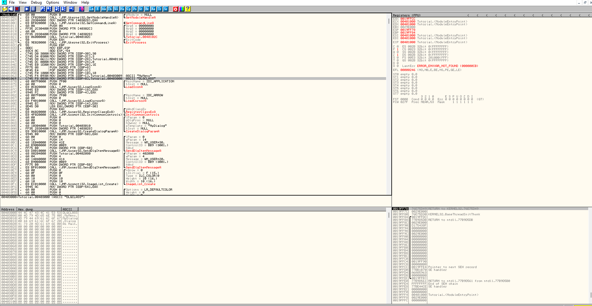

Nhìn vào cột địa chỉ sẽ thấy tại vị trí 401000, hàng chứa kích thước 1000, tên Tutorial, tên phần ".text" và chứa "code". Các tệp exe có các phần khác nhau chứa các loại dữ liệu khác nhau. Trong phần của bài này là code của chương trình. Dài 1000 byte và bắt đầu tại địa chỉ 401000 trong bộ nhớ

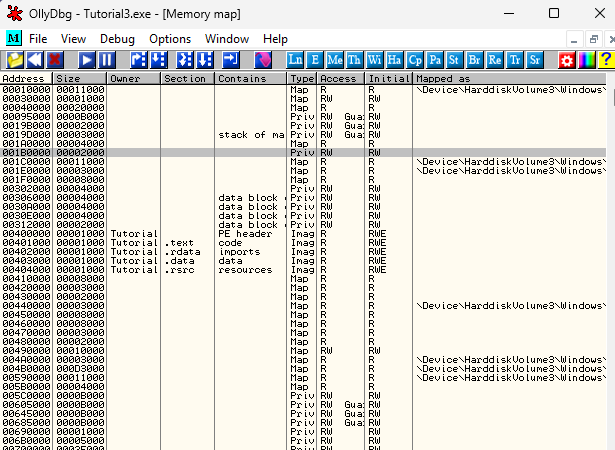

Bên dưới là các phần khác của chương trình Tutorial:
+ có 1 phần .rdata chứa dữ liệu và các thư viện nhập khẩu tại địa chỉ 402000
+ 1 phần .data không chứa gì tại địa chỉ 403000. 
+ Cuối cùng là 1 phần có tên .rsrc chứa các tài nguyên(như hộp thoại, hình ảnh, văn bản).

Những phần này có thể được đặt tên bất kì phụ thuộc vào lập trình viên

Trong .data trống rỗng vì nó không chứa dữ liệu, nó bao gồm các biến toàn cục và dữ liệu ngẫu nhiên. Olly không liệt kê vì không biết dữ liệu nào được lưu trữ ở đó

Ở đầu các phần có một phần là PE header. Đây là phần quan trọng. Nó là hướng dẫn để tải tệp này vào bộ nhớ, dung lượng cần để chạy, vị trí các thành phần nhất định. PE header nằm ở đầu mọi tệp.

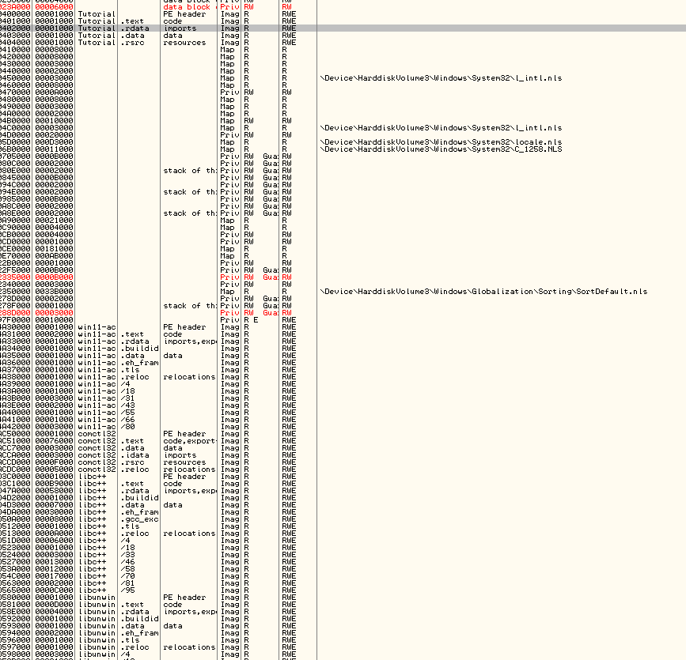

Ở phần dưới có xuất hiện các tệp khác tệp Tutorial như comctl32, win11-ac, libc++, explorer,... Đây là các tệp DLL. Tệp DLL là các tệp có chứa sẵn code các hàm API của Windows(hoặc do lập trình viên khác). Có sẵn các hàm để tránh mất thời gian code ra từng hàm.

_Tại sao DLL lại nằm trong không gian địa chỉ chương trình và tại sao Windows biết được cái DLL nào là cần thiết ?_

Lí do bởi vì trong phần PE header đã liệt kê các DLL. Khi Windows tải tập tin exe vào bộ nhớ, cũng sẽ kiểm tra header và tìm tên các DLL, các hàm trong các DLL mà chương trình cần. Tìm xong thì tải vào không gian nhớ của chương trình để nó có thể gọi. Như vậy, về lí thuyết thì 1 DLL có thể được tải nhiều lần vào bộ nhớ nếu có nhiều chương trình sử dụng DLL đó được tải. Ta có thể xem các hàm mà được gọi bằng việc nhấp chuột phải vào vùng lệnh -> Search for -> All Intermodular Calls

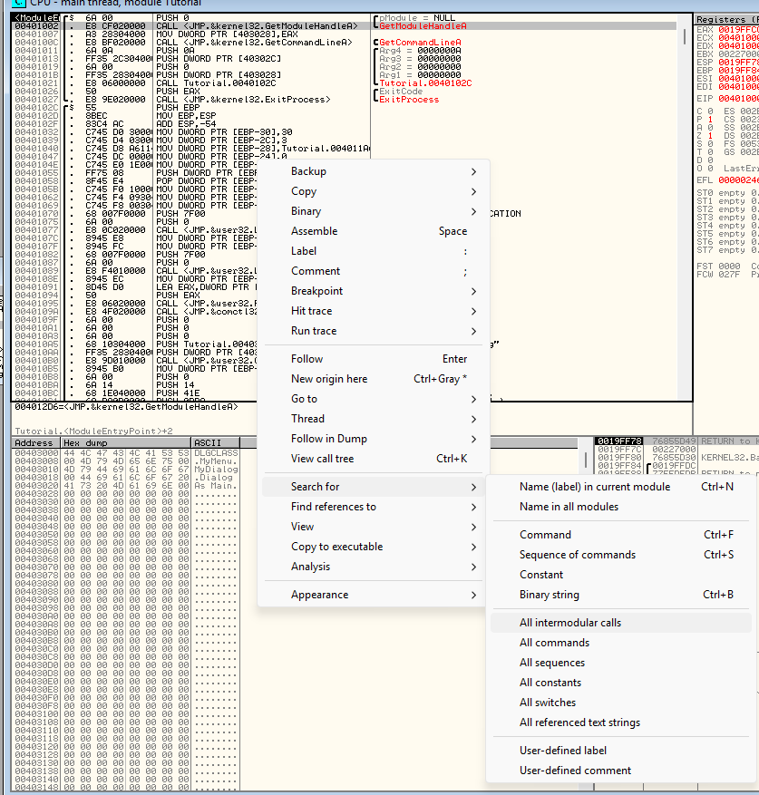

Sẽ ra cửa sổ như này :

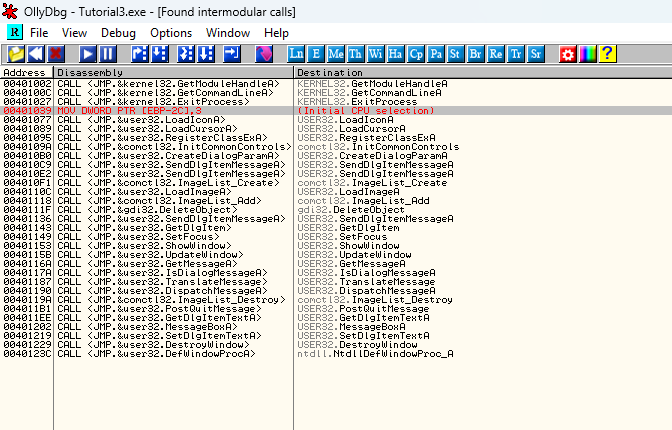

Thông thường 1 chương trình gọi hàng nghìn hàm nhưng trên đây chỉ là chương trình mẫu nên danh sách trên chỉ có ít. Và có thể cần khá nhiều hàm chỉ để thực hiện 1 vai trò cơ bản.

Tiếp theo đến chức năng tìm kiếm theo chuỗi kí tự. Nhấp chuột phải vào vùng lệnh -> Search for -> All Referenced Text Strings

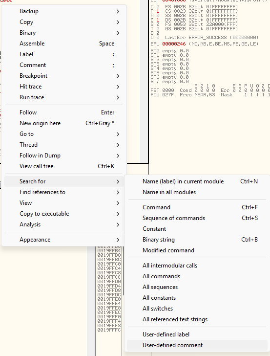

Hiện ra cửa sổ :

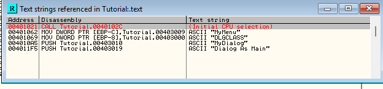

Giống như các hàm thì thông thường sẽ có thể có hàng nghìn chuỗi. Tuy nhiên cũng có thể không có cái gì. Bởi vì tệp đã được packer hoặc obfuscated. Điều này là để tránh việc tìm kiếm dựa vào các chuỗi văn bản của kĩ sư RE. Giả sử như là nếu mà tìm kiếm theo chuỗi "Số seri của bạn là..." và tìm ra thì sẽ rất là vấn đề. Ta cũng có thể nháy đúp vào cái chuỗi văn bản kia sẽ dẫn đến phần lệnh sử dụng chuỗi đó.

# Running the program

Nhìn xuống góc trái dưới sẽ thấy 1 ô màu vàng ghi _Paused_ nghĩa là chương trình đang tạm dừng và sẵn sàng để chạy. Ấn _F9_ để chạy hoặc là vào Debug -> Run. Chương trình sẽ được chạy trong Olly.

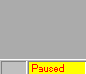

Nhìn xuống ô góc trái dưới bây giờ đã hiện Running. Có nghĩa là tệp đang được chạy trong Olly. ta có thể tương tác với chương trình, xem nó làm gì. Nếu lỡ tay tắt nó, bấm vào lại Olly và ấn Ctrl + F2 hoặc là Debug -> Restart để tải lại và có thể ấn F9 để chạy lại chương trình.

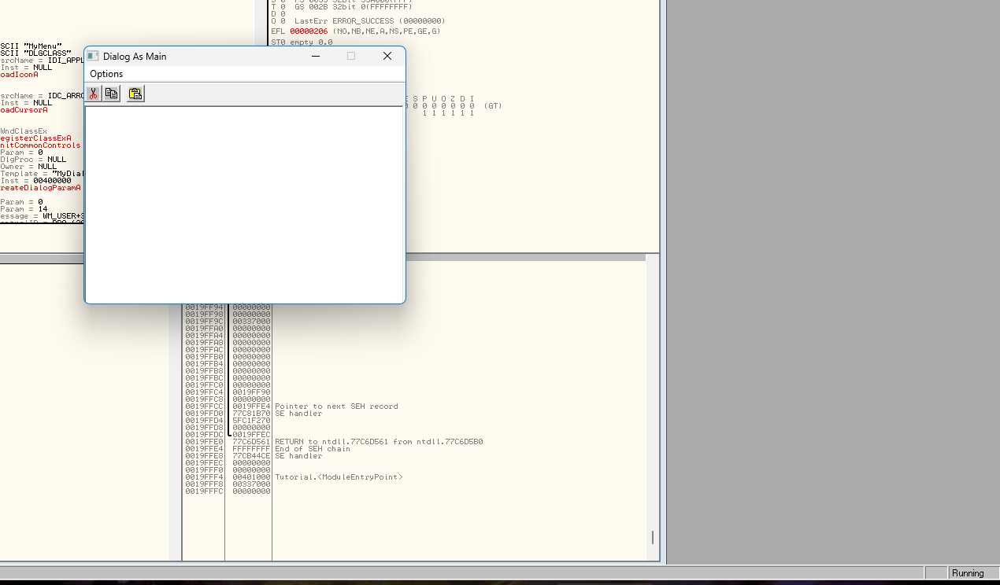

Ta có thể tạm dừng chương trình bằng việc bấm F12 hoặc là bấm Debug -> Paused. Chương trình sẽ dừng tại thời điểm đó. Khi chương trình dừng sẽ không xem được. Ấn F9 lần nữa thì sẽ tiếp tục. Nếu có sự cố thì ấn Ctrl + F2 hoặc Debug -> Restart để tải lại và chạy lại nếu muốn

# Stepping the program

Chạy ứng dụng thì đơn giản nhưng sẽ chả cung cấp thông tin gì nhiều. Vì vậy sẽ thử làm từng bước 1. Khởi động lại bằng Ctrl + F2 và sẽ tạm dừng ở đầu chương trình. Nhấn _F8_ sẽ thấy con trỏ dòng lệnh di chuyển xuống 1 dòng. Olly đã chạy 1 dòng lệnh và dừng lại. Cửa sổ Stack cũng cuộn xuống 1 dòng và có 1 dòng mới ở trên cùng

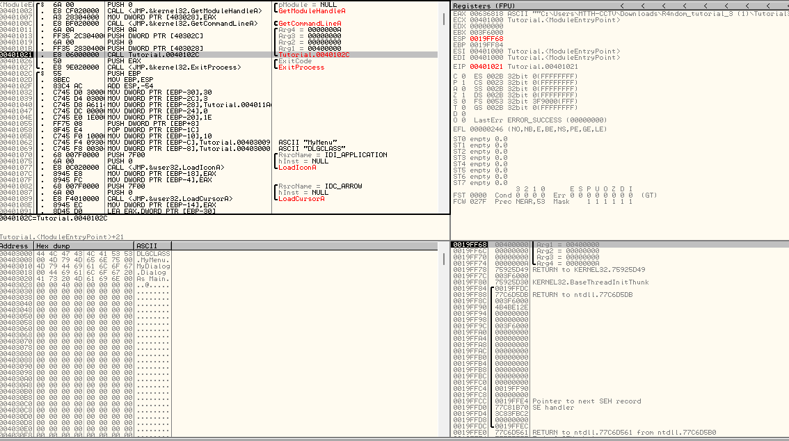

Điều này bởi vì lệnh đã được thực hiện. Lệnh "PUSH 0" đã đẩy 1 số 0 vào stack và hiển thị trên ngăn xếp dạng pModule = NULL vì NULL là cách khác của 0. Trong cửa sổ thanh ghi, thanh ESP và EIP cũng chuyển sang màu đỏ

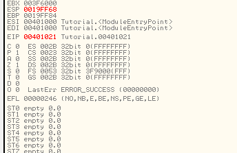

Khi 1 thanh ghi chuyển sang màu đỏ nghĩa là câu lệnh cuối cùng vừa thực hiện đã thay đổi thanh ghi. Thanh ghi ESP trỏ đến địa chỉ đỉnh ngăn xếp tăng lên 1 đơn vị vì ta đẩy 1 giá trị vào ngăn xếp. Thanh ghi EIP trỏ đến lệnh đang được thực thi tăng lên 2 là do không còn ở địa chỉ 401000 mà ở 401002 là lệnh cuối cùng được thực thi dài 2 byte và hiện ta đang tạm dừng ở lệnh tiếp theo. Lệnh này nằm ở địa chỉ 401002 là giá trị hiện tại của EIP.

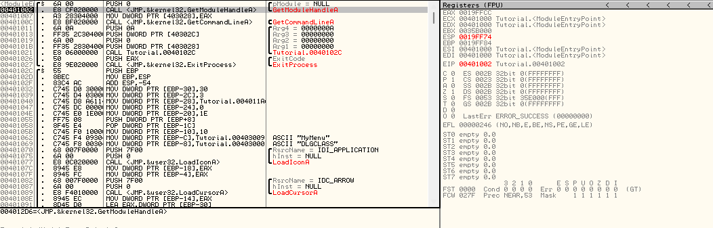

Lệnh Olly đang dừng là lệnh CALL, nghĩa là muốn tạm dừng hàm hiện tại và chạy 1 hàm khác tương tự như trong ngôn ngữ bậc cao :

```c++
int main()
{
    int x = 1;
    call doSomething();  gọi hàm doSomething();
    x = x + 1;
}
```

Trong code ví dụ, ta đặt x = 1 rồi tạm dừng đoạn logic này và gọi hàm doSomething, khi doSomething xong, ta tiếp tục với đoạn logic kia và tăng x lên 1

Tương tự với hợp ngữ, ban đầu đẩy 0 vào ngăn xếp, sau đó gọi 1 hàm là GetModuuleHandleA() trong Kernel32.dll

Ấn F8 lần nữa và con trỏ dòng xuống dưới, thanh EIP vẫn đỏ và tăng 5 nghĩa là lệnh vừa chạy dài 5 byte. Ngăn xếp đưa về trạng thái ban đầu. Vì ta nhấn F8 là Step Over nên mã trong lệnh gọi được thực thi và Olly dừng ở dòng tiếp theo sau lệnh gọi. Bên trong lệnh gọi, chương trình đã làm gì đó nhưng ta đã Step Over qua nó.

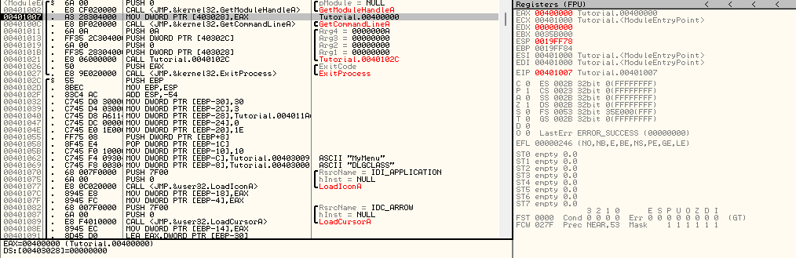

Giờ ta sẽ khởi động lại, ấn F8 để bỏ qua lệnh đầu tiên, sau đó bấm F7 để vào cái phần lệnh gọi sẽ thấy cửa sổ khác đi.

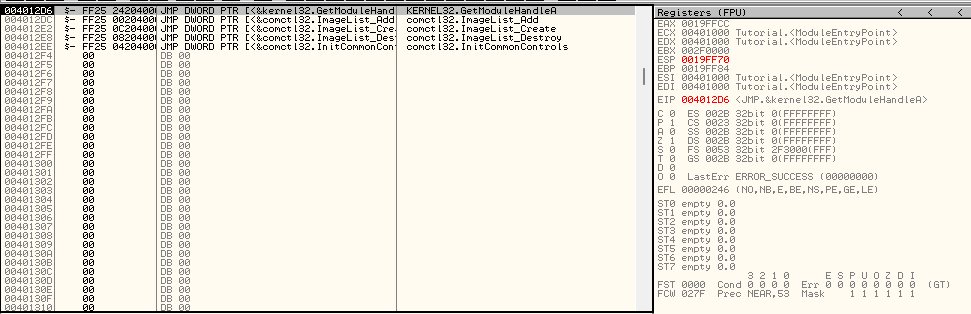

Đó là vì _F7_ là Step In nghĩa là olly sẽ thực hiện cái hàm gọi và dừng tại lệnh đầu tiên ở rtong hàm. Lệnh gọi đã nhảy đến 1 vùng nhớ mới, EIP = 4012D6. Nếu ta tiếp tục step over từng lệnh của hàm này sẽ tiếp tục và quay lại câu lệnh sau câu lệnh gọi.

Ta khởi động lại, ấn F8 4 lần đến đoạn mã này

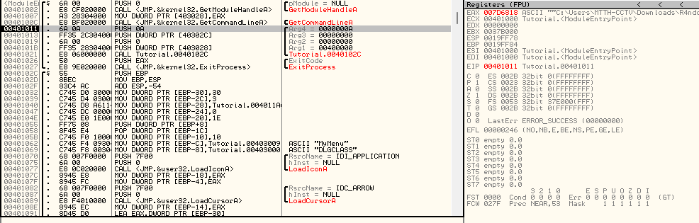

Để ý rằng có 4 cái PUSH, quan sát cửa sổ stack khi nhấn F8 4 lần sẽ thấy ngăn xếp tăng lên.

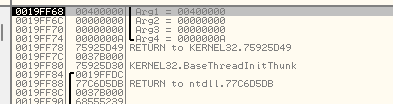

Tại sao lại đẩy 4 con số này vào stack, vì nó là tham số cho hàm sắp tới ở địa chỉ 401021. Nó tương đương với đoạn code sao ở ngôn ngữ bậc cao :

```c++
nt main()
{
    int x = 1;
    int y = 0;
    call doSomething( x, y );
gọi doSomething( x, y );
    x = x + 1;
}
```

Giống như ta khai báo 2 biến sau đó truyền 2 biến vào hàm, hàm sẽ thực hiện với 2 biến đó và trả về chương trình. Như vậy ngăn xếp là 1 trong những cách chính để truyền biến vào hàm, biến được đẩy vào ngăn xếp bằng PUSH, hàm được gọi và trong hàm các biến được truy cập và sử dụng ngược lại với PUSH là POP

Ngăn xếp không phải là cách duy nhất, nhưng nó thường dùng nhất. Các biến cũng có thể đưa vào thanh ghi và truy cập thông qua các thanh ghi này bên trong các hàm được gọi.

Giờ chúng ta ấn F8, thấy nó Running, sau đó hộp thoại của chương trình hiển thị. Điều này là do ta đã vào hàm gọi thực hiện chương trình. Khi này ta tắt chương trình đi. Olly sẽ dừng ở dòng tiếp theo sau hàm gọi vừa rồi

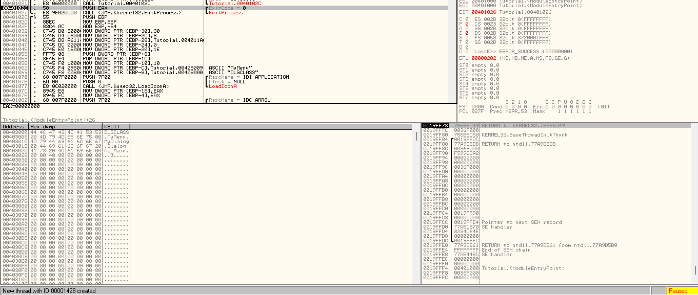

Nhìn hàm CALL tiếp theo là gọi hàm gì đó kernel32.ExitProcess. Đây là hàm API của Windows dừng 1 ứng dụng. Vậy cơ bản là Olly đã dừng chương trình sau khi ta đóng cửa sổ trước khi bị chấm dứt. Bây giờ ấn F9 thì chương trình kết thúc. Phần góc trái thông báo Terminate

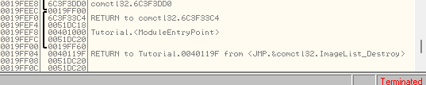

# BreakPoints

Tải lại, nháy đúp vào dòng tại địa chỉ 401011 trong cột thứ 2(opcode '6A 0A'), địa chỉ 401011 sẽ chuyển sang màu đỏ

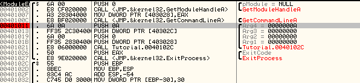

Ta đã đặt 1 điểm ngắt ở địa chỉ 401011. Điểm ngắt buộc Olly dừng thực thi khi nó đạt đến điểm đó. Có nhiều loại điểm ngắt khác nhau.

## Software Breakpoints

Điểm ngắt phần mềm thay thế byte tại địa chỉ điểm ngắt bằng Opcode 0xCC(int 3) là ngắt đặc biệt cho hệ điều hành biết trình debugger muốn dừng ở đây và phải trao quyền điều khiển cho trình debugger trước khi thực hiện lệnh. Ta không thấy lệnh đổi thanh 0xCC vì Olly đã làm ở mức ẩn, Olly sẽ cho phép ta làm những gì muốn. Nếu ta tiếp tục chạy(Running/Step Over), Opcode 0xCC được thay thế trở lại bằng mã gốc

Để đặt software breakpoint, ta có thể ấn 2 lần vào cột opcode, hoặc chọn dòng muốn đặt breakpoint, ấn chuột phải chọn Breakpoints -> Toggle(hoặc ấn F2).

Để xóa breakpoint, ấn 2 lần vào dòng đã đặt hoặc là ấn chuột phải chọn Breakpoint -> Remove Software Breakpoint(hoặc ấn F2 lần nũa)

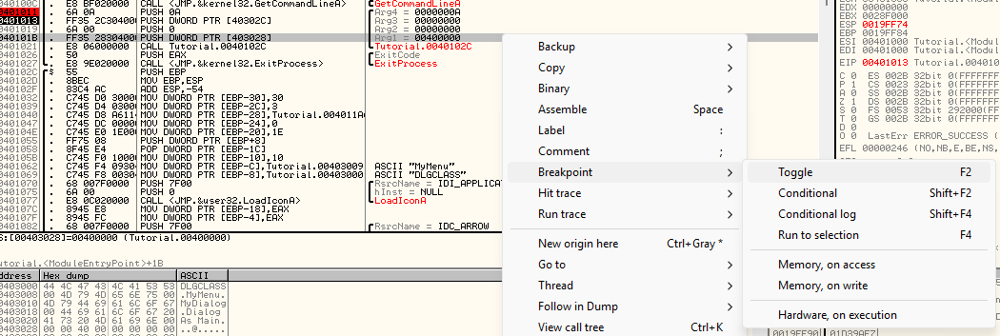

Nếu ta đặt BP ở 401011 và chạy chương trình từ đầu thì chương trình sẽ chạy và bị tạm dừng tại BP.

Để xem các điểm ngắt đã chọn, nhấn vào thanh công cụ _Br_ hoặc chọn View->Breakpoints sẽ có cửa sổ có các BP hiện tại

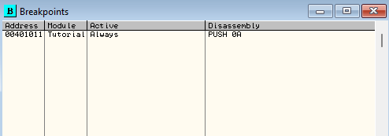

Nháy đúp vào 1 trong số BP thì sẽ nhảy đến điểm đó. EIP giữ nguyên vì ta không thực sự thay đổi luồng điều khiển, nháy đúp vào EIP để quay trở lại chỗ trước khi ta bấm nhảy vào BP.

Nếu ta chọn BP và ấn Space thì sẽ chuyển BP thành Disabled và ấn tiếp thì Always là tắt và bật. Án DEL để xóa BP.

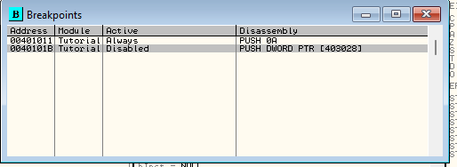

Nếu ta đặt BP nhưng để Disabled thì khi chạy thì sẽ không dừng lại tại BP đó vì đã bị vô hiệu hóa

## Hardware Breakpoints

Điểm ngắt phần cứng sử dụng thanh ghi gỡ lỗi của CPU. Có 8 thanh được tích hợp trong CPU R0-R7  nhưng chỉ 4 được sử dụng. Ta có thể dùng để breaking  để đọc, ghi, thực thi 1 phần bộ nhớ. BP phần cứng và mềm khác ở chỗ BP phần cứng không thay đổi bộ nhớ của chương trình vì vậy có thể đáng tin cậy hơn. 

Đặt BP phần cứng bằng cách nhấp chuột phải vào dòng muốn, chọn Breakpoint -> Hardware, on Execution

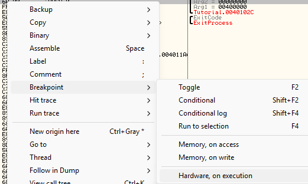

Xem Các BP phần cứng đã đặt bằng cách bấm Debug -> Hardware Breakpoints.

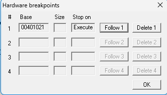

## Memmory Breakpoints

Giả sử ta thấy 1 chuỗi hoặc 1 hằng số đáng nghi, nhưng không biết nó được truy cập ở vị trí nào của chương trình. Ta sẽ dùng BP memory sẽ giúp ta dừng bất kỳ lệnh nào đọc hoặc ghi vào địa chỉ bộ nhớ đó

Các cách đặt BP: 

+ Nhấp chuột vào dòng đó, ấn chuột phải, chọn Breakpoint->Memory, On Aceess/Memory, On Write
+ Đặt BP trên 1 địa chỉ trong kết xuất bộ nhớ, đánh dấu 1 hoặc nhiều byte trong cửa sổ, chuột phải và chọn như trên

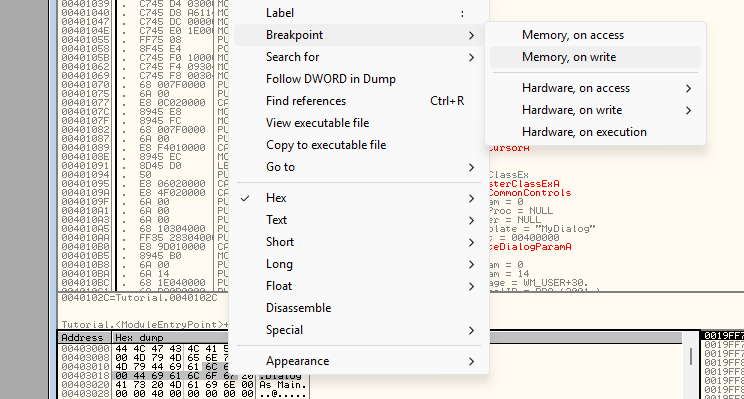

+ Đặt cho toàn bộ phần nhớ. Bấm Me trên thanh công cụ hoặc View->Memory, chuột phải vào phần bộ nhớ muốn và chọn tương tự.

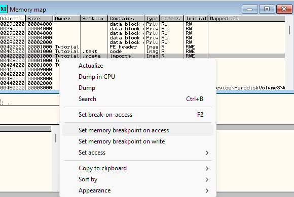

# Using the Dump Pane

Sử dụng ngăn kết xuất để xem nội dung của bất kì vị trí bộ nhớ nào trong không gian bộ nhớ của quy trình được gỡ lỗi. Nếu 1 lệnh trong cửa sổ disassembly, thanh ghi hoặc bất kỳ mục nào trong ngăn xếp chứa tham chiếu đến vị trí bộ nhớ, nhấp chột phải vào tham chiếu đó và chọn Follow in Dump và ngăn kết xuất hiện ra địa chỉ

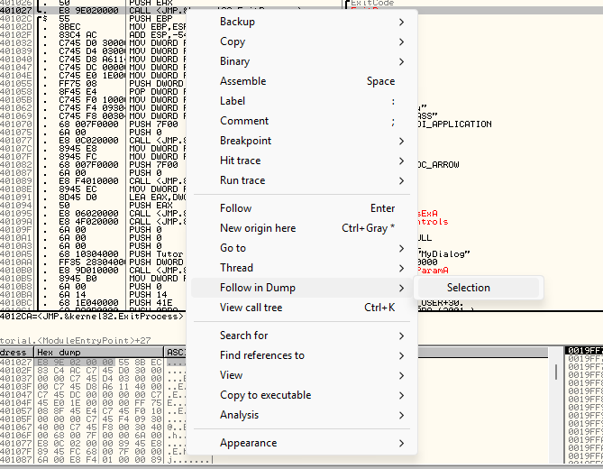

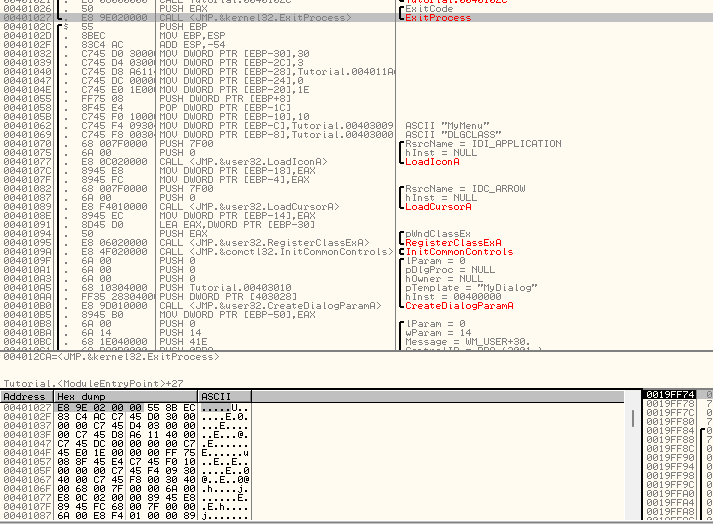

Có thể chuột phải vào ngăn dump và chọn Go to để nhập địa chỉ xem

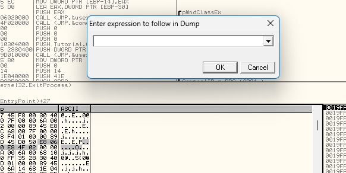

Tải lại chương trình. Nhấn F8 8 lần sẽ tại địa chỉ 401021, có Call Tutorial.0040102C. Nếu ta nhìn vào dòng này thì hiểu cơ bản là nó nhảy xuống địa chỉ 40102c các vị trí hiện tại 3 dòng. Đây là lệnh CALL nên xong thì nó sẽ quay lại 401021

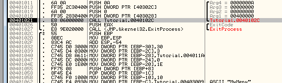

Step đến địa chỉ 401062, đặt 1 BP. Ta tạm dừng tại 401062

Nhìn vào lệnh là MOV DWORD PTR[EBP-C].Tutorial.00403009 là lệnh chuyển bất cứ gì ở địa chỉ 00403009 vào ngăn xếp mà Olly tham chiếu là EBP-C. Thấy ở cột Comment Olly đã nhận ra rằng địa chỉ này là địa chỉ chuỗi MyMenu. Chuột phải vào lệnh, chọn Follow in Dump sẽ thấy 3 tùy chọn

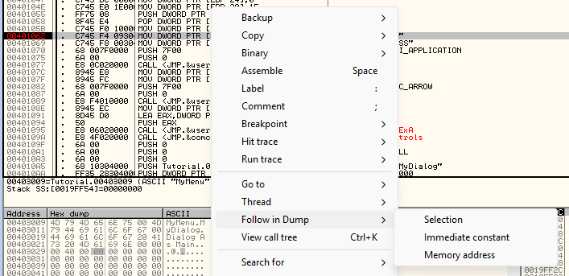

+ Chọn Immediate constant sẽ tải bất kỳ địa chỉ nào được ảnh hưởng bởi lệnh

+ Chọn Selection thì hiển thị địa chỉ của dòng được đánh dấu(dòng 401062)

+ Chọn Memory address sẽ hiển thị bộ nhớ cho EBP-C, là hiển thị bộ nhớ cho các biến cục bộ đang làm việc trên ngăn xếp.

Chọn Immediate constant

Bộ nhớ bắt đầu từ địa chỉ 403009 là địa chỉ của lệnh tải chuỗi ASCII kia. Bên phải là chuỗi MyMenu, trái là các hex cho từng ký tự. Sau MyMenu là một số chuỗi bổ sung dùng cho phần khác của chương trình

# Finally, Something Fun!

Ta sẽ nghịch nghịch chút bằng việc chỉnh sửa nhị phân của thông điệp hiển thị. Đổi chuỗi Dialog As Main thành 1 cái gì đó.

Đầu tiên Click vào D trong Dialog As Main trong phần ASCII

Thấy byte hex của D đang được đánh dấu. Chọn toàn bộ chuỗi Dialog As Main

Chuột phải, chọn Binary->Edit để thay đổi nội dung bộ nhớ của chương trình

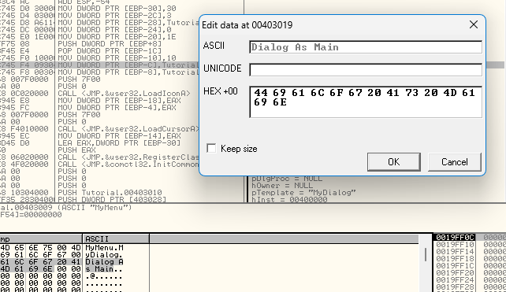

Sẽ có 1 hộp thoại, dòng đầu là chuỗi ASCII, dòng thứ 2 là cho Unicode nhưng không dùng nên trống, dòng thứ 3 là hex, nhập bất cứ gì muốn lên chuỗi ASCII, đảm bảo rằng không thêm nhiều chữ cái hơn chuỗi gốc.

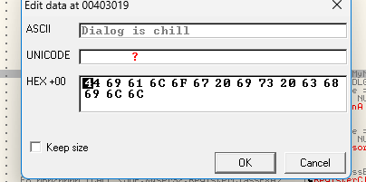

Click OK và chạy F9 lại chương trình, nhập bất cứ gì và chọn Options->Get Text sẽ ra hộp thoại.

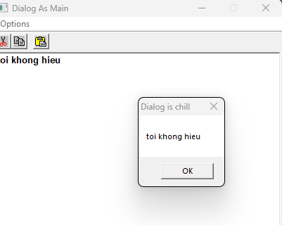

Thấy tiêu đề đã khác.

