# DLLs DLL

DLL được tải bởi trình tải hệ thống khi khởi động ứng dụng. DLL(Dynamic Link Libraries) là tập hợp các hàm, thường được cung cấp bởi Windows(hoặc bất kỳ ai) được sử dụng nhiều lần trong chương trình windows. Để tránh lặp đi lặp lại và tẻ nhạt. Những hàm này được lưu trong các thư viện và liên kết động nếu cần thiết

Ví dụ khi ta chuyển đổi chữ thường thành hoa, cần thực hiện ở nhiều ứng dụng, có 3 lựa chọn. 1 là tự viết mã và đưa vào ứng dụng thì sẽ có vấn đề là ứng dụng khác  cũng cần sử dụng chức năng này nhiều lần thì ta sẽ phải copy dán vào tất cả chỗ mà dùng. 2 là có thể tạo 1 thư viện mà  tất cả ứng dụng có thể gọi. Trong trường hợp này chỉ cần có hàm convert kia và có thể có các hàm khác là đủ cho các ứng dụng gọi và ta sẽ mã hóa 1 lần, điều đặc biệt là giả sử nếu ta có thuật toán code tốt hơn thì với cách 1 ta phải sao chép và sửa lại nhiều chỗ, còn với cái thứ 2 chỉ cần sửa ở thư viện DLL và các ứng dụng sẽ cập nhật thay đổi.

Cuối cùng là sử dụng các hàm do Windows có sẵn. Nên bởi vì họ đã nghiên cứu code rất lâu năm nên gần như tối ưu và lý do thứ hai là giả sử windows mà có bản cập nhật mới thì DLL của Windows sẽ cập nhật theo nhưng với DLL của chúng ta tự tạo thì không tự cập nhật và có thể không tương thức với bản Windows mới.

# How DLLs are used

Khi ta tải chương trình, Windows Loader kiểm tra PE Header và xem những hàm nào của ứng dụng được gọi và gọi từ DLL nào. Sau khi tải ứng dụng vào không gian nhớ, nó sẽ tải từng DLL vào không gian nhớ của ứng dụng. Nó sẽ đi đến tất cả các chỗ gọi và chèn địa chỉ chính xác của hàm của DLL. VD : nếu có hàm strToUpper trong kernel32 DLL thì nó sẽ tìm nơi mà tải kernel32 DLL, tìm địa chỉ hàm strToUpper và chèn địa chỉ này vào những dòng code trong ứng dụng mà có gọi hàm này. Khi chạy ứng dụng sẽ gọi vào không gian DLL trong bộ nhớ, thực hiện strToUpper và quay lại chương trình

Ta quan sát với Olly.

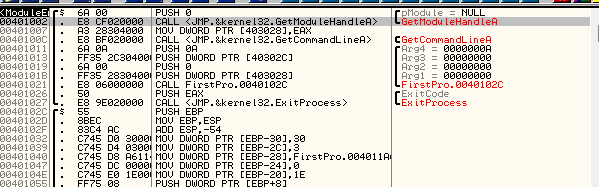

Ta thấy dòng đang chọn có gọi hàm kernel32.GetModuleHandleA. Hàm này xử lý không gian bộ nhớ chương trình ứng dụng. Ta sẽ xem cách nó được gọi.
click vào dòng lệnh đó và ấn Space. Có 1 cửa sổ hiện ra

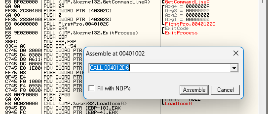

Có thể biết đượng đoạn mã asm của việc gọi hàm và cho ta chỉnh sửa đoạn mã. Nhưng nhờ vào đây ta có thể biết được địa chỉ của hàm. Ta có thể nhảy đến địa chỉ này để xem hàm này làm gì. Chọn dòng lệnh và ấn Enter thì sẽ được đưa tới đoạn mã thực hiện của hàm.

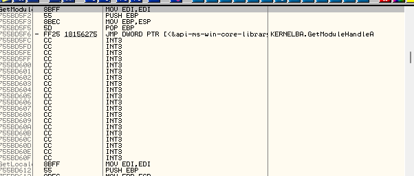

# The Address Jump Table

Các DLL không phải lúc nào cũng được tải vào bộ nhớ tại cùng 1 vị trí. Trình tải Windows chịu trách nhiệm tải ứng dụng và DLL cần sẽ được phải thay đổi vị trí tải của DLL. Lý do là vì giả sử 1 Windows DLL, cái đầu tiên được tải và ánh xạ vào địa chỉ 80000000 và giả sử ta cũng muốn một DLL khác cũng cùng tải tại địa chỉ đó. Vì không thể để cả 2 cùng 1 địa chỉ nên phải di chuyển 1 sang địa chỉ khác. Gọi là di dời

Vấn đề là : Khi lần đầu tiên viết code ứng dụng và viết 1 lệnh là GetModuleHandleA, trình biên dịch biết chính xác vị trí của DLL thích hợp, nó sẽ đặt 1 địa chỉ như "CALL 80000000". Giờ đây cứ khi chương trình tải vào thì nó sẽ là CALL 80000000, nhưng điều gì xảy ra nếu trình tải quyết định di dời DLL sang 8000E300, CALL sẽ bị sai.

Cách mà PE và tệp WIndows giải quyết là tạo 1 bảng nhảy. Khi mã được biên dịch lần đầu và mọi lệnh gọi đến GetModuleHandleA đều trỏ đến 1 vị trí duy nhất trong ứng dụng và vị trí này ngay lập tức chuyển đến 1 địa chỉ tùy ý. Mỗi cái gọi 1 địa chỉ cụ thể và ngay lập tức chuyển đến 1 địa chỉ tùy ý. Khi loader tải tất cả các DLL nó sẽ qua bảng nhảy này và thay thế các địa chỉ tùy ý bằng địa chỉ thực của hàm trong bộ nhớ. Bảng nhảy trông như này :

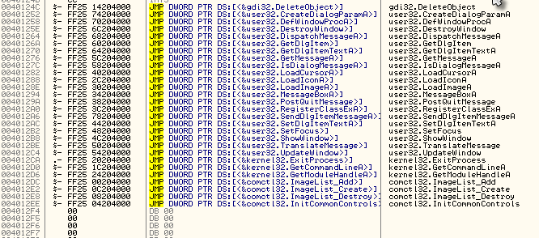

Đây là 1 ý tưởng phức tạp. Ta có ví dụ sau, ta viết 1 chương trình ngắn gọi 1 hàm trong kernel32.dll gọi là ShowMarioBrosPicture :

```c++
main()
{
      call ShowMarioBrosPicture();
      call ShowDoYouLikeDialog()
      exit();
}
ShowDoYouLikeDialog()
{
      If ( user clicks yes )
      {
          call ShowMarioBrosPicture();
          Call ShowMessage( "Yes, it's our favorite too!")
      }
      else
      {
          call showMessage( "You obviously never played Super Mario Bros.");
      }
}
```

Khi biên dịch, các lệnh gọi đến hàm sẽ được thay bằng địa chỉ thực tế và sẽ trông như này

```asm
401000    call 402000     // Call ChowMarioBrosPicture
401002    call 401006     // Call showDoYouLikeDialog
401004    call ExitProcess
401006    Code for "Do You like It" dialog
.
.
.
40109A    if (user clicks yes)
40109C  call 402000    // call showMarioBrosPicture
40109E    call 4010FE    // call show message
4010a1  call ExitProcess
4010a3  if (user clicks no)
4010a5  call 4010FE    // call show message
4010a7  call ExitProcess

4010FE  code for show message
...
40110A  retn
```

Đây là bảng nhảy nếu chỉ có ShowMarioBrosPicture

```
402000  JMP XXXXXXXX  402000 JMP XXXXXXXX
```

Bây giờ, vì chương trình không biết ShowMarioBrosPicture ở đâu, trình biên dịch sẽ điền vào X cho CALL địa chỉ thực tế

Khi trình tải Windows tải ứng dụng, nó tải tệp nhị phân vào bộ nhớ trước và có bảng nhảy, nhưng bảng nhảy chưa có địa chỉ thực nào. Sau đó, nó tải DLL vào không gian nhớ, đi tìm vị trí của các hàm, khi thấy địa chỉ của hàm ShowMarioBrosPicture thì nó sẽ đi vào bảng nhảy và thay thế X bằng địa chỉ thực, giả sử địa chỉ của ShowMarioBrosPicture là 77CE550A. Mã bảng nhảy được thay bằng :

```
402000 JMP 77CE550A.
```

Lúc này Olly có thể hiểu rằng đây là trỏ đến hàm ShowMarioBrosPicture, nó sẽ vào bảng nhảy và hiển thị dưới dạng

```
402000 JMP DWORD PTR DS:[<&kernel32.showMarioBrosPicture>]
```

Bảng nhảy trong ứng dụng FirstProgram


Khi chương trình được code lần đầu, tất cả các hàm được gọi trong các DLL khác nhau, nhưng trình biên dục không biết nó ở đâu trong bộ nhớ nên nó sẽ trông như này :

```
40124C    JMP XXXXX    // gdi32.DeleteObject
40124C    JMP XXXXX gdi32. Xóa đối tượng
401252    JMP XXXXX    // user32.CreateDialogParamA
401252 người dùng JMP XXXXX32.     Tạo DialogParamA
401258  JMP XXXXX    // user32.DefWindowProcA
  401258 người dùng JMP XXXXX32 . DefWindowProcA
40125E  JMP XXXXX    // user32.DestroyWindow
40125E  JMP XXXXX  người dùng32. Phá hủyCửa sổ
```

Sua khi tải ứng dụng và các DLL và tìm thấy địa chỉ của các hàm, sau đó nó xem qua từng hàm và thay thế chúng bằng địa chỉ thực tế mà các hàm đang ở. Nếu không làm theo cách này, trình tải phải qua toàn bộ ứng dụng và thay mọi CALL và mọi hàm trong mọi DLL bằng địa chỉ thực. Rất nhiều việc. Bằng cách này, trình tải chỉ phải thay thế địa chỉ ở 1 nơi cho mỗi lệnh gọi hàm, cụ thể là dòng hàm trong bảng nhảy :

Ấn F7 trong Olly -> ấn vào dòng 401002 và ấn phím cách.

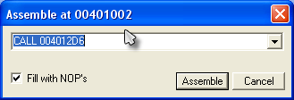

Chú ý lại địa chỉ 4012D6.Ấn F7 sẽ nhảy vào bảng địa chỉ

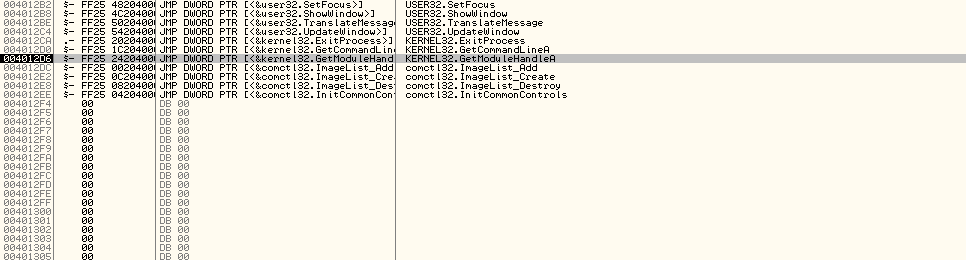

Ấn F7 1 lần nữa thì nó sẽ đưa đến địa chỉ thực của GetModuleHandleA tại 7780B741. Ta có thể hiểu rằng đnag ở trong module kernel32 theo 2 cách. Đầu tiên là tiêu đề cửa sổ CPU của Olly :

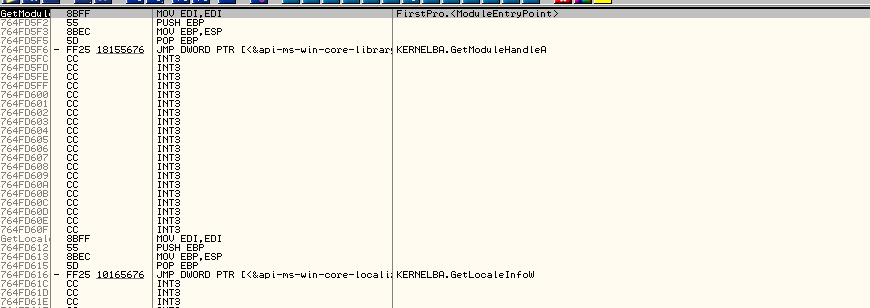

Có thể thấy rằng nó để là module kernel32

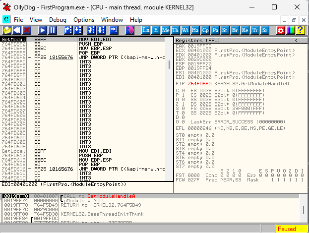

Cách thứ 2 là vào cửa sổ bộ nhớ và tra cứu địa chỉ :

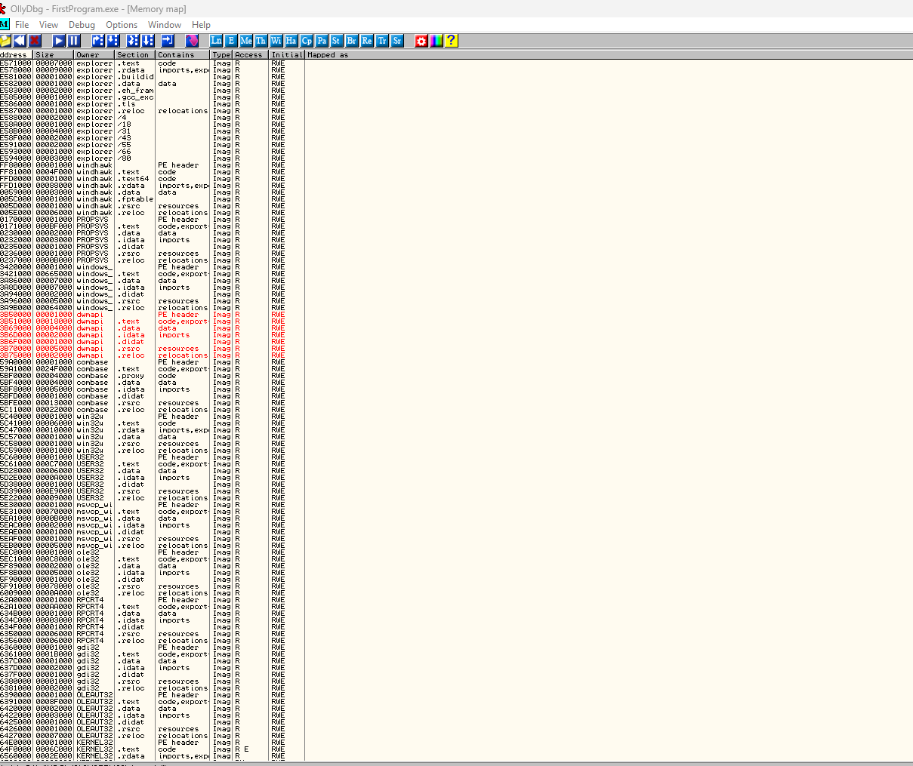

Có thể thấy rằng địa chỉ 7780B741 nằm trong không gian địa chỉ của phần mã của kernel32

Có thể xem 1 số lệnh gọi khác. Khởi động lại, F8 xuống 40100C, dòng này là lệnh gọi GetCommandLineA. Nhấn phím cách để xem nó trỏ đến địa chỉ 

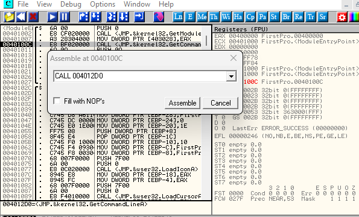

Địa chỉ 4012D0. Truy cập địa chỉ này, nhấn Ctrl G hặc nhấn vào GOTO và nhập địa chỉ muốn đến.

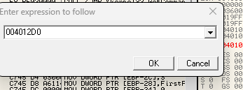

OK để nhảy đến. Bảng nhảy của hàm GetCommandLineA

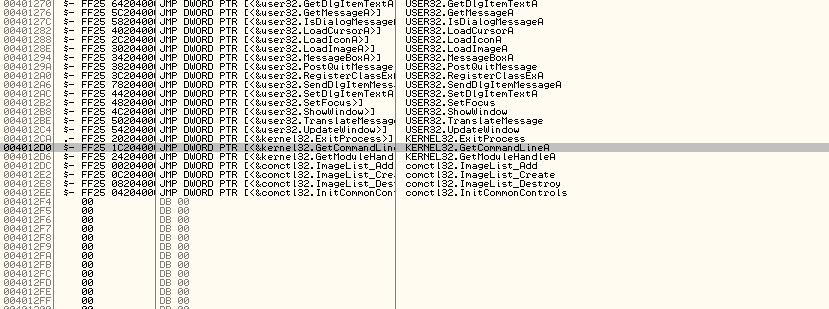

Nhấn F7 để thực hiện các bước nhảy và sẽ nhảy vào đầu của hàm GetCommandLineA trong kernel32.dll. hàm bắt đầu từ 76BC60105

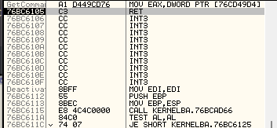

# Jumping in and out of DLLs

Khi thực hiện 1 chương trình, nhiều khi sẽ kết thúc trong DLL. Đây thường không phải nơi ta muốn, nếu ta muốn ra khỏi DLL và quay lại mã chương trình từ đoạn DLL này. Chỉ cần qua tất cả các hàm của DLL cho đến khi quay lại, nhưng mất thời gian. Cách thứ 2 là bấm vào Debug->Execute till user code hoặc nhấn Alt+F9. Điều này nghĩa là chạy cho đến khi quay lại mã chương trình của mình

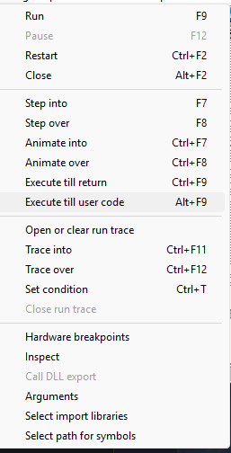

Có thể nhiều lúc không hoạt động vì  DLL truy cập bộ đệm hoặc biến ở trong không gian làm việc của chương trình, Olly sẽ bị dừng ở đó, vì vậy có thể nhấn Alt + F9 tiếp để quay lại. Giờ thì quay lại chương trình và để ý là đã xuống dòng bên dưới

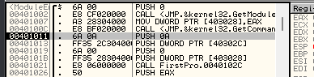

Thử 1 tùy chọn khác để quay lại code chương trình của chúng ta. Khởi động lại, F8 đến GetCommandLineA, F7 nhảy vào, mở cửa sổ bộ nhớ Me,cuộn cho đến khi thấy có mã chương trình. Nhấn F2 để chuyển điểm ngắt hoặc chuột phải chọn Break-on-access

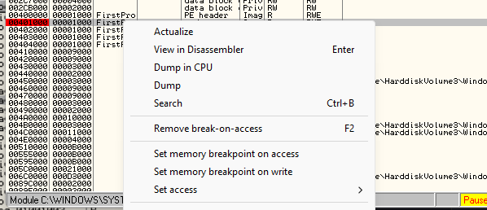

Chạy ứng dụng, Olly sẽ ngắt tại dòng sau dòng gọi DLL vừa rồi. Xóa điểm ngắt đi để tránh nó làm hỏng chương trình.

# More on the stack

Phần rất quan trọng trong RE

Xem cửa sổ Register, thanh ghi ESP(thanh trỏ đến địa chỉ của đỉnh của ngăn xếp) là 0019FF78 và để ý xuống cửa sổ stack, thấy địa chỉ trên cùng khớp với ESP

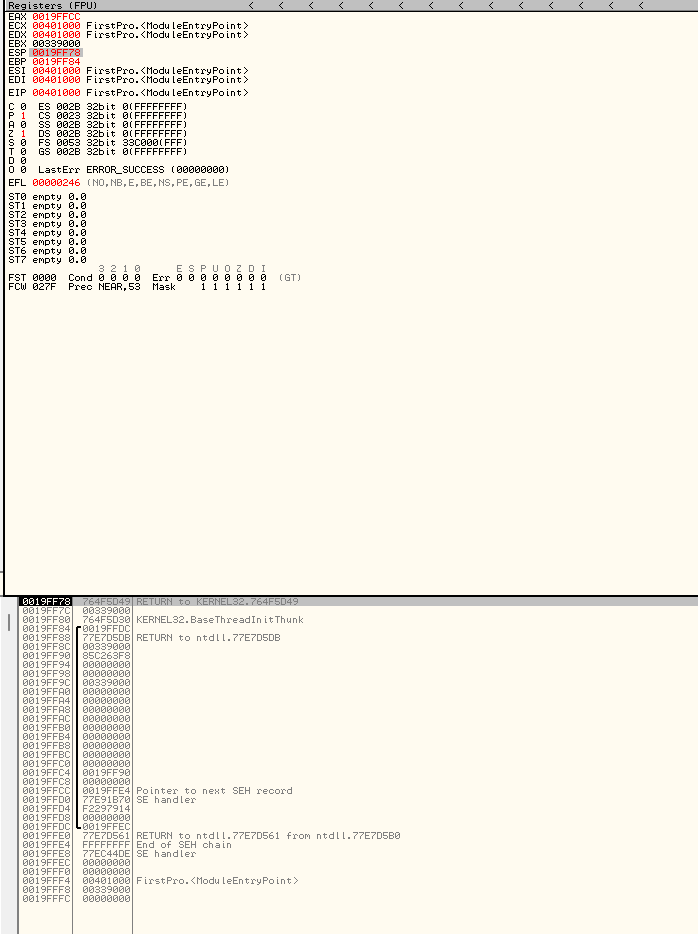

F8 1 lần để đẩy 0 vào stack

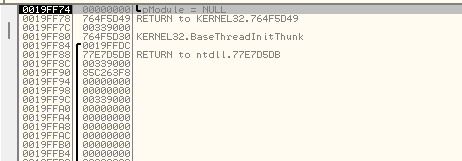

Nhìn vào cửa sổ thanh ghi ESP :

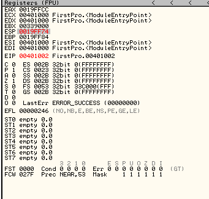

Nó chuyển qua 19FF74 bởi vì sau khi đẩy 1 byte vào ngăn xếp, đây là đỉnh mới của ngăn xếp. F8 1 lần đến lệnh gọi GetModuleHandleA và nhìn vào cửa sổ ngăn xếp

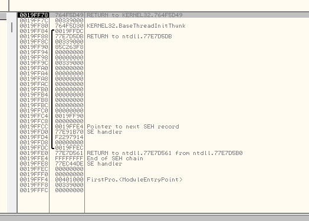

Thấy cửa sổ ngăn xếp giảm trở lại 1 và ESP trở lại như cũ. Lý do vì hàm GetModuleHandleA đã sử dụng số 0 được đẩy vào ngăn xếp làm đối số và bật nó ra khỏi ngăn xếp vì không cần nữa. Như đã biết đây là 1 cách truyền đối số cho các hàm : đẩy chúng vào ngăn xếp, hàm được gọi sẽ bật chúng ra khỏi ngăn xếp, sử dụng chúng và trả về, thường là bất kỳ thông tin nào cần trong thanh ghi.

Ấn F8 2 lần để đến lệnh Gọi GetCommandLineA, thấy ngăn xếp không đổi vì ta không đẩy bất cứ gì vào ngăn xêp để hàm đó dùng. Tiếp, đến lệnh PUSH 0A. Đấy là đối số đầu tiên mà ta sẽ chuyển sang hàm được gọi tiếp theo.Step over thì ta sẽ thấy 0A ở đầu ngăn xếp, thanh ghi ESP giảm 4, khi ta đẩy 1 giá trị vào ngăn xếp, ESP sẽ giảm xuống khi ngăn xếp tăng trong bộ nhớ. F8 1 lần nữa thanh ghi ESP sẽ xuống 4 1 lần nữa. Do Ta đã đẩy giá trị 4byte vào ngăn xếp. Nếu nhìn vào đầu ngăn xếp, ta thấy rằng ta đã đẩy 00000000 vào ngăn xếp. Tại sao  ?

Nhìn vào dòng code :

```
PUSH DWORD PTR DS:[40302c]
```

Ý nghĩa dòng code kia là lấy 4 byte tại địa chỉ 40302C và đẩy vào ngăn xếp. Có gì tại 40302C ? Ấn vào dòng code đó, Chuột phải -> Follow in Dump -> Memory Address. Thao tác này sẽ tải nội dung của bộ nhớ bắt đầu từ 40302C

Rõ ràng, không có gì nhiều. Nhưng ta đã biết số 0 đến từ đâu. Nếu muốn biết chi tiết những gì đang xảy ra, không gian nhớ được thiết lập cho các biến và cuối cùng được điền bằng các biến, hiện tại các biến được khởi tạo thành 0

Giờ ấn F8 1 lần, chúng ta ở 1 PUSH khác nhưng là từ địa chỉ 403028. Cuộn trên cửa sổ dump, thấy nó nhiều số 0 hơn. Vì vậy những gì phần này đang làm là đẩy con trỏ vào các địa chỉ bộ nhớ, hiện đang đặt ở số 0, mà code của chúng ta dùng làm biến. Step Over qua PUSH cuối cùng và vào CALL 40101C. Điều đầu tiên nên chú ý là 1 gì đó mới được đẩy vào ngăn xếp, địa chỉ trả về cho CALL, 401026

Khi bất kỳ mã nào sử dụng lệnh CALL, địa chỉ của elenhj tiếp theo được chạy nếu chúng ta không thực hiện call sẽ tự động được đẩy vào ngăn xếp. Lý do là sau khi hàm mà ta gọi đã thực hiện mọi thứ cần làm, nó cần biết quay lại nơi nào. Địa chỉ này tự động được đẩy vào ngăn xếp là địa chỉ trả về đó.

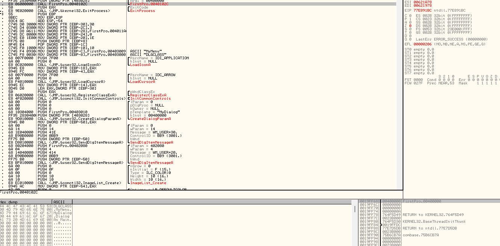

Thấy Olly đã phát hiện ra đó là 1 địa chỉ trả về và nó trỏ lại chương trình FirstPro, và địa chỉ cần được trả về là 40000

Giờ, Ở cuối hàm, 1 lệnh RETN được sử dụng. Nghĩa là POP dịa chỉ của đầu ngăn xếp và trỏ trỏ mã đang chạy đến địa chỉ này(thay thế thanh ghi EIP, thanh ghi của dòng mã hiện tại đang chạy với giá trị bật ra này). Vì vậy hàm được gọi biết chính xác nơi nó cần quay lại khi hoàn tất. Nếu cuộn xuống, thấy lệnh RETN tại địa chỉ 4011A3 sẽ bật địa chỉ này ra khỏi ngăn xếp và chạy mã tại địa chỉ đó.

# Một số thứ cần biết

> Quy tắc 1 : Học ASM Rất quan trọng

Điều cuối cùng là cách Olly xử lý việc hiển thị các đối số và biến cục bộ. Nếu nhấn đúp vào thanh ghi EIP để quay trở lại dòng code hiện tại, và nhìn xuống 1 dòng sẽ thấy 1 số nhãn màu xanh lam, có nội dung Local, 1 nhãn nội dung Arg

Khác biệt giữa biến cục bộ và đối số là đối số là các biến được truyền đến 1 hàm mà hàm đó cần, thường được truyền trên ngăn xếp. Biến cục bộ là 1 biến mà hàm được gọi tạo ra để giữ 1 cái gì đó tạm thời. Ví dụ

```c++
main()
{
    sayHello( "R4ndom");
}

sayHello( String name)
{
    int numTimes = 3;
    String hello = "Hello, ";

    for( int x = 0; x < numTimes; x++)
        print( hello + name );
}
```

Trong chương trình trên, R4dom là 1 đối số chuyền vào hàm sayHello. Trong ASM chuỗi này(hoặc địa chỉ) sẽ được đẩy vào ngăn xếp để hàm sayHello có thể tham chiếu đến. Khi điều khiển chuyển sang hàm sayHello, sayHello cần thiết lập 1 vài biến cục bộ, biến mà hàm sử dụng và không cần thiết sau khi hoàn tất. Ví dụ là 1 số nguyên numTimes, chuối hello và số nguyên x. trong trường hợp ngăn xếp không đủ ngon, cả đối số và biến cục bộ đều được lưu trữ trên ngăn xếp. Cách ngăn xếp thực hiện điều này là sử dụng thanh ghi ESP. Nó thường trỏ đến đầu ngăn xếp, nhưng nó có thể được sửa đổi, giả sử nhập hàm sayHello và ngăn xếp có dữ liệu sau trên đó :

+ Địa chỉ chuỗi "R4dom"
+ Địa chỉ trả lại từ call đưa ta đến

Nếu ta muốn tạo 1 biến cục bộ, ta cần trừ 1 lượng từ ESP và sẽ tạo không gian trên ngăn xếp. Giả sử chúng ta trừ 4 từ ESP. Ngăn xếp sẽ như sau :

+ Số 32 bit trống
+ Địa chỉ chuỗi "R4dom"
+ Địa chỉ trả lại từ call đưa ta đến.

Giờ ta có thể đặt bất cứ thứ gì ta muốn vào địa chỉ này, vd ta có thể làm cho nó là viết tắt của biến numTimes trong hàm sayHello của chúng ta. Vì hàm sử dụng 3 biến(tổng 32 bit), nó sẽ trừ đi 12 byte hoặc 0xC(trong hex) từ ESP và sau đó chúng ta có 3 biến cục bộ để dùng. Ngăn xếp sẽ như này :

+ Địa chỉ 32 bit trống trỏ đến chuỗi "hello"
+ Số 32 bit trống cho biến x
+ Số 32 bit trống cho biến numTimes
+ Địa chỉ chuỗi "R4ndom"
+ Địa chỉ trả lại từ call đưa ta đến

Giờ sayHello có thể điền, thay đổi, sử dụng các địa chỉ để dùng với các biến và nó vấn có đối số được truyền vào hàm ngay từ đầu(chuỗi "R4ndom"). Xong thì có 2 cách để xóa sạch biến cục bộ và đối số. 1 là thay đổi thanh ghi ESP trở lại trước khi ta thay đổi. 2 là sử dụng lệnh RETN đặc biệt với 1 số sau nó. Để chương trình có thể nhớ được giá trị ban đầu của ESP, nó dùng 1 thanh ghi EBP để theo dõi vị trí ban đầu mà ngăn xếp trỏ đến khi lần đầu ta nhập hàm sayHello. Khi nó đã sẵn sàng trả về chỉ cần sao chép giá trị ban đầu của ESP(lưu trong EBP) ra khỏi EBP trở lại ESP và BAM, các biến sẽ mất. Địa chỉ trả về bây giờ ở trên cùng của ngăn xếp và khi lệnh RETN chạy, nó dùng cái này và quay lại chương trình chính

TH2 là có thể cho CPU biết không cần bao nhiêu byte trên ngăn xếp nữa và nó sẽ xóa khỏi đầu ngăn xếp. Trong TH của ta, chúng ta dùng RETN 16 sẽ loại bỏ 16 byte đầu khỏi ngăn xếp, để lại đỉnh mới của ngăn xếp với địa chỉ trả về để quay lại chương trình chính.Nói chung là cơ chế phụ thuộc trình biên dịch

Olly đã giải mã 1 đối số và 12 biến cục bộ trong Firstro. Các biến cục bộ này được sử dụng trong chương trình để theo dõi những thứ như địa chỉ của bộ đệm cho văn bản đầu vào, độ dài của văn vản đầu vào. Khi hoàn tất nó sẽ bật các giá trị này ra, thay đổi thanh ghi ESP trở lại EBP hoặc RETN bằng 1 số.

