# Introduction

Ta sẽ hoàn thành một số điều với Olly vào phút cuối với 1 crackme. Đây chỉ là 1 chương trình sử dụng để yêu cầu nhập số seri và hiển thị thông báo. Nếu nhập đúng thì hiển thị thông báo tốt, nếu sai hiển thị thông báo xấu. Tạo thói quen kiểm tra nối tiếp.

Tải chương trình FAKE vào Olly.

Có thể thấy nó khá giống với những cái trước.

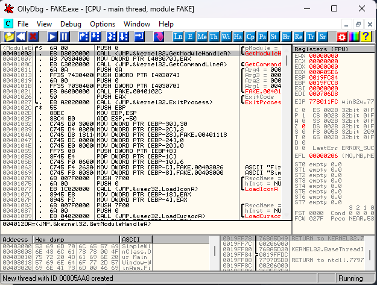

Đầu tiên, chạy thử ứng dụng xem nó hoạt động như nào

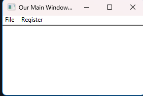

Click Register 

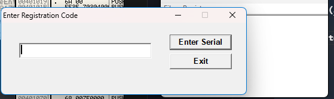

Nhập 1 số seri thử và nhấn Enter Serial 

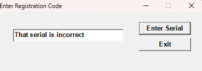

Bây giờ sẽ là phương pháp đầu tiên.

# Searching for all text strings

Trước tiên, nhiều người nghĩ phương pháp này hiếm được dùng vì nó là phương pháp rất rõ ràng và bất cứ ai muốn bảo vệ chương trình khỏi RE, sẽ vô hiệu hóa nó. Đối mặt với nó, có thể là đóng gói, bảo vệ hoặc mã hóa hoặc thay đổi nhưng nhiều khi tác giả cũng không hoàn toàn chặn cách này. Và nó cũng là 1 trong những điều đầu tiên cần kiểm tra.

Cơ bản phương pháp này yêu cầu Olly tìm kiếm không gian bộ nhớ của chương trình, tìm xem có gì giống chuỗi ASCII hoặc Unicode. Thông thường nó sẽ trông rõ ràng, sẽ có nhiều chuỗi văn bản như "Thank for registering!!" hoặc ít chuỗi văn bản như "F@7="

Biết liệu chuỗi văn bản hợp pháp trong tệp nhị phân hay không có thể cung cấp thông tin cho ta, như tệp nhị phân được đóng gói hoặc bảo vệ theo cách nào đó, nó có độc hại không(suy xét rằng có chuỗi "Gửi tất cả mật khẩu đến www.badguys.com" không phải cách viết virus có trách nhiệm) và ngay cả khi tệp viết bằng ngôn ngữ hiếm sử dụng.

Cách làm : Nhấp chuổi phải -> Search For -> All Referenced Text Strings

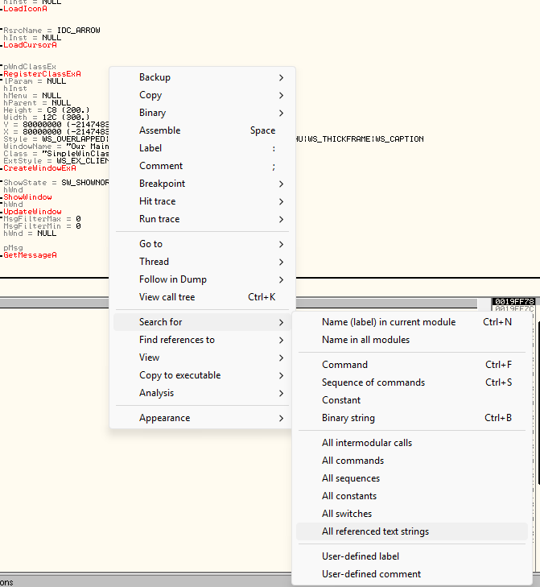

Olly sẽ tìm kiếm trong dung lượng bộ nhớ của chương trình và hiển thị :

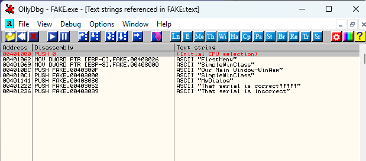

Danh sách này khá ngắn vì chương trình nhỏ. Thông thường có hàng nghìn dòng.

> Quy tắc thứ 2 : Hầu hết các sơ đồ bảo vệ có thể được khắc phục bằng 1 lệnh nháy đơn giản để chuyển đến mã tốt thay vì mã xấu

Như vậy có nghĩa là trước khi thông báo xấu được hiển thị thì có một số loại được kiểm tra(Chúng đã được đăng ký chưa ? Mã reg có nhập chính xác không? Thử nghiệm thời gian đã kết thúc chưa ?) Và sẽ có 1 bước nhảy sau khi so sánh này sẽ chuyển sang thông báo tốt hoặc xấu tùy thuộc vào kết quả so sánh

Ta sẽ tìm kiếm, bắt đầu từ "This serial is corect!!!!" tại địa chỉ 401222

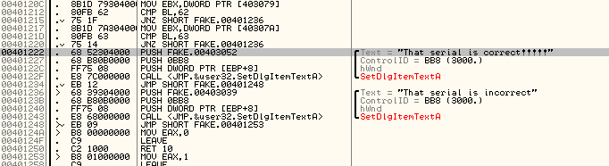

Nó nhảy đến thông điệp ta muốn và không muốn qua jump. Nhưng ngay trên lệnh JNZ là 1 lệnh CMP, nghĩa là đây khả năng là cách để Olly hiển thị thông điệp ta muốn hay không muốn

Có 1 cặp CMP JNZ tại 401212 và tại 401207. Nếu quan sát kỹ thì thấy cả 3 cái cmp jmp kia đều nhảy đén thông điệp xấu. Nghĩa là với bất cứ thứ nào được kích hoạt sẽ đạt thông điệp xấu. Vậy nếu ta không nhảy vào bước nào trong 3 bước này thì sao. Ta sẽ thất bại và có thông điệp tốt. Vì vậy điều cần làm là giữ để không nhảy để chương trình thất bại cho đến khi đạt thông điệp tốt.

# How to place a comment

Comment rất hữu ích, đặc biệt với code phức tạp. Code thì đã khó để đọc hiểu rồi, nhưng nhờ vào comment thì ta có thể note lại những thông tin quan trọng. Ở đây ta sẽ note vào những đoạn jnz rằng "We  do not want to jump here". Nháy đúp vào dòng code và đặt comment 

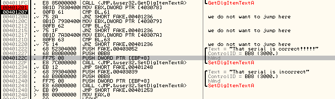

Đặt 1 điểm ngắt tại địa chỉ 401201. Chạy chương trình(F9). Nhấp vào Register và nhập số seri bất kì. Giờ Olly sẽ tạm dừng tại BP. Thấy code dừng tại dòng :

```
MOV EBX, DWORD PTR DS:[403078]
```

Ta xem nội dung bộ nhớ, chuột phải vào dòng kia, ấn Follow in Dump -> Memory address, xem cửa sổ memory

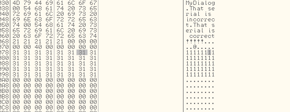

Đây là số seri mà ta đã nhập vào. Từ đây ta có thể biết rằng 4 byte đầu tiên được tải vào EBX. F8 tiếp để kiểm tra thanh ghi EBX

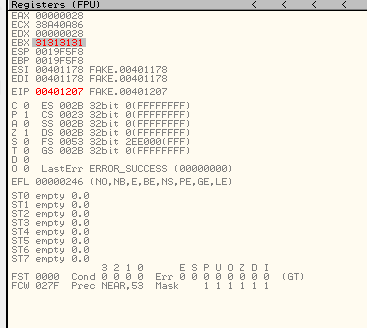

Nháy đúp vào thanh ghi sẽ xem các kí tự ASCII thực tế của thanh ghi EBX

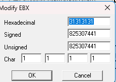

___Nhớ rằng đây là một trong những cách thay đổi thanh ghi nhanh chóng___

# Little Endian Order

Bộ xử lí lưu trữ dữ liệu khác nhau trong bộ nhớ, tùy thuộc vào kiến trúc của bộ xử lí. Có 2 cách để lưu trữ dữ liệu trong bộ nhớ : Big-Endian và Little-Endian. Intel dùng Little-Endian, vì vậy ta phải làm quen với nó. 

_Ví dụ:_ chúng ta có địa chỉ 7E04F172. Chúng ta chia nó thành 4 bytes, 7E, 04,F1,72. Người ta sẽ nghĩ rằng nó lưu trong bộ nhớ sẽ như này :

1000::7E

1001::04

1002::F1

1003::72

Nhưng các kỹ sư Intel thông minh hơn, họ lưu trữ như này:

1000::72

1001::F1

1002::04

1003::7E

Phía trên là ví dụ về Big-Endian, nghĩa là phần cuối lớn nhất của số(theo thứ tự thập phân), được lưu trữ đầu tiên trong bộ nhớ. Vì 7E000000 > 040000, byte đầu được lưu trữ ở vị trí đầu, byte 2 ở vị trí thứ 2. 

Phía dưới là Little-Endian, nghĩa là lưu trữ byte nhỏ nhất trước,tiếp theo là byte thứ 3, thứ 2, theo thứ tự trong bộ nhớ. Vì 72 < F100 nên nó sẽ được lưu trữ trước

Như vậy trong Big-Endian, số 7E04F172 sẽ như thế này : 7E04F172

Còn trong Little-Endian, nó sẽ trông như này : 72F1047E  

Nghe có vẻ vô lý nhưng Little-Endian có nghĩa hơn so với Big, lí do thì chúng ta không thể rõ so với các nhà phát triển của intel. Vì vậy khi nhìn vào code, cả trên đĩa và bộ nhớ, ta phải đảo ngược 4 byte. Olly thỉnh thoảng làm điều này cho chúng ta :

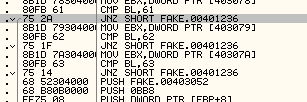

bên trái sai, bên phải đúng(dòng Mov)

Quay lại cửa sổ đăng kí

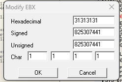

Sẽ có 1 ví dụ ngoải, nếu mà số nhập là 1212 thì nó đã biểu diễn ở Little-Endian là 31323132 và các kí tự bị ngược. Thực tế là nhìn xuống cái dòng Char ta cũng thấy nó là 2121

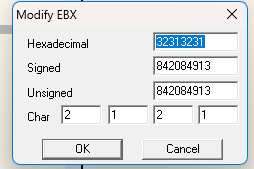

Nghĩa là nó đã biểu diễn theo đúng Little Endian

Giờ sang hướng dẫn tiếp

```
CMP BL,61
```

Đây là 1 câu so sánh, BL(byte đầu tiên trong thanh ghi EBX) với 61(hex). 

Tiếp đến là :

```
JNZ SHORT FAKE.401236
```

Như ta đã comment ở trước là ta không muốn cái điều kiện jump này đạt được. JNZ nghĩa là Jimp if not zero, nghĩa là gộp với dòng trên thì có thể hiểu rằng, nếu  BL không bằng 61 thì nó sẽ jump đến cái thông điệp xấu.

Và ta đã thấy Byte ngoài cùng bên phải của thanh ghi EBX là 31 không phải 61, nó sẽ làm ta nhảy vào vòng lặp.

# CPU Flags

Cờ là cách để bộ xử lý có thể biết chính xác kết quả của lệnh là gì.  Cơ bản, CPU thực hiện so sánh 2 thứ, đặt cờ dựa trên các thuộc tính tương đối và sau đó thực hiện câu lệnh nhảy dựa trên các cờ này. 

_VD:_

```
if( serialNumber == 3 )
    dontShowNag();
else
    showNag();
```

Trong asm sẽ trông như này :

```
compare serialNumber with 3
   jump (if they are equal) to dontShowNag();
   jump to showNag();
```

Thực tế như này :

```
MOV EAX, addressOfSerialNumber 
CMP EAX, 3 
JE addressOfDontShowNag 
JMP adressOfShowNag
```

Đầu tiên, EAX được tải số seri của ta vào, tiếp là so sánh với 3, Nếu = 3 chuyển đến dontShowNag(),  nếu không = 3, truyền lệnh JE và nhấn lệnh JMP, tự động nhảy đến showNag().

Các cờ quan trọng là ZERO và CARRY, hiển thị ở Z và C trong Olly. Thay đổi cờ này có thể chặn bước nhảy trong chương trình

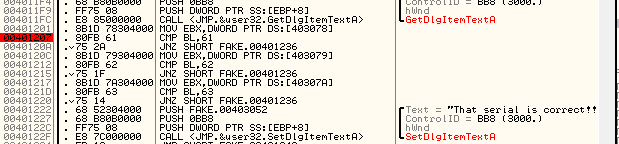

Đặt BP tại trước JNZ đầu tiên. Ta có thể xem xem bước nhảy có thể được thực hiện hay không ở cửa sổ bên dưới 

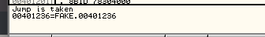

Bây giờ nếu ta không can thiệp thì Olly sẽ thực hiện nhảy, ta sẽ qua cửa sổ Register, cờ Z

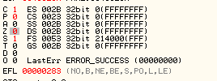

Cờ Z đang là 0. Có nghĩa là so sánh giữa 61 và nội dung thanh ghi BL(31) là 0, hoặc sai, không giống nhau. Giải thích 1 chút là nếu so sánh 2 cái không giống nhau thì cờ sẽ là 0 còn kết quả thì không bằng không. Vì vậy JNZ sẽ thực hiện nhảy, bây giờ, cờ Zero đang là 0. Vì vậy cần chuyển Z sang 1, cách là nháy đúp vào số 0, thì nó sẽ thành 1

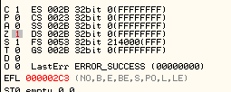

Giờ thử F8 để xem có nhảy không thì không nhảy. Do ta đã thay đổi hành vi của chương trình.

Tiếp theo là so sánh với 62h và 63h, ta cũng làm tương tự

Sau đó ta F9 để chạy nốt chương trình

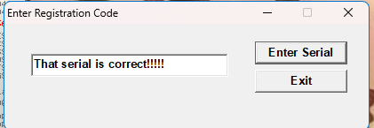

___Cờ Z bằng 0 thì JNZ sẽ thực hiện nhảy___

>#3  Phải làm nhiều mới vỡ ra được RE

# Homewokrk

Tìm ra số seri đúng để nó in ra cái correct ?

Nhờ con gemini mình cũng đã tìm ra chuỗi kêt quả là :

> abc

Tại sao lại là abc ?

Đầu tiên, ta để ý rằng, ở đây ta có 1 hàm GetDlgItemA, nghĩa là nhập liệu

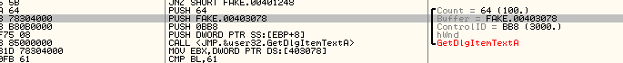

Có thể hiểu đây là phần nhận chuỗi ta nhập vào. Ta để ý tiếp dòng buffer của nó, nó ghi "Buffer = FAKE.00403078", thì nhờ gemini, mình cũng hiểu ra rằng, chuỗi ta nhập vào sẽ có địa chỉ bắt đầu ở 403078.

Tiếp theo khi qua các đoạn so sánh và JNZ. 

Với JNZ đầu tiên, ta để ý là nó mov vào thanh ghi EBX 1 ký tự gì đó ở 403078. Thì ta có thể hiểu là đây là kí tự đầu tiên

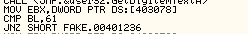

Kí tự đầu tiên này được đẩy vào thanh ghi EBX và nằm ở BL. BL so sánh với 61h đổi ra ASCII là a

Tiếp đến là nó lại mov 1 ký tự khác ở 403079, nghĩa là địa chỉ sau của ký tự đầu tiên của input, hay nó chính là ký tự thứ 2 của input. 

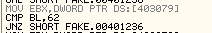

Nó cũng được đẩy vào BL, so sánh với 62h, đổi ra ASCII là b

Tương tự với 40307A thì nó là ký tự thứ 3 và so sánh với 63h đổi ra ASCII là c.

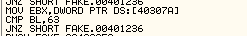

Như vậy ta có chuỗi _abc_ và...

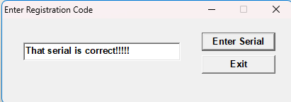

