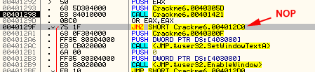
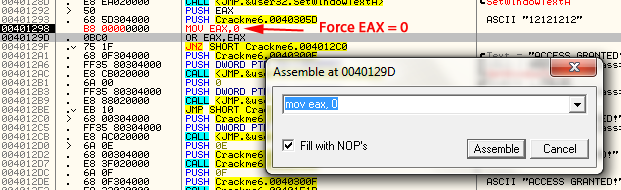
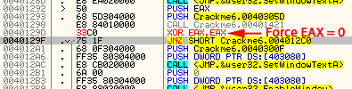
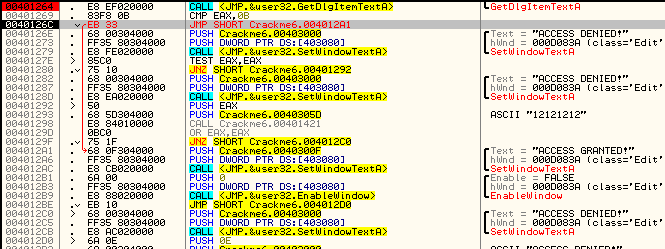

# Solution #1

Một trong những cách đơn giản nhất để vá app là đơn giản NOP lệnh JNZ ở địa chỉ 40129F

Nó sẽ bắt buộc app rơi vào thông điệp tốt mọi lúc.

# Solution #2

Một khả năng khác để đảm bảo EAX luôn bằng 0 là đơn giản thay thế lệnh gọi kiểm tra mật khẩu với __MOV EAX,0__

Điều này cơ bản xóa toàn bộ pha call kiểm tra tính hợp lệ của mật khẩu và luôn nhảy tới good boy

# Solution #3

Theo cùng 1 lí do như #2 trên thì ta sẽ giữ pha gọi, nhưng sau đó nó trả về, chúng ta có thể buộc EAX luôn bằng không, Chỉ cần thay __OR EAX,EAX__ với __XOR EAX,EAX__

#  Extra Credit

Cách đơn giản nhất để loại bỏ hạn chế về về độ dài mật khẩu là chỉ cần thay lệnh jump ban đầu nếu mật khẩu quá đài và thay nó với 1 lệnh nhảy jump trực tiếp đến thông điệp good boy.

Điều này không chỉ có lợi tỏng việc vá app để luôn chấp nhận mật khẩu mà không giống giải pháp trên, nó cũng loại bỏ mọi hạn chế  về mật khẩu.