# Introduction

Trong hướng dẫn này ta sẽ có thêm 1 kĩ năng mới vào trong kho vũ khí của mình. Ta sẽ làm gì nếu không có xâu văn bản trong tệp nhị phân để tìm kiếm? Ta sẽ nghiên cứu một crackme có tên là Crackme6

Vì vậy, hãy bắt đầu...

Tiếp tục và tải tệp Crackme6 vào Olly

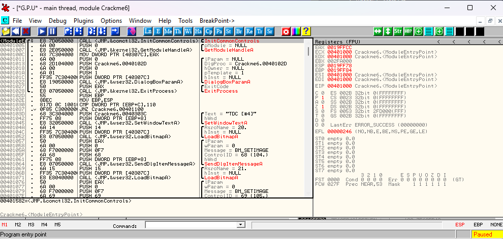

Bây giờ, như thói quen, hãy chạy app và xem ta có gì

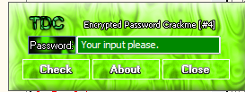

Có vẻ đơn giản. Tôi nhập một mật khẩu bất kì và nhận lại được :

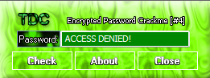

Khá gọn. Vì vậy hãy đến tiện ích "search for Strings" hữu dụng và xem ta có gì :

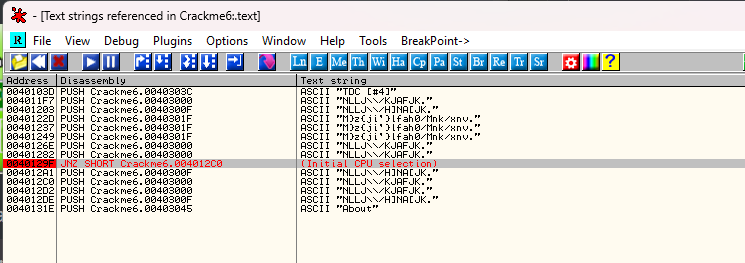

Cái gì đây ??? Chúng chả có tác dụng gì cả. Ta sẽ làm gì với những chuỗi kia? Rõ ràng, bài crackme này đã mã hóa các chuỗi văn bản. Đây là thời điểm tốt để giới thiệu

> R4ndom' Essential Truths About Reversing Data #3 : Do not rely on binary's having usable text strings.

Thật không may, ngay từ khi ta tham gia vào các tệp nhị phân thực(như sản phẩm thương mại) hầu hết đã được đóng gói hoặc là bảo vệ bằng 1 cách nào đó. 1 trong những cách rõ ràng nhất để cản kỹ thuật đảo ngược là mã hóa chuỗi. Điều thú vị trong RE là nếu ta tìm kiếm chuỗi văn bản mà bất cứ cái gì xuất hiện, ta có thể cho rằng tệp nhị phân đó có lẽ không đưa ra quá nhiều thách thức. Vì vậy, ta không thể phụ thuộc vào bất cứ điều gì ngay ta có nó và nó rất tuyệt vời.

# Intermodular Calls

Do đó, ta sẽ học 1 thủ thuật mới trong trường hợp không có chuỗi văn bản nào. Hầu hết các ứng dụng Windows sử dụng 1 bộ API tiêu chuẩn để thực hiện các hành động cụ thể. Ví dụ, MessageBoxA được gọi nếu muốn một hộp tin nhắn đơn giản, hoặc TerminateProcess được gọi khi app muốn kết thúc. Vì hầu hết app dùng những API giống nhau, ta có thể dùng nó để mang lại lợi ích. Ví dụ, Có những API để lấy văn bản từ 1 hộp nhập hộp thoại (như tên người dùng và số seri). Có những API để thiết lập thời gian(dùng trong những màn hình nhắc nhở chỗ mà ta phải đợi 10s trước khi ấn "continue"). Có những hàm so sãnh các chuỗi được gọi để so sánh 2 chuỗi(mật khẩu được nhập từ bàn phím có giống với cái được lưu ở trong chương trình không ?) Và có API để đọc và viết vào registry(để lưu và truy vấn trạng thái đăng ký của ta)

Olly có 1 cách để tìm kiếm tất các cuộc gọi API. Chuột phải vào cửa sổ disassembly và chọn "Search for" -> "All intermodular calls"

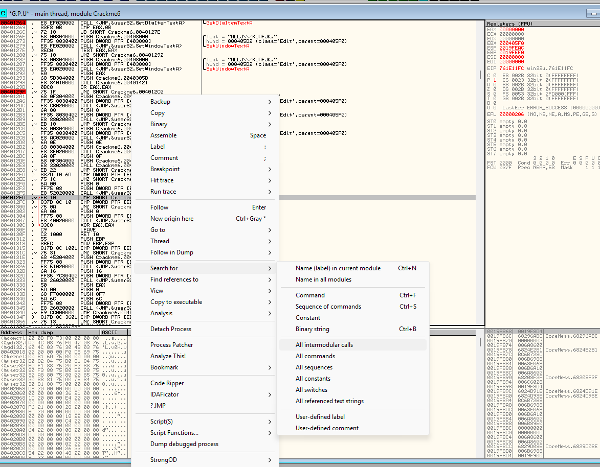

và Olly mở cửa sổ và tìm thấy các cuộc gọi liên modun:

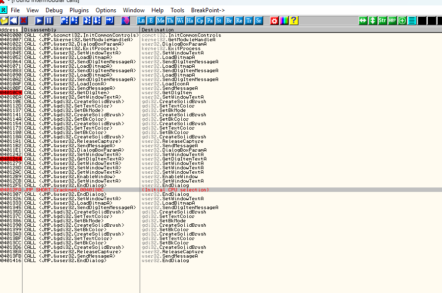

Điều đầu tiên ta nên làm là click vào tiêu đề "Destination" để sắp xếp danh sách hàm theo thứ tự chữ cái(thay vì địa chỉ) :

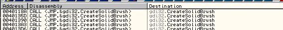

Và vây giờ, nếu ta nhìn vào cột thứ 3, ta có thể thấy tất cả các pha gọi API được crackme thực hiện :

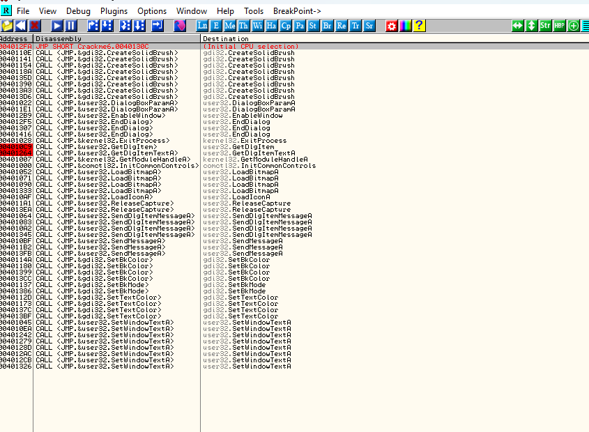

Đây là một chương trình nhỏ, vì thế không có nhiều. Hầu hết các chương trình sẽ có hàng trăm. Nhưng ở trong danh sách này, ta có thể nói nhiều về nhị phân. Ta có thể nói rằng nó sử dụng các hộp thoại như là cửa sổ chính của window. Ta có thể nói nó tải một bitmap tùy chỉnh. Hoặc ta có thể nói rằng nó đổi một số màu trong hộp thoại.

Ở trong 1 ứng dụng lớn hơn, cửa sổ này thậm chí trở nên vô giá hơn, vì nó sẽ nói cho ta những thứ như 1) Có API registry nào được gọi để lưu trữ hoặc truy vấn thông tin từ registruy không? 2) có API đang gọi trang web để xác thực rằng ta thực sự đã đăng ký không? 3) Có API nào đang đọc và ghi vào file nơi mà có lẽ 1 khóa đăng ký được lưu trữ không ? Và khi ta vào 1 tệp nhị phân được đóng gói, màn hình này sẽ trở nên quan trọng hơn.

Tất cả những gì đang được nói, có những API đặc biệt mà kĩ sư RE luôn tìm kiếm, các APi dùng trong bảo vệc lược đồ rất nhiều, bao gồm :

```c++
DialogBoxParamA
GetDlgItem
GetDlgItemInt
GetDlgItemTextA
GetWindowTextA
GetWindowWord
wsprintA
LoadStringA
lstrcmpA
MessageBeep
MessageBoxA
MessageBoxExA
SendMessageA
SendDlgItemMessageA
ReadFile
WriteFile
CreateFileA
GetPrivateProfileA
WritePrivateProfileStringA
GetPrivateProfileStringA
```

Không may là trên đây không bao gồm tất cả các lệnh gọi API mà có thể gặp phải, nhưng may là hầu hết các app sử dụng những cái dưới đây :

```c++
GetDlgItemA
GetWindowTextA
lstrcmpA
GetPrivateProfileStringA
GetPrivateProfileIntA
RegQueryValueExA
WritePrivateProfileStringA
GetPrivateProfileIntA
```

Vì vậy, nếu ta tập trung vào 8 lệnh gọi API trên, ta có thể giải quyết phần lớn các trường hợp. Và đừng quên, ta luôn có Olly để giúp với "Get help on symbolic name"

Giờ, khi ta nhìn xuống danh sách các lệnh mà Olly thấy trong crackme của ta, có 2 cái mà ở trong danh sách ngắn của ta:


__GetDlgItem và GetDlgItemTextA__

Những gì 2 lệnh này gọi API là truy xuất bất kì văn bản nào được nhập vào trong hộp thoại. Ở trong crackme của ta, điều này chỉ có nghĩa là 1 điều, mật khẩu của ta đã nhập vào. Điều ta cần làm là cho Olly dừng bất cứ khi nào nó gặp 1 trong những lần gọi kia. Cách để thực hiện là chọn dòng lệnh có lệnh gọi mà ta muốn, chuột phải và chọn "Set breakpoint on every call to ..." trong đó ... là tên của API(trong trường hợp này là GetDlgItem):

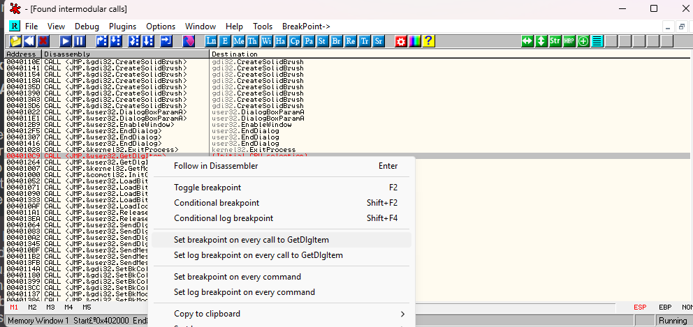

Bây giờ ta có thể thấy Olly đã đặt BP trên dòng này

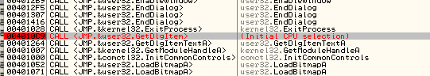

Chúng ta cũng muốn dừng trong những pha gọi API khác, GetDlgItemTextA, vì vậy click vào nó, chuột phải và làm tương tự :

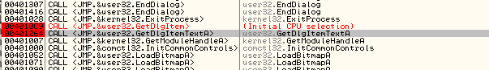

Bây giờ, bấy cứ khi nào Olly gặp 1 trong 2 pha gọi này, nó sẽ dừng(trước khi pha gọi thực hiện) Vì vậy hãy thử nó. Khởi động lại crackme và chạy nó. Olly sẽ dừng ở pha gọi GetDlgItem

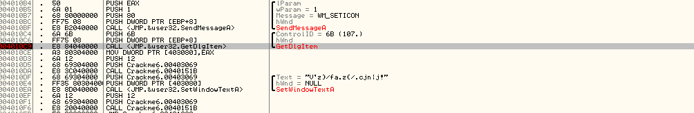

Bây giờ, ta vẫn chưa nhập gì, ta thực sự không quan tâm đến những gì GetDlgItem nhận được trong trường hợp này, tiếp tục F9 :

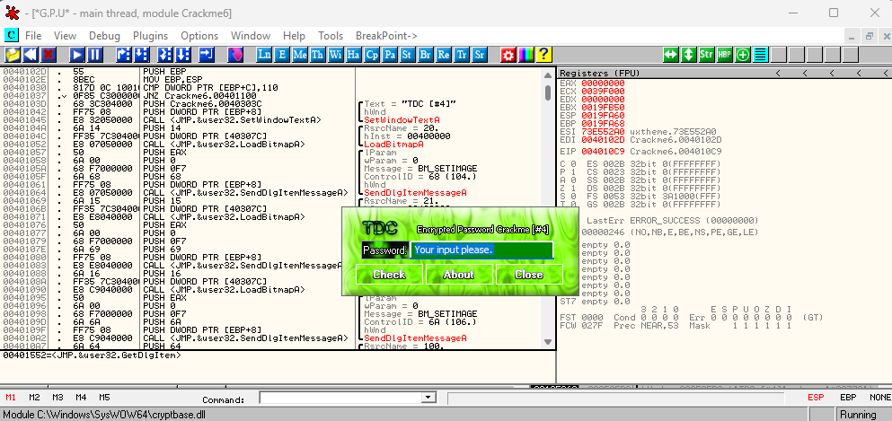

Nhập mật khẩu và "check"

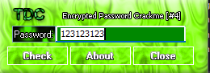

Và Olly sẽ dừng 1 lần nữa, lần này là ở GetDlgItemTextA

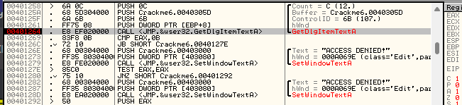

nếu ta nhìn xung quanh 1 chút, ta sẽ thấy rằng ta đang ở đúng nơi. Thật buồn cười là không một chuỗi văn bản nào trong số đó ở đây khi ta tìm kiếm chúng.

# Cracking the app

Hãy nhìn nhanh xung quanh. Ta thấy 1 bước nhảy (JB) vươt qua "ACCESS DENIED", vì thế ta sẽ chú ý đến nó :

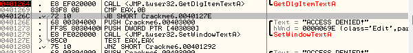

Sau đó có 1 bước nhảy(JNZ) vượt qua badboy thứ 2, vì vậy, ta sẽ thêm nó vào danh sách. Sau đó ta sẽ rơi thẳng vào goodboy, vì vậy cơ bản là ta muốn  chắc rằng ta nhảy cả 2 cú nhảy đó :

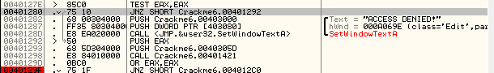

Hãy thử nó xem có đúng không. Chạy app lần nữa và ta sẽ dừng ở GetDlgItemTextA(bỏ qua BP đầu)

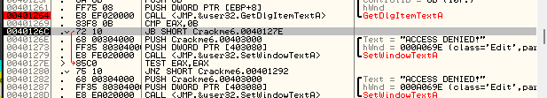

Vì đây là 1 bước nhảy JB, ta cần lật bit C.

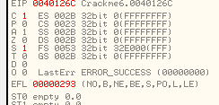

Vì thế điều đó sẽ buộc phải nhảy. Giờ ta sẽ thực hiện 1 lệnh TEST khác và dừng ở cú nhảy ở địa chỉ 401280. Để ý rằng mật khẩu của ta được hiển thị trong cột comments.

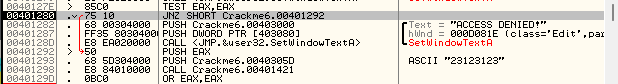

Cú nhảy này ta muốn thực hiện khi nó nhảy vượt qua badboy, vì thế chỉ cần bước tiếp cho đến khi ta đến lệnh JNZ tiếp theo ở địa chỉ 40129F :

Ok, giờ nó sẽ nhảy vượt qua thông điệp tốt, vì thế ta muốn ngăn điều này xảy ra. Ta biết là phải làm gì rồi đó :

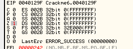

Gờ hãy chạy app(F9) và ta sẽ thấy ta đã bẻ khóa thành công chương trình

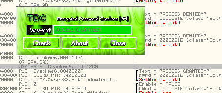

# Homework

Với 1 thử thách, hãy thử chính bản thân vá crackme này, dựa vào các cờ ta đã đổi. Sau đó lưu bản vá chương trình đó vào, ta có thể chạy nó với bất kì mật khẩu(ít hơn 11 kí tự) nào và nó sẽ hiện "Access Granted". Nhớ rằng có 1 số bản vá có thể thực hiện điều này, nếu 1 bản vá không hiệu quả, có thể tiếp tục tìm kiếm

Thử thách khó hơn : vá crackme để  mật khẩu của ta có thể dài bất kì

Giải quyết thử thách cơ bản, ta sẽ thay lệnh JB ở địa chỉ 40126C và 401280 thành JMP để chắc chắn thực hiện 2 lệnh này. Sau đó ở lệnh nhảy JNZ ở địa chỉ 40129F, ta sẽ đổi ngược lại thành JZ để không thực hiện cú nhảy này. Và khi chạy chương trình đã ok.

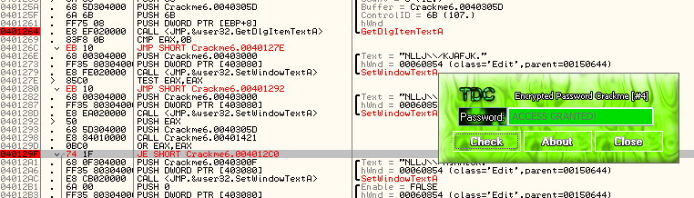

Với cấp độ cao hơn, ta mò xung quanh có thể nhận ra đoạn code check xem có 11 kí tự ở password ở đây địa chỉ 401269 : __CMP EAX,0B__ nghĩa là so EAX với 11

Thực ra với bản vá cơ bản của ta cũng đã qua mặt được nó rồi :

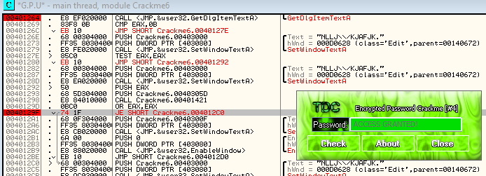

Nhưng ở đây, để mang tính xây dựng, chắc là ta sẽ thay lệnh cmp kia thành NOP cho nó ok.

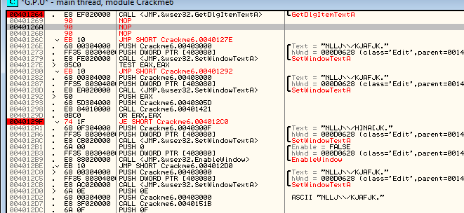

Lưu bản vá lại :

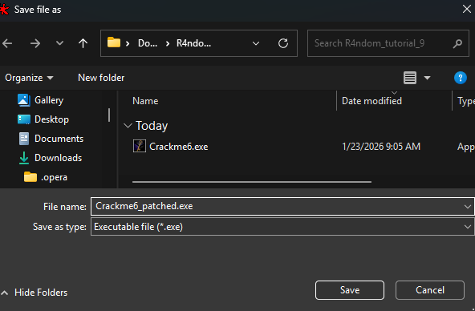

Chạy thử :

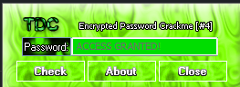

Ok rồi.