# Introduction

Trong bài này, ta sẽ tiếp tục bàn về việc vá chương trình. Tuy nhiên, ta sẽ bước đầu đi sâu vào việc tìm mật khẩu chính xác của chương trình được ẩn giấu. 

# Giải quyết ban đầu

Ở bài này ta sẽ có một chương trình console. Chương trình console là 1 chương trình cửa sổ 32bit giống như các chương trình windows khác. Khác biệt là nó không dùng giao diện đồ họa còn lại giống hệt nhau. Crackme này gọi là CrackmeConsole.exe. Chạy lên và xem có gì:

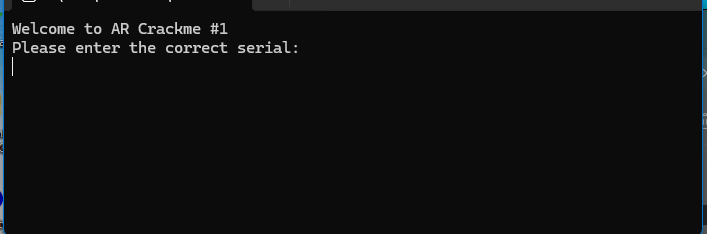

Thử nhập mật khẩu :

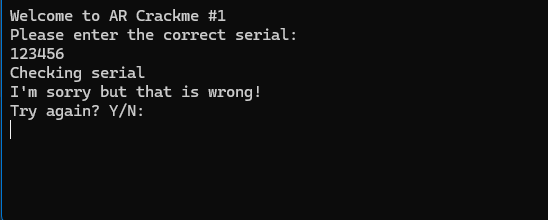

Có vẻ không ổn. Bấm N để kết thúc.

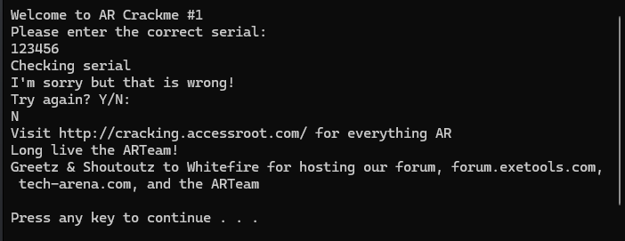

Tải vào Olly và bắt đầu điều tra. Và bắt đầu bằng thao tác kiểm tra các chuỗi :

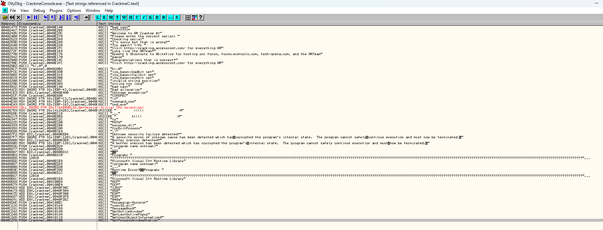

Không khó để tacos thể thấy được badboy : "I'm sorry but that is wrong!". Double click để nhảy vào vùng của nó.

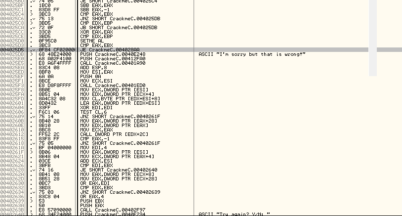

Để ý một chút, có 1 cú nhảy đến thông điệp này từ 4025C6, được biểu thị bằng một mũi tên. Ta cũng nhận ra rằng ta có thể chạm vào thông điệp badboy bằng việc không nhảy ở cú JE tại địa chỉ 4025D5. Xem bước nhảy này sẽ nhảy tới đâu:

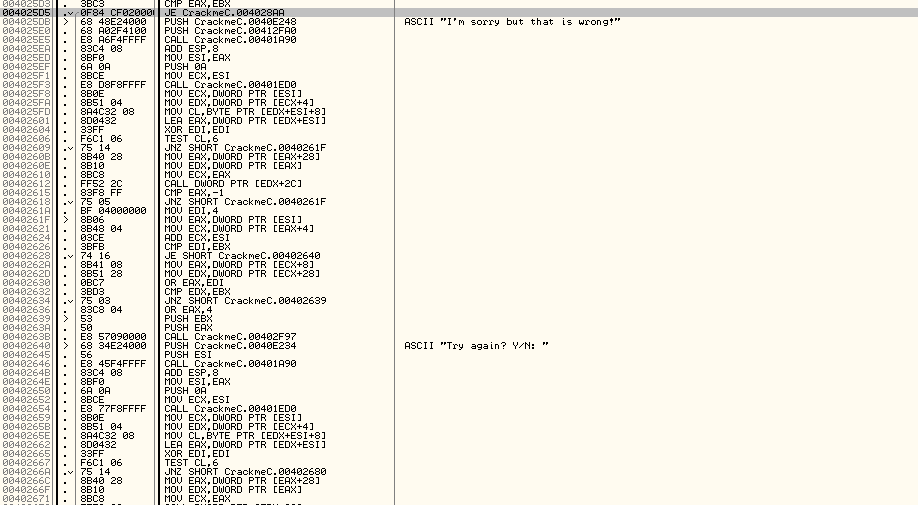

Cuộn xuống 1 lúc :

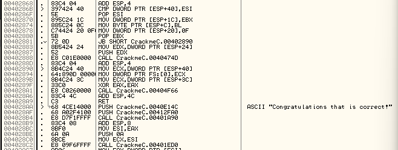

Đây có vẻ là con đường ta muốn đi. 

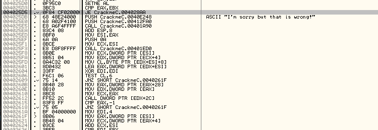

Vì vậy cú nhảy tại địa chỉ 4025D5 nhảy đến thông điệp goodboy, vì vậy đó là bước nhảy ta muốn thực hiện. Thử tìm một vài cú nhảy xung quanh khác, có vẻ cũng có 1 cú nhảy trước đó cũng dẫn đến goodboy.

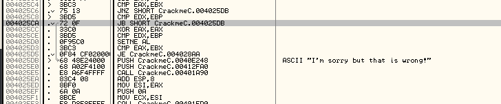

Cài này là badboy

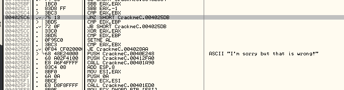

Cũng như cái này, tiếp tục nhấp vào hướng dẫn nhảy. Từ đây ta có thể suy đoán rằng chỉ có bước nhảy tại 4025D5 là cú nhảy duy nhất đến goodboy. Vì vậy ta muốn tất cả cú nhảy đến badboy không nhảy và buộc cú nhảy nhảy đến goodboy. Nếu cuộn lên 1 chút sẽ thấy lệnh gọi/so sánh tại địa chỉ 402582

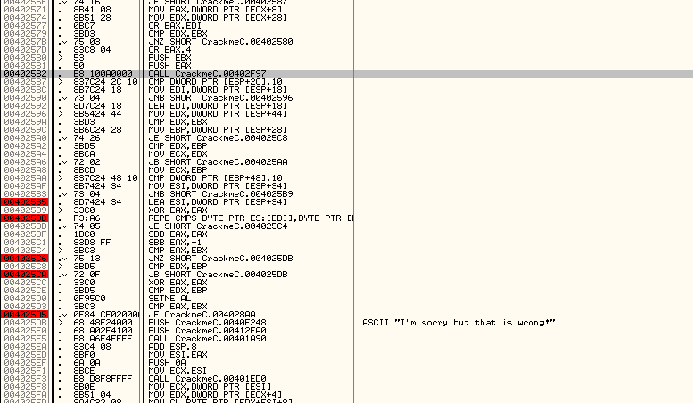

Cuộn tiếp lên, thấy có 1 bước nhảy để bỏ qua Call bên trên để thực hiện so sánh

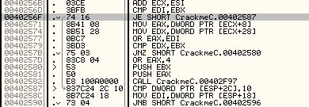

Cuộn lên trên tiếp sẽ thấy một nhóm so sánh khác, đặt BP cho cả 2 CALL

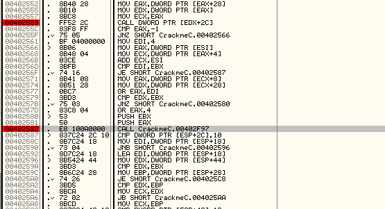

Ok thử chạy lại app và xem gì xảy ra nếu nhập password 11111

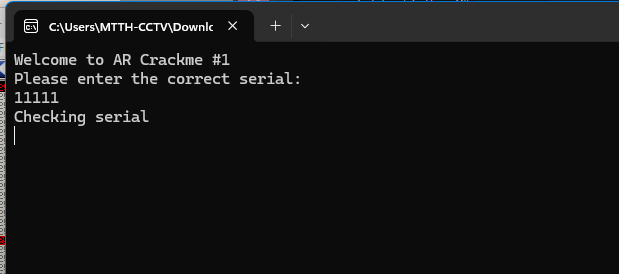

Olly dừng tại Call đầu tiên

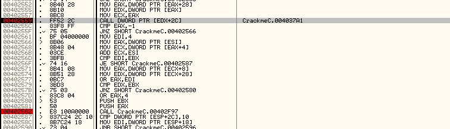

Bắt đầu step từng bước một, có thể thấy bước nhảy ở 40256F nhảy qua cái Call thứ 2, điều này có thể nhận định rằng bước nhảy này không phải là thứ kiểm tra mật khẩu, nên cótheer là quy trình nào đó nếu mật khẩu không đáp ứng một số thông số kỹ thuật nhất định như quá ngắn hoặc quá dài. nhảy tiếp 1 bước

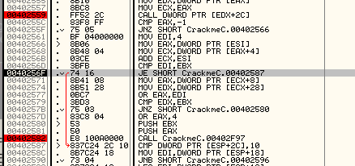

Tại 4025C6 thấy cú nhảy đến badboy

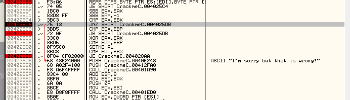

Đổi cờ Z và xem điều gì xảy ra

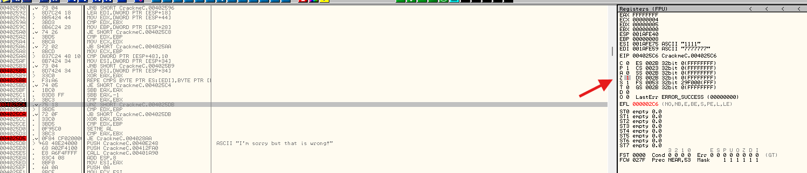

Nó đã không nhảy đến badboy. Ta step từng bước 1. Tại 4025CA lại có jump đến cái call badboy. Để ý sang lệnh asm thì là JB. Đoạn này ta phải đổi cờ C 

JB nghĩa là so sánh unsigned, nếu nhỏ hơn thì nhảy -> CF = 1

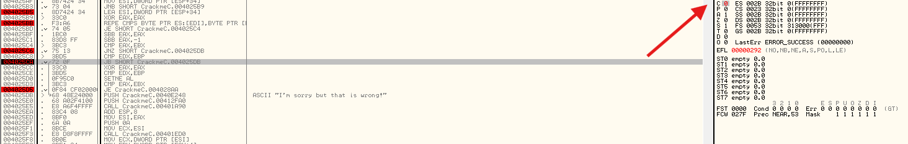

Tại 4025D5 thì có JE đến cái goodboy ta cần thì sẽ đổi cờ Z để thực hiện cú nhảy này

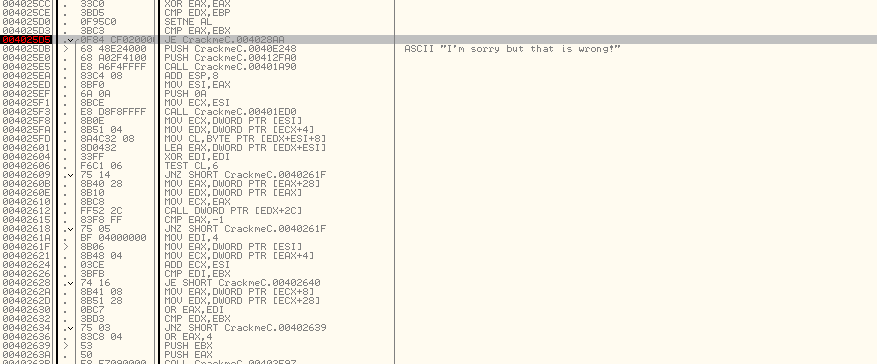

Ta đã tìm được bản vá

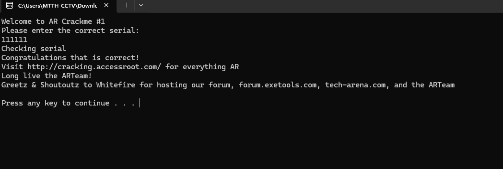

# Digging Deeper

Thử cuộn trở lại bước nhảy badboy, cố tìm hiểu lý do khiến cú nhảy nhảy nếu ta không vá. Đặt một comment tại bước nhảy đến badboy để ta còn nhớ

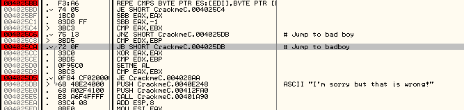

Nên đặt các dấu _#_ ở đầu để comment trông nổi bật. Giờ nhìn lên bên trên cú nhảy xem có tìm ra nguyên nhân gây ra không

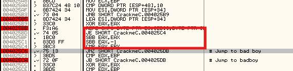

Ta có thể thấy 1 vài lệnh SBB với Compare. Điều này không có nghĩa nhiều với ta lúc này vì ta không biết bất kỳ điều gì trong số đó liên quan đến điều gì, vì vậy chuyển đến phần tiếp theo và xem có thể hiểu nó không

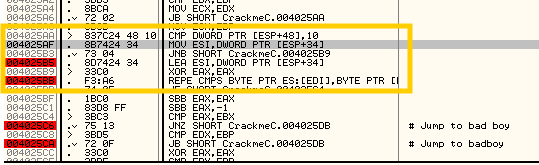

Ok ta đã đến một giai đoạn nào đó. Đầu tiên có thể thấy là lệnh REPE CMPS, đây là một dấu hiệu lớn trong reverse, tra thử REPE xem nó nói gì

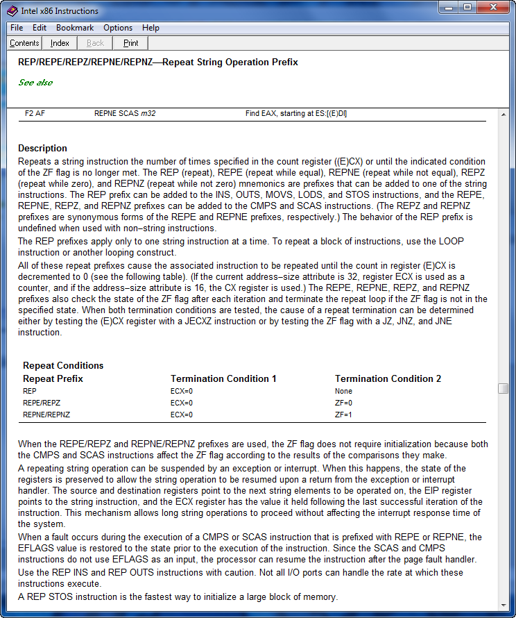

Nó như một câu lệnh lặp lại vòng lặp cho đến khi ECX = 0, lệnh sau REPE là CMPS là lệnh được lặp lại. Tóm lại,  lệnh này có nghĩa là "lặp lại so sánh 2 địa chỉ bộ nhớ, tăng  địa chỉ thông qua mỗi lần lặp, trong khi cờ không vẫn bằng nhau". Cơ bản là so sánh 2 chuỗi. Trong reverse, việc so sánh 2 chuỗi, cờ đỏ sẽ tắt, nó không được thực hiện thường xuyên trong các ứng dụng và kiểm tra số seri/mật khẩu/khóa đăng ký là một trong số ít lần như vậy. Đặt BP trên dòng đầu tiên của phần này tại 4025B5 và khởi động lại app. Nhập mật khẩu và Olly dừng tại điểm ngắt này

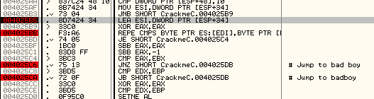

Giờ để ý đén dòng lệnh đầu tiên, _LEA ESI, DWORD PTR SS:[ESP+34]_, là loading một Effective Address vào ESI từ ngăn xếp SS: biểu thị ngăn xếp, [ESP+34] biểu thị vị trí trên ngăn xếp, trong trường hợp này là byte thứ 34 vượt qua bất kỳ thanh ghi ESP nào đang trỏ đến và lệnh LEA về cơ bản có nghĩa là tải địa chỉ của một cái gì đó, trái ngược với nội dung một cái gì đó. Nếu ta nhìn vào thanh giữa nơi đang có mũi tên, ta thấy SS:[ESP+34] bằng địa chỉ 012FE88 và ở địa chỉ này lưu mật khẩu ASCII. Step 1 bước và thấy ESI được đặt bằng mật khẩu của ta nhập ở trên ngăn xếp

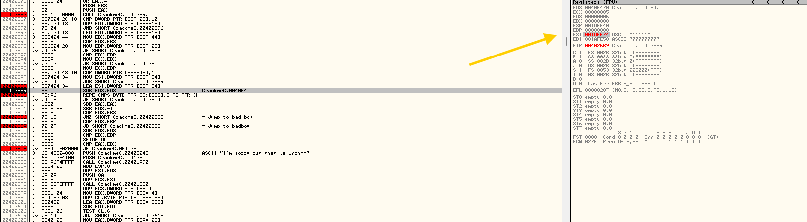

Lệnh tiếp theo đặt EAX thành 0 và sau đó ta gặp lệnh REPE. Trong trường hợp này, nội dung bộ nhớ tại địa chỉ được lưu trong ESI được so sánh với nội dung của địa chỉ bộ nhớ được lưu trong EDI

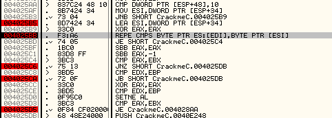

Sau đó thanh ghi ECX được hạ xuống một, so sánh sẽ được chuyển đến vị trí bộ nhớ tiếp theo trong cả EDI và ESI và vòng lặp kết thúc khi ECX = 0. Trong trường hợp này, nếu nhìn lên trên sẽ thấy ECX được đặt thành 5, vì vậy vòng lặp sẽ đi qua tất cả số trong mật khẩu của ta, mỗi lần so sánh một số với một chữ số trong EDI, nhưng đang so sánh với cái gì ? Nếu ta nhìn vào cửa sổ thanh ghi một lần nữa sẽ thấy rằng EDI trỏ đến một địa chỉ trên ngăn xếp có một số ASCII 7 trong đó. Xem điều này trên ngăn xếp. nhấp vào địa chỉ bên cạnh EDI, nhấp chuột vào nó và chọn "Follow in stack"

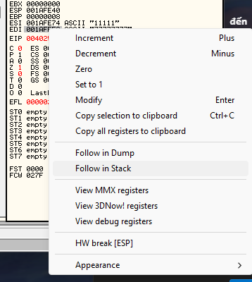

Cửa sổ ngăn xếp sau đó nhảy đến địa chỉ được tham chiếu, trong trường hợp này kà 01AFE58. Tại địa chỉ này, ta thấy 1 chuỗi "37" . Nhìn vào ASCII thì thấy rằng 37 bằng "7" mà ta đã thấy trong cửa sổ thanh ghi nằm trong thanh ghi EDI

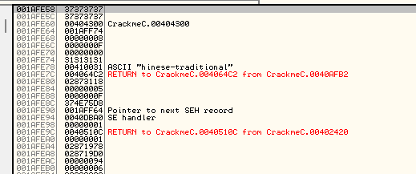

Ok, như vậy là đã hiểu rằng mật khẩu đã nhập được so sánh với 1 chuỗi ASCII được mã hóa cứng tất cả cách chữ số 7. Có chính xác 8 trong số chúng trên ngăn xếp. 8 chữ "7" này được so sánh từng cái một với những gì ta nhập. Nếu ta vượt qua tất cả 8 trong số chúng bằng nhau(7) thì ta sẽ thực hiện bước nhảy tiếp. Mật khẩu ta được so sánh với 8 chữ "7" nên là mật khẩu là 8 chữ "7". Khởi động lại và dùng thử

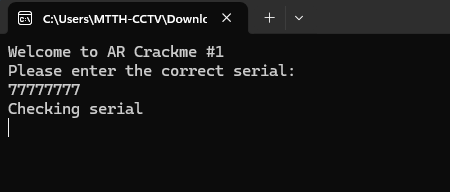

Okela

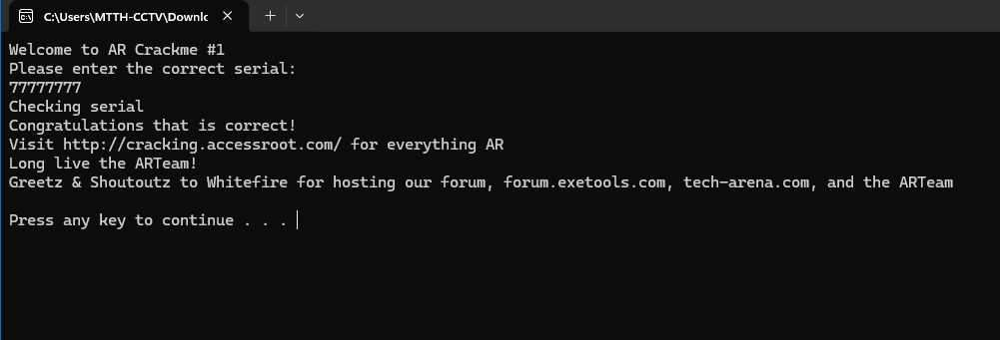

Và ta đã đạt được. Nhìn xa hơn một chút so với thông thường ta sẽ vá sẽ tiết lộ mật khẩu, thực ra là tốt hơn so với việc vá một app mà không biết rằng có thực sự vá không.

# One Last Thing

Đây là những gì nhận ra được của tác giả, đây là phần cốt lõi

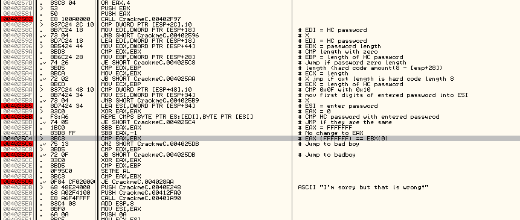

Có nhiều điều cần thiết để hiểu cách hoạt động....

