# Introduction 

Trong bài hướng dẫn này ta sẽ cần vượt qua 1 chương trình khó hơn chút. Nó là ReverseM1 được viết bởi R4ndom. Ta sẽ bàn về bảng ASCII cho Olly.

# Getting Started

Chạy chương trình 

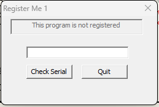

Ta có thể thấy rằng nó nói rằng Chương trình chưa được đăng kí và yêu cầu ta nhập vào 1 số seri gì đó. Nhập thử bừa :

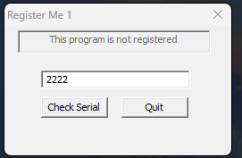

Click Check Serial :

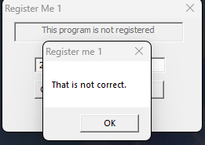

Và ta có thể thấy rằng chúng ta không đúng. Mở chương trình trong Olly và tìm kiếm theo chuỗi 

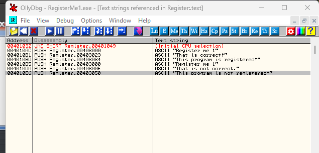

Có vẻ đáng mong chờ. Kiểm tra chuỗi "That is not correct" trước :

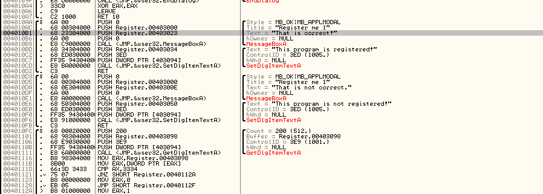

Và ta đến với vấn đề chính. Bởi vì mỗi phần của chúng là 1 hàm riêng biệt, ta cần phải thấy nơi mà gọi chúng, hãy làm vậy:

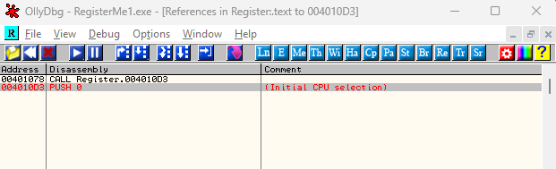

Ta có thể thấy rằng có 1 cú call đến hàm này. Double click và xem nó làm gì

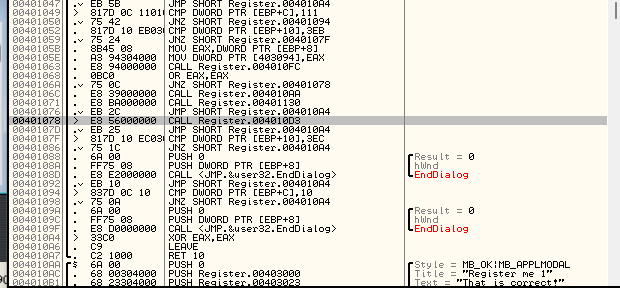

Đây, ta có thể thấy rằng badboy được gọi ở địa chỉ 401078 và ta cũng thấy ngay lập tức có 1 lệnh nhảy vào cái cú call kia ở địa chỉ 40106A

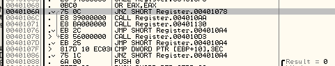

Cuộn lên 1 vài dòng, ta có thể thấy có 1 cú call để kiểm tra vòng lặp/so sánh/nhảy cái mà ta đã thấy trước đó. Từ đây ta có thể đoán rằng phần kiểm tra vòng lặp chính là ở 4010FC, gọi từ địa chỉ 401063. Sau khi trả về, thanh ghi EAX được kiểm tra xem nó có chứa 0 hay không, nếu không, ta sẽ nhảy đến badboy.

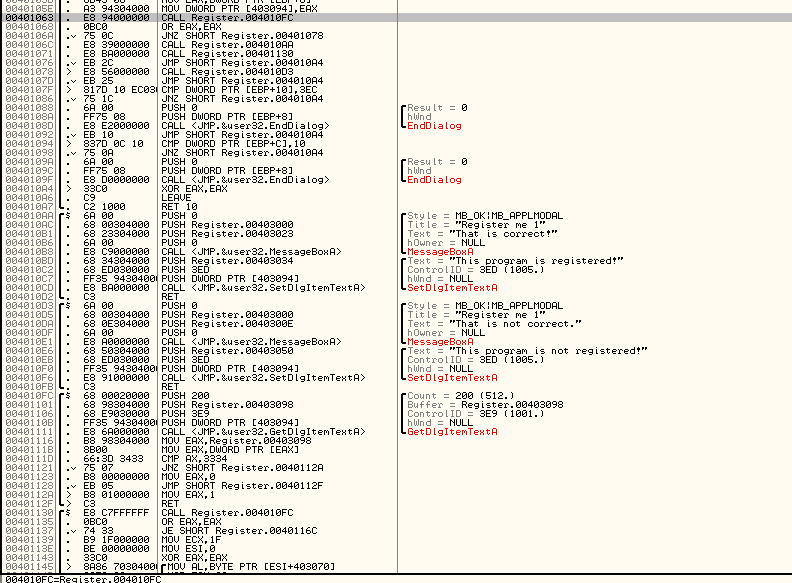

Hãy kiểm tra giả thiết trên bằng việc đặt BP ở địa chỉ 40106A và chạy lại app. Sau khi nhập 1 số, ta sẽ dừng ở lệnh jump sau pha call kiểm tra chuỗi seri

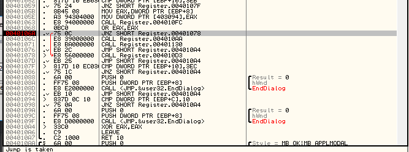

Giờ, hãy giúp Olly đi đúng hướng bằng việc không để cho nó nhảy và nó sẽ gọi đến goodboy

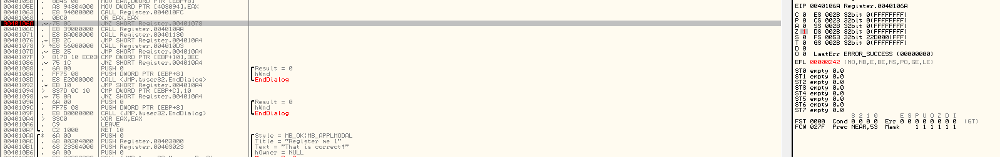

Ấn chạy tiếp

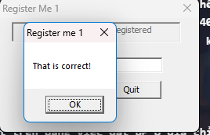

Tuyệt, Ấn ok và ...:

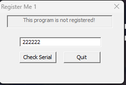

Cái quái gì đang xảy ra ở đây, hoàn toàn là nó không đăng kí chương trình. Điều này nghĩa là ta đã thiếu hụt một vài điều gì đó.

# Looking a Little Closer

Chạy lại app, nhập 1 số và Olly dừng ở 40106A

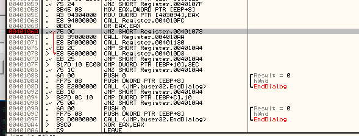

Ta thấy rằng nếu ta giữ không cho Olly nhảy tới badboy, ngoại trừ việc nhảy đến cú call vào dòng 40106C, nó sẽ call địa chỉ 4010AA. Nhìn xuống vòng lặp, ta có thể thấy rằng nó khá chuẩn mựcc, nó mở một hộp thoại với thông điệp "That is correct" và nó sẽ chuyển nhãn ở trên màn hình chính thành "This program is registered"

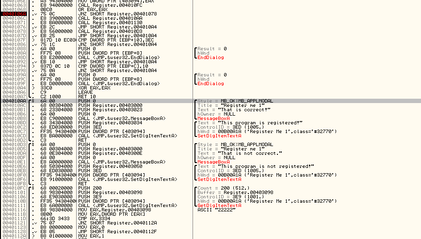

Nhưng từ từ, khi ta trở lại từ cú call, có 1 cú call khác ở địa chỉ 401071

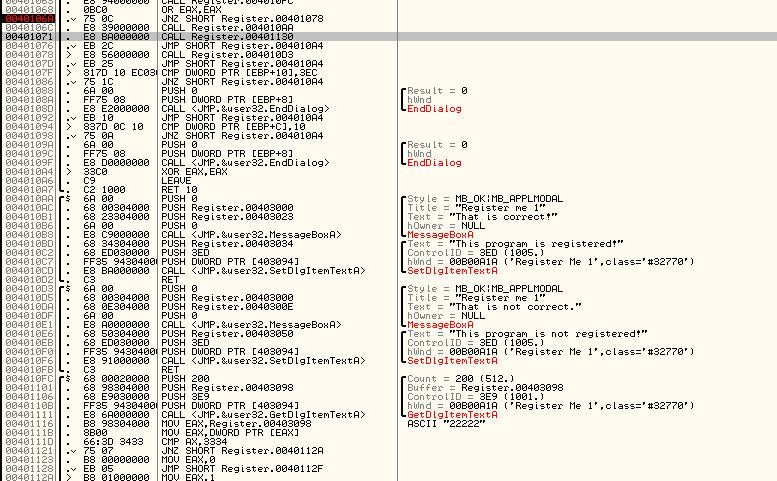

Cú call này call 401130, vì thế ta cần xem lại chút. Đầu tiên, ta để ý rằng nó gọi SetDlgItemTextA, nhưng có 1 điểm lạ là 1 chuỗi gì đó. Ta kiểm tra từng dòng. Ở 401130 1 cú call tới 4010FC. Nhìn lên trên, ta có thể thấy đây là vòng lặp kiểm tra số seri. Nó sau đó OR thanh ghi EAX với chính nó để xem nó có là 0 hay không và nếu không, nó sẽ thực hiện ............

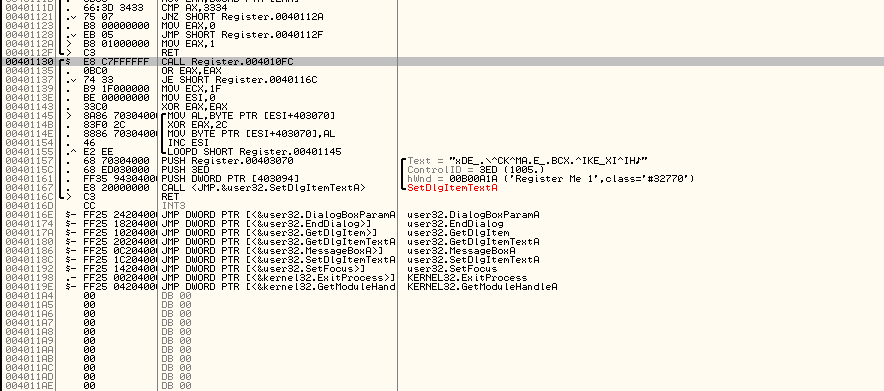

Vì vậy cái mà ta có thể thu được từ đây là, sau khi ta vá cái capp để hiển thị goodboy, 1 cú call nữa được thực hiện, và trong đó lại là 1 cú call, cú call này thực hiện vòng lặp kiểm tra số seri 1 lần nữa, thực hiện quá trình phân tích tương tự ở trên kết quả. Đây là sự kiểm tra backup. Giờ ta sẽ xem điều gì sẽ xảy ra nếu ta fail cú backup check 2 này.
(cái mà ta gặp phải vì ta đã chỉ patched cú jump)

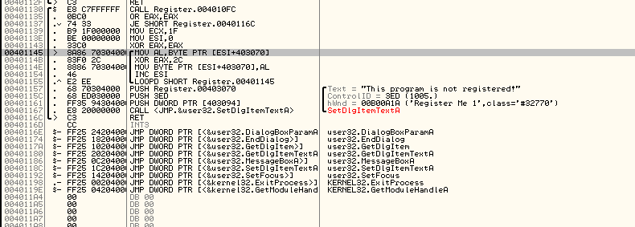

Đầu tiên, ECX được tải vào với 1F(31 trong hệ 10), ESI thì sau đó được tải vào với 0 và EAX là 0 thì out. Sau đó ta sẽ rơi vào 1 vòng lặp. Ta sẽ phân tích vòng loop này từng bước 1. Dòng đầu tiên chuyển 1 byte từ 1 địa chỉ ESI + 403070 và vì ta biết rằng ESI = 0, địa chỉ là 403070, trong thanh ghi AL. Xem cái gì ở trong cái địa chỉ trong dump. Click chuoojt phải chọn Follow in dump -> click vào cái memory address hoặc nếu mà chưa chọn dòng nào thì phải nhập địa chỉ 403070

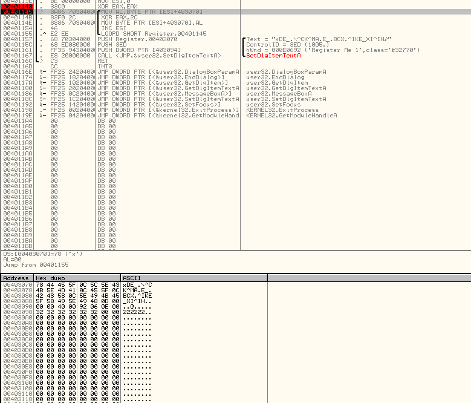

Nếu ta để ý kĩ, ta có thể thấy rằng đây là 1 chuỗi string cái xuất hiện ở trong tham số của SetDlgTextItemA. Vì vậy nó đang tải kí tự đầu tiên của ..... vào AL

__1 điều ta nên biết rằng trong ngôn ngữ assembly, 1 thanh ghi cụ thể thường được dùng trong cách mặc định VD ECX dùng để đếm, ESI dùng để lưu địa chỉ nguồn, EDI dùng để điểm đích. Đây là 1 trường hợp của ví dụ__

Tiếp đến, ta XOR các kí tự với 2C và sau đó lưu nó lại vào trong cùng 1 ô nhớ địa chỉ 403070 kia

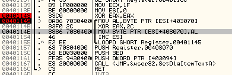

Cuối cùng là tăng ESI, thanh ghi nguồn và bắt đầu 1 LOOPD. LOOPD nghĩa là giảm thanh ghi ECX 1 lần 1 và lặp cho đến khi ECX bằng 0. Nó cho ta biết rằng giá trị được tải vào ECX ban đầu, 31 tỏng hệ 10 là độ dài của vòng lặp này.

Từ 1 bức tranh toàn cảnh, vòng lặp này là 1 cách lặp cơ bản thông qua từng kí tự của 1 chuỗi kì lạ, XOR nó với 2C và lưu lại vào trong cùng ô nhớ. Nó sẽ tiếp tục cho đến khi ECX bằng 0 hoặc 31 lần. nhảy đơn và khi gặp lệnh LOOPD sẽ quay trở lại đỉnh và nhìn vào cửa sổ dump.
                
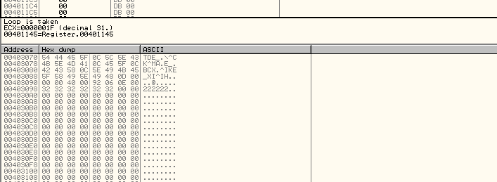

Ta cũng để ý rằng kí tự đầu tiên của chuỗi đã được thay thế. Ký tự gốc đã được XOR và bây giờ nó là 'T'. Nếu ta bước từng bước trong vòng lặp 1 vài lần, ta sẽ thấy cửa sổ dump đổi các chuỗi. Ta cũng sẽ thấy tham số của SetDlgItemTextA thay đổi như vậy

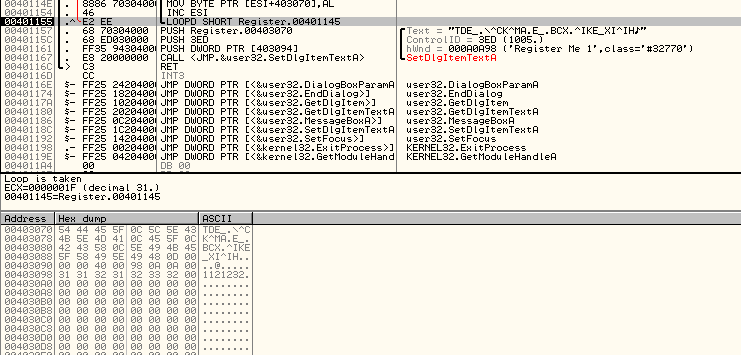

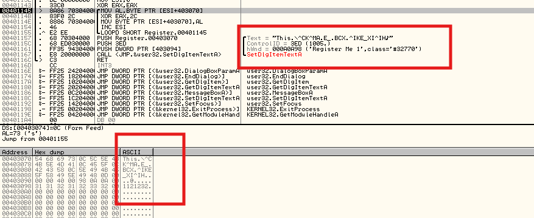

Bước hết các bước của vòng lặp, ta có thể thấy thông điệp cuối cùng, cái mà trông thực sự quen thuộc "This program is not registered", thông điệp này giống với cái thông điệp hiển thị ở trong màn hình chính biểu hiện rằng ứng dụng này thực tế là vẫn chưa được đăng kí

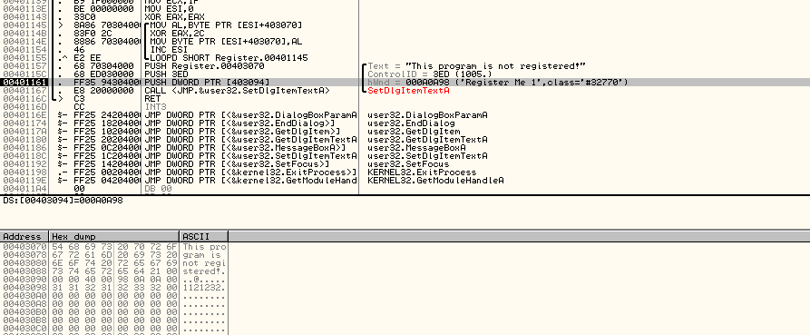

Ta có thể thấy chuỗi sau đó trở thành giá trị được đẩy vào SetDlgItemTextA, thay thế cái thông điệp đăng kí mà được đặt cùng với good boy bằng bản sao của thông báo chưa đăng kí trước đó

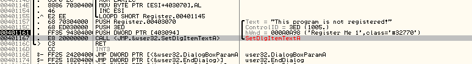

Và đây là thứ ta thấy trên app :

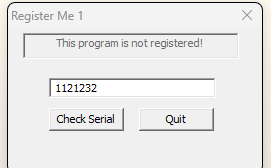

Vì thế bây giờ ta biết rằng cách khôn ngoan để vá cái app là vào trong hàm check serial và đảm bảo rằng nó luôn trả về giá trị đúng, nó được gọi không chỉ ở lần kiểm tra đầu tiên mà còn phải sau khi màn hình thành công được hiển thị. Nhắc lại rằng, cú gọi tới check serial được gọi, sau đó EAX được kiểm tra với 0. Nếu không là 0 thì nhảy tới badboy vì thế ta muốn vòng lặp trả về 1 số 0. Sau đó lần lần kiểm tra thứ 2 serial được gọi, nó sẽ trả về 1 số 0 một lần nữa và cú kiểm tra của ta sẽ được vượt qua

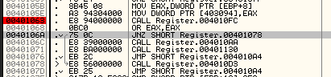

Vì thế, tới hàm kiểm tra serial và xem ta có thể làm gì với nó. Ban đầu vòng lặp là 1 cú call tới GetDlgItemTextA. Như ta có thể đoán, nó chỉ lấy cái số serial ta nhập vào. Ta có thể thấy điều này bằng cách nhấn chuột vào đối số tại địa chỉ 401101 trỏ đến vùng đệm tại nơi văn bản sẽ được ghi vào và theo dõi nó trong bản ghi

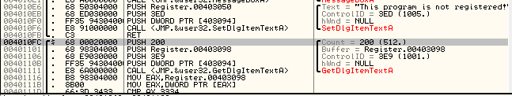

Sau khi ta qua hết hàm GetDlgItemTextA, ta có thể thấy số seria trong buffer 

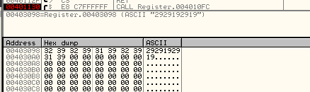

Sau khi nó được lưu trong buffer, địa chỉ phần đầu của buffer được đẩy vào EAX và nội dung của địa chỉ được đẩy vào EAX. Về cơ bản, thao tác này chuyển 4 byte đầu tiên của mật khẩu vào EAX. Các byte này sau đó được so sánh với 3334 và nếu nó không khớp EAX được điền với 1(bad), ngược lại khớp, EAX lưu giá trị 0(good)

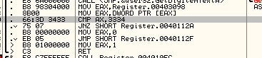

Có thể thấy quyết định chính là tại lệnh JNZ ở địa chỉ 401121 

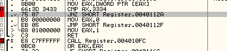

Dòng này xác định xem EAX bằng 0 hay bằng 1 trước khi trả về. Vì thế điều ta muốn là đảm bảo rằng EAX luôn bằng 0.

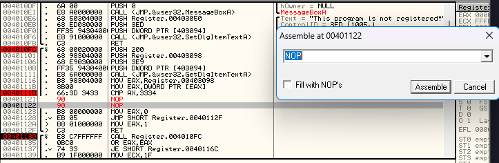

Vì vậy mã nguồn bây giờ sẽ luôn thực thi rằng chuyển 0 vào trong EAX và nhảy trực tiếp đến return. Giờ chạy app

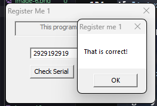

Và để ý rằng sau cú call tới kiểm tra  serial, ta sẽ nhảy thẳng tới goodboy

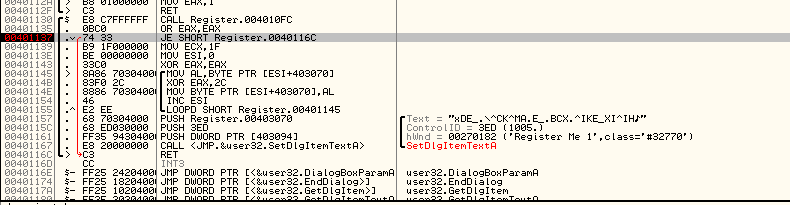

Và trong check thứ 2 sẽ nhảy tới goodboy như vậy 

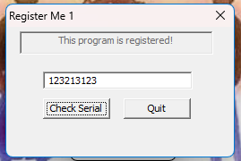

Vì vậy ta đã tìm ra 1 bản vá lỗi cho đăng ký chương trình này, bất kể nhập seri gì. Chúc mừng !

# ASCII table plugin 

1 thứ ta nên thử là tìm mật khẩu(hoặc cần cho nó). Để giúp bạn, tải và cài ASCII table plugin và copy nó vào trong thư mục plugin của bản. Sau đó restart và chọn plugin -> Ascii table và hiển thị bảng. Mặc dù còn nhiều thiếu sót, nó sẽ cung cấp cho ta 1 bảng nhanh chóng về các giá trị ASCII

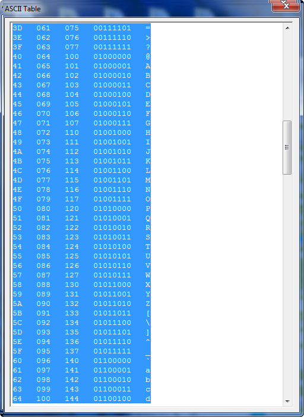

