# Giói thiệu 

Trong phần này sẽ thực hiện trên 1 chương trình thực sự. Chương trình này có sự hạn chế về thời gian, sau thời gian này nó sẽ không hoạt động. Ta sẽ vá nó để nó nghĩ rằng nó đã được đăng ký. 

# Nghiên cứu ứng dụng

Tiến hành cài đặt ứng dụng. Sau khi hoàn tất sẽ xuất hiện :

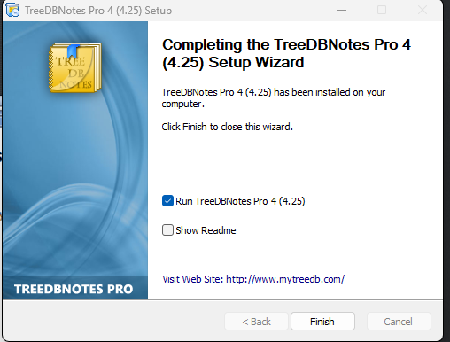

Để chạy ứng dụng và xem đang xử lí gì

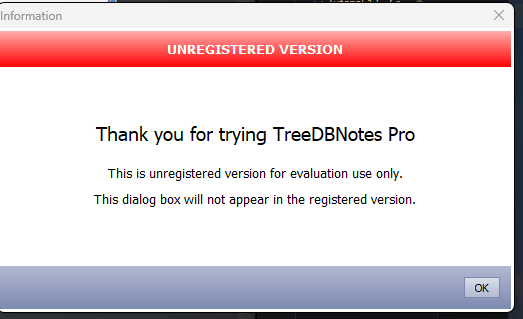

Không đẹp chú nào. Ở đây ta nhận thấy một số chuỗi hữu ích , "unregistered", "evaluation", "registered". Nhấn ok và đến màn hình chính:

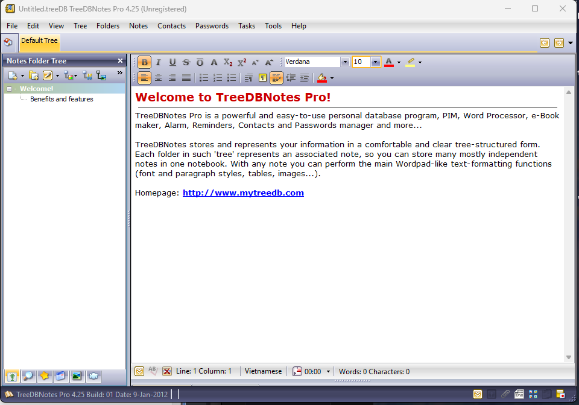

Lưu ý rằng nó ghi "unregistered" trên cùng thanh tiêu đề. Thông thường, một nơi khác ta nhìn thấy trong ứng dụng là màn hình giới thiệu. Nhiều lần nó sẽ chứa các chuỗi và ý tưởng để RE. Trong giai đoạn này, ta tìm các từ khóa, các cú call hàm dễ nhận biết, những thứ như vậy. Càng làm điều này sẽ có nhiều manh mối xuất hiện

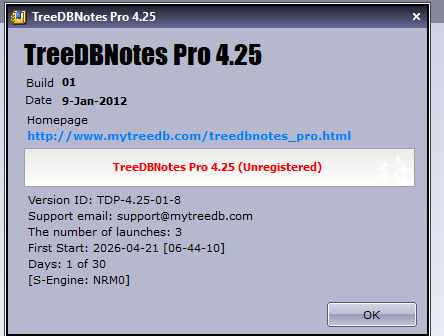

Ở đây ta lại thấy "unregisted" một lần nữa. Điều tiếp theo ta cần tìm là có cách nào nhập mã đăng kí không. Đây là điểm khởi đầu tốt cho việc xâm nhập nếu mẹo "search fo strings" không hoạt động

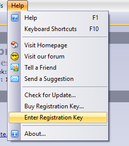

Và ở đây thấy 1 tùy chọn nhập mã đăng kí

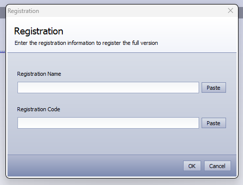

Thử 1 cái gì đó xem điều gì xảy ra

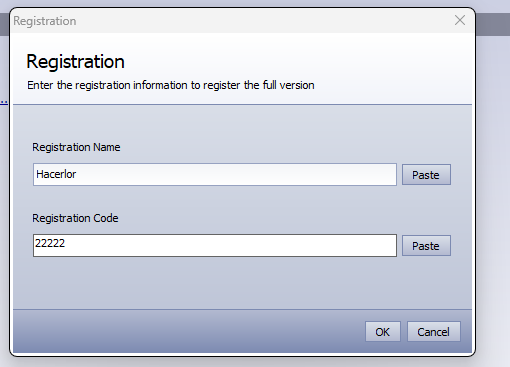

Nhấn OK:

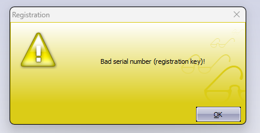

Có vẻ không đúng, nhưng ta có một ý tưởng khá tốt về những gì ta có trong tay, tải nó vào Olly

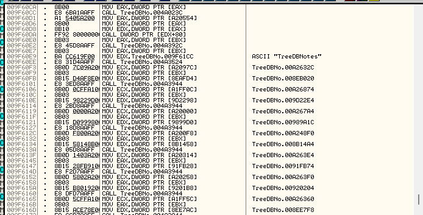

Có thể thấy trông hơi khác với các ứng dụng ta xem xét trước đó: có nhiều lệnh CALL mà không có các thiết lập Windows điển hình như RegisterClass. Đây là 1 dấu hiệu của chương trình viết bằng Delphi. Delphi dùng nhiều lệnh gọi ở khắp nơi. Ta có thể chắc chắn bằng cách chạy 1 chương trình ID, nhưng sẽ thực hiện trong 1 hướng dẫn sau này. Có các công cụ chuyên dụng giải quyết chương trình Delphi, nhưng may là ta không cần nó trong bài này.

# Finding the Patches

Hãy thử kiểm tra chuỗi. Chuột phải: Search for -> All referenced text strings và 

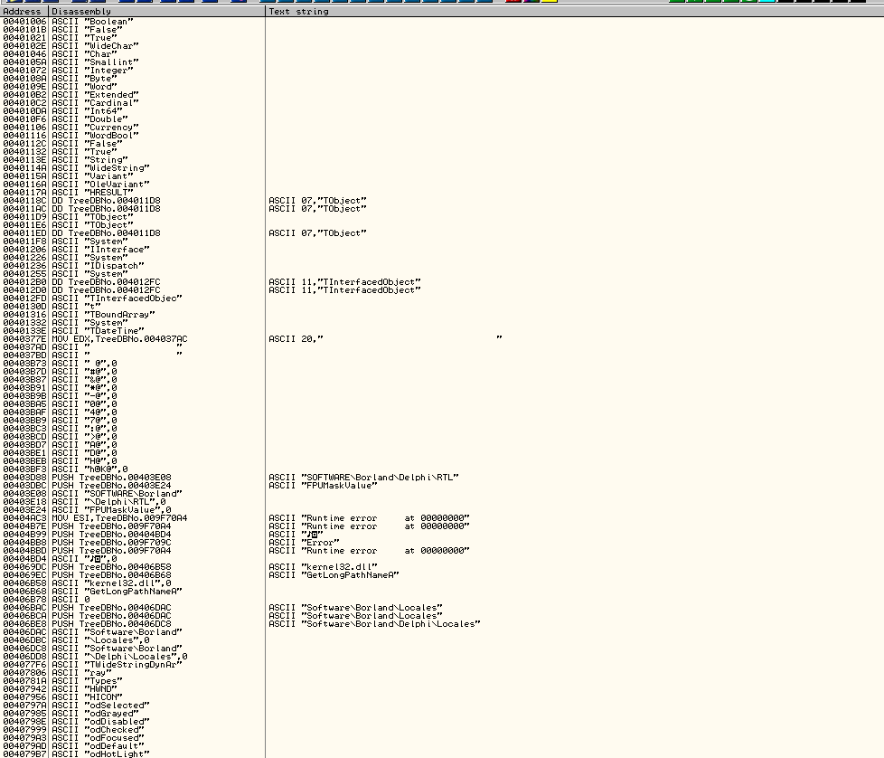

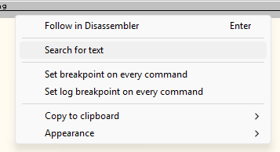

Và cửa sổ tìm kiếm sẽ mở ra. Giờ ta để ý rằng từ registration và registered được dùng nhiều vì thế ta tìm nó. Thường thường, trong trường hợp nàu, lần đầu tiên tìm, ta sẽ tìm "regist" sẽ bao phủ "Registrations" và "registered" và ta sẽ không bao giờ nhận được dương tính giả từ nó(đoán là không có từ "registrar" trong chương trình này). Đảm bảo rằng "case sensitive" chữ hoa tắt và "Entire scope" bật

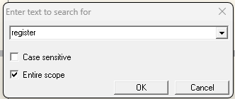

Kết quả đầu tiên nhận được có vẻ không đáng mong chờ, bấm ctrl-L để đến với kết quả tiếp 

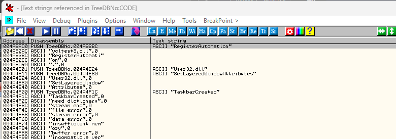

Chú ý rằng kết quả đầu tiên chỉ là dữ liệu thực của cái kết quả đầu tiên ta có. Điều này vì kết quả đầu tiên là nơi chuỗi "RegisterAutomation" được đẩy vào ngăn xếp, lần xuất hiện thứ 2 là dữ liệu thực tế trong bộ nhớ cho chuỗi "RegisterAutomation". Nhận ra điều này vì không có lệnh nào cho nó trong cột thứ 2 mà thay vào đó là ghi ASCII. Hầu hết các chuỗi ta gặp sẽ có 2 phiên bản, một nơi chuỗi được truy cập và một phiên bản nơi chuỗi tồn tại

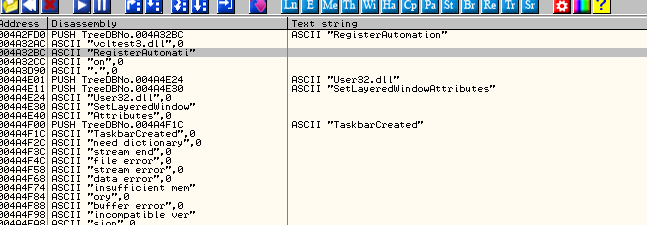

Nếu ctrl + L tiếp, ta sẽ đến với một chuỗi không mong chờ khác, tiếp tục Ctrl + L cho tới khi ta thấy như này.

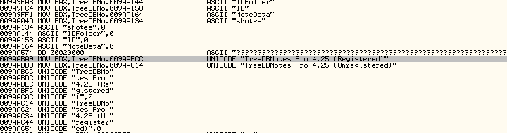

Bây giờ thì trông có vẻ tốt hơn. Có vẻ như trong 1 thời điểm nào đó của luồng chạy chương trình, nó sẽ kiểm tra xem ta đã đăng kí hay chưa và phụ thuộc vào kết quả, nó điền vào thanh tiêu đề của cửa sổ bằng chuỗi đã đăng ký hoặc chưa đăng ký. Đây là nơi tốt để bắt đầu. Nhấn đúp vào phiên bản "registered" và sẽ nhảy đến phần code

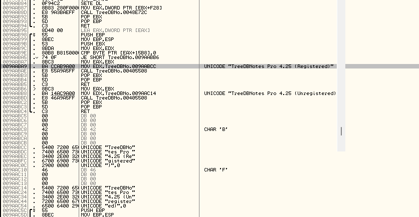

Điều đầu tiên cần chú ý là ta có thể thấy nơi chuỗi được sử dụng là tại địa chỉ 9AABA9 và ta cũng thấy nơi chuỗi được lưu là 9AABCC. Thứ 2, ta cần để ý là cả 2 chuỗi đều trong cùng 1 phương thức và có 1 lệnh nhảy điều kiện ở trên chúng, nhấp vào điều kiện đó tại địa chỉ 9AABA5 

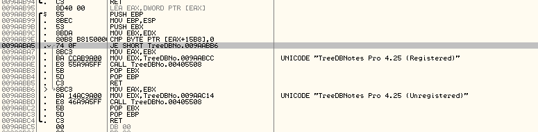

Ta có thể thấy rằng nếu kết quả bằng nhau, ta nhảy đến bản "unregistered" của chuỗi. Rõ ràng không muốn điều này. Đặt BP trên lệnh JE này và bắt đầu ứng dụng 

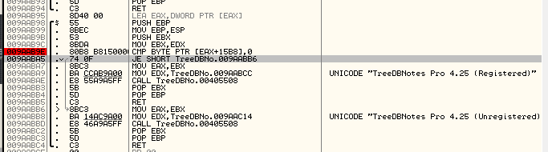

Olly dừng lại tại dòng này và muốn nhảy đến badboy. Thay đổi nó 1 lần nữa bằng cách đặt giá trị thanh ghi bằng 0 và nhấn chạy. Điều này sẽ xảy a 1 lần nữa và khi xóa cờ, cuối cùng ta nhận được 1 số thông điệp :

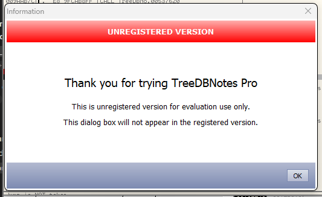

Vì thế nó đã không chạy. Vì thế vá cái này không làm cho chúng ta trở thành unregistered, mặc dù nếu ta click ok và xóa cờ 1 lần nữa, ta sẽ nhận thấy rằng nó đã gỡ bỏ tiêu đề unregistered của cửa sổ chính

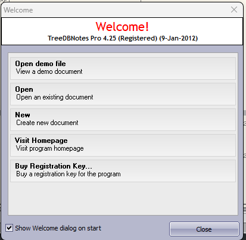

Vì thế ít nhất ta biết rằng ta đang đi đúng hướng. Những gì ta cần làm là lên mức độ tiếp theo và điều tra thêm 1 chút. Khởi động lại app để ta dừng tại điểm dừng của mình và điều tra thêm 1 chút

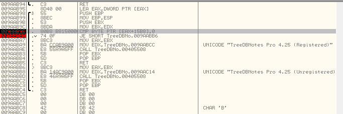

Không có cú call nào trước cái compare, nhưng trước lệnh JE có 1 lần so sánh ở địa chỉ 9AAQB9E :

__CMP BYTE PTR DS:[EAX+15B8],0__

Vì thế dựa trên kết quả của so sánh này, ta hoặc là đã được đăng kí, hoặc là không. EAX+15B8 chỉ là một địa chỉ ô nhớ, trong trường hợp này là một biến toàn cục vì nó bắt đầu bằng DS. Điều ta hi vọng là đây là hàm check duy nhất rằng ứng dụng đã được đăng kí hay là không. Nếu nó không phải vậy, ta sẽ cần phải tìm nơi nào khác mà kiểm tra đăng kí. Nhấp vào lệnh so sánh hiển thị cho ta EAX+15B8 là gì

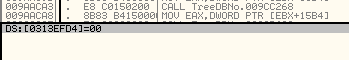

Click chuột phải vào địa chỉ, chọn "Follow in dump"

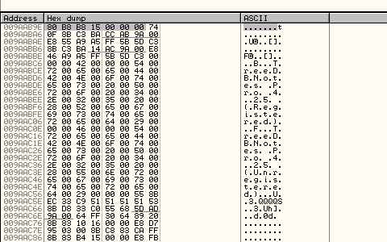

_Địa chỉ thì chắc chắn khác nhau. Không sao, chỉ cần làm theo và thay thế bằng địa chỉ của bản thân và nó sẽ chạy ổn_

Đây ta có thể thấy địa chỉ mà bị kiểm tra xem đăng kí hay không, đó là 00 đầu tiên tại địa chỉ 313EFD4(ít nhất là trên máy tôi). Điều này có nghĩa rằng nếu nội dung của vị trí bộ nhớ này không phải là số không, quy trình này sẽ giả định rằng chúng ta đã được đăng kí. Điều này có nghĩa rằng có thể có quy trình khác trong app kiểm tra vị trí bộ nhớ này, đó là lý do tại sao trong màn hình thì hiển thị "Đã đăng kí" trong khi phần khác của app lại biết là không. Vì ta mới chỉ bypass luồng chạy tự nhiên của chương trình sau khi kiểm tra nội dung ô nhớ, bất cứ quá trình kiểm tra khác chưa được bypass

Điều đầu tiên, cần đặt địa chỉ bộ nhớ này thành không = 0 để ta biết rằng ít nhất quy trình này sẽ luôn hoạt động theo ta muốn. Đặt 1 điểm dừng trên dòng so sánh 9AABA5 và xóa điểm dừng khác. Khởi động lại app và dừng lại, nhấp chuột phải vào dòng so sánh và chọn "Follow in dump" -> "Memory location" vì Olly đã đặt lại cửa sổ dump của chúng ta khi ta khởi động lại. 1 điều ta cần chú ý là địa chỉ bộ nhớ mà lệnh so sánh kiểm tra khác lần này.

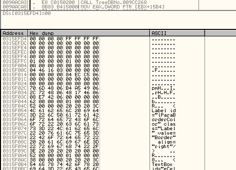

Cái đầu tiên địa chỉ khác, giờ là 315EFD4. Khác nhau giữa mọi người, nhưng chỉ cần lưu ý rằng, địa chỉ bộ nhớ lưu cờ đăng kí/chưa đăng kí là khác

Click vào "00" trong bảng dump(ở 315EFD4 trong bảng dump), click chuột phải và chọn "Binary" -> "Edit"

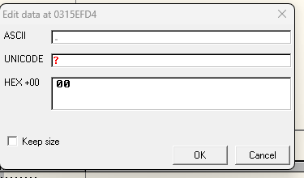

Nhập vào 01

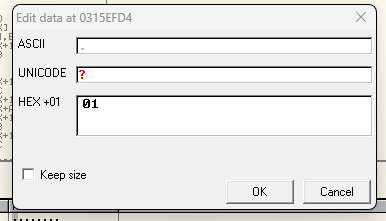

Và để ý rằng nó đã cập nhật bảng dump

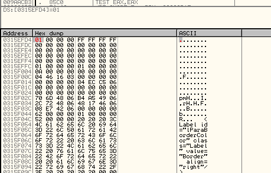

Tiếp tục chạy nó cho đến khi ta bị lỗi 1 lần nữa. Ta nhận ra rằng nội dung bộ nhớ đã trở lại thành số 0 và ta lại tiếp tục nhảy đến badboy. Điều này có nghĩa là ở đâu đó trong ứng dụng, 1 kiểm tra thứ cấp được thực hiện để đặt lại cờ đăng ký của ta về 0. Những gì ta cần làm là tìm nơi điều này được thiết lập và đảm bảo rằng nó không xảy ra. Để làm được, ta đặt 1 điểm dừng phần cứng tại địa chỉ  này để Olly dừng bất cứ khi nào ghi vào vị trí này. Ta nên chọn tùy chọn "Write" vì ở đâu đó cái giá trị 0 đang được ghi vào bộ nhớ này

Khởi động lại app và tiếp tục chạy đến khi dừng lại. Nhấp chuột phải vào "Compare" -> "Follow in dump" 1 lần khi olly reset lại cửa sổ dump. Chỉnh binary đầu tiên thành 1. Thấy rằng giá trị này giờ đây nằm ở địa chỉ bộ nhớ khác

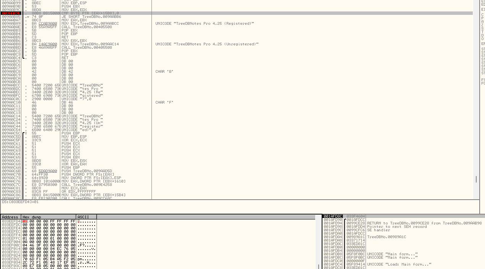

Click vào giá trị đầu tiên trong cửa sổ dump mà ta vừa chỉnh sửa, chọn "Breakpoint" -> "Hardware on write" -> "byte"

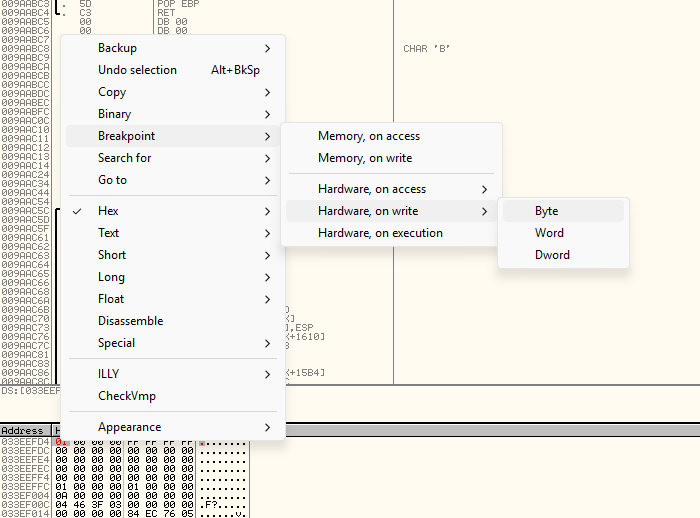

Khi tiến hành RE 1 app, ta thường chọn các điểm dừng liên quan đến phần cứng vì các điểm dừng này khó bị ứng phát hiện hơn. Chọn "byte" bởi vì nó là khối dữ liệu duy nhất mà ta muốn theo dõi

Giờ hãy chạy app. Olly sẽ dừng ở điểm dừng quen thuộc của chúng ta 1 lần nữa. Có thể thấy giá trị 01 ta nhập vào vẫn còn nguyên. Mọi thữ vẫn ổn. Hãy chạy Olly 1 lần nữa và Olly sẽ dừng ở 1 đoạn mã mới

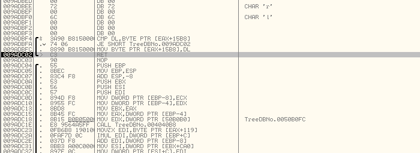

Nếu nhìn vào góc dưới bên phải cửa sổ OllyDBG sẽ thấy ta đang dừng ở điểm dừng phần cứng

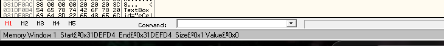

# Patching the app

Giờ hãy cùng xem đoạn mã này, lệnh đầu tiên là so snahs DL với nội dung trong ô nhớ có địa chỉ mà ta vừa sửa. Nếu 2 giá trị bằng nhau. Chương trình sẽ chuyển sang địa chỉ 9ADC02, nơi mà chương trình chỉ đơn giản là trả về. Nếu nó khoong bằng nhau, chương trình sẽ lưu nội dung thanh ghi DL vào trong bộ nhớ tươnng ứng. Chúng ta biết giá trị của DL = 0 vì ta thấy rằng giá trị trong bộ nhớ chuyển từ 01 của ta thành 00. Cơ bản là 1 thao tác kiểm tra lại, nếu thao tác này thất bại, giá trị 0 sẽ được gán vào cờ biểu thị registered/non-registered. Nếu nó không thất bại, nó sẽ được giữ nguyên. Giờ xóa BP hardware bằng cách chọn "Debug" -> "Hardware breakpoints" và xóa nó sau đó đặt 1 BP tại địa chỉ 9ADBF4 nhằm để nó dừng chương trình trước khi thực hiện đoạn mã này.

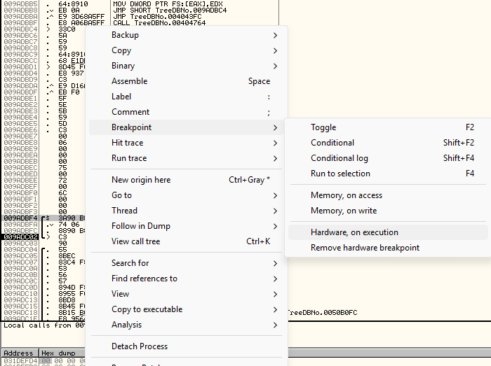

Lúc này ta sẽ thắc mắc rằng tại sao lại không đặt các BP bình thường ở vị trí đó. Nó bởi vì trước đó tôi từng thử rồi nhưng Olly không dừng tại đó. Có 1 vài lý do gây tình trạng này: đoạn mã thay đổi đa hình nên BP bị mất, ứng dụng  cũng kiểm tra xem có BP nào được đặt không và ứng dụng sẽ xóa nó, BP nằm trong phần mà Olly không thể tự động phát hiện được,... Điều này hoàn toàn có thể xảy ra. Nếu vậy, ta cần đặt BP vào hardware thay cho nó. Không có gì đảm bảo rằng phương pháp này sẽ hoạt động được vì app cũng có thể kiểm tra điều này. Nhưng đây là cách hiệu quả để đặt BP, nên là thường nó sẽ hoạt động tốt

__Trong bài tiếp sẽ trình bày chi tiết hơn về trick anti-debug__

Giờ khởi động lại app. Ta dừng chương trình tại BP hardware này

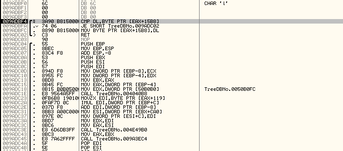

Ok, giờ hãy nghĩ 1 chút. Cái thủ tục này kiểm tra rằng ta đã đăng kí hay không, nếu chưa được đăng kí, giá trị 0 sẽ được đẩy vào địa chỉ bộ nhớ được chỉ định bởi [EAX+15B8], ngược lại nếu được đăng kí, giá trị 01(hoặc 1 giá trị khác 0) sẽ được ghi vào vị trí đó. Sau đó thủ tục cũ sẽ được thực hiện. Thủ tục này sẽ hiển thị dòng chữ "Registered" hoặc "Unregistered" ở trên thanh tiêu đề của cửa sổ tùy thuộc vào giá trị được lưu tại vị trí bộ nhớ đó. Vì vậy nếu ta đảm bảo rằng giá trị 1 luôn được đẩy vào vị trí bộ nhớ đó mỗi lần thủ tục này thực hiện thì các thủ tục khác cũng kiểm tra vị trí bộ nhớ đo và nhận thấy rằng cái app đã được đăng kí

Điều gì xảy ra nếu ta đổi quy trình này để luôn ghi 01 vào vị trí bộ nhớ tương ứng, thử xem sao.

Câu hỏi tiếp theo là làm sao để thực hiện nó 1 cách dễ dàng nhất. Ta đã có giá trị DL lưu tại 9ADBF4. Vì vậy cần thay đổi giá trị DL thành 1. Tuy nhiên việc này sẽ làm tăng độ dài của lệnh lên 1 byte, đồng thời giá trị của lệnh RETN cũng bị ghi đè. Vậy nếu ta thay các lệnh so sánh và nhảy bằng  việc gán 01 vào DL thì sao ? Như vậy thì ở dòng cuối, giá trị DL sẽ lưu vào vị trí bộ nhớ tương ứng. Đây là cách thực hiện : chọn 2 lệnh CMP và JMP kia để thực hiện thao tác này

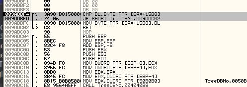

Chuột phải -> Binary -> Fill with NOPs

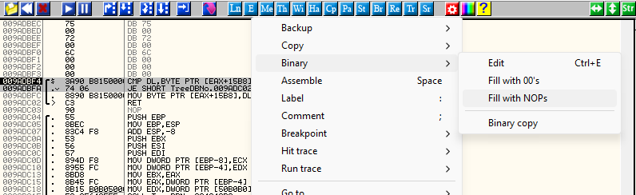

Không bắt buộc thực hiện bước này nhưng nó giúp thao tác trở nên đơn giản hơn.

Click vào NOP đầu tiên ở địa chỉ 9ADBF4 nhần phím cách sẽ mở ra cửa sổ code asm. Nhập MOV DL,1

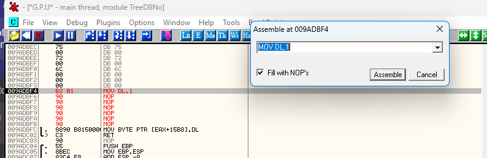

Click Asemble, sau đó nhấp Cancel, kết quả như này

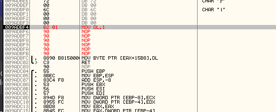

Giờ, mỗi khi thủ tục này được gọi, giá trị 1 sẽ ghi vào thanh ghi bộ nhớ thay vì 0. Vì ta vẫn đang ở dòng lệnh đầu tiên của thủ tục này, ta có thể kiểm tra xem giá trị 1 có được ghi vào vị trí bộ nhớ tương ứng không. Có lẽ cần truy cấp vào địa chỉ bộ nhớ chính xác trong tệp dump, có thể  Olly đã đặt lại giá trị đó rồi. Sau đó, chạy ứng dụng Olly sẽ dừng ở điểm dừng ban đầu của ta.

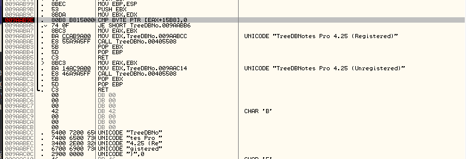

Và ta có thể thấy rằng mình đang chuyển sang chuỗi dữ liệu đúng. Tiếp tục chạy và ta sẽ dừng ở thủ tục kiẻm tra đăng kí và nó sẽ được gán 01 vào địa chỉ 1 lần nữa như kế hoạch ban đầu. Quy trình này sẽ lặp lại vài lần cho đến khi :

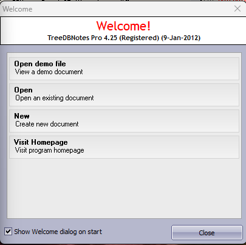

Giờ ta đã hoàn tất việc Registered. Tiếp tục chạy chương trình(mở 1 file demo) và Olly sẽ dừng 1 vài lần ở trong thủ tục đăng kí, nhưng mỗilaanf nó sẽ đều đi đúng. Sớm thôi ta sẽ chuyển đến màn hình chính

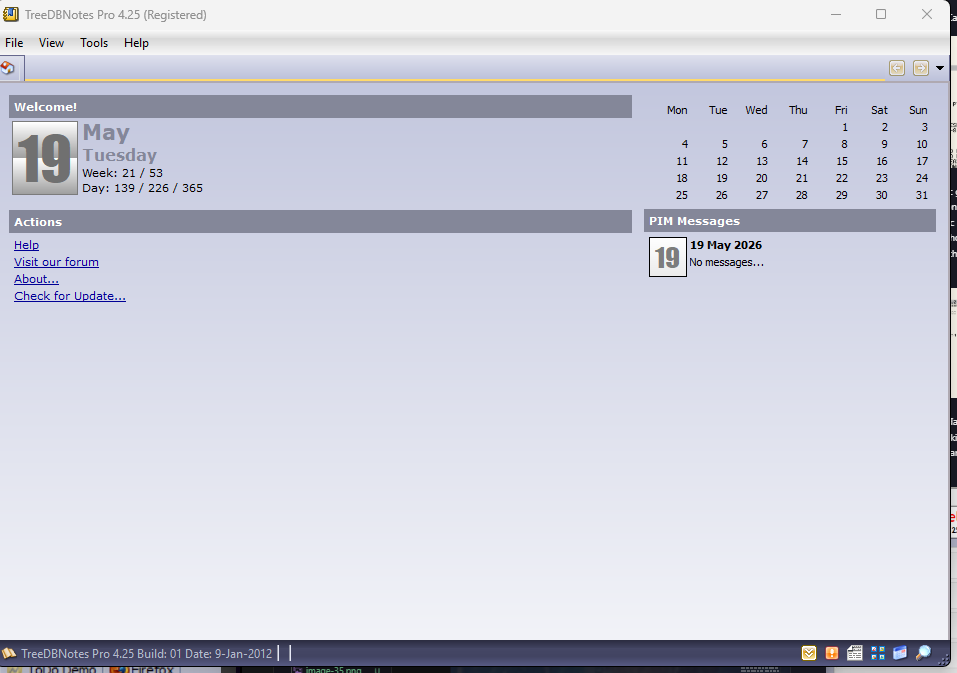

Và đã thấy ta đã được đăng kí. Nhấp vào mục "About screen shows"

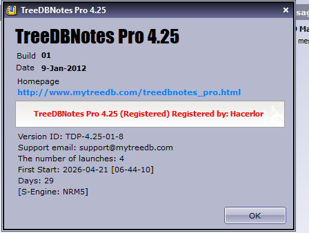

Thành công rồi. Ta đã có 1 chương trình crack đầu tiên.

Đừng quên lưu lại tập tin đó. Mở cửa sổ Hardware breakpoints(Debug -> Hardware breakpoints) và click "Follow on our BP". Điều này sẽ đưa ta đến bản vá của ta. Highlight bất cứ cái gì ta đã thay đổi, chuột hải và chọn "Copy to executable". Chuột phải vào cửa sổ mới xuất hiện và chọn "Save to disk". Lưu nó với tên ban đầu của nó. Giờ thoát khỏi Olly và chạy lại app và nó sẽ chạy đúng như mong đợi