# Introduction

Nags hay còn gọi là nag screens là nững hộp thoại xuất hiện để nhắc người dùng rằng thời gian dùng thử sắp hết, bạn cần đăng kí hoặc nhắc nhở về việc truy cập trang web. Nói chung là những thông báo phiền toái và không cần thiết. Nhiều chương trình miễn phí có chưa thông báo kiểu này, chúng thường xuất hiện dưới dạng quảng cáo, thông báo về thời gian dùng thử hoặc yêu cầu người dùng truy cập trang web khác. Các phần mềm thương mại cũng thường chứa các thông báo tương tực như là nhắc ta rằng "bạn còn 18 ngày dùng thử sản phẩm này". Việc loại bỏ các thông báo này là 1 trong những nhiệm vụ quan trọng trong quá trình RE phần mềm. Trong hướng dẫn này, ta sẽ xem xét hai ứng dụng có nags. Sau đó tìm cách loại bỏ chúng để chúng sẽ không xuất hiện nữa

Trong phần này cũng sẽ giới thiệu về extension IDAFicator

# The First App

Chương trình nhị phân đầu tiên ta xem xét là Nag1.exe, ngay khi chạy chương trình này, thông báo cảnh báo ngay lập tức hiện ra

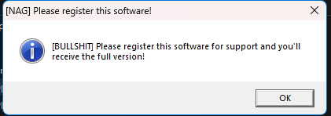

Rõ ràng đây là 1 sản phẩm tạo bởi 1 cracker. Dù sao thì sau khi nhấn vào OK sẽ vào màn hình chính

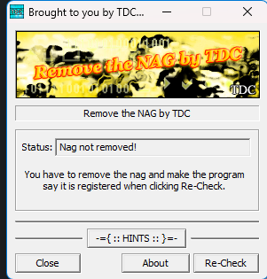

Lưu ý rằng nó ghi "Nag not removed!". Tất nhiên ta không thể nhấn vào nút "Hints" và kết quả nhận được là những thông tin chi tiết 

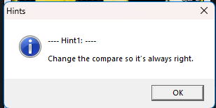

Cảm ơn. Tải app và Olly và thử phương pháp quen thuộc : tìm kiếm chuỗi kí tự

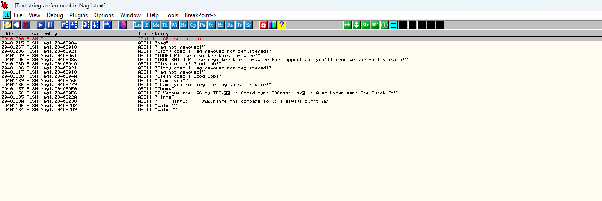

Ta có thể xem nội dung hiển thị trên màn hình cảnh báo tại địa chỉ 4010AE. Nhấp đúp vào để chuyển đến thông báo được tọa ra

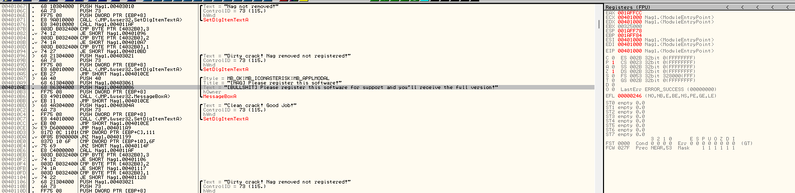

Có 1 chuỗi kí tự thú vị ở trên đó, nhưng ta hãy phớt lờ nó. Hyax nhấp vào dòng lệnh đầu tiên trong đoạn mã MessageBoxA tại địa chỉ 4010A7 để xem đoạn code này được gọi ở đâu

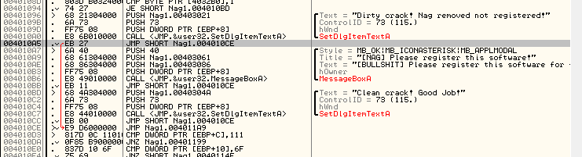

Ta có thể thấy rằng lệnh này được gọi bởi 1 lệnh JE tại địa chỉ 40108B, ngay sau 1 phép so sánh nào đó. Ta đã quen với tình huống này. Đặt 1 BP tại JE đó

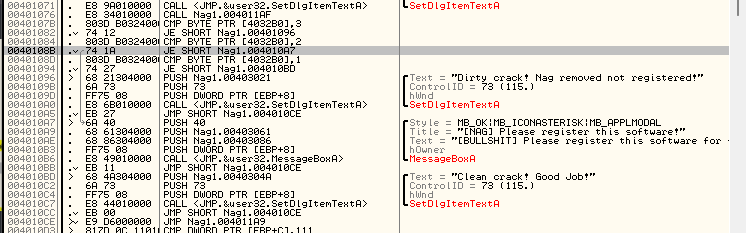

Chạy app và sẽ dừng tại BP của ta và sẽ thấy rằng nó chuyển sang màn hình hướng dẫn. Ngăn việc jump

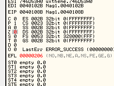

Chạy lại ứng dụng

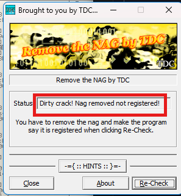

Đó là nguyên nhân gây vấn đề "Dirty Crack". Có vẻ như ta vá chưa đủ các lỗi trong ứng dụng. Khởi động lại app. Olly sẽ dừng lại ở điểm BP của ta. Đặt cờ Zero  về 0 một lần nữa

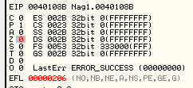

bước 2 bước để thực hiện cú Jump tiếp theo. Và cú jump này chính là goodboy, nhưng  thực tế lại khiến ta rơi vào badboy

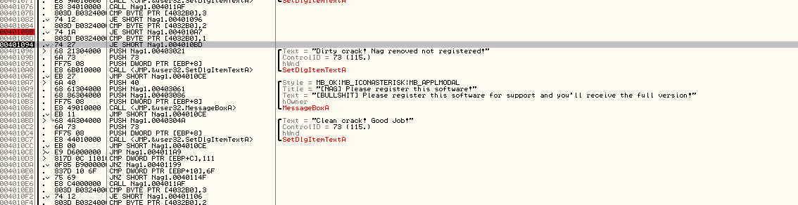

Hãy vá nó để luôn nhảy :

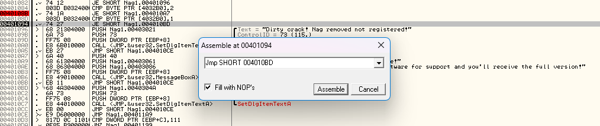

Và ta chạy app và sẽ thấy là đã đúng

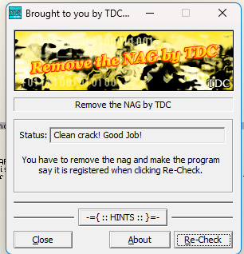

Rõ ràng là ta có thể vá chương trình này bằng cách giữ bản vá hiện tại và quay lại địa chỉ 40108B(nơi mà ta đặt cờ zero bằng 0) và vá nó cho không bao giờ nhảy. Lưu lại 2 bản vá này sẽ hoạt động tốt. Nhưng ta cần biết rằng luôn luôn có những cách khác để vá 1 app, thường là rất nhiều cách. Khởi động lại app và cuộn đến BP:

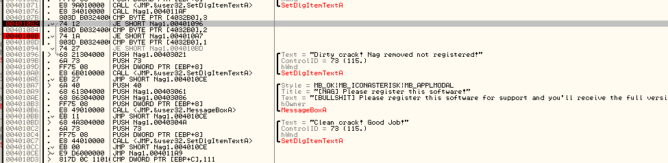

Để ý rằng tập lệnh này có dạng như sau :

```
if (contents of 4032B0 == 3)
    jump "Dirty Crack"
else if(contents of 4032B0 == 2)
    jump "Show nag screen"
else
    Display "Dirty Crack"
```

Ta biết rằng màn hình nag hiển thị nhắc nhở theo mặc định, nội dung của địa chỉ bộ nhớ 4032B0 sẽ luôn bằng 2 vì đó jump sẽ luôn được thực hiện. Tốt, nếu ta muốn bỏ qua toàn bộ điều kiện if/then này và nhảy đến goodboy thì sao ? Vì vậy nếu ta thế lệnh jump đầu tiên bằng cách nhảy thẳng đến goodboy, ta chỉ cần 1 bản vá. Thử xem:

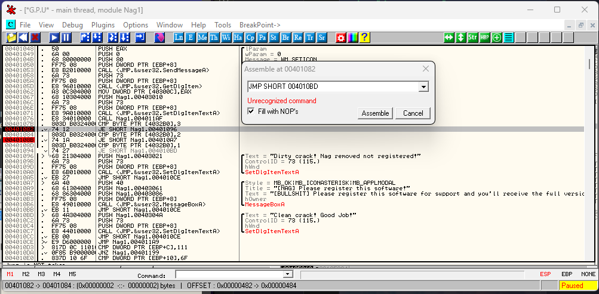

Giờ chạy app:

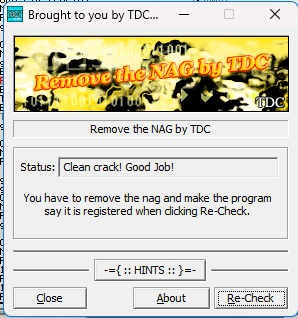

Và ta có thể thấy là nó đã đạt được kết quả tương tự. Một giải pháp khác xịn hơn có thể suy nghĩ đến đó là "Nếu nội dung của 4032B0 luôn bằng 2" và để nhận được thông báo goodboy thì cần phải là 1, tại sao không đặt 1  vào vị trí bộ nhớ này và ta luôn nhận được goodboy. Nên thử điều này. Khởi động lại app, nhấp vào cửa sổ dump đến địa chỉ 4032B0 và chỉnh sửa nhị phân nó thành 1. Liệu nó có hoạt dộng

## Trả lời mở rộng

Hoàn toàn có thể đẩy 1 vào ô nhớ 4032B0, ta đẩy 1 vào dump :

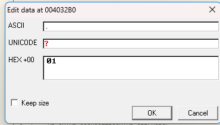

Và sau đó sẽ có kết quả :

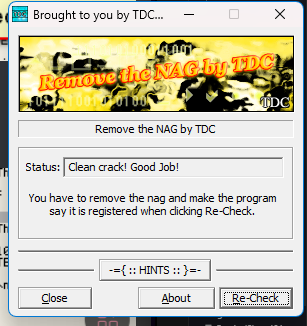

## Tiếp tục


Một điều khác cần ghi nhớ là luôn có những cách khác để tìm đoạn mã ta đang cần tìm. VD, trong ví dụ này ta không thể dùng chuỗi ta có thể tìm kiếm các lệnh gọi liên modul : Intermodular calls

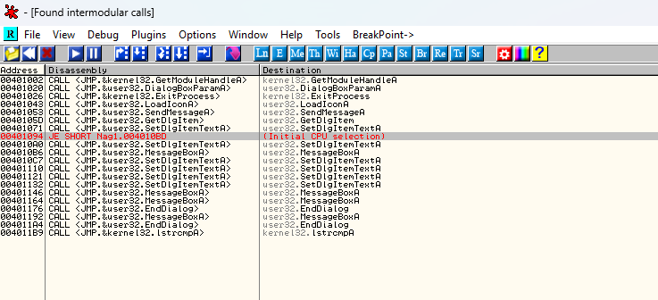

Để ý rằng có 4 lệnh call  tới MessageBoxA. Chuột phải vào nó và chọn "Place a breakpoint on every call to MessageBoxA". Khi ta chạy app, trước khi bất cứ thứ gì hiển thị, ta dừng ở dòng code này :

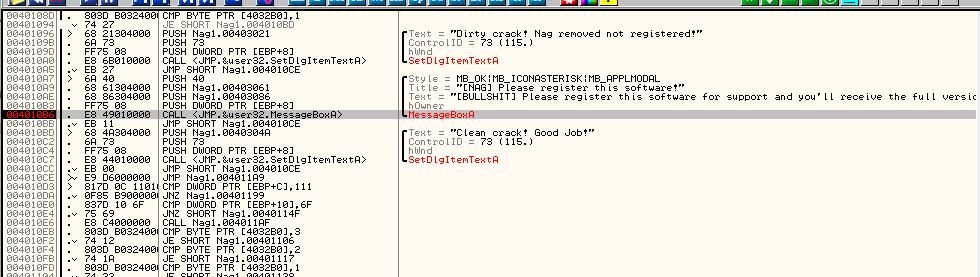

Trông có vẻ quen thuộc, đó chính là hộp thoại nag. Vì vậy phải luôn nhớ rằng có nhiều hơn 1 cách để hoàn thành 1 việc. Sắp tới ta cũng sẽ hopjc 1 số kỹ thuật khác có thể được sử dụng(như trình xử lý thông báo của Windows) sẽ cung cấp cho ta nhiều thủ thuật hơn nữa.

# The Second App

Giờ hãy xem xét Nag2.exe. Nó tương tự nhưng ta sẽ giải quyết theo cách khác. Khi khởi chạy app, ta sẽ nhận được thông báo nhắc nhở như mong đợi : 

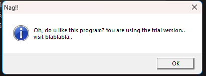

và sau khi click OK ta sẽ nhận được màn hình chính :

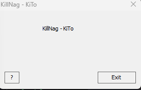

Tải chương trình vào Olly

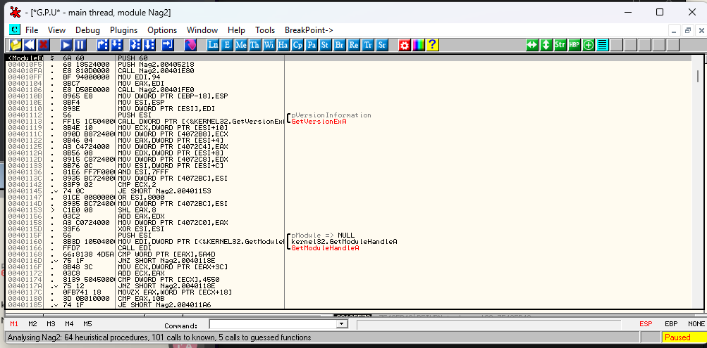

Trước tiên, hãy xem có chuỗi ký tự nào không. Điều ta nhấn mạnh ở đây là plugin IDAFicator. Trong số nhiều extension bổ sung, nó cung cấp 1 nhóm các nút ở phía trên giúp việc tìm kiếm các chuỗi kí tư dễ dàng hơn. Nhấp vào nút chuỗi ký tự (Str), nó sẽ hiển thị cả mã ASCII và Unicode, đồng thời tự động đưa con trỏ lên đầu trang để không cần phải cuộn lên trên. Đây là hình ảnh các nút

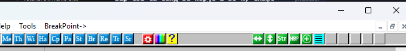

Nút đầu tiên(mũi tên trái phải) cho phép tiến lùi. VD nếu nhấp vào 1 lệnh gọi, sau đó nhấn Enter để đến lệnh gọi đó, nhấp vào biểu tượng đầu tiên sẽ đưa ta trở lại lệnh gọi. Nhấp chuột phải sẽ đưa ta tiến lên. Nút thứ 2 sẽ cố gắng tìm điểm bắt đầu của hàm hiện tại, trong khi nhấp chuột phải sẽ cố gắng tìm điểm kết thúc. Tiếp theo là nút chuỗi kí tự. Tiếp theo là nút Breakpoint Hardware. Nó sẽ hiển thị 1 hộp thoại hữu ích cho ta thấy tất cả các điểm dừng phần cứng của ta. Rất tiện dụng. Biểu tượng mục tiêu sẽ hiển thị 1 hộp thoại để nhập nhiều dòng mã hợp ngữ, được sử dụng nếu ta đang thay đổi 1 phần đnags kể của tệp thực thi

Ta sẽ để ý  một mục menu mới có tên Breakpoint. Mở ra 1 menu thả xuống chứa nhiều lệnh gọi API thường dùng để ta có thể tự động đặt BP cho chúng

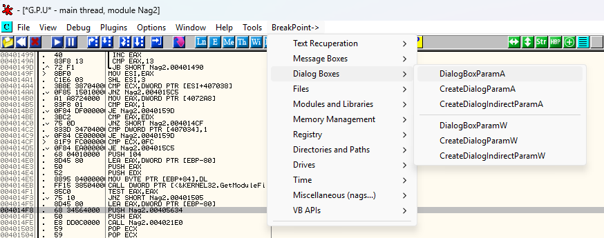

Cuối cùng, có 1 mục menu ngữ cảnh được thêm vào cho phép ta có thể khôi phục các byte bị ẩn,  điều mà ta sẽ đề cập trong 1 hướng dẫn khác Vì vậy, nhấp vào nút chuỗi "Str" trên thanh công cụ mới:

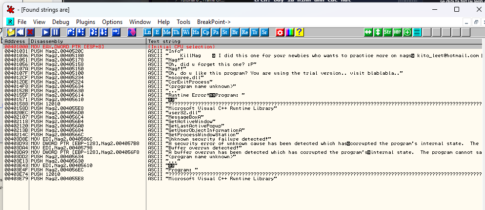

Và trong dòng thứ 7 từ trên xuống, ta thấy 1 nag, nhấp đúp chuột:

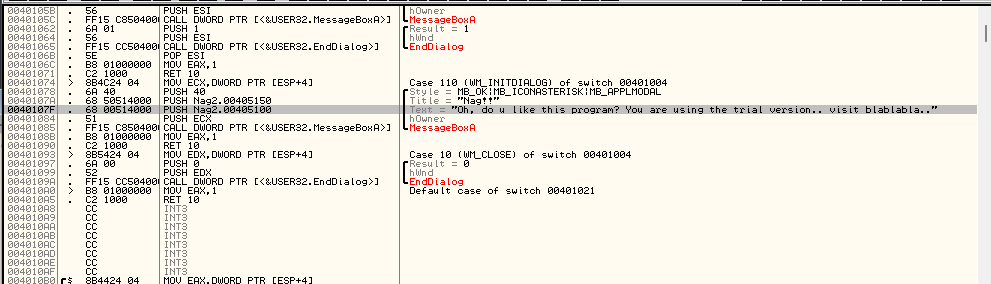

Để xem phương thức của nag. Đây là 1 hàm độc lập(Có lệnh RETN ở trên và dưới nó) nên ta biết được nó được gọi từ đâu đó. Nhấp vào dòng đầu tiên của nó tại địa chỉ 4010744 để xem nó được gọi từ đâu:

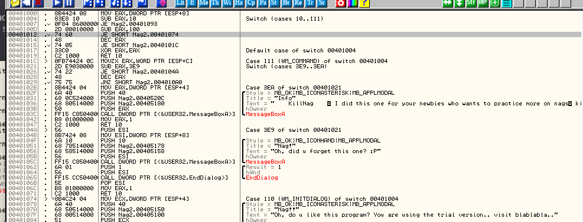

Ta có thể thấy nó được gọi từ 401012, 1 lệnh JE. Đặt BP ở đây và chạy app

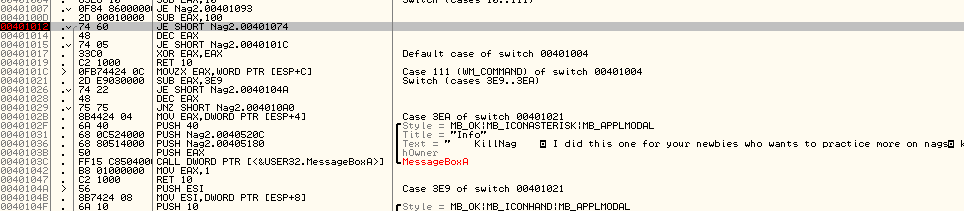

Và ta dừng ở lệnh JE. Để ý rằng nó khôg gọi màn hình nag. Lý do là vì ta đang ở giữa trình xử lý thông báo của Windows. Ta sẽ đi sâu vào trình xử lý thông báo trong 1  bài khác, nhưng hiện tại chỉ cần biết tất cả các chương trình Window GUI đều có trình xử lý thông báo và Windows gửi nhiều thông báo khác nhau qua thông báo đó. Tùy thuộc vào thông báo nào được gửi đến(và liệu ta có muốn làm điều gì đó bất thường khi 1 hành động nhất định được thực hiện hay không) ta có thể thêm code riêng của ta để ghi đè lên các quy trình thông thường của Windows. VD, khi ta nhấp vào dẫu 'X' để đóng cửa sổ, Windows sẽ gửi 1 thông báo thông qua  trình xử lý thông báo nói rằng " này, người dùng muốn đóng cửa sổ". Chúng ta có thể cho phép thông báo đó được gửi đi, trong trường hợp đó Windows sẽ xữ lí nó và đóng cửa sổ, hoặc chúng ta có thể bắt thông báo này và làm nhưnxg gì ta muốn (có thể hiển thị hộp thoại nói rằng "Bạn chưa lưu, bạn có chắc chắn muốn thoát không")

BP của ta nằm ngay giữa đoạn mã này, vì vậy thông báo đầu tiên nhận được không khớp với thông báo mà ứng dụng này mong muốn ghi đè lên để hiển thị thông báo nhắc nhở:

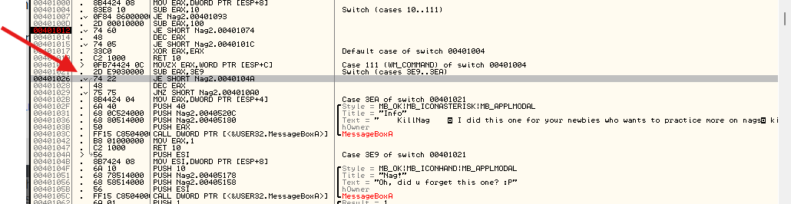

Tiếp tục và nhấn F9 để chạy app và ta sẽ dừng ở cùng 1 BP, nhưng lần này, bước nhảy sẽ được thực hiện, hiển thi thông báo nhắc nhở. Bây giờ hãy bảo Olly đừng hiển thị thông báo nhắc nhở :

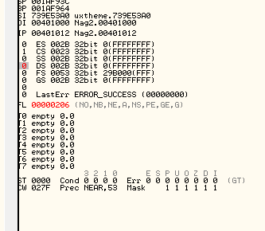

Giờ, nếu ta rời khỏi điểm dừng này, 34 thông báo nữa sẽ được gửi qua trình xử lý thông báo này. Ta có thể giữ nguyên BP và nhấn chạy 34 lần(trong trường hợp đó, tại một thời điểm nào đó  ta sẽ thấy cửa sổ xuất hiện, các nút được vẽ,v.v.) hoặc ta có thể xóa BP và chỉ nhấn chạy 1 lần. Trong trường hợp này, lệnh gọi đến thông báo này, lệnh gọi đến thông báo nhắc nhở sẽ không được thực hiện lại, vì vậy việc xóa BP và chạy lại là ổn:

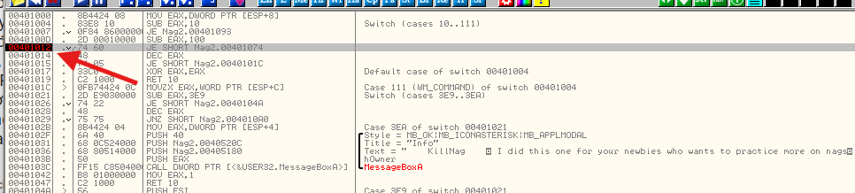

Ta sau đó có màn hình chính

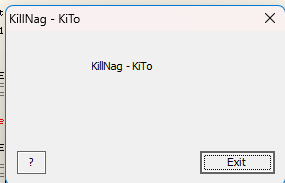

# Patching the App

Bình thường, ta sẽ vá lệnh JE nhảy đến phần thông bó bằng 1 lệnh NOP để nó không bao giờ nhảy tới, nhưng ta muốn đổi mới bằng 1 cách khác để thực hiện vá lỗi này. Ta biết rằng khi thông báo gửi  chính xác được gửi đến trình xử lý thông báo(trong trường hợp này là thông báo thứ 2), code nag sẽ được gọi. Vậy điều gì xauyyr ra nếu chúng ta cho phép nhảy đến phần nag, nhưng thay đổi code nag để nó chỉ nhảy trở lại ngay lập tức

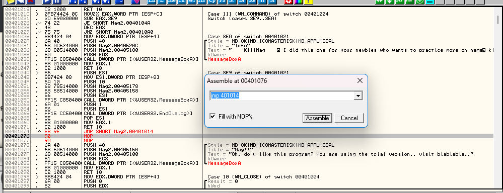

Đây, cú nhảy sẽ được thực hiện đến các lệnh nag ở 401074, nhưng ta sẽ ngay lập tức nhảy trở lại dòng dau lần nhảy ban đầu(401014). Về cơ bản, chương trình của chúng ta sẽ nhảy, rồi nhảy ngay trở lại dòng tiếp theo:

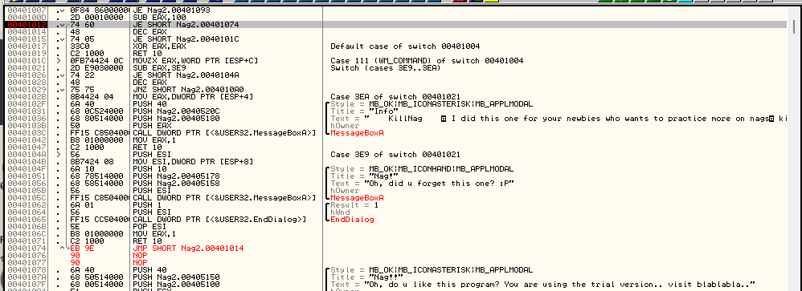

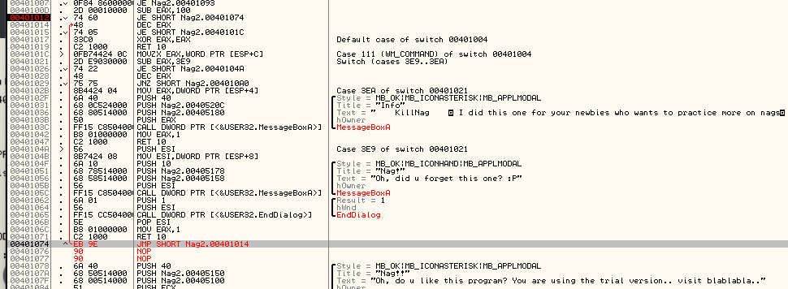

Thực sự không có sự khác biệt nào giữa việc vô hiệu hóa lệnh JE tại dòng 401012 hoặc thêm lệnh nhảy ngược lại tại dòng 401074, nhưng ta cần bắt đầu nhận ra rằng luôn có nhiều cách để vá lỗi - đôi khi vô hiệu hóa 1 lệnh gọi không phải là cách tốt nhất. Hãy nhớ rằng, ta là chủ sở hữu của tệp nhị phân này - ta có thể thêm bất kỳ code nào ta muốn, vì vậy đừng ngại sửa đổi nó, đặc biệt là khi đang học. 

Chạy app cho thấy thông báo nhắc nhở vẫn bị bỏ qua:

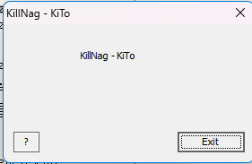

Giờ hãy lưu bản vá. Highlight cái thay đổi code và chọn "copy to executable" -> "selection"

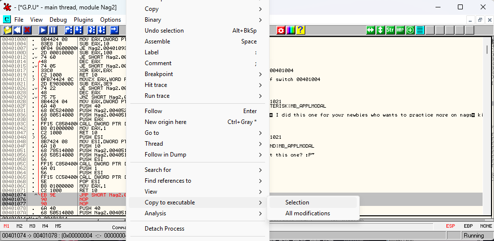

Sau đó click vào cửa sổ mới và chọn "Save file"

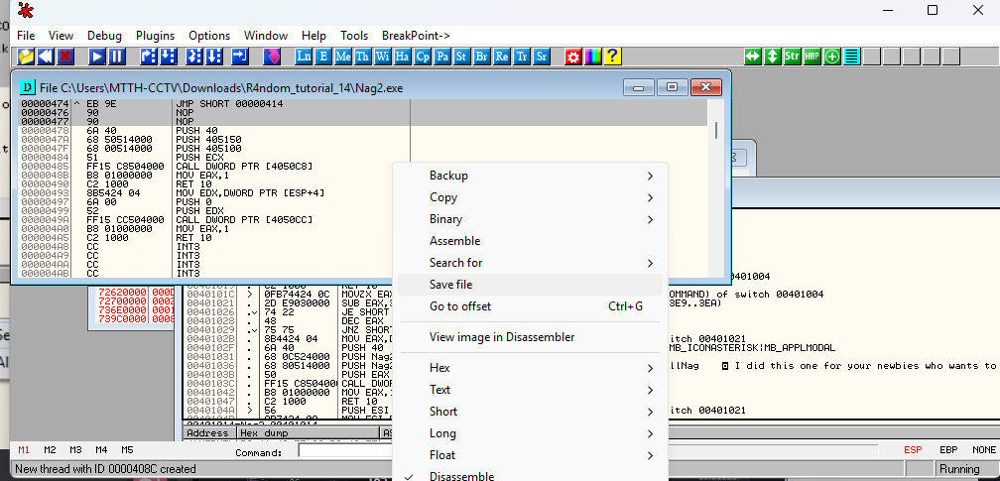

Được rồi, tải chương trình đã được vá này vào Olly và thử xem. Chúng ta sẽ chuyển thẳng đến mafn hình chính, vậy là biết bản vá đã hoạt động. Bây giừo nhấn thoát ta sẽ nhận được

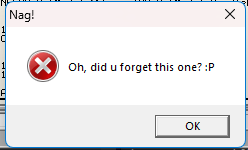

Ôi không, có vẻ tác giả thực sự quyết tâm. Hãy tìm lời cái nag thứ 2. Trở lại phần chuỗi ký tự và ta có thể thấy văn bản của nag này cũng ở đó:

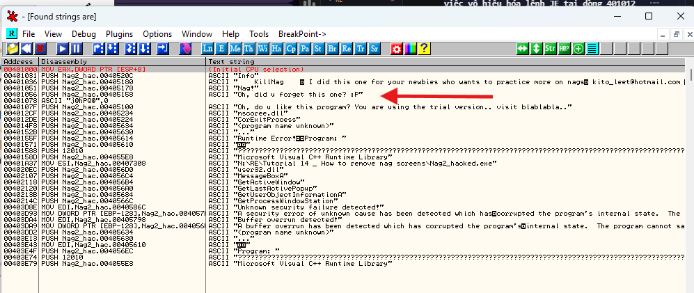

Rất nhiều ứng dụng làm điều này, chúng bắt đầu bằng 1 nag và sau khi đóng ứng dụng, chúng lại có thêm 1 nag khác. Hầu hết thời gian, khi tìm chuỗi văn bản của nag đầu tiên, ta sẽ tự động tìm bất kì nag khác. Nhấp đúp vào văn bản này:

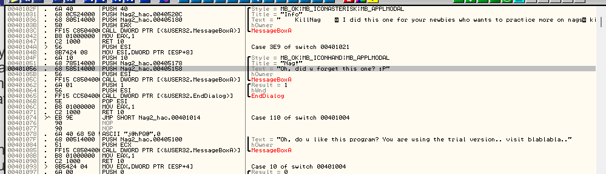

Và ở đây ta thấy hàm cho nag này. Click vào dòng đầu tiên của nó ta sẽ thấy nag thứ 2 được gọi ngay sau khi nag đầu được gọi, nhưng nó dùng 1 thông điệp khác để kích hoạt(có thể là thông báo đóng cửa sổ). Vì vậy, khi nag này xuất hiện, báo hiệu rằng người dùng đã chọn "Exit", thông báo nag thứ 2 được gọi.

Suy nghĩ đầu tiên của ta có thể là "tại sao  ta không thêm 1 lệnh nhảy nữa vào đây để quay lại ngay như đã làm ở lần trước?". Tuy nhiên, nếu xem xét kỹ phương thức này, ta thấy nó gọi lệnh nag thứ 2, nhưng ngay sau đó lại gọi hàm EndDialog. Vì vậy, việc quay lại ngay lập tức sẽ không hiệu quả vì hộp thoại của chúng ta sẽ không bao giừo đóng lại

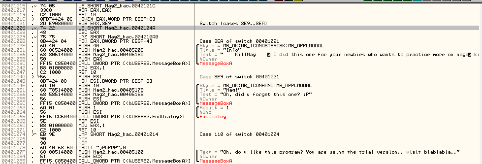

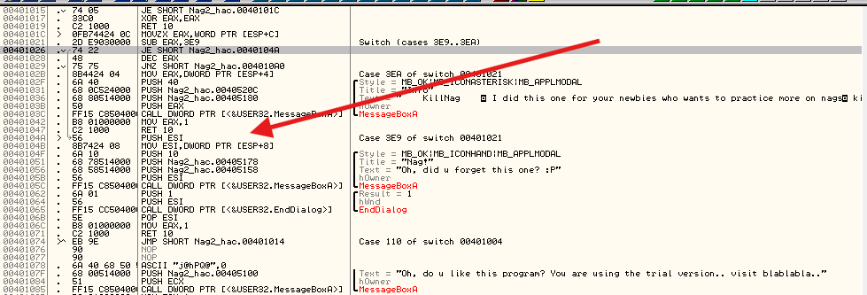

Vì thế suy nghĩ tiếp theo có thể là "Hãy đổi lệnh JE tại dòng 401026 để nhảy đến EndDialog, bỏ qua lệnh MessageBoxA". Đây là 1 ý tưởng hay, thử xem:

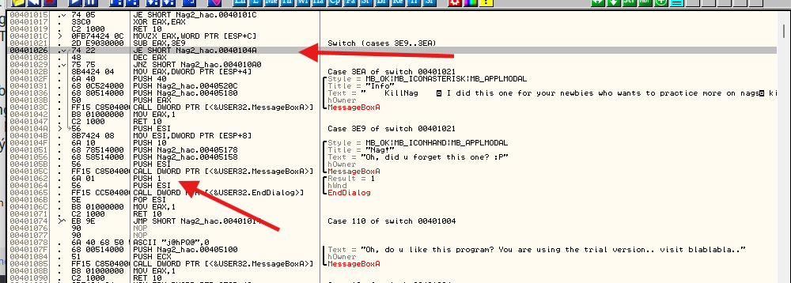

Đổi lệnh JE ở 401026 để nhảy đến vị trí 401062, tức là nhảy đến dòng đầu của EndDialog

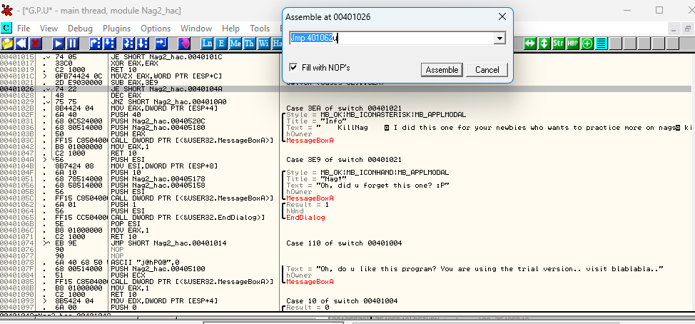

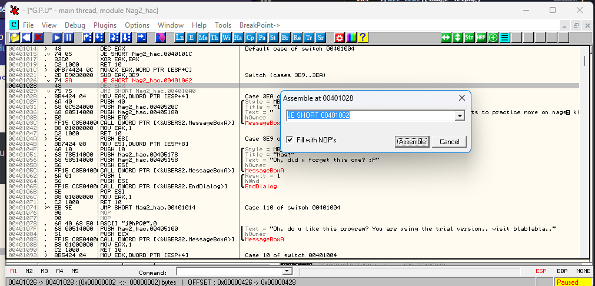

Chạy lại app:

Tình hình là chạy lại rồi bấm exit thì nó out luôn. Có vẻ không khả quan. Có vẻ là đã sai. Ta cần làm như sau : chạy lại ứng dụng mà không có bản vá, tiến hành debugging từng bước để xem ứng dụng hoạt động ra sao; sau đó chạy lại với bản vá và so sánh sự khác biệt trong 2 trường hợp. Tiếp theo, khởi động lại ứng dụng và nhấn nút "Exit", lúc này chương trình sẽ tạm dừng tại điểm ta đặt bản vá - tuy nhiên điểm này sẽ không còn tồn tại vì bản vá bị gỡ bỏ sau lần khởi động lại

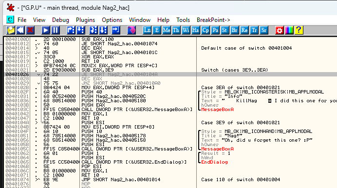

Chạy chương trình đến khoảng vài dòng mã, sau đó nhảy đến dòng gọi hàm MessageBoxA, sẽ thấy thông báo nhắc nhở xuất hiện

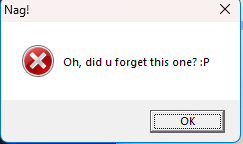

Thực hiện step 2 lần nữa đến khi chương trình gọi EndDialog

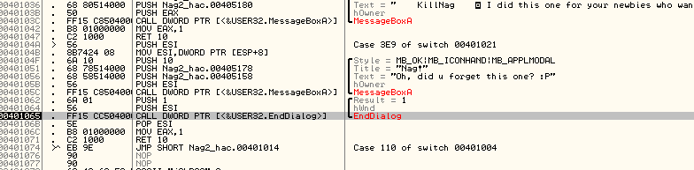

Giờ hãy xem ngăn xếp. Ta thấy tổng cộng có 4 phần tử trong ngăn xếp : 1 con trỏ đến cửa sổ, kết quả từ hộp thoại kết thúc, một con trỏ đến dòng mã đầu tiên của chương trình 401000 và 1 địa chỉ trả về đến thư viện user32

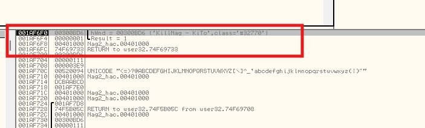

Tiếp theo, khởi động lại ứng dụng, sau đó khi đến phần vá lỗi cần thiết, hãy kích hoạt nó(trong cửa sổ các bản vá, nhấn Space khi bản vá đã được chọn)

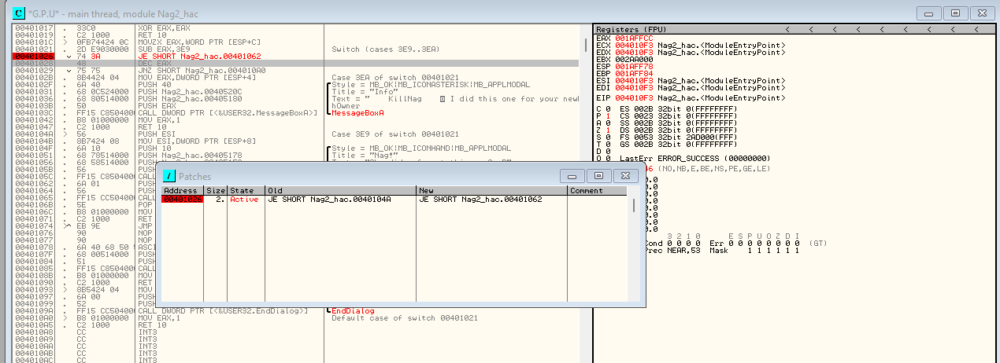

Tiếp theo, bỏ qua phần hiển thị hộp thoại cảnh báo. Tiếp tục thực thi mã cho đến khi gặp EndDialog

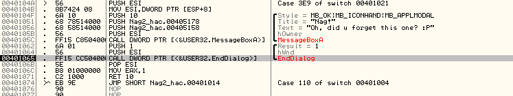

Giờ hãy xem xét stack của chúng ta. Ta có con trỏ cửa sổ (handle), mã kết quả và lệnh trả về cho thư viện user32. Tuy nhiên điều quan trọng là ta lại thiếu mất con trỏ đến dòng mã đầu tiên của chương trình tại địa chỉ 401000

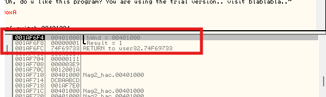

Nếu cuộn lên và xem xét lời gọi đến hàm nag thứ 2, ta sẽ thấy rằng trước khi hộp thoại được tạo ra, giá trị ESI được đẩy vào ngăn xếp - đây là 1 con trỏ đến mã chương trình. Điều này xảy ra ngẫu nhiên trong trường hợp này : chương trình đang đẩy giá trị này trước khi gọi hàm MessageBox, dù rằng việc này hoàn toàn có thể được thực hiện sau đó. Do đó, ta đang thiếu 1 thao tác đẩy quan trọng mà ứng dụng cần để có thể gọi EndDialog 1 cách chính xác. Vấn đề là chúng ta có 1 số đoạn mã khởi tạo cần thiết, sau đó lại có một lời gọi đến 1 hàm cảnh báo mà chúng ta không mong muốn và cuối cùng là lời gọi đến EndDialog - điều mà ta cần.

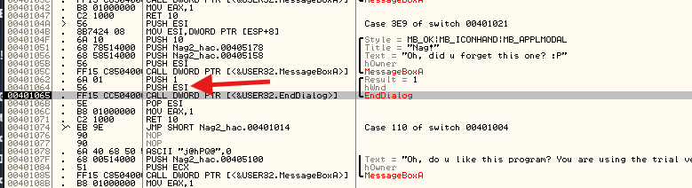

Được rồi, loại bỏ những đoạn mã không cần thiết trước. Chọn các lệnh MessageBoxA(từ địa chỉ 40104F đến 40105C) sau đó nhấp chuột phải và chọn Binary -> điền bằng NOPs

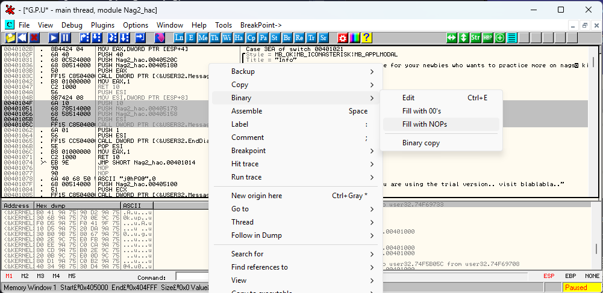

Và không còn gọi nag nữa rồi

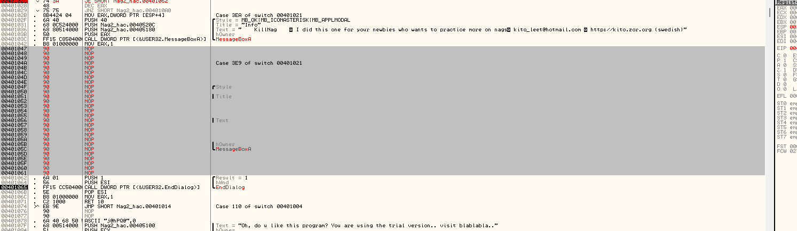

Giờ chạy app, thấy ứng dụng đóng bình thường. Lưu bản vá này lại nhé!

