# Introduction

Trong bài này sẽ gỡ bỏ một thông báo nag khỏi phần mềm chính hãng. Ngoài ra sẽ học thêm một vài trick vào công cụ RE

# Investigate the app

Phần mềm này sẽ cứ 40 ngày là gửi thông báo cực kì khó chịu

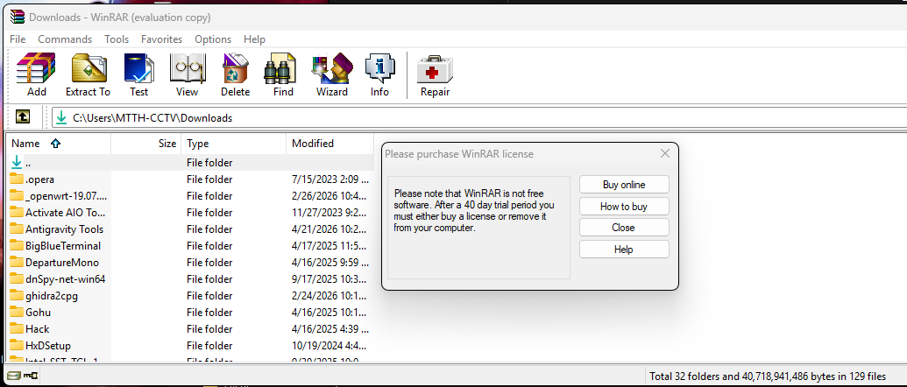

Lời nhắc này liên tục xuất hiện. Hiện lên thường xuyên khi dùng ứng dụng gây khó chịu. Ngoài ra, phía trên giao diện cũng thấy dòng "evaluation copy"

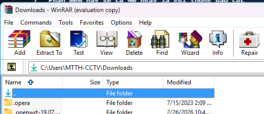

Có 2 cách để tìm đoạn mã liên quan

# The First Way

Tải vào Olly và bắt đầu

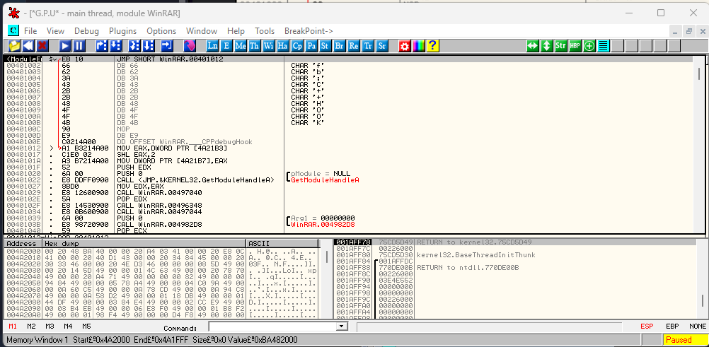

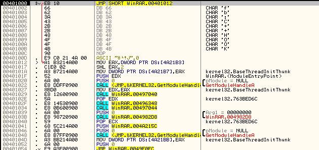

Mở ứng dụng và chờ đến khi cửa sổ thông báo xuất hiện. Ngay sau khi nó xuất hiện(và trước khi ta đóng nó) hãy nhấp vào Olly rồi nhấn nút tạm dừng(bên cạnh nút phát):

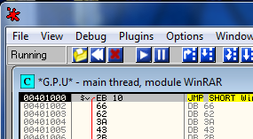

Giờ đây ta muốn tìm hiểu xem nag đó bắt nguồn từ đâu và cuối cùng là yếu tố nào đã khiến nó xuất hiện. Dĩ nhiên ta có thể tìm các chuỗi kí tự hoặc các gọi hàm giữa các modun nhưng phương pháp này sẽ không hữu ích với ứng dụng hiện nay. Vì vậy ta cần tìm 1 mẹo khác

# The call stack(Call Stack)

Call Stack là công cụ mà Olly cung cấp để theo dõi từng bước mã nguồn đã dẫn đến trạng thái hiện tại và xác định các hàm nào được gọi. Ngoài ra nó còn cố gắng hiển thị các tham số được truyền vào hàm đó. Tất cả điều này có thể đạt được bằng cách sử dụng ngăn xếp bình thường ở góc bên phải , nhưng call stack lại cung cấp 1 cách nhìn trực quan và dễ hiểu hơn nhiều về dữ liệu này. Tuy nhiên cần lưu ý rằng Olly không hoàn hảo trong việc xử lý dữ liệu này và ta không nên coi mọi thông tin trong cửa sổ này là tuyệt đối chính xác. Hiện đang có nhiều phỏng đoán diễn ra. Ngoài ra, cửa sổ này thường xuyên xuất hiện trống không. Tình trạng này xảy ra khi Olly bị mất hoàn toàn định hướng hoặc Reverse 1 chương trình Visual Basic(vì các chương trình VB không gọi hàm theo cách thức giống các ngôn ngữ lập trình thông thường)

Để xem call stack, nhấp nút St 

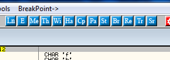

Nếu dùng phiên bản khác, nhấp nút K trên thanh công cụ. 

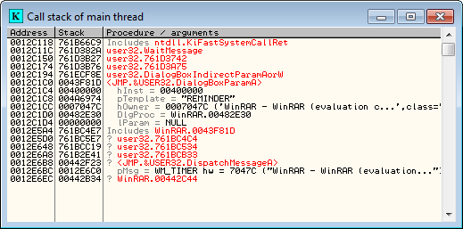

Có vài điểm cần lưu ý. Cuộc gọi gần nhất nằm ở đầu danh sách, giống cách sắp xếp của ngăn xếp(stack). Thuật ngữ Includes cho biết lệnh này đã tham gia vào cuộc gọi, nhưng Olly không xác định được chính xác cách thức tham gia đó. Ký hiệu dấu (?) cho thấy Olly chưa hoàn toàn chắc chắn về dòng lệnh này, vì vậy cần xem xét 1 cách thận trọng

Trong ví dụ cụ thể này, ta có thể thấy 1 hàm từ ntdll, một hàm từ user32, một lời gọi đến hàm DialogBoxParamA với các đối số, thêm một số lời gọi khác đến từ user32 và cuối cùng là một lời gọi từ ứng dụng của ta - WinRAR. Các biểu tượng này như sau: tại địa chỉ 442C44, WinRAR đã gọi hàm DispatchMessageA - trong trường hợp này là để hiển thị một hộp thoại. Sau đó user32 gọi hàm DialogBoxParamA để hiển thị hộp thoại với tiêu đề "evaluation copy", cùng với một đối số khác. User32 sau đó hiển thị cửa sổ đối thoại này và hiện đang chờ đợi đầu vào từ người dùng, thông qua việc sử dụng hàm WaitMassage để thực hiện chức năng chờ này

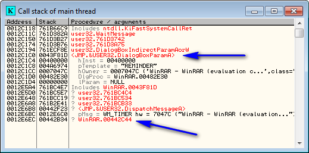

Trong cửa sổ này, những yếu tố quan trọng nhất là lời gọi đến hộp thoại và lời gọi từ ứng dụng của ta. Thông thường, khi sử dụng ngăn xếp gọi(call stack), ta bắt đầu từ phần trên cùng và tìm mục đầu tiên có thể giúp xác định đoạn mã mà ta đang quan tâm. Nếu mục này không phù hợp, ta tiếp tục xuống dưới danh sách, lần lượt kiểm tra từng lời gọi hàm cho đến khi quay trở lại vị trí trong mã đủ xa để tìm được lệnh so sánh(compare/jump) - chính lệnh này quyết định việc hàm hiện tại có được gọi hay không. Chúng ta thử xem xét lời gọi hàm DialogBoxParamA bằng cách nhấp đúp vào dòng mã đó

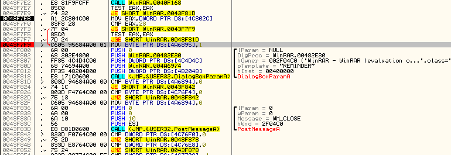

Tiếp theo chương trình chuyển sang gọi hàm DialogBoxParamA. Ta đặt 1 điểm ngắt BP ngay tại đầu khối lệnh này - nơi thực hiện các bước thiết lập và gọi hàm để hiển thị hộp thoại. Ngay phía trên đó, chúng ta có thể thấy một số lệnh nhảy có điều kiện nổi bật rõ ràng. Nếu cuộn lên trên hơn nữa, ta sẽ thấy một số chú thích dạng "Case XX(WM_Something) của switch 0043F0A4, trong đó XX là 1 số thập lục phân

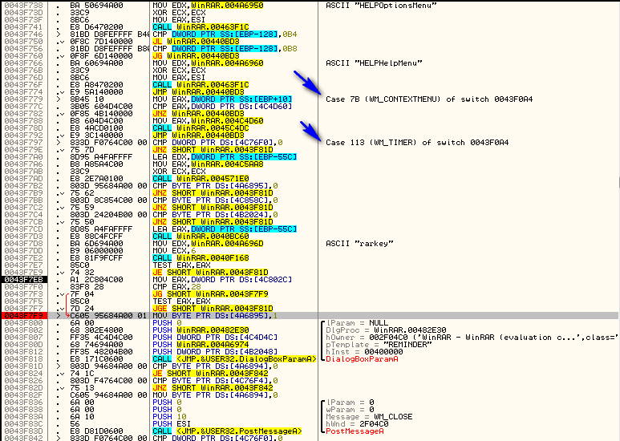

Đây là cách Olly minh họa 1 cấu trúc switch statement. Nếu cuộn lên phía trên, ta sẽ thấy đây là 1 cấu trúc switch statement rất lớn. Nếu có kinh nghiệm lập trình Windows, ta sẽ nhận ra các định dạng "WM_SOMETHING" là các tin nhắn Windows và toàn bộ đoạn mã này chính là 1 thủ tục xử lý tin nhắn dành cho Windows. Ta không cần lo lắng nếu chưa hiểu rõ phần này vì một bài hướng dẫn sắp tới sẽ đi sâu phân tích các thủ tục xử lý Windows Message 1 cách chi tiết. Giờ chỉ quan tâm đến trường hợp liên quan đến việc gọi hộp thoại của ta. Tại đây, ta có thể xem toàn bộ trường hợp này :

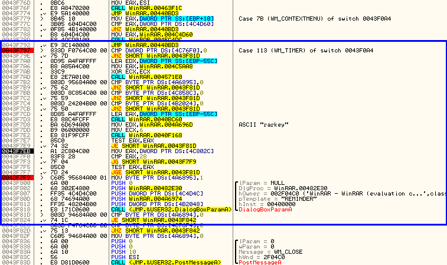

Ta nhận thấy rằng đoạn mã này nằm trong phần xử lý các tin nhắn WM_TIMER - điều này rất đáng chú ý. Tại sao hộp thoại của chúng ta lại xuất hiện trong một hàm xử lý tin nhắn liên quan đến việc thời gian chờ kết thúc. 

Lưu ý rằng sau khi hộp thoại được gọi, sẽ xuất hiện một số lệnh nhảy có điều kiện và các phép so sánh

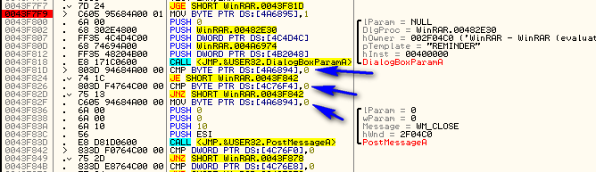

Các đoạn mã này sẽ chuyển tiếp việc thực thi ứng dụng tùy theo lựa chọn của người dùng trong hộp thoại, nếu nhấp nút đóng, hệ thống sẽ chuyển sang đoạn mã tương ứng để đóng cửa sổ và thao tác liên quan khác

Khi cuộn lên đầu phần switch.case, ta thấy có 1 phép so sánh ban đầu và lệnh nhảy

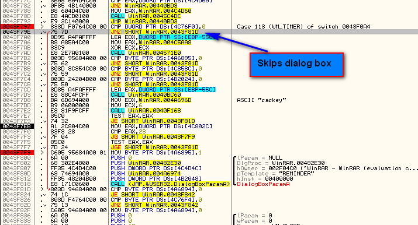

Lệnh nhảy(jump) ở đây bỏ qua phần gọi hàm mở hộp thoại cảnh báo(cùng nhiều đoạn mã khác). Hãy cùng xem đonaj so sánh và nhảy ban đầu này hoạt đông như nào. Nhấp chuột phải vào dòng mã chứa dòng "Case 113(WM_TIMER)" rồi chọn "Goto"

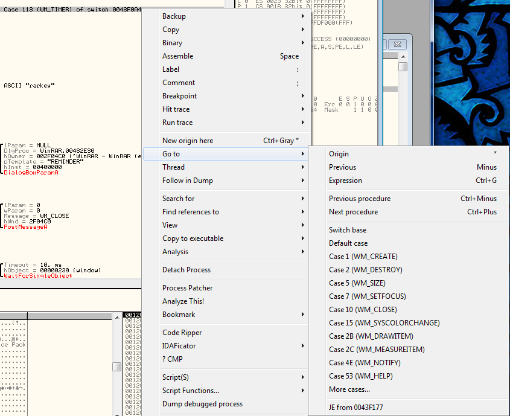

Trong cửa sổ thả xuống, ta thấy Olly hiển thị một số trường hợp có thể xử lý bằng câu lệnh switch này. Khi nhấp vào "More cases..." sẽ mở ra một hộp thoại liệt kê đầy đủ tất cả các trường hợp đó

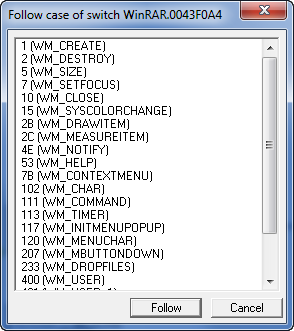

Khi nhấp chuột vào một vài mục trong số này và chọn "Follow", ta sẽ được chuyển đến đoạn mã xử lý trường hợp tương ứng. Ta sẽ thấy rằng ở đầu mỗi đoạn code đều có 1 lệnh so sánh và nhảy(compare/jump). Điều này có nghĩa là ngôn ngữ asm xử lí câu lệnh switch/case như 1 chuỗi các điều kiện if/then rất dài. Cấu trúc này có thể được mô tả dưỡi mã giả này

```c++
if (msg != WM_CREATE)
   jump to next if
Do WM_CREATE code
Jump to end
if (msg != WM_DESTROY)
   jump to next if
Do WM_DESTROY code
Jump to end
if (msg != WM_SIZE)
   jump to next if
Do WM_SIZE code
```

Vì vậy, ngay từ đầu mỗi trường hợp xử lí, ta sẽ kiểm tra xem điều kiện này có đúng với cái tin nhắn cụ thể đang được truyền đến hay không, nếu không, hệ thống sẽ chuyển sang bước so sánh tiếp theo. Nếu điều kiện đúng, hệ thống sẽ bỏ qua bước nhảy và tiếp tục thực thi đoạn mã xử lý tin nhắn tương ứng

Hiện tại, bởi vì trường hợp của ta liên quan đến thông điệp WM_TIMER, ta cần tìm hiểu(tra google) rằng đây là hàm xử lí đjowjc gọi khi bộ định thời(timer) kết thúc. Nghĩa là ở đâu đó trong code, bộ định thời này đã được khởi động. Cuộn lên trên, sẽ thấy nguyên nhân gây ra vấn đề.

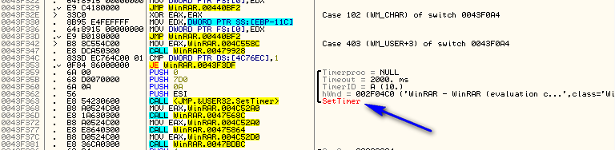

Giờ, ta có thể đoán rằng cách để loại bỏ nag.

# Patch the App

Cách đơn giản nhất là khiến cho tiến trình xử lý thông điệp này không được thực hiện bất kì thao tác nào khi thời gian kết thúc. Và cách đơn giản nhất để làm điều này là đảm bảo rằng nhảy  qua phần xử lí của case này mỗi lần.

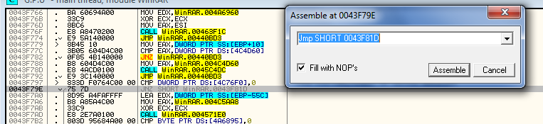

Và bản vá trông như này :

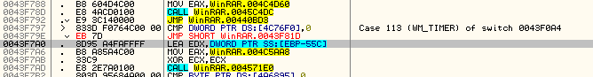

Giờ đây, mỗi khi quy trình xử lí tin nhắn nhận được thông báo rằng bộ định thời đã hết thời gian, nó sẽ tự động bỏ qua thông báo đó mà không thực hiện bất kì thao tác nào. Chạy app và sau 1 thời gian ngắn ta sẽ thấy rằng không còn thông báo nhắc nhở

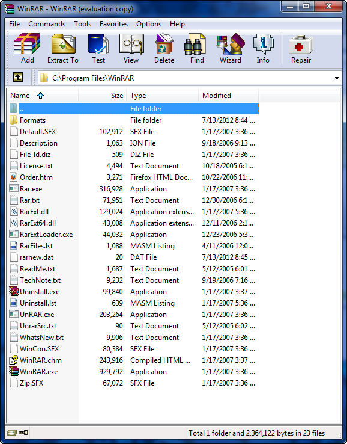

Chương trình hiện vẫn còn hiển thị "Evaluation" trên thanh tiêu đề, ta sẽ xử lí trong 1 bài phức tạp hơn. Nhưng mặc dù vậy, chương trình vẫn hoạt động bình thường và sẽ không bao giờ hết hạn. Kể cả hết hạn, nó sẽ không ảnh hưởng đến việc sử dụng

# The Second Way

Cách thứ 2 là dùng Resource Hacker

Mở Resource Hacker và tải ứng dụng vào

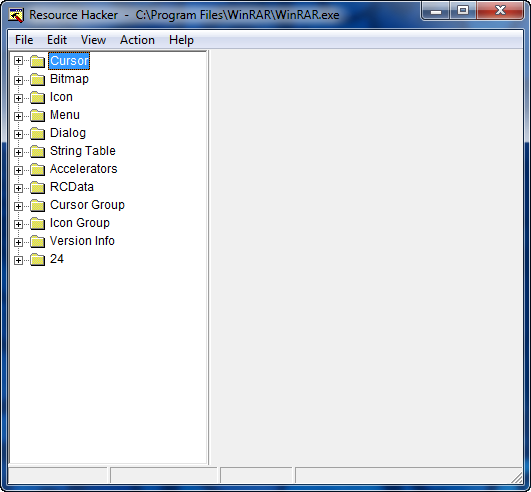

Ở cây thư mục bên tría hiển thị các tài nguyên khác nhau có trong ứng dụng. Có thể thấy ứng dụng bao gồm các hình ảnh bitmaps, icons, menu và quan trọng nhất là các hộp thoại 

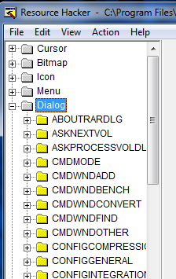

Ứng dụng này có rất nhiều hộp thoại. Nhấn vào hộp thoại đầu tiên - ABOUTRARDIALOG.

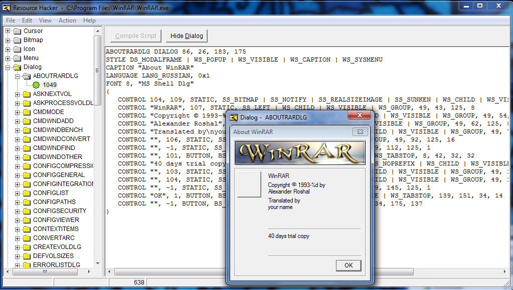

Resource Hacker hiển thị các thông tin liên quan đến hộp thoại này, bao gồm tiêu đề(cái xuất hiện ở tiêu đề cửa sổ), các nút tương ứng với hộp thoại, các tùy chọn thiết lập khác nhau. Nó cũng mở một cửa sổ mô phỏng chính xác hộp thoại như nào. Trong trường hợp này hộp thoại About. Sau khi nhấn xem nhiều hộp thoại khác nhau, ta sẽ gặp cái mà ta muốn :

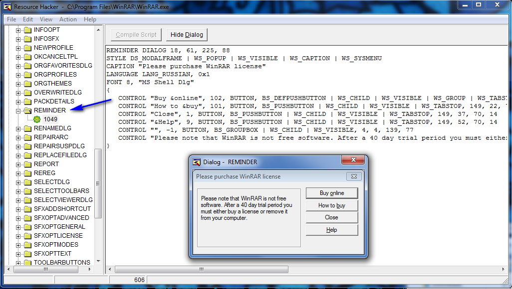

Trông quen thuộc. Lưu ý rằng tên của hộp thoại là "REMINDER". Thỉnh thoảng Windows sử dụng tên để tham chiếu đến một hộp thoại đôi khi dùng mã ID. Trong trường hợp này, hệ thống dùng tên "REMINDER". Giờ ta đã biết rằng tất cả ta cần là tải app vào Olly, chuyển đến chức năng "search for strings". Hãy tìm cụm từ "REMINDER"

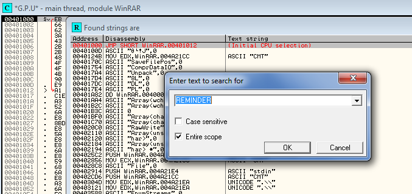

Và ta có thể thấy điều này ngay trong danh sách

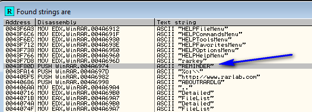

Nhấp đúp vào nó sẽ đưa ta đến đúng phần mà ta đã truy cập trước đó qua call stack

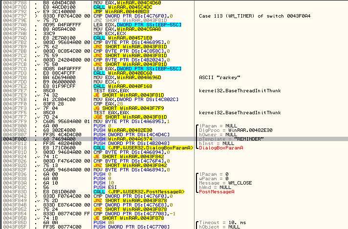

Thực tế, ta sẽ thấy 1 tham số được truyền vào hàm DialogBoxA chính là tên "REMINDER". Nếu tài nguyên được định danh bằng mã ID thay vì tên, ta có thể thấy nó bằng cách nhấp chuột phải vào cửa sổ disassembly và chọn "Search for" -> "Command". Sau đó nhập vào ô tìm kiếm "PUSH xx" với xx là mã ID dạng hex của tài nguyên. Điều này sẽ dẫn ta đến vị trí gọi hàm hộp thoại tương ứng

# One More thing

Nếu ta xem qua các bài hướng dẫn crack tệp nhị phân này, ta sẽ thấy 1 phương pháp phổ biến đơn giản là xóa hộp thoại trong Resource Hacker. Cách này thực sự hiệu quả trong trường hợp này và ta sẽ không còn phải thấy nag,  dù nó sẽ không phải lúc nào cũng làm được - dideeuf này còn phụ thuộc vào cách chương trình xử lí khi thiếu 1 tài nguyên nhất định. Vì kĩ thuật này đơn giản nên việc thử nghiệm luôn là 1 lựa chọn đáng cân nhắc

