# Olly Debugger là gì ?

Đây là trình gỡ lỗi phân tích hợp ngữ 32 bit, đặc biệt cho trường hợp không có mã nguồn, nó là trình gỡ lỗi động nghĩa là có cho phép thay đổi nhiều thứ của chương trình đang chạy. Điều này giúp tìm hiểu cách hoạt động.

# Tổng quan

## Disassembly

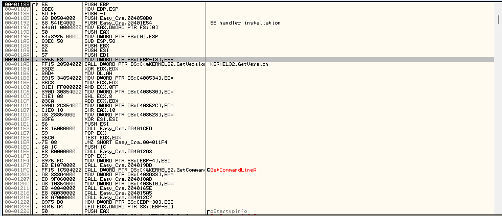

Vùng chứa phần phân tích code nhị phân. Hiển thị thông tin mã nhị phân gồm mã lệnh, ngôn ngữ hợp ngữ được dịch. Cột đầu là địa chỉ trong bộ nhớ của lệnh. Cột 2 là mã lệnh dạng hợp ngữ để CPU đọc. Các lệnh này tạo ra ngôn ngư máy. Nếu xem ở dạng dữ liệu thô trong mã nhị phân thì sẽ tấy rõ. 

Như vậy nhiệm vụ của Olly là phân tích ngôn ngữ máy thành hợp ngữ để con người dễ đọc. Cột thứ ba là chính là hợp ngữ 

Cột cuối cùng là nhận xét của Olly về dòng mã đó. Đôi khi chính là tên của các lệnh gọi API. Olly cũng giúp chúng ta hiểu bằng cách đặt tên cho lệnh nào không phải là của API bằng những cái tên hữu ích. Ta cũng có thể thêm nhận xét cho lệnh bằng cách nháy đúp.

## Registers

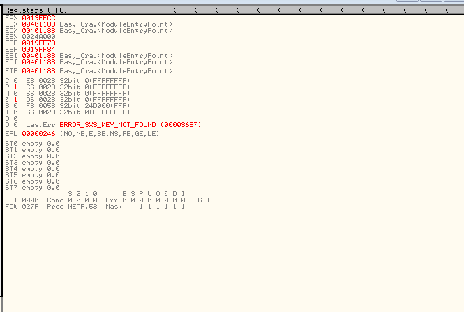

Mỗi CPU có 1 tập thanh ghi. Chúng là nơi lưu trữ tạm thời các giá trị tương tự như biến trong ngôn ngữ lập trình bậc cao.

Lần lượt từ trên xuống là Registers, Flags, Floating Point Registers

Trên cùng là thanh ghi CPU

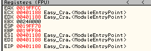

Thanh ghi sẽ đổi màu nếu chúng được thanh đổi từ đen sang đỏ(nghĩa là có thay đổi). Ta cũng có thể nháy đúp vào để thay đổi nội dung thanh ghi

Giữa là các cờ được CPU dùng để đánh dấu mã khi có sự kiện xảy ra, nháy đúp vào sẽ thay đổi.

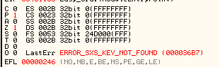

Dưới cùng là các thanh ghi FPU, bộ xử lí dấu phẩy động. Được dùng bất cứ khi nào CPU thực hiện phép toán dấu thập phân. Hiếm khi sử dụng, chủ yếu là mã hóa

## The Stack

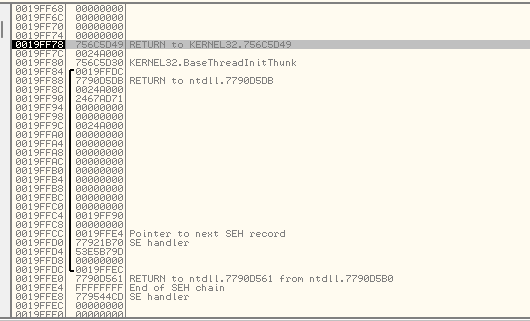

Là một phần của bộ nhớ được dùng riêng cho mã nhị phân dưới dạng danh sách dữ liệu tạm thời. Dữ liệu này gồm con trỏ đến địa chỉ trong bộ nhớ, dấu hiệu, chuỗi kí tự, quan trọng nhất là địa chỉ trả về mà mã cần quay lại khi gọi 1 hàm. 

Khi 1 method này gọi 1 method khác, quyền điều khiển chuyển cho method mới nhằm để nó có thể trả về. CPU phải theo dõi vị trí method mới này được gọi từ đâu để khi method này hoàn thành, CPU có thể quay lại ví trí ban đầu và tiếp tục thực thi mã sau khi gọi. Ngăn xếp là nơi CPU lưu giữ địa chỉ trả về này.

Ngăn xếp theo cấu trúc First In, Last Out.

Trong hình ảnh, cột đầu là địa chỉ mỗi thành viên dữ liệu, cột 2 là biểu diễn thập lục phân 32 bit của dữ liệu, cột cuối là nhận xét của Olly về mục dữ liệu. Trên hàng đầu tiên, có nhận xét, RETURN to kernel, là địa chỉ mà CPU đặt trên ngăn xếp khi hàm hiện tại kết thúc, nó sẽ biết nơi cần quay lại.

## The Dump

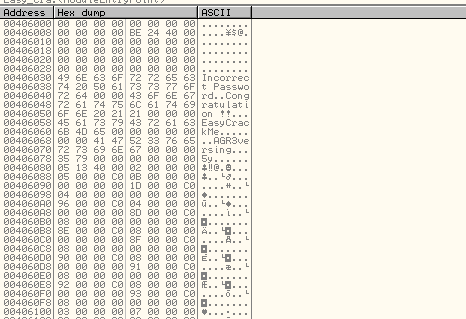

Đây là cửa sổ giúp ta xem đoạn dữ liệu thô mà CPU đọc, hiển thị 2 dạng cùng một dữ liệu là thập lục phân và ASCII. Được biểu diễn ở 2 cột, cột đầu là địa chỉ trong bộ nhớ.

## The Toolbar

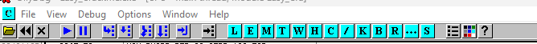

Đây là các nút điều khiển chính để chạy mã. Có thể truy cập được từ menu Debug.

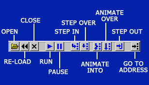

Một số biểu tượng

+ Re-load là khởi động lại ứng dụng và tạm dừng nó lại tại điểm bắt đầu
+ Run và Pause
+ Step In : chạy 1 dòng mã và sau đó dừng lại, gọi 1 hàm khác nếu có
+ Step Over : tương tự nhưng bỏ qua 1 lời gọi đến 1 hàm khác
+ Animate : giống Step Over nhưng thực hiện chậm để có thể quan sát

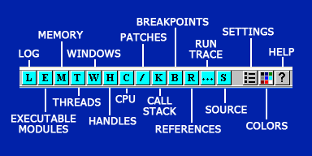

Một số công cụ có thể dùng thường xuyên. Có thể truy cập được trong menu View.

### Memory (M)

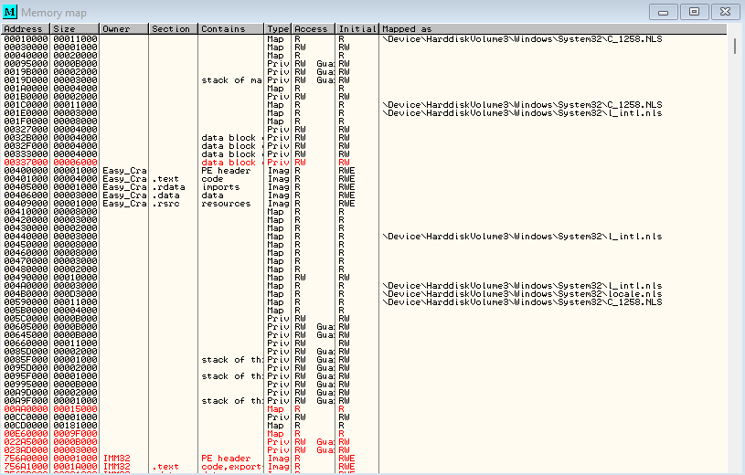

Cửa sổ này hiển thị tất cả các khối bộ nhớ mà chương trình đã cấp phát. Nó bao gồm các phần chính của ứng dụng đang chạy.

Còn có nhiều phần khác ở dưới danh sách, đây là các DLL mà chương trình đã tải vào bộ nhớ và dự định sử dụng. Nếu nháy đúp vào dòng bất kỳ nào, sẽ hiện ra 1 cửa sổ đoạn mã dịch ngược của phần đó. Cửa sổ này hiển thị loại khối, quyền truy cập, kích thước và địa chỉ bộ nhớ nơi phần đó được tải.

### Patches (P)

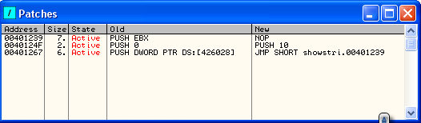

Hiển thị các bản vá mà ta đã thực hiện nghĩa là những thay đổi với đoạn mã gốc. Trạng thái State đặt là Activate nếu tải lại ứng dụng, các bản vá sẽ bị vô hiệu hóa, kích hoạt lại hoặc vô hiệu hóa thì nhấp vào bản vá mong muốn và bấm phím Space. Thao tác này sẽ bật/tắt bản vá. Các cột New, Old hiển thị các hướng dẫn gốc và hướng dẫn đã được thay đổi

### Breakpoints (B)

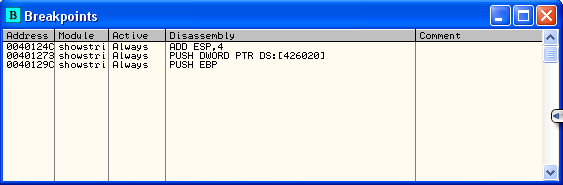

Hiển thị vị trí các điểm dừng

### Kall Stack (K)

Khác với cửa sổ ngăn xếp trước đó. Nó hiển thị nhiều thoong tin về các lệnh được gọi và thực hiện trong mã, các giá trị được gửi đến các hàm.

## The Context Menu

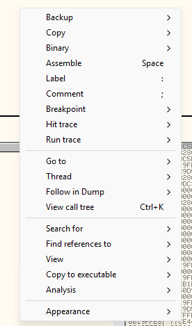

Khi nhấp chuột phải vào vùng trong Olly, sẽ hiện ra menu các thao tác.

+ Binary cho phép chỉnh sửa dữ liệu nhị phân ở cấp độ từng bytes. Đây là nơi có thể thay đổi chuỗi Unregistered ẩn trong dữ liệu nhị phân thành Registered.
+ Breakpoint cho phép đặt điểm dừng
+ Search For là nơi tìm kiếm dữ liệu trong dữ liệu nhị phân như chuỗi kí tự, lời gọi hàm.
+ Analysis buộc Olly phân tích lại đoạn mã đang xem