# Introduction

Các tệp UDD sẽ lưu lại lịch sử làm việc với ứng dụng

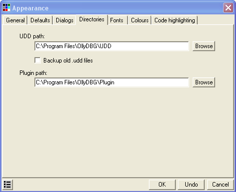

# Investigating the binary

Tải tệp crackme2.exe

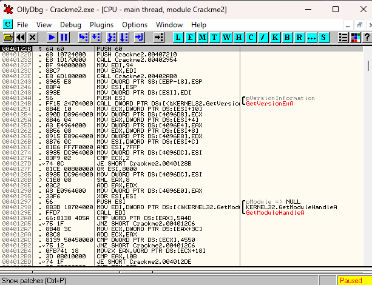

Đầu tiên ta sẽ chạy thử ứng dụng vì nó cung cấp lượng thông tin cần thiết như là có yêu cầu thời gian không, có chức năng cụ thể nào bị vô hiệu hóa không, nó có giới hạn 1 lượng số lần chạy không, có màn hình đăng kí mà ta có thể nhập mã không 

Đó là những điều cần thiết để biết. Ta sẽ dần tích lũy các kinh nghiệm(mất bao lâu để xác thực 1 mã code, Nó có buộc dẫn ta đến 1 trang web?)

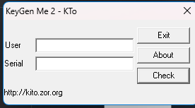

Nhập thử bất kỳ

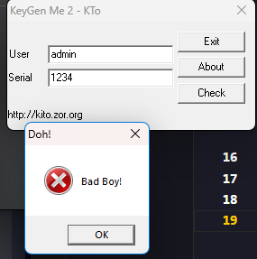

Nó không phải điều ta muốn. Quay tại Olly, thử công cụ đầu tiên ta biết là tìm kiếm theo chuỗi văn bản. Chuột phải -> Search for -> All Referenced text strings.

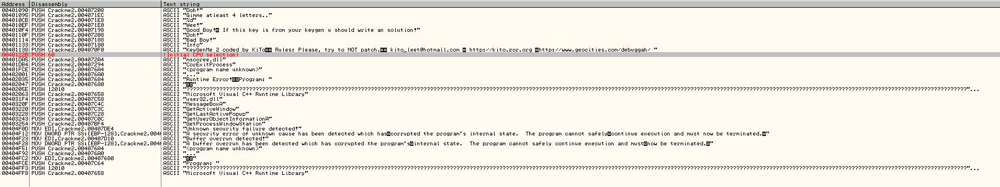

Có 1 số thứ ta có thể biết được. Đầu tiên là có vẻ đầu vào yêu cầu tối thiểu 4 kí tự

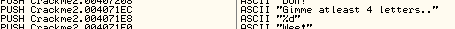

Thứ 2 là ta có thấy các thông điệp tốt và xấu 

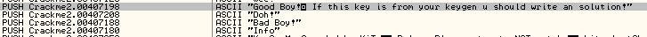

Thử với dòng "Good boy"

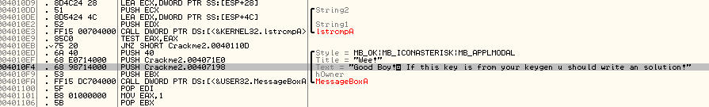

Đây giống như 1 quy trình. Ta tìm kiếm chuỗi văn bản, tìm chuỗi văn bản hiển thị nếu ta nhập mã/mật khẩu/giấy phép đúng hoặc sai, đi đến phần code đó,thấy các thông điệp tốt hoặc xấu có thể gần nhau. Theo quy tắc, ta tìm các đoạn so sánh/nhảy cái ta muốn. Hãy tìm bước nhảy đó.

Bước nhảy đầu tiên ta tìm thấy là ở địa chỉ 4010EB, 1 câu lệnh JNZ. 

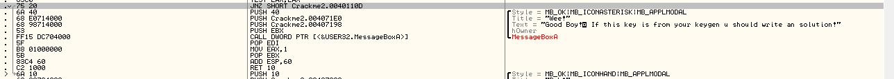

Câu lệnh jump nhảy thẳng vượt qua good boy đến bad boy. Có vẻ như đây là nơi chính xác để ta bắt đầu khai thác. Ta cũng biết rằng trước khi nhảy thì phải có một phần so sánh gì đó để quyết định xem có nhảy hay không. Nhìn lên bên trên ta thấy có "TEST EAX,EAX" 

Giải thích 1 chút là phép TEST là sẽ thực hiện phép toán AND giữa các bit của hạng tử 1 với các but của hạng tử 2, nhưng khác với phép câu lệnh AND là AND sẽ lưu kết quả vào 1 thah ghi đích thì TEST không lưu kết quả, chỉ để kiểm tra các bit và thiết lập các cờ trong thanh ghi để cho lệnh so sánh tiếp theo. Cụ thể các cờ là SF, ZF, PF. Hầu hết, nếu mà lệnh là kiểm tra xem 2 thanh ghi có giống nhau không thì ý nghĩa của nó là kiểm tra xem nó có phải số không hay không. 

Nghĩa là chỉ khi hạng tử thứ nhất = 0 thì ZF = 1, khác 0 thì ZF = 0.

Từ kết luận trên, ta có thể hiểu rằng nếu EAX không bằng 0 thì nó sẽ nhảy vì JNZ chỉ nhảy khi ZF = 0. Và sẽ nhảy đến bad boy. Đặt 1 BP ở câu lệnh JNZ, khởi động lại, nhập 1 username và số seri(4 ký tự) và ấn vào crackme. Olly sẽ dừng ở BP.

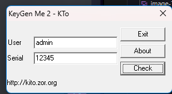

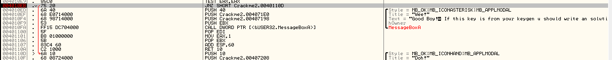

Giờ chúng ta có thể thấy là ta sẽ nhảy qua good boy thẳng đến bad boy. Đừng để điều này xảy ra. Lật cờ ZF 

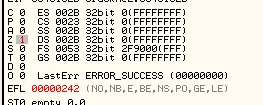

Và ta có thể thấy rằng ta không thực hiện bước nhảy. Chạy ứng dụng và
e
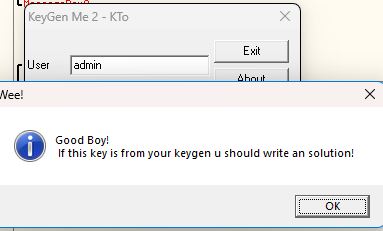

Sau này, sẽ có thêm nhiều kiến thức ta cần bổ sung để xử lí.

# Patching

Nếu khởi động lại, chạy crackme, nhập user/seri Olly sẽ làm mất BP của chúng ta đã đặt và 1 lần nữa ta lại nhảy đến bad boy vì đổi cờ chỉ mang tính tạm thời. Bây giờ, thay vì tạm thời đổi cờ, ta sẽ thay đổi code thực sự ở trong file nhị phân để làm điều ta muốn. Đó gọi là vá lỗi(patching)

Click vào dòng lệnh mà ta dừng (4010EB) click vào cột lệnh dòng JNZ SHORT... và nhấn phím cách. Cửa sổ hiển thị dòng lệnh bật ra, ta có thể thay đổi lệnh

Giờ điều ta phải làm bây giờ là thay đổi để không jump vào thông điệp bad boy, để không bao giờ nhảy vào nghĩa là ta không muốn cái lệnh kia được thực hiện. Vì thế điều ta sẽ làm là thay thế nó bằng 1 lệnh không làm gì, lệnh NOP. NOP viết tắt là No OPeration. Vào cửa sổ hộp thoại vừa rồi và thay đổi JNZ SHORT 0040110D thành NOP

Ta có thể điền NOP. Nhấn vào Assemble, để commit dòng đó và sau đó bấm cancel để đóng cửa sổ.

Nếu ta không ấn cancel và tiếp tục click Assemble, ta sẽ sửa từng dòng. Đây là 1 tính năng của Olly của Olly và nó dành cho khi ta muốn thay thế một số dòng mã. Nó giúp ta không phải nhấn dấu cách cho mỗi dòng. 

Để ý rằng những dòng mà ta dừng ở đó đã bị thay đổi lệnh, giờ đây nó hiện ra 2 dòng NOP thay cho lệnh JNZ và nó màu đỏ

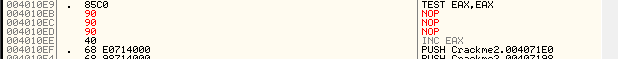

Lý do có 2 dòng NOP là vì lệnh NOP chỉ dài 1 byte và lệnh ta cần thay , JNZ thì dài 2 byte, vì thế Olly thay toàn 2 bytes với NOP. Bnaj cũng để ý rằng lệnh jump và mũi tên đã mất. Đó bởi vì không còn lệnh jump nào cả. Chỉ cần 1 bước ta sẽ có thông điệp good boy.

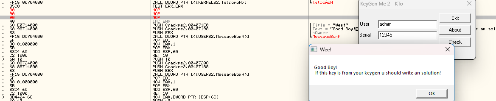

# Saving the patch

Một điều quan trọng cần biết là bản vá sẽ không giữ nguyên nếu ta restart lại ứng dụng cho đến khi ta lưu lại tệp nhị phân. Ta có thể thấy điều này trong thực tế. Bấm vào Biểu tương "Pa" hoặc Ctrl P để xem cửa sổ bản vá

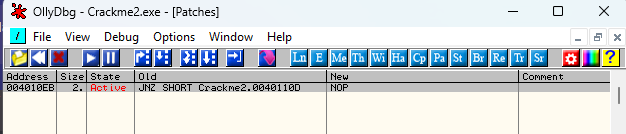

Cửa sổ vá hiển thị tất cả các bản vá mà ta đã làm với ứng dụng. Để ý rằng địa chỉ màu đỏ và có State Active. Vì ứng dụng của ta vẫn chạy, nghĩa là bản vá đang được triển khai và nếu CPU chạy code này, nó sẽ chạy bản vá. Giờ đấy, tải lại ứng dụng. Đầu tiên, Olly có thể đưa ra 1 số lỗi, rất dài, phức tạp cho chúng ta biết rằng bản vá của chúng ta có thể không dính bởi vì Olly không thể theo dõi chúng. 

Khởi động lại ứng dụng và NOP của ta biến mất, mã gốc trở lại. Để giữ lại bản vá vĩnh viễn, ta phải lưu lại bản thay đổi vào tệp nhị phân ở trên đĩa. Trước hết bật lại bản vá. Sau đó nhấp chuột phải vào vùng code, chọn "Copy to executable" và chọn "All modifications"

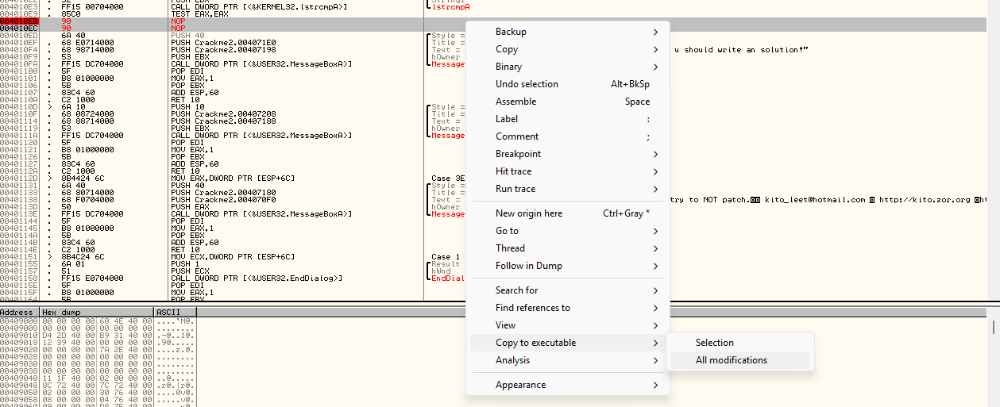

Chọn "copy all" nếu nó hỏi có muốn lưu tất cả sửa đổi.

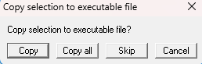

Nó sẽ rất quan trọng nếu ta muốn triển khai nhiều bản vá và muốn lưu tất cả trong cùng một lần, vì thỉnh thoảng rất dễ để ta quên rằng ta đã tạo nhiều bản vá. Trong trường hợp này, mặc dù ta chỉ có 1 bản vá, chọn tất cả bản vá sẽ chỉ lưu 1 bản của chúng ta. Tất nhiên, chỉ những bản vá mà đặt active trong cửa sổ bản vá mới được lưu.

Sau đó, ta chọn "Selection" thay vì "All modifications", nhưng ta phải chắc rằng phần sửa đổi của ta phải được đánh dấu trong cửa sổ disassembly(bằng cách nhấp và kéo tất cả các dòng có sửa đổi trong đó). Không sao nếu ta chọn nhiều hơn các dòng được sửa đổi-Olly chỉ thay đổi các dòng đã sửa đổi.

Sau khi click "Copy all", 1 cửa sổ sẽ hiển thị, về cơ bản kết xuất của toàn bộ quá trình nhưng với bản vá của chúng ta trong đó.

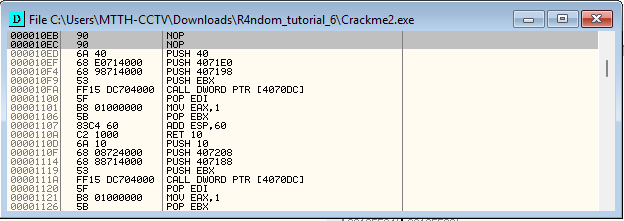

Ta có thể thấy bản vá của chúng ta ở trên cùng. Nhưng nhận ra rằng đây  chỉ là phiên bản sửa đổi của tệp thực thi trong bộ nhớ, nó vẫn chưa được lưu trong đĩa, do đó nếu ta đóng cửa sổ và restart ứng dụng, nó sẽ không lưu. Hãy lưu nó cho tốt. Chuột phải vào vùng cửa sổ và chọn "Save file". Điều này sẽ lưu quá trình này vào một tệp thực tế. 1 cửa sổ lưu sẽ hiện ra. Lưu tệp dưới dạng Crackme2_patched(thường thêm patched ở đuôi để dễ theo dõi)

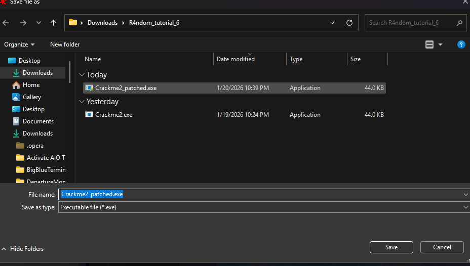

Giờ ta sẽ có 1 phiên bản vá lỗi của Crackme. Hãy thử nó. Mở tệp mới trong Olly. Ctrl G -> GOTO và nhập địa chỉ của cái lệnh đã vá.(Mình đã mở lại bản vá nhưng nó không có quyền cho phép chạy)

Chạy ứng dụng ở bên ngoài và đã ok

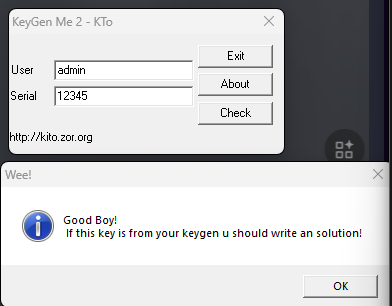

Bây giờ ta đã có tệp nhị phân được bẻ khóa và vá lỗi đầu tiên.

# Homework

Có thể thay lệnh "TEST EAX,EAX" tại địa chỉ 4010E9 thành lệnh nào để lệnh nhảy không được thực thi và sẽ hiển thị good boy ?

Lệnh thay phải thay cho mỗi TEST, vì vậy cũng phải đúng 2 bytes, nếu nhiều hơn 2 bytes, nó sẽ ghi đè lên lệnh JNZ

Câu trả lời là thay lệnh TEST thành __XOR__, lệnh XOR đủ 2 bytes, nếu EAX = 0 thì cũng cho ra ZF = 1.

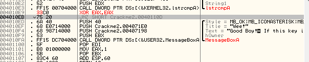

Mọi thứ đã ok

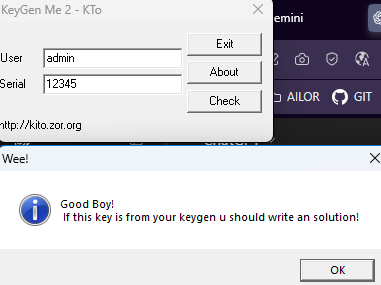

# Note lại kiến thức 

## JNZ nhảy khi nào

JNZ = Jump if not zero 

ZF = 0 -> Nhảy
ZF = 1 -> Không nhảy

## ZF = 1 khi nào ?

ZF = 1 Khi kết quả các phép toán = 0

_VD:_

XOR EAX,EAX ; EAX = 0 -> ZF = 1
SUB EAX,EAX ; =0 -> ZF = 1
CMP EAX,0 ; EAX = 0 -> ZF = 1
TEST EAX,EAX ; EAX = 0 -> ZF = 1

## ZF = 0 khi nào ?

ZF = 0 Khi kết quả khác  0 

_VD:_

MOV EAX, 5
TEST EAX, EAX    ; ≠ 0 → ZF = 0
CMP EAX, 3       ; 5 ≠ 3 → ZF = 0
SUB EAX, 3       ; 5 - 3 = 2 → ZF = 0

