# Introduction 

Trong bài này sẽ giải quyết 2 cái Crackme

# Investigating

Ta vào ngay canyou.exe(đảm bảo canyou.dll ở cùng 1 nơi) trong olly

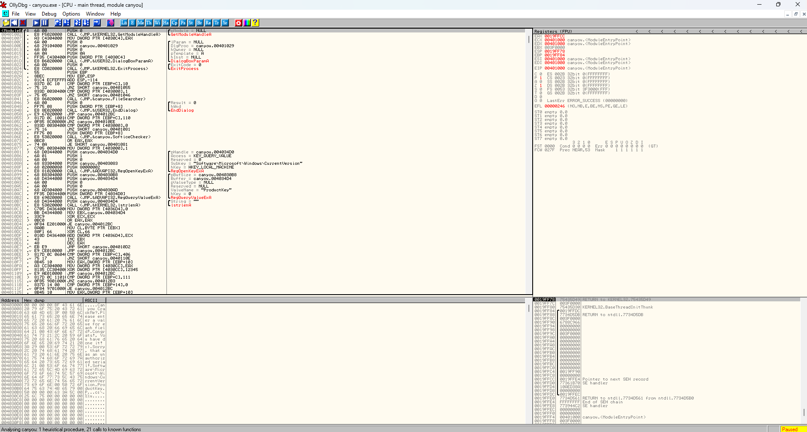

Điều quan trọng đầu tiên cần làm là chạy ứng dụng và nghiên cứu nó. Nó cung cấp rất nhiều thông tin, có thử thách thời gian gì không ? Có Tính năng nào bị vô hiệu hóa không? Có giới hạn số lượng lần chạy không ? Có màn hình đăng kí mà ta có thể nhập mã đăng ký không ?

Đó là tất cả những điều thực sự quan trọng cần biết và khi ta quen với RE, ta sẽ có nhiều thêm kinh nghiệm hơn về những gì ta nên tìm kiếm

Khi chạy app , có :

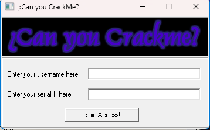

Ta nhập thử 1 số thứ và nhận được :

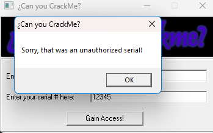

Giờ ta vào lại Olly xem có những chuỗi gì ?

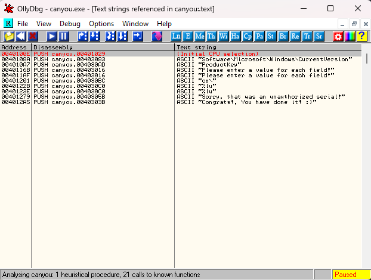

Đó là những chuỗi ASCII mà crackme cung cấp

Điều đầu tiên ta cần để ý là có một số thứ gì cần phải nhập vào trường

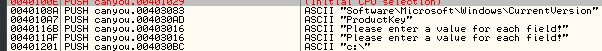

Và sao đó có một số thứ quan trọng :

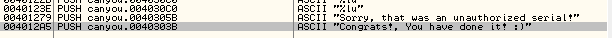

Nháy đúp vào xem thử ở đâu :

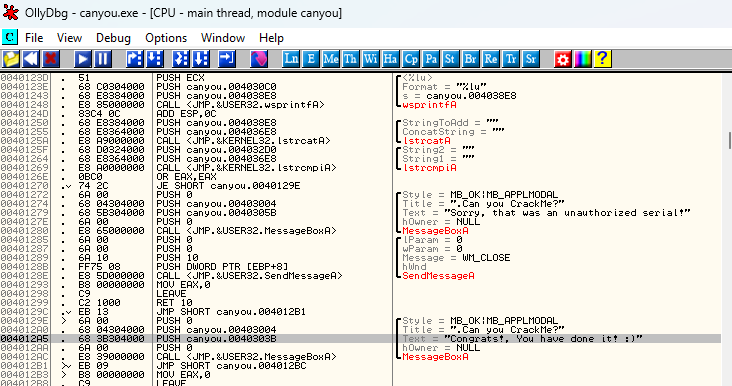

Có một số thứ trông quen thuộc. Ta có 1 bad boy, theo sau đó là 1 good boy, cùng với 1 pha jump rõ ràng trước bad boy, có lẽ là để nhảy sang good boy. Ngoài ra, cần để ý đến trước jump là 1 pha call đến Window API lstrcmpi.

Giải thích 1 chút, ltrcmp so sánh 2 xâu kí tự. Hàm này rất quan trọng trong RE và ta sẽ thấy nó nhiều lần. Nó được sử dụng trong nhiều lược đồ đăng ký/mật khẩu để so sánh xâu  mà người dùng nhập với xâu mà ứng dụng đã mã hóa hoặc tạo ra. Nếu kết quả so sánh chuỗi là 0, thông tin người dùng nhập vào là đúng, nghĩa là các xâu giống nhau. Nếu nó không trả về không, các xâu không giống nhau. Trong trường hợp của crackme, chuỗi nhập seri có lẽ được kiểm tra dựa trên 1  chuỗi nội bộ hoặc tạo động và nếu EAX trả về 0, chúng giống nhau, ngược lại thì không. Như đã thấy Olly không biết các chuỗi là gì vì chúng ta vẫn chưa khởi đoọng app và nhập gì, nhưng một khi ta bắt đầu, Olly sẽ thay thế xâu Stirng1 và String2 bằng các chuỗi thực. Nếu ta đặt 1 BP trong jump và chạy app, nhập chuỗi 12345. Olly sẽ hiển thị cho chúng ta các xâu mà chúng sẽ được so sánh

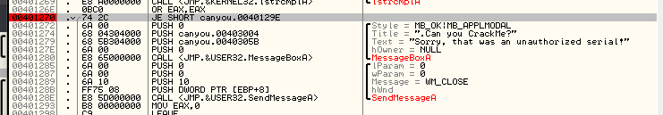

Nếu ta thấy dòng bên trên của lệnh jump, ta có thể thấy rằng password được so sánh với giá trị 31..., bất kể nó là gì. Quay trở lại, EAX sẽ chứa 1 số 0 nếu chúng giống hệt nhau và bất cứ thứ gì khác nếu chúng không giống. Lệnh "OR EAX,EAX" chủ là 1 cách để hiểu xem EAX có bằng 0 hay không, lệnh "JE SHORT canyou.004129E" nhảy đến good boy. Tôi muốn  chỉ ra chuỗi so sánh quy trình mà sẽ tìm hiểu trong tương lai. Ta sẽ phải tìm ra cách mà 15 chữ số kia được tạo ra và tìm kiếm ltrcmp có thể dẫn ta đến việc tạo ra nó.

Nhưng trong thời gian chờ đợi, ta đặt 1 BP trong lệnh JE ở dòng 401270 và chạy lại app, nhập username và số seri và Olly sẽ dừng lại ở BP

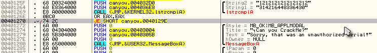

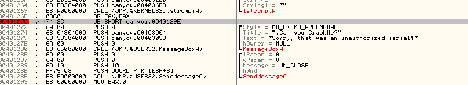

Ta để ý cái dòng JE, Olly sẽ không nhảy tới good boy và thay vào đó sẽ rơi vào bad boy. Ta sẽ sửa cờ từ  0 thành 1

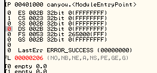

Và nó đã đúng:

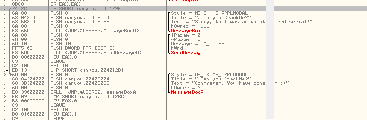

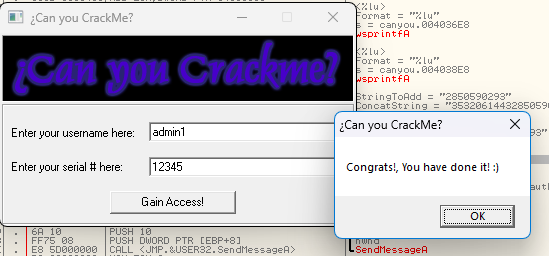

# Patch The App

Lần này ta không muốn dùng NOP vì điều đó sẽ làm chương trình luôn hiển thị bad boy. Thay vào đó, ta muốn đảm bảo rằng nó sẽ luôn nhay tới thông điệp good boy. Vì thế, đén dòng BP và thay đổi lệnh. Chắc chắn rằng là ta bấm vào lệnh JE và ấn phím cách

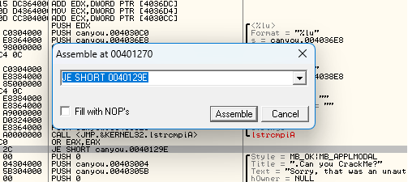

Một lần nữa, chú ý lệnh đang bôi đen trong hộp chỉnh sửa. Giờ, hãy thay đổi lệnh JE(Jump on Equal) thành JMP(luôn nhảy)

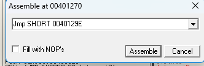

Ấn vào Assemble và sau đó bấm vào Cancel và sẽ thấy sự thay đổi trong dòng code. 

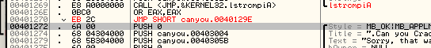

Chạy lại app, đảm bảo rằng nó hoạt động

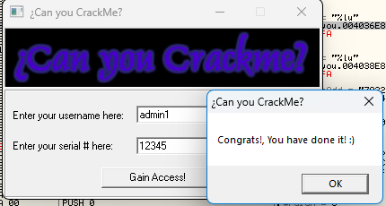

Giờ đây hãy lưu bảm vá vào đĩa. Nhớ rằng, nếu khởi động lại app sẽ phải bật lại bản vá. Nhưng vì app vẫn đang chạy, click vào Olly, chuột phải vào cửa sổ disasssembly, chọn "Copy to executable" -> "All Modification"

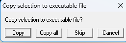

Chọn "Copy All" và cửa sổ quy trình bộ nhớ sẽ mở ra

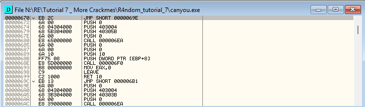

Giờ hãy lưu vào ổ đĩa, click chuột phải trong cửa sổ, click "Save File". Lưu thành canyou_patched

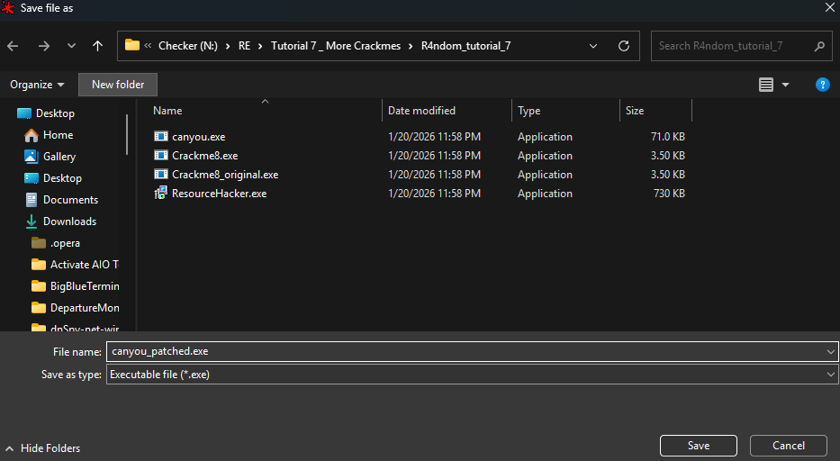

Tải tệp mới vào Olly và chạy nó để kiểm tra lại. Thấy ok là được.

# Another Crackme

Hãy tải chương trình thứ 2, Crackme8.exe và chạy trong Olly

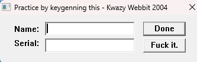

Tốt, hài ở đây là sau khi ta nhập tên và seri, ta phải chọn nút nào, thử 1 cái nhỉ.

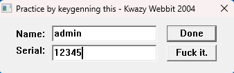

Nếu ta chọn F*** it thì sẽ bị out. Còn nếu chọn Done 

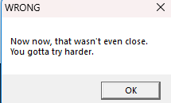

Giờ đây ta sẽ thay các nút để có ý nghĩa hơn.

# Using Resource Hacker

Chạy chương trình đó lên :

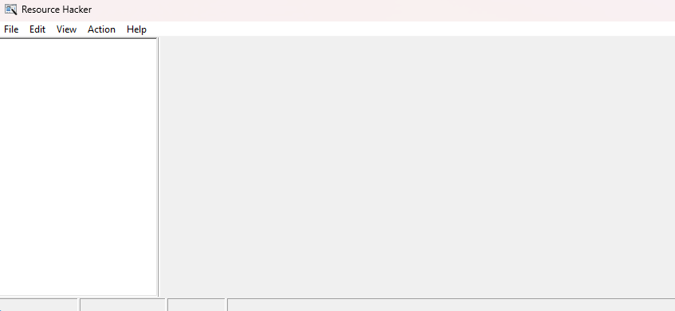

Tiếp tục tải tệp Crackme8 vào trong Resource Hacker sẽ nhận thấy 1 folder Dialog với 1 dấu cộng bên cạnh. Mở dấu cộng và click vào dấu cộng bên cạnh thư mục tiếp theo(103) và sẽ thấy một số thứ như này :

Giờ hãy nhấp vào 1033 và nó sẽ điền vào ngăn bên phải với 1 đoạn dữ liệu về dialog, cũng như mở hộp thoại tham chiếu hiển thị nó trông như nào :

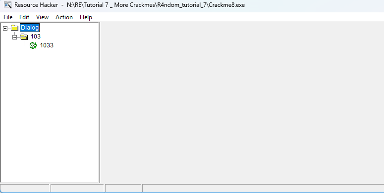

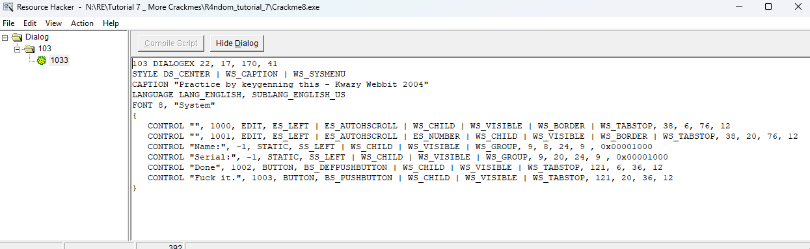

Ở ngăn đầu bên phải, ta có thể thấy một số dữ liệu như font, chú thích, kiểu,...

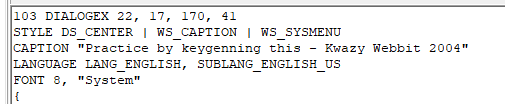

Và bên dưới có thể thấy chi tiết về các phần tử của hộp thoại, gồm nhãn "Name", "Serial" và 2 nút. Hãy đổi hộp thoại theo ý thích được không ?. Đầu tiên, đổi 2 nút thành "Check" và "Exit"

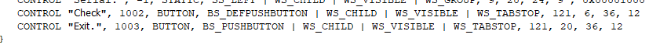

Bây giờ hãy đổi chú thích ở trên cùng 

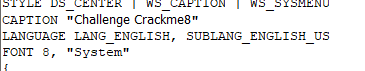

Giờ nhấn vào nút Compile ở trên cùng và sẽ thấy hộp thoại cập nhật.

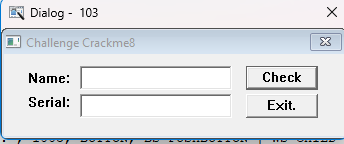

Tốt, nó trông ổn hơn. Hãy Lưu nó(File -> Save) và load crackme vào trong Olly(cái được lưu dưới dạng Crackme8_original) và chạy nó 

Giờ sẽ chính thức bắt đầu..

# Cracking the program

Bây giờ ta nên biết cách khai thác. Tìm kiếm chuỗi văn bản: 

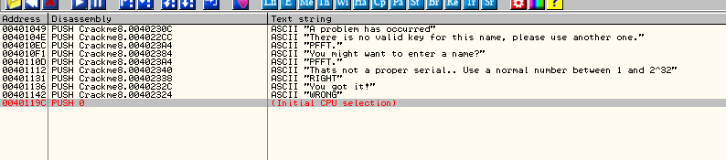

Có 2 thứ ta học được : 1) Số seri phải nằm trong khoảng 1->2^32. 2) ta biết nơi mà good boy và bad boy được tạo ra. Hãy tới good boy.

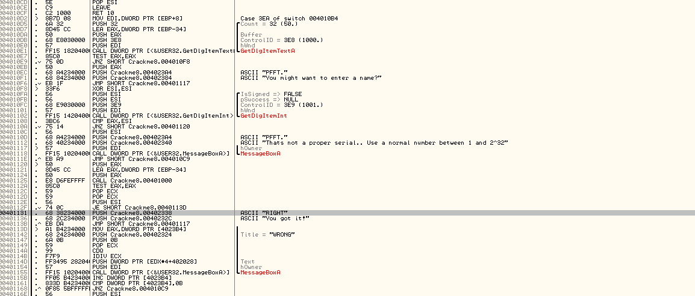

Và ta click 2 lần vào trong vùng quen thuộc. Ta sẽ thấy thói quen của good boy ở địa chỉ 401131 và bad boy ở địa chỉ 40113D. Ta cũng thấy lệnh jump(JE SHORT Crackme8.0040113D) tại địa chỉ 401131 và so sánh(TEST EAX,EAX) ở địa chỉ 40112A. Hãy đặt 1 BP ở địa chỉ 40112F và chạy app. Nhập tên và seri và bấm "Check". Olly sẽ dừng ở BP.

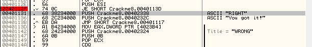

Có thể thấy rằng, không có gì thay đổi. Olly sẽ nhảy qua good boy đến thẳng bad boy. Ta dã có thói quen xóa cờ và chạy lại app.

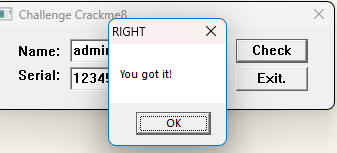

Và thành công. Giờ hãy nhanh chóng tạo 1 bản vá: tải lại app, tới BP, click 1 lần vào dòng lệnh JE và ấn space và NOP vào jump nhằm để ta luôn có thể nhảy tới good boy.

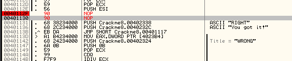

Ấn "Assemble" và ấn "Cancel". Chuột phải và chọn "Save to executable" -> "All Modifications" và chọn "Copy all". Chuột phải vào cửa sổ và chọn "Save file" và lưu nó. Giờ ta có 1 bản vá và thay đổi code sẽ lấy bất cứ số seri nào ta nhập vào và hiển thị thông điệp cậu bé ngoan.

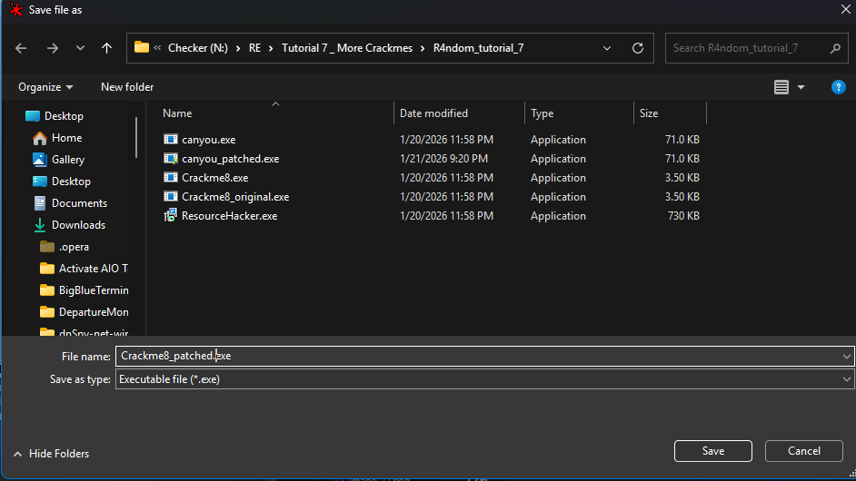

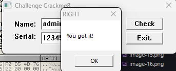

# Food for thought

(Điều đáng suy ngẫm)

Tôi muốn đề cập rằng Resource Hacker là 1 chương trình vui và rất hữu ích. Nó cho phép ta không chỉ thay đổi nhiều thứ trong file(xâu, icon, nhãn, nút, chú thích) nhưng nó cũng cho ta đổi nhiều thứ trong cửa sổ của nó(nút bắt đầu, menu ngữ cảnh, hộp thoại giới thiệu của máy tính). Trên thực tế, Resource Hacker là cái mà tôi dùng để đổi các biểu tượng trong Olly.

