# Introduction

Bài này sẽ xem xét 1 thử thách crackme khó hơn. Đó là Crackme3.exe. Cũng cần học một số thủ thuật mới.

# Investigating the binary

Tiếp tục và khởi động Olly và tải crackme. Nó sẽ tải, phân tích và dừng ở dòng đầu tiên 

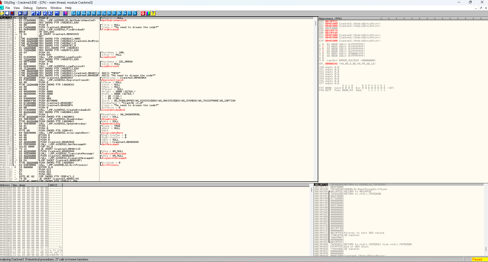

Hãy chạy để xem ta có gì:

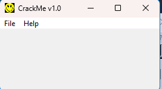

Không có gì nhiều. Chọn Help - > Register

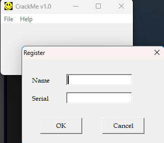

Nhập tên và seri để xem xem app phản hồi như nào

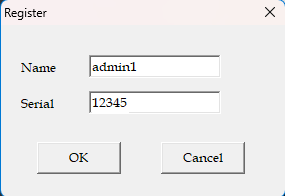

Trong phần này, ta nhận được 1 tin xấu

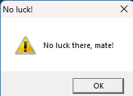

Ta sẽ cuộn xuống để xem chương trình :

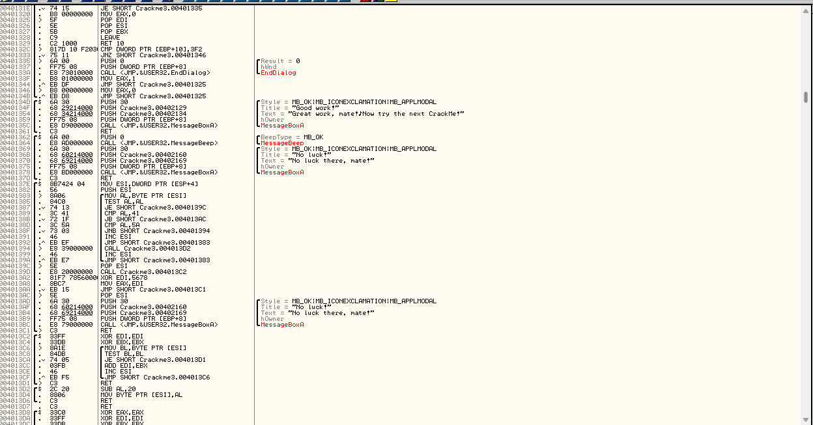

Nhìn vào dòng văn bản trước khi hàm MessageBoxA được gọi. Nếu ta nhìn vào bên trái của văn bản phía trên lệnh MessageBoxA được gọi, có thể thấy 1 đường kẻ màu đen mô tả các tham số theo sau là call.

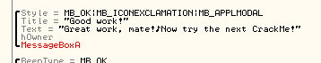

Những gì mà Olly hiển thị ra ở đây là những tham số được chuẩn bị để truyền vào hàm cùng với hàm được gọi. Trong trường hợp này, tham số thứ 1) là kiểu cửa sổ, 2) là tiêu đề cửa sổ("Good work"), 3) là văn bản cửa sổ("Great..."), và 4) là Handle của chủ sở hữu cửa sổ. Cuối cùng, hàm MessabeBoxA được gọi. Ta có thể click chuột phải vào từ MessageBoxA và chọn "Help on symbolic names" để thấy tham số truyền vào và trả về của hàm này.

Ta cùng xem phần ngay bên dưới:

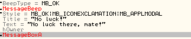

Có một sự khác biệt lớn giữa hai pha gọi hàm. 1 Cái thì trông khá tốt và cái còn lại thì không nhiều. Tôi nghĩa ta có thể đồng ý rằng ta muốn cái đầu tiên được gọi.

___Sự thật thiết yếu về đảo ngược dữ liệu #2:___ 

__2. Hầu hết các lược đồ bảo vệ có thể khắc phục bằng cách thay đổi lệnh nhảy đơn giản để chuyển đến code tốt thay vì code xấu(hoặc ngăn việc nhảy qua code tốt)

Nếu ta nhìn vào 1 vài dòng bên trên 2 hàm này, ta sẽ thấy 1 số lệnh jmp cái mà sẽ chọn con đường ta đi, con đường tốt hay xấu. Đây là trường hợp 99% thời gian trong app hiện có. Mẹo là tìm jump.(Tất nhiên có 1% khác mà một cái gì đó khó hơn nhiều cần thực hiện). Trong trường hợp của chúng ta, Có 1 vài jumps ở  401344 và 40134B. Bây giờ, với 1 kĩ sư RE, những cú nhảy sẽ nhanh chóng được bỏ qua(và nếu ta muốn biết tại sao, đó là vì chúng không cùng chức năng với hộp tin nhắn của ta, vì thế vì vậy chúng sẽ không nhảy qua thông điệp xấu hoặc nhảy đến thông điệp tốt, nhưng chúng ta sẽ đề cập sau) 

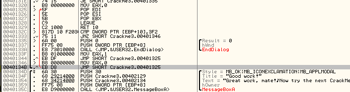

Trước hết, click vào JMP ở 40134B. Ta Sẽ thấy 1 đường màu đỏ xuất hiện cho biết nơi JMP sẽ nhảy đến và ta có thể thấy rằng nó đi sai hướng

Nó không nhảy đến thông điệp tốt, cũng không vượt qua thông điệp xấu, mà đi lên, phần code phía trước. Hãy xem cái còn lại ở 401344. Cái đó thực sự chỉ vào cùng 1 cái với cái kia.

Bằng cách này, lý do 1 người dịch ngược dày kinh nghiệm sẽ vượt qua những thứ như này là vì cách Olly hiển thị các hàm. Nếu nhìn giữa cột đầu(địa chỉ) và cột thứ 2(opcode) ta sẽ thấy 1 vài đườngmauf đen dày. Những dòng này được đưa vào Olly để phân biệt các hàm riêng biệt(đôi khi không)

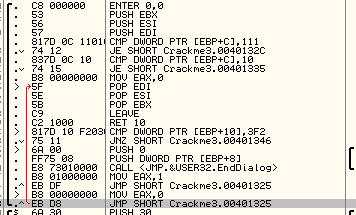

Trong trường hợp này, ta thấy cả 2 dòng jmp ở trên hàm phía trên thông điệp tốt và xấu. Vì chúng không nhảy vào thông điệp tốt hoặc xấu, chúng thực sự không giúp gì cho ta. Điều này cũng cho ta biết 1 điều khác, hộp tin nhắn đầu tiên(tốt) thì không cùng hàm với hộp tin nhắn xấu. Điều này nói cho ta biết rằng, các hàm này được gọi từ 1 nơi nào đó và ở đâu đó trước khi chúng được gọi, có 1 quyết định được đưa ra về  việc gọi hàm nào đó, hàm tốt hay xấu.Hãy xem cách ta vượt qua trở ngại này.

# Finding References

Click chuột phải vào dòng đầu tiên của hàm tốt ở địa chỉ 40134D và chọn "Find References To" -> "Selected Command" (Hoặc bấm Ctrl+R):

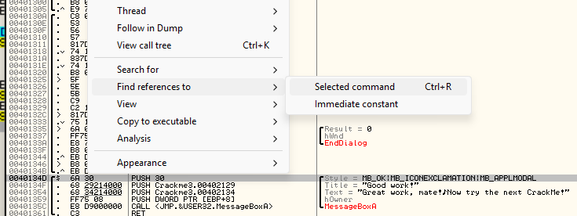

Thao tác này sẽ hiện cửa sổ tham chiếu

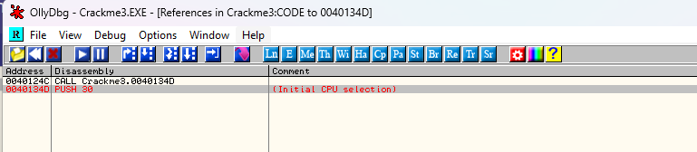

Điều này cho thấy tất cả các tham chiếu(CALL và JMP) trong code mà Olly có thể tìm thấy CALL hoặc JMP đến địa chỉ đó. Bây giờ, nhấn đúp vào cái đầu tiên trong danh sách, sẽ đưa ta đến  dòng gọi thông báo tốt này

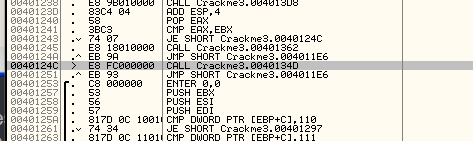

Trên dòng 40124C ta có thể thấy 1 CALL CRACKME.0040134D. 40134D là dòng đầu tiên của hộp thoại thông điệp tốt. Đặt 1 BP ở đây :

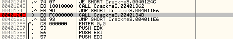

Giờ, hãy làm tương tự với hàm còn lại, hàm xấu.Đén dòng 401362, dòng đầu của thông điệp xấu, chuột phải, chọn "Find References To" -> "Selection" (Hoặc Ctrl+R). Thao tác này sễ hiển thị  cửa sổ tham chiếu. Giờ, click 2 lần vào dòng đầu và ta sẽ được đưa đến địa chỉ mà gọi thông điệp xấu.

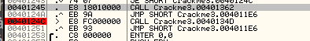

Thú vị là khi nó ở trên 2 dòng so với cái BP trước của ta. Hãy đặt 1 BP ở đây:

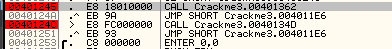

_Hãy nhớ rằng thỉnh thoảng ta sẽ chọn 1 dòng và tìm tham chiếu, nhưng sẽ không có gì. Có 2 thứ có thể đã gây ra điều này : 1) Ta đã chọn sai điểm "Entry Point" vào hàm này, nghĩa là có Calls hoặc Jumps ở đâu đó đến hàm này, nhưng chúng gọi 1 dòng khác, có lẽ dòng đúng ở trước hoặc sau dòng ta đang chọn . Chọn đúng dòng để tìm tham chiếu có thể mất thời gian và kĩ năng, nhưng hãy tiếp tục. Lí do thứ 2 là Olly có thể không tìm thấy tham chiếu là bởi vì không có vị trí rõ ràng trong code, cái mà trỏ đến dòng này. Nhớ rằng, sẽ có rất nhiều con số được thao tác động khi chương trình chạy, và địa chỉ mà Call hoặc Jump đến cũng không ngoại lệ. Vì thế, nếu có gọi đến địa chỉ được tạo động, sẽ không có cách nào để Olly biết trước rằng nó sẽ gọi đến dòng này, vì thế nó sẽ không liệt kê tham chiếu đến nó. Có cách để giải quyết vấn đề này, nhưng ta sẽ đi sâu vào chúng sau.

Giờ, nếu ta nhìn xung quanh 2 cái Calls, ta sẽ nhìn thấy 1 cặp lệnh jmp. Cái đầu tiên, 1 JE ở địa chỉ 401243 là JE SHORT CRACKME.0040124C. Giải thích chút, JE(Jump if Equal) (ZF = 1), nghĩa là jump if zero flag được đặt là 1(hoặc 2 mục được so sánh là bằng nhau). Ta cũng có thể thấy rằng JE này nhảy qua cuộc gọi thông điệp xấu, và lệnh đầu tiên sau jump là gọi đến thông điệp tốt, nnghĩa là nếu JE này không nhảy, ta sẽ gọi thông điệp xấu thay vào. Vì thế ta muốn làm cho nó nhảy nhằm để ta có thể gọi thông điệp tốt. Hãy nhìn điều này trong thực tế. Đặt 1 BP ở lệnh JE và khởi động lại app. Click Help -> Register trong chương trình crackme và nhập tên, số seri, click ok

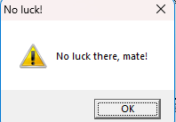

Chúng ta vẫn nhận được bad và Olly khôngduwngf? Nghĩa là Olly không chạm đến BP của ta. Điều gì đang xảy ra ?

Đây mới thực sự là nơi kĩ thuật RE có ích, ta đã bỏ lỡ điều gì? 1 int 0xcc bị gián đoạn? IsdebuggerPresent? NTFlags? TLS Callback? và sẽ tiếp tục với cuộc rượt đuổi để tìm kiếm giải pháp phức tạp. Nhưng vì ta mới chỉ bắt đầu, ta chỉ có một vài công cụ theo ý mình, 1 trong số đó là tìm kiếm chuỗi, hãy thử điều này :

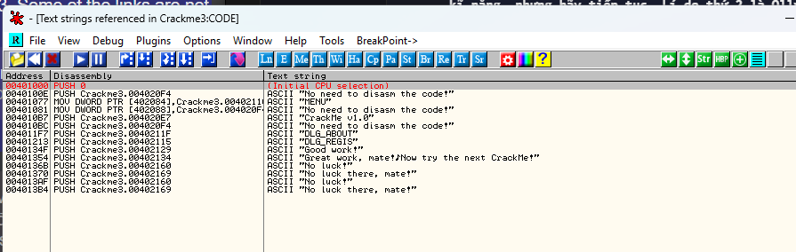

Giờ, ta có thể thấy 1 cái gì đó thú vị ở đây. Có 2 "No luck!" bad boy và chỉ 1 good boy. Nghĩa là, 1 nơi nào đó trong code là 1 kiểm tra và nếu nó không vượt qua, bad boy sẽ hiển thị. Đây là 1 kỹ thuật rất phổ biến trong chống đảo ngược : tạo 1 vị trí rõ ràng cho thông điệp tốt/xấu, nhưng sau đó thêm 1  kiểm tra khác không quá rõ ràng. Nếu ta chỉ nhìn vào cửa sổ code, nơi thông điệp tốt và xấu, ta sẽ để ý rằng xâu "No luck!" được tải tại địa chỉ  40136B, đó không phải cái ta tìm, nháy đúp vào cái còn lại tại địa chỉ 4013AF

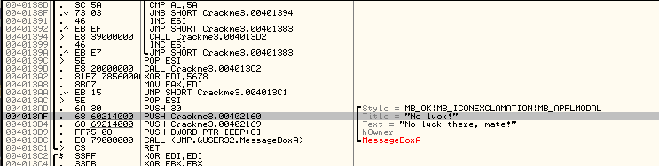

Bad boy này hoằn toàn nằm ở 1 phần hoàn toàn khác của bộ nhớ chương trình. Và ta nghĩ rằng crackme này dễ dàng. Tìm đoạn compare/jump. Trong trường hợp có 1 JMP tại địa chỉ 4013AA, khi nhấp vào, Olly hiển thị 1 mũi tên đi qua bad boy. Thử đặt BP vào lệnh JMP đó và khởi động lại ứng dụng và chạy

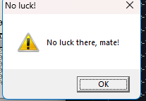

Nó vẫn ra. Vì vậy phải đào sâu hơn. Ta sẽ đọc code và cố hiểu điều gì đang diễn ra.

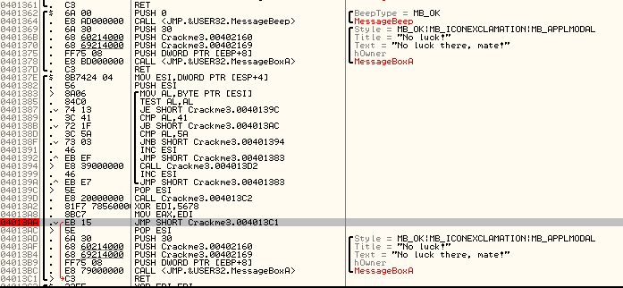

Bắt đầu trong hàm này, có một vòng lặp đầu tiên kiểm tra xem AL có là 0(TEST AL,AL), sau đó quay vòng qua, so AL với 1 cặp số(41,5a), ở giữa chúng sẽ 1 số bước nhảy tùy thuộc vào giá trị của AL. Trước hết, ta hãy xem bước nhảy nào thực sự gọi bad boy(vì có 1 lệnh JMP trước bad noy, không gì có thể qua nó, vì vậy 1 cái gì đó phải nhảy qua trước bước nhảy và chạy badboy. Nơi có khả năng nhất là địa chỉ 4013AC

Chuột phải vào lệnh đầu tiên của thông điệp badboy messageBoxA tại địa chỉ 4013AC, click chuột chọn Find References to -> Selected Address. Khi click vào dòng, có 1 mũi tên đỏ hiện ra, cho thấy lệnh nào gọi nó, nhưng ta biết rằng không có lệnh nào trong crackme gọi thông điệp badboy. Tìm tham chiếu giúp chúng ta xác định chỉ 1. Cửa sổ tham chiếu :

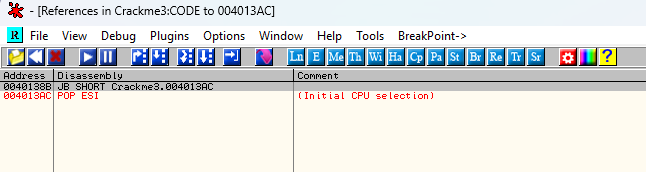

Click đúp vào dòng đầu và sẽ biết dòng nào gọi badboy.

Vậy là 1 vòng lặp. Lưu ý rằng bên cạnh dòng màu đỏ trong cửa sổ tham chiếu, chỉ có 1 tham chiếu đến cái địa chỉ này, vì vậy có thể yên tâm rằng dòng này tại địa chỉ 40138B là code duy nhất gọi cái badboy này. Vì vậy bây giờ, ta xác định "JB SHORT 4013AC" tại địa chỉ 40138B là thủ phạm. Đặt 1 BP tại 40138B và thay đổi nó nhanh chóng để xem có thể vượt qua badboy này không. Đặt 1 BP tại 40138B và chạy lại app

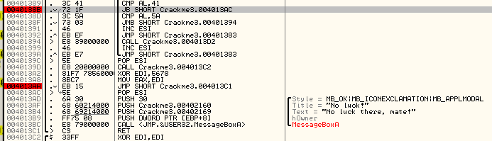

Vì mũi tên xám, ta biết rằng, ta sẽ không nhảy đến badboy trong vòng lặp này, F9 1 lần nữa để chuyển qua vòng lặp 1 lần nữa.

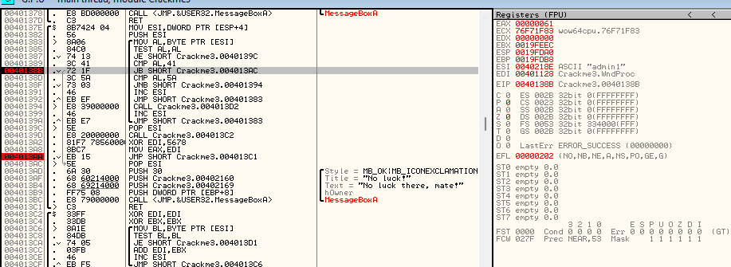

Lần thứ 2 thông qua vòng lặp, nó sẽ gọi badboy ngay. Ta sẽ ngăn chặn nó. Để xem có đúng hướng không. Ta để ý rằng nếu đổi cờ ZF, bước nhảy vẫn chạy, vì đây là lệnh JB là 1 phần của tập lệnh nhảy hơi khác, dùng cờ carry thay vì cờ zero. Nháy đúp vào cờ C mũi tên sẽ sang màu xám

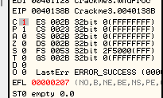

Giờ chạy vòng lặp một lần nữa xem badboy có được gọi trong vòng lặp không. Ấn F9 nhiều lần và không lần nào gọi badboy.

Điều này có nghĩa là ta đã vượt qua pha kiểm tra đầu tiên của badboy và giờ sẽ qua đến lượt kiểm tra của ta. Hãy vá lại kiểm tra đầu tiên kia để khỏi cần phải lo lắng về nó nhằm để tập trung vào cái kiểm tra chính. Quay lại 40138B và nghĩ cách  vá nó nhằm để không nhảy tới badboy. Nhớ rằng, jump được gọi 2 lần thông qua vòng lặp và chỉ khi AL dưới 41(lệnh CMP AL,31, JB SHORT 4013AC). Vì vậy điều ta cần làm chỉ đơn giản là NOP cái jump này. Sau đó nó sẽ không bao giờ jump và ta không cần lo nó jump tới badboy.

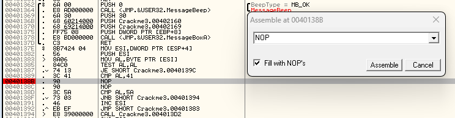

Chuột phải, chọn "Copy to executable" -> "All modifications". Thao tác này sẽ mở cửa sổ bộ nhớ mới. Nhấp chuột phải vào cửa sổ và chọn "Save file" và lưu nó là Crackme_patch1.exe

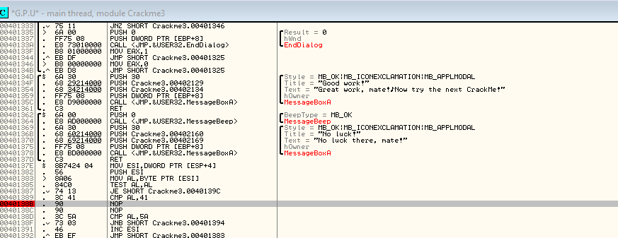

Trước khi ta reload lại bản vá mới, ta cần nhận ra rằng tất cả các bản vá, bình luận và đặc biệt là BP sẽ bị xóa vởi vì tất cả chúng là thông tin được lưu trong UDD file CCrackme3.udd. Ta đang mở Crackme3_patch1 cái mà không có file UDD liên kết với nó. Nhưng có 1 vài tin tốt. Đi kèm với việc tải xuống này là plugin  quản lí điểm ngắt. Nếu ta thực sự muốn, cpu nó vào trong tệp plugin và khởi động lại Olly. Nếu ta thực sự tải nó ngay từ đầu, ta đã tải nó rồi. Mở cửa sổ BP, click chuột phải chọn "Breakpoint manager" -> "Export Breakpoints"

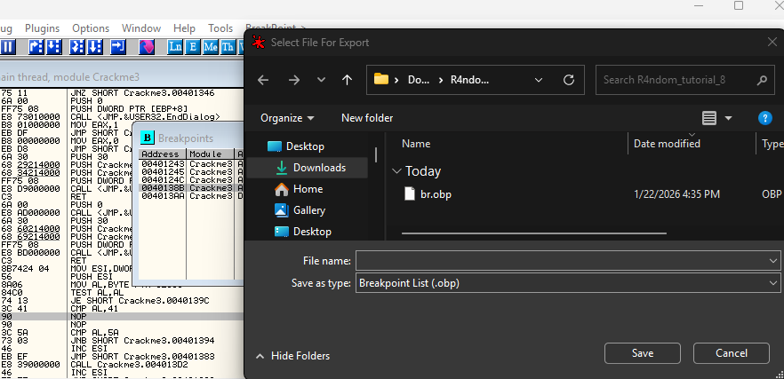

Lưu tệp vì chúng ta sẽ tải nó trong tệp mới. Reload lại bản vá vào trong Olly. Nó sẽ bật ra cửa sổ thông báo về các điểm ngắt bị hỏng.

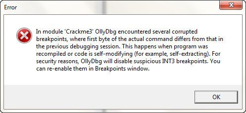

Chỉ cần nhấp OK. Mở cửa sổ BP trong chương trình bản vá và có thể tất cả các BP sẽ biến mất. Click chuột phải, chọn "Breakpoint Manager" -> "Import breakpoints"

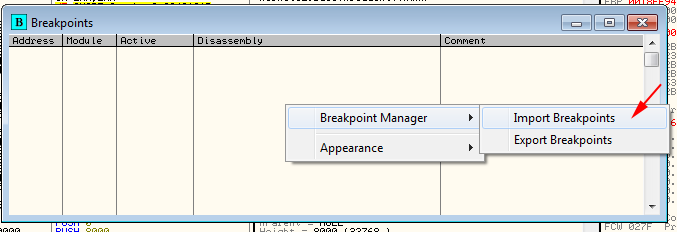

Giờ ta sẽ thấy những BP ban đầu của ta trở lại 

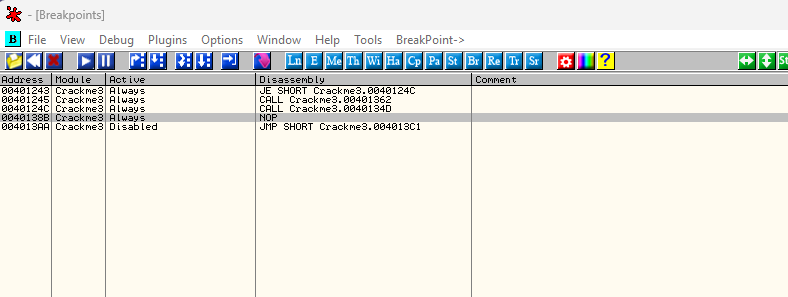

Chạy app và Olly sẽ dừng ở BP đầu tiên ở địa chỉ 401243, lệnh JE

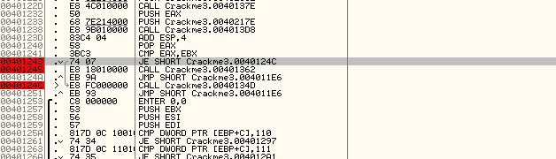

Giờ, nhớ lại, nếu ta nhìn vào mũi tên màu xám đi từ dòng tạm dừng xuống dòng 40124C, bởi vì nó đang màu xám, nó sẽ không được chạy. Ta cũng thâyys giữa cửa sổ disassembly và cửa sổ dump và nó nói cho ta rằng "jump is NOT taken" :

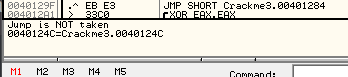

Điều này có nghĩa là, nếu không làm gì, chương trình sẽ không tự nhiên nhảy đến pha call thứ 2, và sẽ nhảy vào pha call đầu. Pha call jump đầu nhảy đến thông điệp badboy, vì thế ta thực sự không muốn nó xảy ra. Ấn F8 1 lần để bước. Vì Olly đã nói với ta, ta sẽ không nhảy và ta đang gọi thông điệp xấu. Ấn F7 để nhảy vào pha gọi và ta sẽ đến lệnh đầu tiên của thông điệp xấu. Giờ, nếu ấn F9 để chạy Olly, ta sẽ nhìn ra chính xác gì ta đã nhận ra:

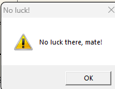

Hãy xem ta có thể khắc phục điều này không. Khởi động lại app, ấn F9 để chạy, chọn "Help" -> "Register" và nhập tên, seri. Giờ, khi ta click Ok Olly dừng 1 lần nữa ở BP đầu tiên.

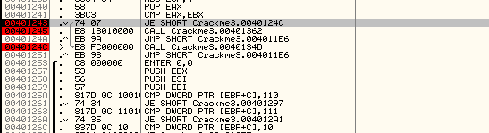

Lần này, hãy giúp Olly đi đúng hướng. Nhìn qua cửa sổ Registers và để ý rằng cờ Z đang màu đỏ, giờ thì ta biết là phải làm gì rồi đó:

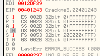

ĐĐểys rằng, mũi tên đang màu xám, hiện ra rằng cú nhảy sẽ không được thực hiện, giờ đã chuyển sang màu đỏ, và vùng giữa cửa sổ disassembly và dump chuyển thành "Jump will be taken". Những gì ta làm là nói cho Olly rằng đổi cờ mà nó dùng  để xác định xem 2 thứ có giống nhau không, để nó nghĩ rằng chúng giống nhau. Bây giờ, ta sẽ nhảy vượt qua thông điệp xấu và gọi thông điệp tốt.

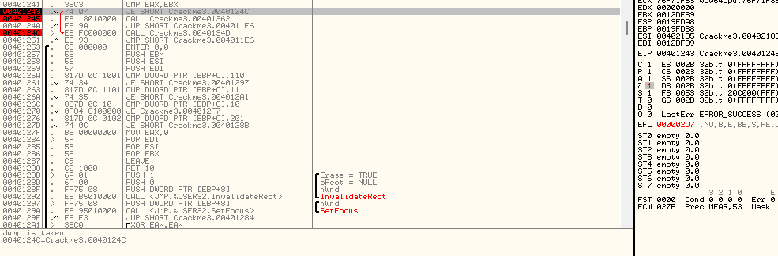

Hãy thử nó. Nhấn F8 để tạo cú nhảy và ấn F7 để bước vào cuộc gọi. Ta sẽ nhảy sang phần đầu của thông điệp tốt :

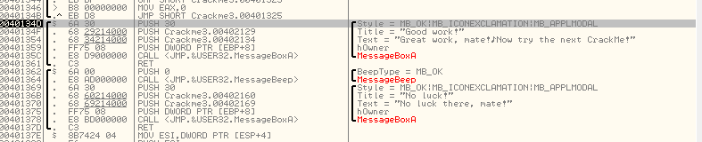

Ấn F8 2 lần, nhìn cửa sổ ngăn xếp mỗi lần click. Ta sẽ thấy các tham số của MessageBoxA được đẩy vào ngăn xếp, trong trường hợp này thực sự là 1 thông điệp tốt. Ngay khi ta bước qua pha gọi hàm ở địa chỉ 40135C, hộp thoại thông điệp hiện ra. Ta đã bẻ khóa được chương trình

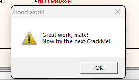

Giờ vấn đề là vì chúng ta đã đổi cờ 1 cách nhanh chóng, khi app chạy lần nữa, nó sẽ không đổi cờ đó nưa, vì thế ta sẽ nhảy đến thông điệp xấu. Điều ta cần làm là bằng cách nào đó lưu lại thay đổi nhằm để mỗi lần chương trình chạy, ta có thể buộc nó nhảy. Đây là lúc bản vá xuất hiện. Làm tương tự như ta làm trước đó. Đánh dấu các dòng thay đổi trong đó, chuột phải và chọn "copy to executable". Chuổi phải vào cửa sổ hiện ra và chọn "Save file". Chọn tên và đây sẽ là bản vá của ta.

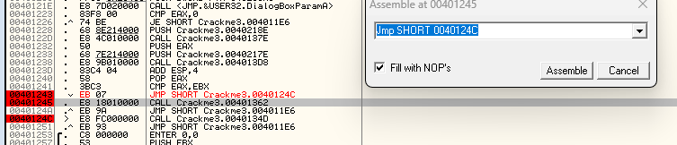

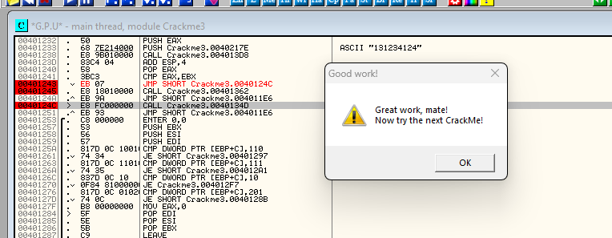

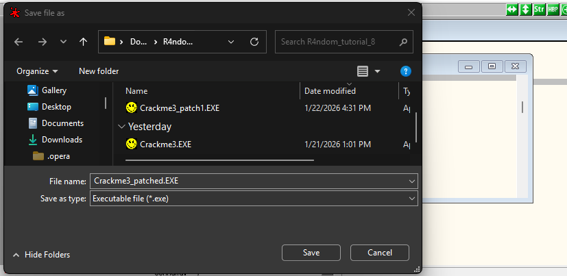

Tốt rồi. Ta đã bẻ khóa được 1 crackme với thực sự một vài thách thức trong đó.