# Introduction to Windows Messaging

Trong bài hướng dẫn này, ta sẽ tìm hiểu về các thông điệp Windows và các thủ tục xử lý chúng. Trong hầu hết các chương trình, ngoại trừ ứng dụng viết bằng Visual Basic, .NET hoặc Java - các tác vụ đều được thực hiện qua cơ chế gọi lại (callback) dựa trên cơ chế thông điệp. Điều này có nghĩa là khác với thời kì lập trình DOS xưa kia, khi phát triển ứng dụng trên Windows, ta chỉ cần thiết lập cửa sổ với các tùy chọn cấu hình, hình ảnh bitmap, mục menu và các thành phần khác mà ta muốn hiển thị, sau đó tạo một vòng lặp để chương trình chạy liên tục cho đến khi kết thúc. Vòng lặp này chỉ có 1 nhiệm vụ duy nhất: Nhận một thông điệp từ Windows và chuyển nó đến hàm callback của ứng dụng. Những thông điệp này có thể là bất kỳ thao tác nào - từ việc di chuyển con chuột, nhấn 1 nút, đến việc nhấn biểu tượng X để đóng ứng dụng. Khi phát triển một ứng dụng, ta sẽ thiết lập vòng lặp vô tận này trong thủ tục WinMain, đồng thời cung cấp 1 địa chỉ gọi hàm - chính là hàm callback - để xử lý mỗi khi có thông điệp đến. Vòng lặp này sau đó sẽ chuyển các tin nhắn nhận được đến hàm callback thông qua địa chỉ mà chúng ta cung cấp; tại hàm callback này, ta sẽ quyết định xem có cần xử lý thông điệp cụ thể nào đó hay không hoặc để hệ điều hành xử lý thay

Ví dụ, chúng ta có thể hiển thị một hộp thoại đơn giản chứa thông báo cảnh báo và một nút OK. Điều duy nhất chúng ta quan tâm là thông báo xác nhận rằng nút OK đã được nhấp. Ta không cần biết người dùng  có di chuyển cửa sổ không(thông điệp WM_MOVE) hay nhấp vào bất kỳ vị trí nào trong cửa sổ của chúng ta ngoài vùng nút OK(thông điệp WM_MOUSEBUTTONDOWN). Tuy nhiên chỉ khi nhận được thông báo rằng nút OK được nhấp, ta mới cần thận hiện một hành động nào đó. Tất cả các thông báo mà chúng ta không cần xử lý đều do hệ điều hành Windows tự động xử lý thay. Đối với những thông điệp àm chúng ta thực sự muốn xử lý, ta chỉ cần ghi đè cơ chế mặc định của Windows và thực hiện các thao tác cần thiết

Thủ tục Main dùng để khởi tạo các cửa sổ và chứa vòng lặp gọi là WinMain; còn hàm callback thì thường được gọi là WndProc nếu là cửa sổ hoặc DlgProc nếu là hộp thoại - tuy nhiên, các tên này có thể là bất kỳ tên nào tùy ý

# Loading the App

Tải tập tin Crackme12.exe vào Olly và xem xét:

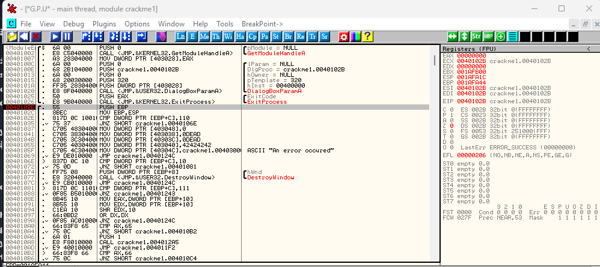

Dưới đây là hình ảnh của 1 ứng dụng tiêu chuẩn viết bằng C hoặc C++, khi sử dụng hộp thoại làm cửa sổ chính của chương trình

__Nếu chương trình sử dụng một cửa sổ thông thường thay vì hộp thoại, giao diện sẽ có ngoại hình khác biệt - xem phần bên dưới__

Hãy để ý các đối số được đẩy vào ngăn xếp và lời gọi hàm DialogBoxParamA. Thao tác này sẽ thiết lập một hộp thoại để làm cửa sổ chính của chương trình(Khác với cửa sổ thông thường), tuy nhiên ta không cần quá chú trọng vào các chi tiết kỹ thuật - vì thực tế thì điều này không ảnh hưởng nhiều đến chức năng chương trình. Khi tra cứu tài liệu về DialogBoxParamA, ta có thể thấy :

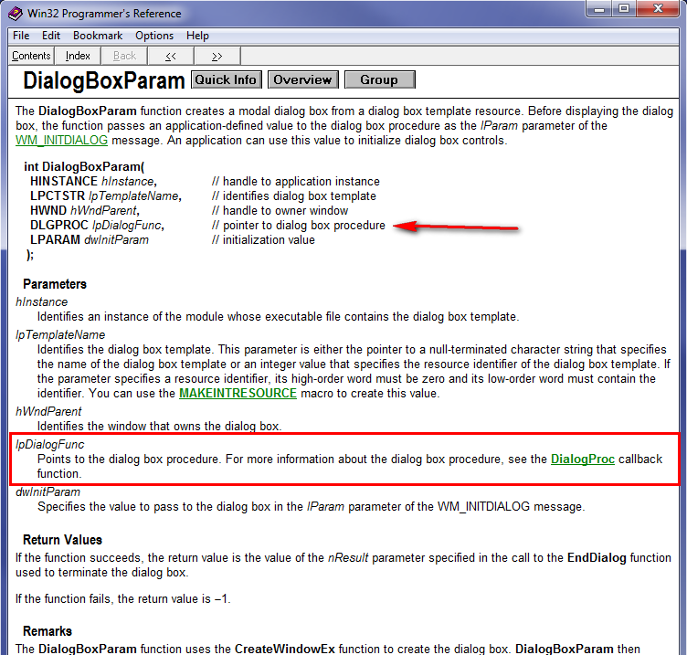

Với mục đích của ta, yếu tố quan trọng nhất trong cuộc gọi này chính là địa chỉ cảu DLGPROC - đây là địa chỉ của hàm callback trong ứng dụng của chúng ta, hàm này sẽ xử lý toàn bộ các thông điệp Windows. Nhìn lại đoạn phân tích mã máy (disassembly), chúng ta có thể dễ dàng nhận ra địa chỉ này :

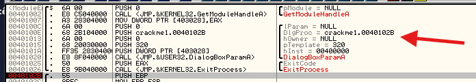

Trong trường hợp này, mã là 40102B. Cùng đến đó và xem như nào

# Main Dialog Callback Message

Ở đây ta có thể bắt đầu nhận ra dấu hiệu khởi đầu của hiện tượng này

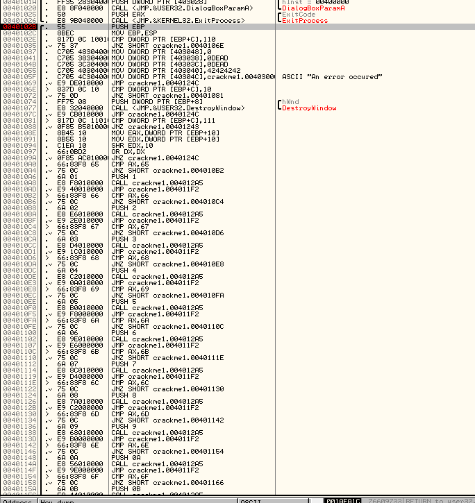

Đây là một hàm DlgProc có vẻ nhìn khá thông thường. Thông thường, nó chỉ là 1 cấu trúc switch rất lớn, tuy nhiên khi được dịch sang mã assembly, nó trở thành một chuỗi các lệnh if/then rất dài. Nếu ta đọc bài hướng dẫn trước đó, đoạn mã này sẽ trông quen thuộc, điểm khác là trong trường hợp này, Olly sẽ không thể nhận diện các nhãn Case(ví dụ : Case 113(WM_TIMER))

Thủ tục này ở đây cho 1 mục đích duy nhất để xử lý các thông điệp từ Windows mà chúng ta muốn phản hồi. Nếu quan sát kĩ, ta sẽ thấy 1 loạt các câu lệnh so sánh và nhảy được gửi đến. Các lệnh này dùng để kiểm tra từng đoạn mã với thông điệp ID mà Windows được gửi đến. Nếu mã hiện tại khớp với các điều kiện so sánh trên, mã sẽ được thực thi. Ngược lại nếu thông  có đoạn mã nào khớp sau toàn bộ quá trình so sánh , thông báo sẽ được chuyển tiếp về hệ điều hành Windows để xử lý tiếp

Hãy xem kĩ hơn 1 chút về quy trình này. Có thể mở và chạy ứng dụng

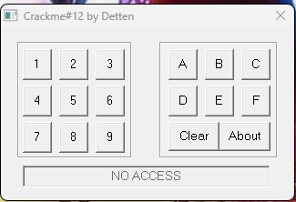

Đây là 1 phần mềm crackme cự kỳ kì lạ. Ta có thể tự do thử nghiệm với nó. Ta sẽ nhận thấy rằng ta có thể tiếp tục nhấn các nút và không có điều gì xảy ra, mặc dù nó có 1 nút clear. Dường như chương trình đang yêu cầu nhập vào 1 mã xác nhận cụ thể, trừ khi ta nhập, nếu không ứng dụng sẽ không làm gì

Giờ hãy đặt 1 BP ở điểm bắt đầu của khối mã DlgProc ở địa chỉ 40102B và khởi động lại app, vì vậy ta có thể xem thông điệp được gửi đến

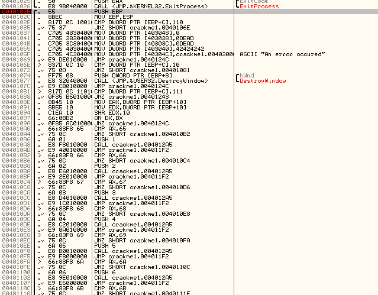

Ngay khi ta khởi động app, ta sẽ ngay lập tức dừng ở BP. Ta sẽ để ý rằng sau 1 vài hướng dẫn ban đầu, ta sẽ bắt đầu phép so sánh đầu tiên

```asm
40102E  CMP [ARG.2], 110
40102E CMP [ARG. 2], 110
```

Nếu ta tra ID 110 trong danh sách các thông điệp Windows đi kèm với tệp tải xuống của bài hướng dẫn, ta sẽ thấy 110 chính là mã tương ứng với hàm InitDialog

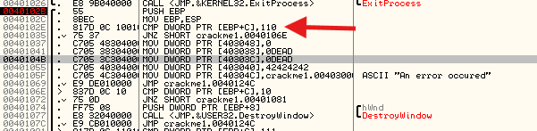

Thông điệp này tạo điều kiện để ứng dụng của ta khởi tạo 1 số thành phần cần thiết. Nếu ta tiếp tục xử lý và thông điệp hiện ra INITDIALOG, hệ thống sẽ tự động chuyển sang các lệnh bắt đầu từ địa chỉ 401037

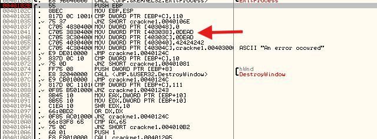

Nhìn xuống cá khu vực thông tin, ta có thể sẽ thấy rằng ARG.2 không phải 110 mà là 30

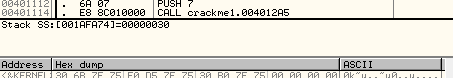

Ở trong biểu đồ của ta, giá trị 30 là mã thông điệp để thiết lập kiểu chữ. Như vậy đây chính là thông điệp đầu tiên mà hệ điều hành Windows gửi đi

Lần so sánh tiếp theo là với 10, trong bảng tra cứu thông điệp của ta, giá trị này tương ứng với WM_CLOSE

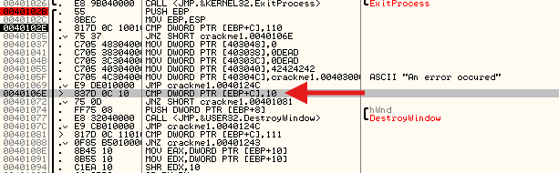

Vì vậy khi nút đóng bị bấm vào, code này sẽ được thực thi. Lệnh so sánh tiếp theo là với 111 tương ứng WM_COMMAND

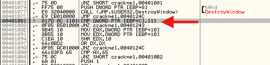

WM_COMMAND là 1 mã thông điệp tổng hợp dùng để đại diện cho nhiều loại thông điệp Windows, thường liên quan đến các thành phần tài nguyên như việc nhấp nút, chọn menu hoặc nhấp vào biểu tượng trên thanh công cụ. Ngoài thông điệp WM_COMMAND, một giá trị nguyên thứ hai còn được gửi trong trường ARG.3 - trường này giúp làm rõ thêm nội dung của thông điệp. Ví dụ khi nhấp vào 1 nút, 1 thông điệp WM_COMMAND sẽ được gửi đến và tham số ARG.3 có thể chứa ID của nút đó. Trong trường hợp ta đang sử dụng 1 phần mềm vẽ tự do, ARG.3 có thể chứa tọa độ X và Y cảu vị trí con trỏ chuột tại thời điểm đó

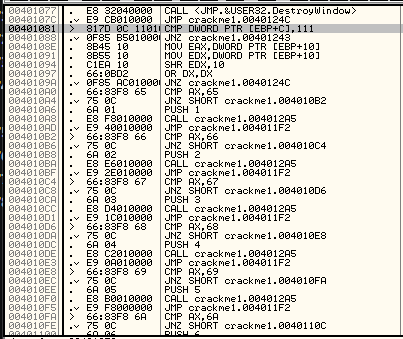

Khi xem xét kỹ lưỡng, ta có thể thấy WM_COMMAND là thông điệp duy nhất(hoặc chính xác hơn là tập hợp các thông điệp, vì mỗi WM_COMMAND có thể thuộc một loại khác) mà thủ tục này xử lý. Nếu ta thực hiện từng bước single step trong quá trình debug, ta sẽ nhận thấy rằng không có bất kỳ đoạn mã nào được thực thi cho thông điệp hiện tại của chúng ta - WM_SETFONT và chúng đơn giản là trả về kết quả tại cuối thủ tục. Hành động này thông báo cho Windows rằng chúng ta muốn hệ thống Windows tự xử lý thông điệp này thi vì do chính chúng ta xử lý

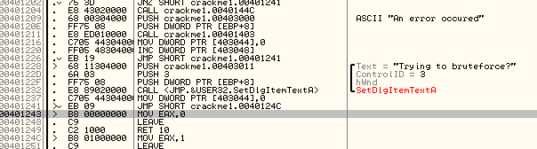

Khi ấn nút RUN một lần nữa, chương trình sẽ tạm dừng tại thông điệp tiếp theo

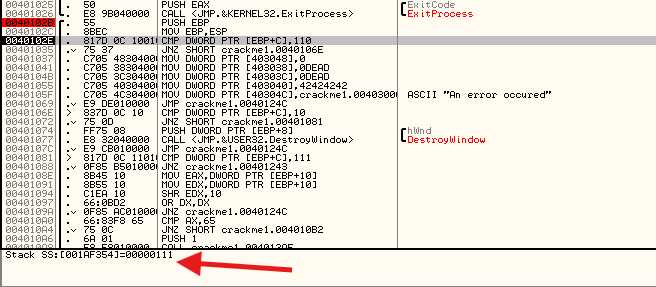

Lần này, ta thấy rằng đây là thông điệp WM_COMMAND. Khi đi sâuu vào đoạn mã so sánh tại địa chỉ 401081 - nơi kiểm tra loại tin nhắn này, ta có thể xem xét kỹ hơn về hàm xử lý WM_COMMAND

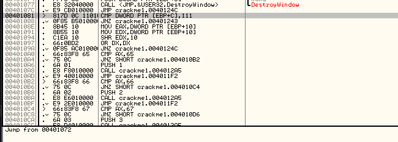

Khi chạy lại ứng dụng, ta một lần nữa dừng tại BP. Lần này có thể thấy rằng hệ thống đang xử lý 1 thông điệp WM_INITDIALOG

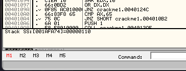

Vì vậy, ta thực thi một vài dòng mã ở phần đầu tiên, những dòng này là một phần của quá trình khởi tạo hộp thoại

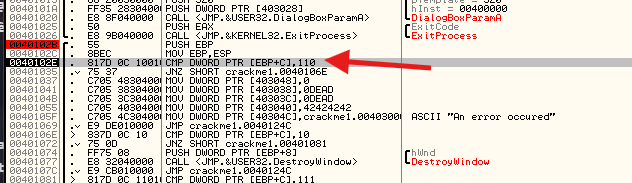

Trong bài này, đoạn mã dưới đây đặc biệt quan trọng. Ta có thể thấy một số giá nguyên được lưu vaof bộ nhớ bắt đầu từ địa chỉ 403038(các giá trị này được truy xuất theo thứ tự không liên tục và 403038 là địa chỉ thấp nhất trong đó). Trước tiên, hiển thị vùng nhớ này lên cửa sổ dump

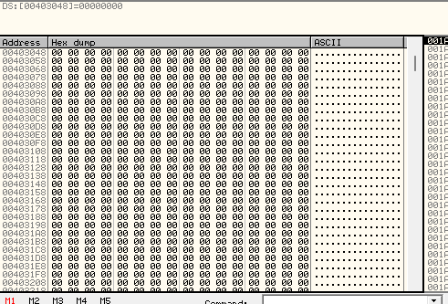

Và ta sẽ thấy rằng biến này được khởi tạo bằng giá trị 0 trước khi thực thi các dòng lệnh này. Tiếp theo, hãy thực hiện lệnh Step Over với lệnh MOV đầu tiên, ta sẽ không thấy bất kỳ thay đổi nào hiển thị ngay lập tức, nhưung một giá trị 0 được sao chép vào ô nhớ địa chỉ 403048. Khi thực hiện Step Over đối với lệnh tiếp theo, ta có thể quan sát các tác động thực sự xảy ra

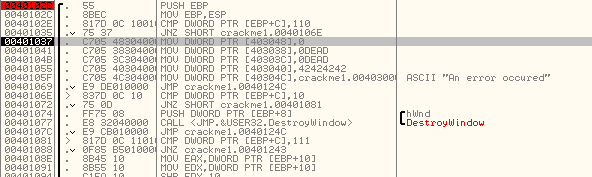

Và ở đây, ta có thể thấy giá trị 0xDEAD đã được sao chép vào bộ nhớ theo thứ tự little endian

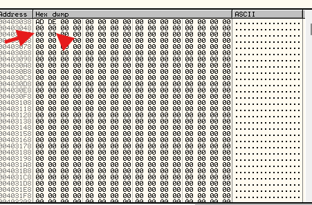

Step over dòng lệnh tiếp cũng tương tự, nhưng tại địa chỉ 40303C

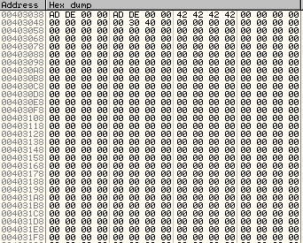

Việc những từ này được viết dưới dạng hex là một dấu hiệu quá rõ ràng, cho thấy nó có vai trò then chốt. Tiếp theo, giá trị 42 được copy ra 4 lần ở địa chỉ 403040. Ta có thể thấy giá trị tương ứng với "B" ở trong khu vực ASCII

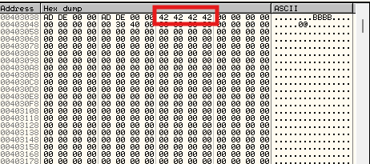

Cuối cùng giá trị số nguyên 403000 được sao chép vào địa chỉ 40304C - điều mà Olly có thể nhận diện là 1 con trỏ đến đoạn mã hoặc dữ liệu bắt đầu từ địa chỉ 403000(little endian)

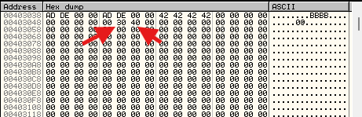

Cuối cùng, ta nhảy ngay đến cuối chuỗi rồi quay lại, chờ đón tin nhắn tiếp theo được gửi đến

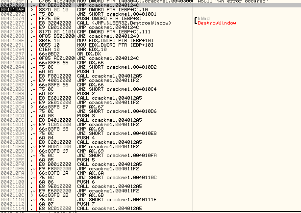

Nhấp F9 thêm vài lần nữa(10), sẽ thấy cửa sổ main dialog được tạo ra

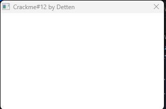

Điều thú vị bắt đầu ở đây: mỗi khi nhấn F9, khoảng 6 lần, một nội dung mới lại xuất hiện trong hộp thoại - điều này xảy ra do hệ thống nhận được 1 thông điệp yêu cầu vẽ tài nguyên tương ứng trên màn hình. Thông điệp tiếp theo có giá trị là 135, tương ứng WM_CTLCOLORBUTTON

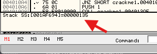

vẽ một nút vào cửa sổ:

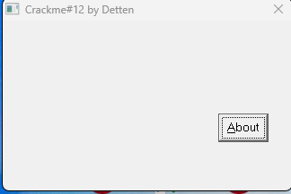

Tiếp theo là nút có chữ số 2

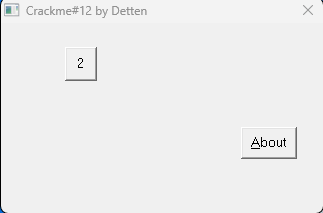

Tại thời điểm này, khi ta nhấp vào F9, ta sẽ thực sự thấy hộp thoại được hình thành từng bước, lần lượt xuất hiện các nút. Điều thú vị là ta có thể quan sát tất cả các thông điệp được nhận và tra cứu chúng trong bảng tra cứu. Ta sẽ thaays rất nhiều thông điệp được truyền đến. Gần cuối, nhãn sẽ được vẽ vở phần dưới cùng và dòng chữ "No access" sẽ được hiển thị lên nhãn đó. Như vậy, cửa sổ sẽ được hoàn tất. Phải nhấn F9 tầm 35 lần thì mới xuất hiện đầy đủ cửa sổ

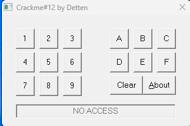

Giờ đây, ta có thể thấy rõ cách hộp thoại được tạo ra. Trước tiên ta có thể thiết lập các yếu tố cơ bản của hộp thoại và ta cũng truyền 1 con trỏ(địa chỉ) tới hàm callback cái mà sẽ xử lý tất cả thông điệp tử Windows. Windows sẽ gửi  1 tập  các thông điệp, 1 cái 1 lần, với callback này, đưa cho ta cơ hội để chạy code với mỗi thông điệp nếu ta muốn. Sau khi hộp thoại dựng xong, Windows sẽ rơi vào một vòng lặp nội bộ, cứ đứng yên đó và chờ ta thực hiện một thao tác nào đó. Ngay sau khi ta làm gì đó, 1 thông điệp được gửi tới callback với ID phù hợp cho hành động cái mà đang diễn ra. Ta có thể quyết định hành động theo thông báo này hoặc bỏ qua nó và để Windows tự xử lý

Điểm cuối cùng mà ta sẽ nhận thấy là: nếu ứng dụng đang được thực thi trong Olly, chỉ cần di chuột qua cửa sổ là Olly sẽ dừng tại điểm bắt đầu của hàm xử lý tại điểm bắt đầu của hàm xử lý thông điệp  khi nhận được 1 thông điệp mới. Windows đang thông báo cho hàm xử lý của chúng ta rằng chuột đã được di chuyển trên cửa sổ. Nói cách khác, bất kỳ thao tác nào ta thực hiện trên hộp thoại này đều sẽ gửi thông điệp đến hàm xử lý của chúng ta

# Homework

1. Hãy thử tìm hiểu xem điều gì xảy ra sau khi nhấp vào 1 nút, đặc biệt là ảnh hưởng đến nội dung bộ nhớ bắt đầu từ địa chỉ 403038. Các nút khác nhau có thực hiện các thao tác khác nhau không ? Ta có thể bắt đầu hiểu được mã nguồn đang thay đổi các vị trí bộ nhớ này hay không ?

___Trả lời:___ Có ảnh hưởng, cụ thể, khi bấm nút gì đó, xem vùng dump của các ô nhớ 403048, các ô nhớ bên dưới đều có sự thay đổi

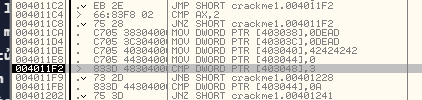

Cụ thể là thấy ô 403044 có tăng giá trị lên 1 với 1 lần bấm, còn những ô còn lại có giá trị khác nhau

2. Hãy đoán xem mật khẩu dài bao nhiêu kí tự

___Trả lời:___ Có thể thấy phần code bên dưới giống như 1 hàm for gì đó, có tăng giá trị của 403044 lên 1, như vậy có thể hiểu đây giống như biến counter. Vậy có thể ngầm ngầm đoán đây là giống kiểu biến để so sánh số lượng gì đó.

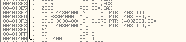

Và đặc biệt sau khi đếm 1 lần thì nó quay trở lại so sánh với giá trị 0xA : 

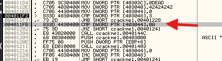

Như vậy có thể đoán password dài _10_ kí tự