Bài này sẽ tìm hiểu về mã tự sửa đổi và phá bản nhị phân này

# Understanding The App

Sau khi tìm hiểu cách hoạt động của callback xử lý các thông điệp. Ta sẽ tận dụng điều này để giải mã phần mềm crackme này. Có thể thấy ứng dụng này chỉ xử lý 3 loại thông điệp 110(INITDIALOG), 10(DESTROY_WINDOW) và 111(COMMAND), mọi thông điệp khác thì bỏ qua. Ta đã quan sát đoạn xử lý sự kiện khởi tạo cửa sổ(init dialog) và không cần quá quan tâm đến đoạn mã xử lý sự kiện đóng cửa sổ(destroy window) vì nó chỉ được gọi khi người dùng đóng ứng dụng. Do đó mọi hoạt động đáng chú ý đều diễn ra trong phần xử lý thông điệp WM_COMMAND. Vì thế hãy tạm dừng Olly ở đoạn mã này. Bỏ BP cũ, thiết lập BP mới tại địa chỉ 40108E hoặc đặt sau lệnh so sánh/nhảy(compare/jump) dành cho ID 111

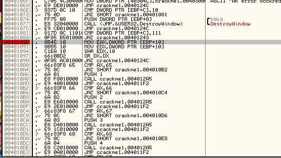

và khởi động app. Ta sẽ để ý rằng nếu ta di chuột trên cái cửa sổ, thay đổi kích thước cửa sổ, di chuyển cửa sổ hoặc bất cứ thao tác nào không liên quan đến việc nhấp vào nút nào, Olly vẫn tiếp tục chạy vì tất cả các thông điệp này đều bị bỏ qua. Giờ hãy click thử 1 nút, nút "1". Olly sẽ tạm dừng tại điểm BP của ta. Ta cũng sẽ thấy rằng biến ARG.3 đang chứa giá trị "65"

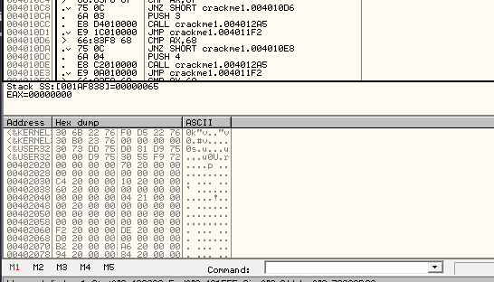

Nếu ta mở tệp crackme trong Resource Hacker và mở cửa sổ main dialog, ta sẽ thấy rằng giá trị 65(tương đương 101 trong hệ thập phân) chính là mã ID của nút "1"

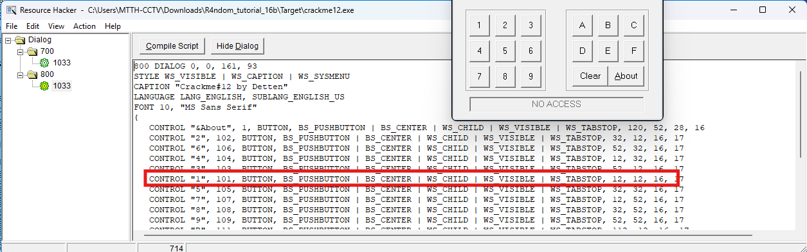

Đây chính là ID có trong ARG.3. Thực chất đây chỉ là ID của nút bấm thôi. Vì vậy, khi xuống vài dpmhf ,ã, ta sẽ thấy phép so sánh bắt đầu được thực hiện, cụ thể là so sánh ID được gửi kèm thông điệp này với các ID đã được hardcode trong app.

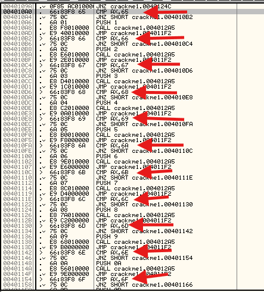

Nhìn tổng thể, mục đích của phần mã này là kiểm tra mã định danh(ID) này với tất cả các mã định danh có thể có, khi tìm thấy sự trùng khớp, nó sẽ gọi đến một đoạn mã xử lý nút tương ứng. Lưu ý rằng, ngay trước khi thực hiện lời gọi, một hía trị sẽ được đẩy vào ngăn xếp, cụ thể là giá trị 1 cho 0x65, giá trị 2 cho 0x66,... Vì tất cả lời gọi đều nhắm đến cùng một  địa chỉ, rõ ràng là đoạn mã ở phần này sẽ xác định nút nào được nhấn dựa trên giá trị trên ngăn xếp, cụ thể là 1 tương ứng với nút 1, 2 tương ứng với nút 2,...Vì vậy hãy thực hiện step từng bước 1 cho đến khi gọi hàm, sau đó step in và kiểm tra xem có gì

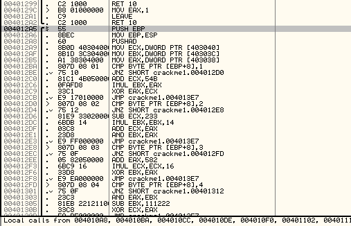

Giờ thì đã vào trọng tâm. Sau khi thiết lập xong ngăn xếp, ta bắt đầu truy cập các vị trí bố nhớ y hệt như vị trí đã được truy cập trong WM_INITDIALOG cụ thể là bắt đầu từ địa chỉ 403038. Vì vậy, mở phần này trong dump để có được một cơ sở tham chiếu rõ ràng.

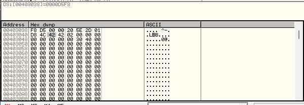

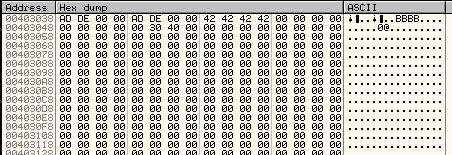

Chúng ta có thể thấy có 2 lần chuỗi "DEAD" cùng với các giá trị 0x42 và địa chỉ 403000. Khi thực hiện từng bước step, trước tiên ta thấy các giá trị 0x42 được chuyển vào thanh ghi ECX, còn 2 giá trị 0xDEAD thì được chuyển vào thanh ghi EBX và EAX

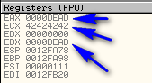

Tiếp theo, ta sẽ thực hiện một loạt phép so sánh để xác định nút nào được nhấn, dựa trên giá trị được đẩy trên ngăn xếp __SS:[EBP+8]__ đang truy cập trực tiếp vào giá trị được đẩy này. Vì chúng ta đã nhấn vào nút đầu tiên, hệ thống sẽ thực hiện tập lệnh đầu tiên

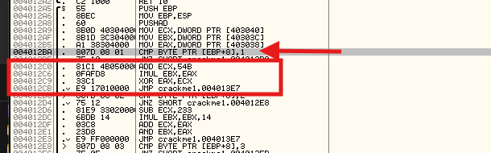

___Một điều cần lưu ý là: tác giả đã thực sự gặp phải nhiều trở ngại hơn mức cần thiết. Ông ấy hoàn toàn có thể đơn giản là truyền giá trị ARG.3, ID của nút và so sánh các ID trong phần này thay vì phải đẩy một giá trị khác vào ngăn xếp rồi mới thực hiện so sánh. Có vẻ là tác giả đang muốn làm khó vì điều này sẽ khó đọc hơn___

Bước đầu tiên, ta sẽ cộng giá trị 0x54B vào thanh ghi ECX(42424242), kết quả thu được là 4242478D. Tiếp theo, ta nhân giá trị trong thanh ghi EAX với giá trị trong thanh ghi EBX(tức là 0xDEAD nhân với 0xDEAD), thu được kết quả là C1B080E9. Cuối cùng, ta thực hiện phép XOR giữa thanh ghi ECX và thanh ghi EAX, sau đó nhảy đến địa chỉ 4013E7. Sau khi thực hiện lệnh nhảy, chương trình sẽ tiếp tục thi hành tại vị trí này:

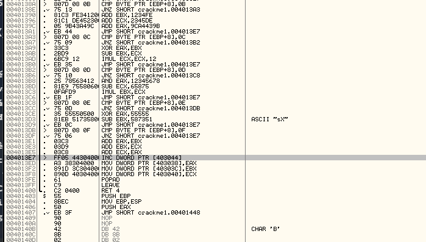

Đây là phần cuối cùng của phương pháp này. Nếu ta cuộn lên trên và xem lại, ta sẽ thấy rằng, cơ bản tất cả các nút đều thực hiện cùng 1 thao tác : thêm 1 giá trị, thực hiện phép XOR với 1 giá trị, rồi nhảy đến cuối chương trình. Điểm khác biệt duy nhất giữa chúng là các giá trị được sử dụng. Sau đó ở phần kết thúc, ta tăng giá trị tại ô nhớ 403044(ban đầu là 0) và có thể coi đây là một biến đếm. Tiếp theo, ta ghi lại các giá trị mới của ECX, EBX và EAX vào chính ô nhớ mà ta đã đọc trước đó. Sau khi trở về, ta quay lại hàm chính:

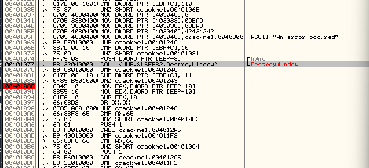

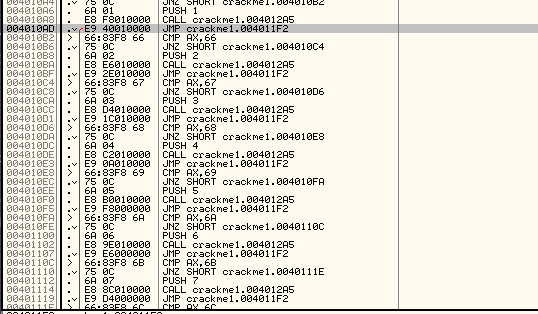

Rồi thực hiện lệnh nhảy đến địa chỉ 4011F2

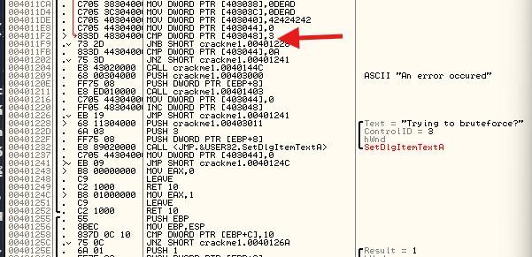

Tiếp theo, ta sẽ so sánh giá trị tại địa chỉ bộ nhớ 403048(mà giá trị này là 0) với số 3(chưa rõ tại sao) sau đó so sánh giá trị của biến đếm tại địa chỉ 403044 với giá trị 0x0A. Lại một lần nữa, điều này cho thấy rằng ô nhớ 403044 chứa một biến đếm có chưucs năng đếm đến 0x0A. Nếu giá trị này không bằng 0x0A, chương trình này sẽ thực hiện lệnh nhảy, điều này cho thấy vòng lặp sẽ được thực thi đúng 10 lần trước khi tiếp tục thực thi các lệnh tiếp theo. Ta cũng có thể đã để ý đến cái lệnh JNB tại địa chỉ 4011F9, lệnh này sẽ  dẫn đến đoạn mã xử lý thông điệp theo phương pháp brute-force. Rõ ràng là vị trí 403048 sẽ có một bộ đếm nào đó bên trong và nếu giá trị này vượt quá 3, hệ thống sẽ hiển thị thông báo tấn công kiểu brute-force

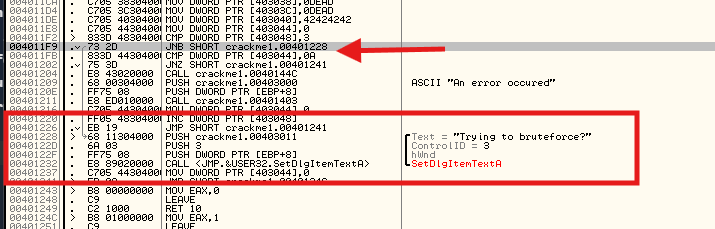

Tiếp theo, hãy tiếp tục chạy chương trình và nhấn nút số 2. Sau đó, ta sẽ tạm dừng tại điểm BP của mình :

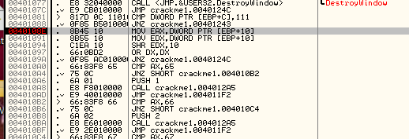

ARG.3 và đổi lại, các thanh ghi EAX và EDX sẽ chứa giá trị ID của nút số 2, tương ứng với 0x66

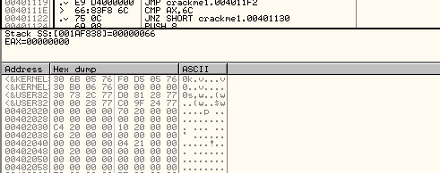

Điều đó có nghĩa là chúng ta sẽ thực thi đoạn mã liên quan đến nút số 2 ngay sau đây :

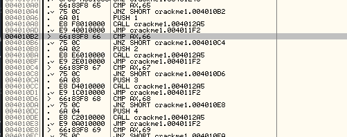

Khi nhảy vào điểm gọi tại 4010BA, ta thực hiện lại chính những bước như lần đầu tiên, chỉ có 2 điểm khác biệt 

1) Bộ nhớ lúc này sẽ không còn chứa các giá trị 0xDEAD và 42424242 nữa mà thay vào đó là các giá trị đã được điều chỉnh
2) Do ta nhấp vào nút thứ 2, nên lần này chúng ta sẽ thực thi đoạn mã tại địa chỉ 4012D6, đoạn mã này sẽ thực hiện các thao tác như SUB ECX,233 và IMUL EBX, EBX, 14,... Say đó, chúng ta nhảy lại trở về cuối chương trình con :

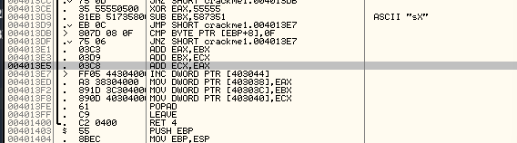

Tại đây, ta tăng giá trị biến đếm tại địa chỉ 403044, sau đó đưa các biến mới trở lại đúng vị trí bộ nhớ tương ứng và quay lại vòng lặp chính. Việc thực hiện bước nhảy sẽ đưa chương trình đến cuối vòng lặp chính 

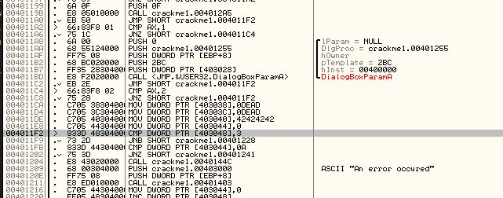

Ở đây, ta so sánh giá trị 403048(vẫn bằng 0) và thực hiện nhảy đến đoạn mã xử lí theo phương pháp brute-force nếu giá trị này lớn hơn 3. Đồng thời ta cũng so sánh giá trị 403044 với 0A và nhảy đến mã lỗi nếu ID của chúng ta lớn hơn giá trị này. Sau đó chương trình sẽ thoát khỏi vòng lặp chính và quay lại vòng lặp của Windows, nơi đang chờ ta thực hiện một thao tác nào đó.

# Cracking the App

Giờ ta đã hiểu rõ cách thức hoạt động của ứng dụng, chúng ta hãy tiến hành vá lỗi. Với ứng dụng này, ta cần vận dụng một chút trực giác. Bằng cách theo dõi toàn bộ luồng thực thi của ứng dụng, ta có thể thấy rằng số lượng lệnh so sánh hay lệnh nhảy nằm ngoài luồng điều khiển thông thường là không nhiều. Thực tế, những đoạn mã duy nhất mà chúng ta quan sát được gồm : một lệnh nhảy đến đoạn mã xử lý thông điệp brute force tại địa chỉ 4011F9, một lệnh nhảy đến hộp thoại "About" nếu tất cả các phép so sánh từ địa chỉ 4010B2 đến 4011A6 đều không thỏa mãn; một lệnh nhảy đến đoạn mã "xóa" tại địa chỉ 4011CA, đoạn mã này đặt lại các vị trí nhớ về giá trị 0xDEAD và 42424242 và một trường hợp rơi tự do vào đoạn mã hiển thị thông báo lỗi tịa địa chỉ 401204. Nếu ta nhấp vào nút "About" và theo dõi luồng thư thi mã, ta sẽ thấy rằng chức năng này chỉ hiển thị hộp thoại About rồi quay vòng lặp chính của chương trình. Việc thực hiện tương tự với nút "Xóa" cũng cho kết quả như vậy. Do đó chúng ta chỉ còn 2 khả năng : hoặc là brute-force hoặc là error code

Đây chính là lúc mà 1 chút trực giác sẽ phát huy tác dụng. Mỗi lần chúng ta kiểm tra ô nhớ địa chỉ 403048 để xác định xem có nên thực hiện nhảy đến đoạn mã xử lý theo phương pháp brute force hay không thù giá trị này đều bằng 0, do đó lệnh nhảy chưa từng được thực hiện. Tuy nhiên, thao tác so sánh tại địa chỉ 4011FB lại so sánh giá trị của bộ đếm nằm ở địa chỉ 403044 và lệnh nhảy sẽ được thực hiện khi giá trị đạt đến 0x0A. Ngoài ra, ta biết rằng mỗi lần lặp vòng lặp, giá trị tại ô nhớ 403044 đều được tăng lên một đơn vị, vì vậy có thể suy ra rằng bộ đếm này chính là công cụ đếm số lần nhất nút mà người dùng đã thực hiện

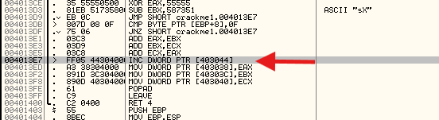

Tất nhiên, suy nghĩ đầu tiên ta nghĩ đến là : "Ừ thì, nhưng đoạn mã này lại gây ra thông báo lỗi". Nhưng thực sự có như vậy không? Thực tế, toàn bộ đoạn mã này chỉ là tải một con trỏ đến một thông điệp thông báo rằng đã xảy ra lỗi - nhưng thông điệp đó có được hiển thị ra màn hình hay không ? Trong đoạn mã này thì không... nên có thể nó hoàn toàn không được hiển thị. Đoạn mã này trông rất đáng ngờ, vì vậy sẽ đi từng bước để phân tích. Ta biết rằng, chỉ khi nhất ít nhất 0x0A(10) nút thì mới thục thi đến đoạn mã này. Vậy hãy đặt 1 điểm ngắt BP tại địa chỉ 401204, xóa các điểm ngắt khác, sau đó khởi động lại ứng dụng để có thể đếm được 10 lần nhấn nút

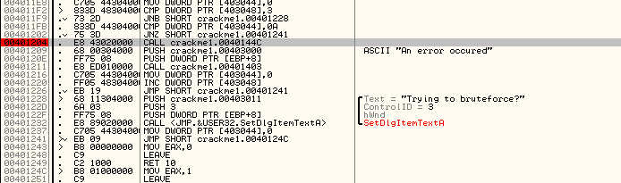

Giờ đây, sau khi nhấn 10 lần nút(cụ thể là ấn 1 10 lần), ta cần tạm dừng tại điểm BP của mình. Trước tiên, chương trình sẽ  sẽ thực hiện 1 lời gọi đến địa chỉ 40144C. Nhấp vào lời gọi xem nó thực hiện gì

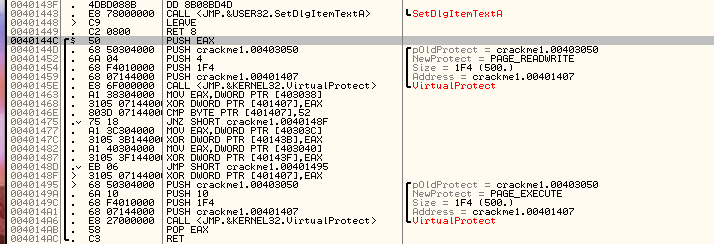

Đoạn mã này trước tiên thực hiện các bước thiết lập ban đầu, sau đó gọi hàm VirtualProtect. Sau khi tìm hiểu thông tin về VirtualProtect, ta sẽ thấy rằng hàm này chủ yếu được dùng để thay đổi các thuộc tính của một vùng nhớ nhất định. Ví dụ phần trong tệp nhị phân chứa mã thực thi thường được thường được thiết lập với thuộc tính cho phép thực thi nhưng không cho phép ghi dữ liệu bởi vì việc ghi dữ liệu vào phần mã là không cần thiết vì mục đích đó vốn thuộc về phần dữ liệu. Nếu ta muốn thay đổi 1 phần của khối mã để nó không chỉ có quyền thực thi mà còn có quyền ghi thì ta có thể sử dụng hàm này. Sau đó, ta có thể ghi dữ liệu vào khu vực bộ nhớ này, từ đó thực sự thay đổi mã chương trình theo thời gian thực. Đây chính là cơ chế hoạt động cảu mã tự điều chỉnh, nó gọi hàm VirtualProtect đối với một phần bộ nhớ trong khu vực mã, thêm thuộc tính có thể ghi, sau đó thay đổi mã(VD thực hiện phép XOR với 1 giá trị số), rồi gọi lại VirtualProtect để khôi phục thuộc tính về chỉ cho phép thưucj thi. Như vậy mã chương trình đã được thay đổi ngay lập tức trong quá trình thực thi

Có vẻ ứng dụng này đang thực hiện thao tác tương tự. Tham số cuối cùng được truyền vào hàm VirtualProtect là địa chỉ bộ nhớ mà ta muốn thay đổi thuộc tính, còn giá trị thứ 3 là độ dài của đoạn bộ nhớ cần thai đổi, tính theo byte. Trong trường hợp này, ta thấy địa chỉ bắt đầu là 401407 và độ dài là 0x1F4(tương đương 500byte). Ngoài ra, tham số thứ 2 là PAGE_READWRITE, điều này cho phép đoạn bộ nhớ này vừa có thể đọc được vừa có thể ghi dữ liệu. Hãy cùng xem xét đoạn bộ nhớ này, bắt đàu từ địa chỉ 401407 để xem điều gì sẽ thay đổi

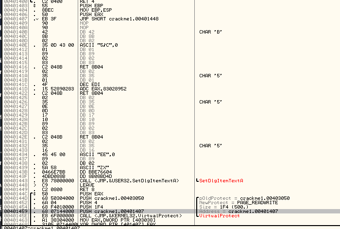

Nó trông thực sự đáng nghi. Nó không giống như 1 đoạn code. Hãy thử đi tiếp và xem app thay đổi những gì trong đoạn nhớ này. Bỏ qua lời gọi VirtualProtect

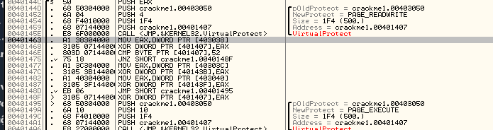

Bây giờ, bước đầu tiên chúng ta thực hiện là chuyển nội dung từ ô nhớ 403038 vào thanh ghi EAX, sau đó thực hiện phép XOR với ô nhớ 401407 và lưu kết quả trở lại ô nhớ 401407. Khoan! Ô nhớ 401407 chính là địa chỉ đầu tiên cảu vùng nhớ mà chúng ta đã thay đổi thuộc tính để có thể ghi dữ liệu vào đó. Còn ô nhớ 403038 ban đầu có giá trị 0xDEAD, nhưng giá trị này đã được thay đổi tùy theo các phím mà ta nhấn và thứ tự nhấn chúng. Vì vậy dãy lệnh này đang thay đổi không ain bộ nhớ dựa trên các phím được nhấn và thứ tự nhấn của chúng. Hãy thực hiện từng bước step over cho đén khi gặp lệnh JNZ tại địa chỉ 401475 sau đó ta sẽ xem xét địa chỉ 401407

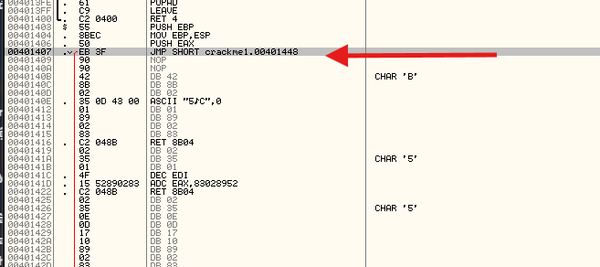

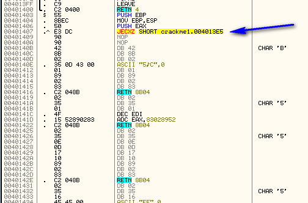

Ta sẽ thấy rằng địa chỉ 401407 đã được thay đổi và hiện tại chứa 1 lệnh hợp lệ JECXZ SHORT crackme1.004013E5. Ứng dụng này vừa tự động thêm 1 lệnh nhảy có điều kiện vào chính mã nguồn của nó. Cách thực hiện đieeuf này là bằng cách thay đổi các mã lệnh (opcode) tức là dữ liệu thô tại một dịa chỉ bộ nhớ cụ thể. Quay lại lệnh hiện hành, bước tiếp theo là so sánh byte đầu tiên tại địa chỉ 401407 với giá trị 0x52 và thực hiện nhảy đến địa chỉ 40148F nếu 2 giá trị không bằng nhau. Nhìn vào hình ảnh ở trên, ta thấy giá trị opcode tại địa chỉ 401407 là E3, rõ ràng không bằng 52, do đó chương trình sẽ thực hiện lệnh nhảy. Lệnh nhảy này chuyển sang một đoạn mã khác và thực hiện lại lời gọi VirtualProtect, lần này nhằm khóa lại toàn bộ phần bộ nhớ về chế độ có thể thực thi được

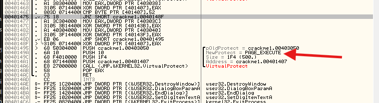

Tuy nhiên trước đó, ta có thể đã nhận thấy rằng ô nhớ 401407 đã được thực hiện phép XOR một lần nữa tại địa chỉ 40148F. Khi xem lại ô nhớ 401407, chúng ta thấy rằng giá trị tại đây đã được thay đổi thêm một lần nữa:

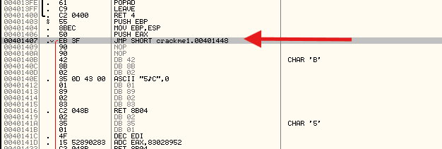

Vì vậy, hiện tại ta có một lệnh JMP thay vì lệnh JECXZ. Thực chất ứng dụng này chỉ đơn giản đã thay đổi nội dung vùng nhớ của chính nó 2 lần : lần đầu để chuyển thành lệnh JECXZ và lần thứ 2 để chuyển thành lệnh JMP. Sau khi tiếp tục thực hiện từng bước, ta quay lại vòng lặp chính.

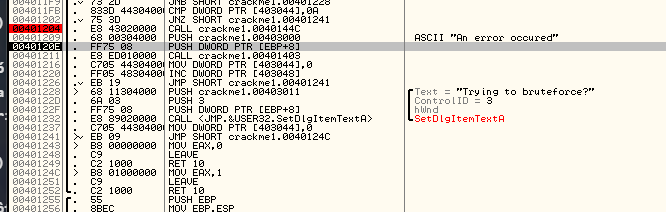

Sau đó, ta đẩy giá trị F08E2 vào ngăn xếp và gọi 1 thủ tục khác tại địa chỉ 401403. Khi đi vào thực thi thủ tục này, ta thấy rằng hàm đó như sau:

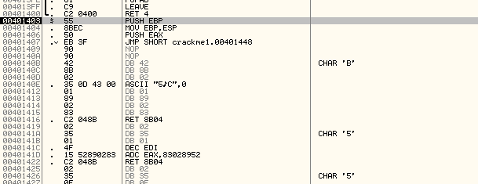

Ta đã chuyển sang vùng nhớ mà ứng dụng đã thay đổi. Ta nhận thấy một lệnh JMP mới xuất hiện tại địa chỉ 401407. Nhảy vào lệnh JMP và xem ta sẽ đi đến đâu

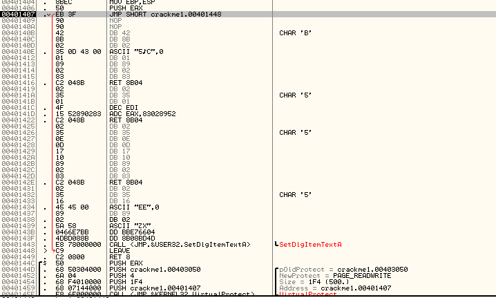

Thật kì lạ, chương trình lại đột ngột chuyển về phần trả về. Như vậy có vẻ như đoạn mã này thực sự chẳng làm được điều gì cả. Hiện tại, ta đã trở lại chương trình chính

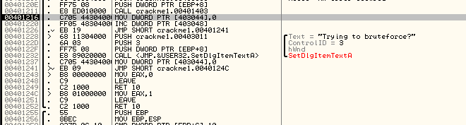

Bước tiếp theo, ta sẽ đặt lại giá trị bộ đếm từ 0x0A về không, sau đó tăng bộ đếm này lên một đơn vị để thực hiện kiểm tra kiểu bruteforce. Giờ đây, ta đã hiểu rõ cơ chế hoạt động của kiểm tra bruteforce: nếu ta nhập mã gồm 10 chữ số (sai) quá 3 lần, giá trị tại ô nhớ 403048 sẽ lớn hơn 3 và hệ thống sẽ chuyển sang hiển thị thông báo bruteforce. Nếu muốn thử, ta có thể làm ngay : chỉ cần gỡ bỏ điểm ngắt (BP) tại địa chỉ 401204, sau đó nhập mã 10 chữ số này 3 lần

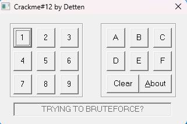

Và chúng ta nhận được thông điệp như mong đợi

Giờ đây hãy đảm bảo điểm ngắt (BP) của chúng ta vẫn được đặt tại địa chỉ 401204(và xóa tất cả các điểm ngắt khác), sau đó khởi động lại ứng dụng. Chúng ta phải khởi động lại ứng dụng và mỗi khi nhập thông điệp bruteforce, bộ đếm sẽ bị đặt về 0. Ta có nhận ra điều này không ?

Như vậy, những gì ta đã biết cho đến nay :

1) Mật khẩu là 10 chữ số
2) Nếu ta nhập sai mã quá 3 lần, ta sẽ nhận được thông báo bruteforce và phải khởi động lại app
3) Mỗi lần ta nhấn 1 nút, các ô nhớ 403038, 40303C và 403040 sẽ được thay đổi theo một cách thức riêng biệt tùy theo từng nút được nhấn
4) Sau khi nhấn 10 phím, hệ thống sẽ thực hiện một số lần gọi gàm để kiểm tra mã của ta và thay đổi lệnh nhảy trong phần mã của chương trình nằm tại địa chỉ 401407 trong bộ nhớ
5) Nếu mật khẩu không chính xác, nhảy điều kiện được tạo ra sẽ dẫn đến một lệnh trở về khiến chương trình quay lại vòng lặp chính
6) Do đó, việc nhập đúng mật khẩu phải khiến lệnh nhảy này được thay thế bằng một thao tác khác hoặc là chuyển sang một vị trí bộ nhớ khác nơi biến goodboy sẽ được định nghĩa, hoặc là thay đổi thêm nhiều đoạn mã trong khu vực này để trực tiếp tạo ra biến goodboy tại vị trí bộ nhớ hiện tại, thay vì thực hiện một lệnh nhảy. Phương án thứ 2 có vẻ hợp lý hơn nhiều: nếu chỉ đơn thuần thay bằng một lệnh nhảy đến một địa chỉ mới, thì những đoạn mã kỳ lạ và không hoạt động này tồn tại để làm gì

Với những hiểu biết trên, ta nhận ra rằng cần phải tập trung phân tích chính xác vào đoạn mã thực hiện các thay đổi tự động chỉnh sửa bản thân, cụ thể là đoạn mã bắt đầu từ địa chỉ 40144C. Hãy cùng xem lại đoạn mã này một lần nữa

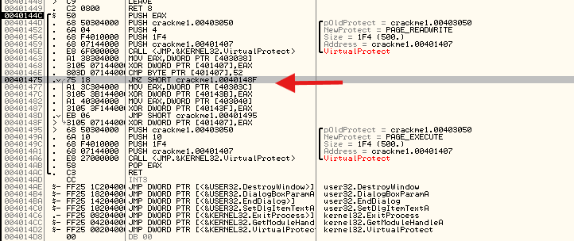

Một điều chúng ta có thể rút ra là việc so sánh với giá trị 0x52 tại địa chỉ 40146E có ý nghĩa rất quan trọng. Thực chất, đây là cách chương trình xác nhận rằng những thay đổi đã thực hiện trên mã nguồn là đúng đắn. Nhưng opcode 0x52 thực sự có ý nghĩa gì? Opcode 0x52 tương ứng với lệnh _PUSH EDX_. Do đó, đoạn mã này sẽ kiểm tra xem lệnh đầu tiên có phải là "PUSH EDX" hay không, nếu không phải, chương trình sẽ gặp lỗi và ngừng hoạt động. Vậy ta cố tình thay thế lệnh đó thành PUSH EDX thì sẽ xảy ra điều gì. Đặt 1 điểm ngắt tại địa chỉ 40146E, nơi mã chương trình kiểm tra lệnh push rồi thực thi ứng dụng. Khi chương trình dừng tại điểm ngắt này, hãy chuyển đến địa chỉ 401407 và thay đổi giá trị đó thành 0x52

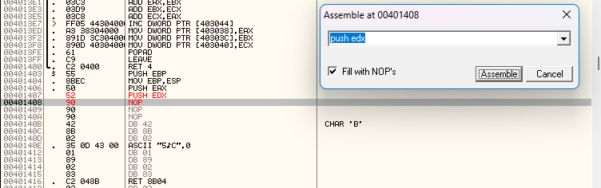

Tiếp theo, trong chế độ thực thi từng lệnh(single stepping), ta cần loại bỏ từng lệnh JNZ tại điểm kiểm tra 0x52

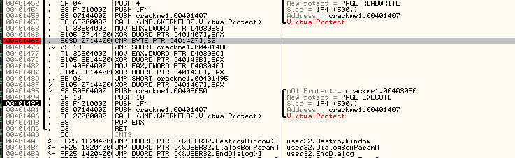

Hiện tại, đoạn mã sẽ chuyển giá trị tại địa chỉ 40303C vào thanh ghi EAX, sau đó thực hiện phép XOR giữa giá trị này và dữ liệu tại địa chỉ 40143B. Vậy địa chỉ 40143B là gì? Hãy cùng xem xét kĩ hơn

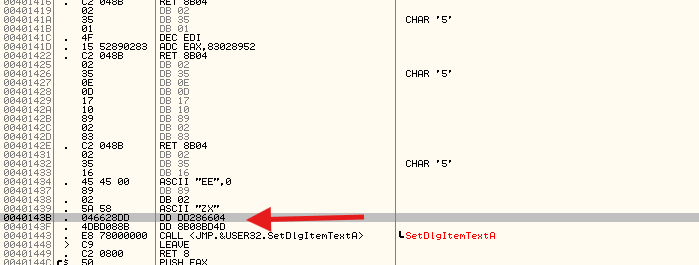

Có thể thấy, đây chỉ là một địa chỉ bộ nhớ nằm ở cuối phần mã tự sửa đổi của chương trình. Sau khi thực hiện phép XOR với địa chỉ này, ta thu được kết quả sau

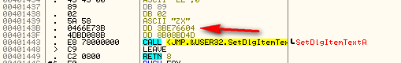

Sau đó, ta thay đổi giá trị tại địa chỉ 40143F bằng cách thực hiện phép XOR giữa địa chỉ này với nội dung tại địa chỉ 403040

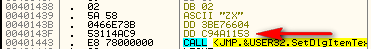

Hiện tại ta đã biết rằng các địa chỉ này không được chuyển đổi thành mã đúng đắn, do đó chúng thực sự không giúp ích được gì. Tuy nhiên, vì đây là thao tác cuối cùng mà ứng dụng thực hiện trước khi kết thúc nên nó chắc chắn phải có ý nghĩa quan trọng. Tiếp tục phân tích, sau khi đã thay đổi lệnh PUSH EDX, ddeer xem đoạn mã này thực hiện chức năng gì. Tiếp theo, hãy quay lại vòng lặp chính, sau đó đi sau vào lời gọi tại địa chỉ 401211

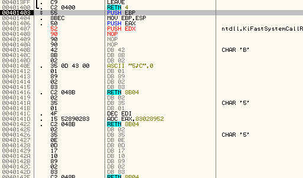

Hiện tại, ta đang ở phần đầu của đoạn mã tự điều chỉnh, bắt đầu từ lệnh PUSH EDX mà chúng ta vừa thêm vào. Hãy thông báo cho Olly rằng tình hình đã thay đổi và yêu cầu nó phân tích lại đoạn mã này

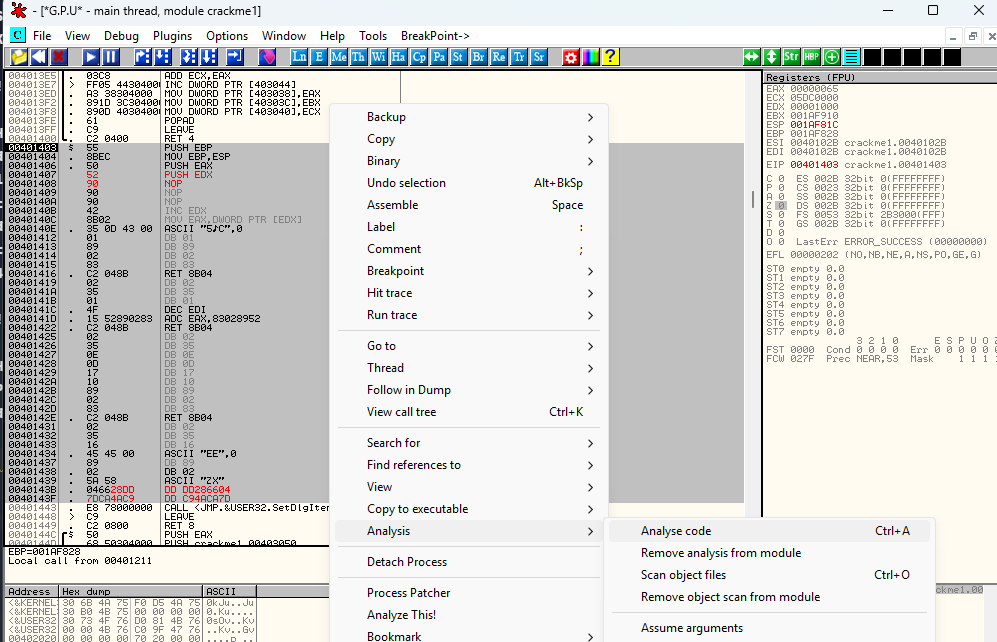

Và mọi thứ bắt đầu trông trở nên khả quan hơn nhiều:

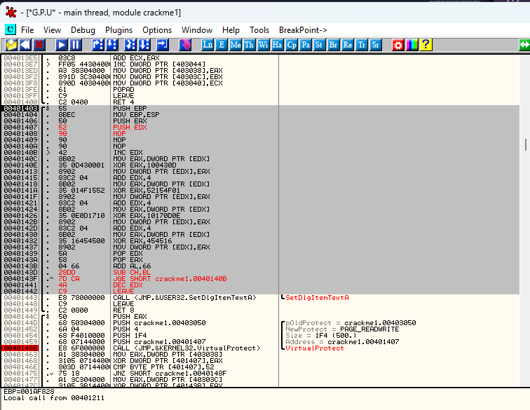

Giờ đây, nó trông như một đoạn mã thực sự. Trừ phần cuối cùng mà ta viết sai ra

Giờ đây, chính là phần mà việc phân tích trở nên phức tạp hơn và kinh nghiệm thực tế sẽ hữu ích. Ta cần xem xét đoạn mã này dưới góc nhìn tổng thể và tự hỏi: "Đoạn mã này nhằm thực hiện điều gì?" Ban đầu, ta thấy lệnh PUSH EDX. Lệnh này, kết hợp với lệnh POP EDX ở cuối đoạn mã, cho thấy rằng EDX sẽ chỉ được sử dụng trong phạm vi cục bộ của đoạn mã này. Tiếp theo, ta thấy một số vùng nhớ NOPS trống, những vùng này có lẽ nên chứa mã chương trình, dù hiện tại ta vẫn chưa biết đó là mã gì. Sau đó, nhiều địa chỉ bộ nhớ được thực hiện phép XOR với các giá trị DWORD. Dựa trên kinh nghiệm, điều này thường cho thấy chúng đang giải mã 1 dữ liệu nào đó, trong trường hợp này, dữ liệu đó chính là nội dung mà thanh ghi EDX đang trỏ đến. Ta có thể suy ra điều này vì EDX được đẩy(PUSH) vào ngăn xếp và sau đó không được gán giá trị mới, mặc dù sau đó vẫn bị thay đổi và được truy cập lại. Các NOP có lẽ là vị trí phù hợp để thiết lập giá trị cho EDX và EDX sẽ trỏ đến dữ liệu cần được giải mã hoặc thay đổi bằng các phép toán XOR

Cuối cùng, ta nhận thấy có một số vị trí bộ nhớ bị giải mã sai, bắt đầu từ địa chỉ 40143D. Tuy nhiên, lời gọi hàm SetDlgItemTextA không nằm trong số các vị trí bị sai đó, điều này có nghĩa là lệnh này không bị thay đổi. Thông thường, trước khi gọi hàm SetDlgItemTextA, các tham số sẽ được đẩy vào ngăn xếp, do đó có thể suy ra rằng khi nhập mật khẩu chính xác, các lệnh từ địa chỉ 40143D đến 401442 rất có thể sẽ chứa một số lệnh push(có thể là 3)

Vấn đề là EDX đang trỏ đến đâu? Ta có vài lựa chọn ở đây và một lần nữa, đây chính là lúc kinh nghiệm đóng vai trò then chốt. Lúc này ta nhớ ngay đến chuỗi ký tự "An error occured" và suy nghĩ rằng ta chưa từng sử dụng chuỗi này. Trước đó, ta nhận thấy đây là một chiêu lừa và thực tế không bao giừo được dùng đến. Có lẽ đây chính là nội  dung sẽ được giải mã. Một manh mối khác cho thấy đây là 1 phương án khả thi là chuỗi này được đẩy vào ngăn xếp nhưng lại không bao giờ được sử dụng. Vì sao lại vậy? Đây là hình ảnh trạn thái ngắn xếp khi ta thực thi đoạn mã này

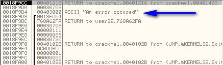

Do đó nếu ta muốn kiểm tra giả thuyết này, chỉ cần làm cho EDX trỏ đến chuỗi kí tự này. Cách đơn giản nhất là gán cho EDX giá trị offset trong bộ nhớ nơi chuỗi "An error occured" được lưu trữ, cụ thể là địa chỉ 403000. Tuy nhiên phương pháp này sẽ chiếm quá nhiều byte. Nhìn lại mã nguồn, ta chỉ có đúng 3 lệnh NOP để tận dụng nhằm gán cho EDX một chuỗi lỗi. Nếu nghĩ ở tư duy lập trình asm và nhớ rằng chuỗi kí tự hiện đang được đẩy lên ngăn xếp thì có lẽ ta có thể tải con trỏ trỏ đến chuỗi đó từ ngăn xếp vào thanh ghi EDX 

Thông thường, ta gán giá trị cho một biến cục bộ bằng một lệnh có dạng như sau:

```
MOV EDX, [EBP + some_#] or MOV EDX, [EBP - some_#]
```

Vấn đề đặt ra là con số đó là bao nhiêu? Bỏ qua một vài lệnh đầu tiên trước tiên và tiếp tục cho đến khi gặp địa chỉ 401408

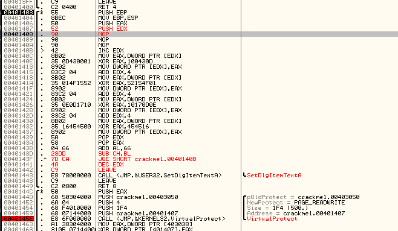

Khi xem lại các thanh ghi, ta thấy rằng EBP trỏ đến địa chỉ 1AF810 và chuỗi lỗi đó nằm cách EBP một khoảng 12 byte về phía trên tức là ở vị trí thấp hơn trên ngăn xếp

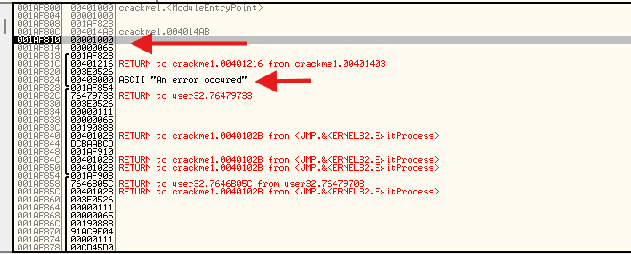

Do đó lệnh của chúng ta dùng để tải con trỏ đến chuỗi lỗi sẽ như sau:

```
MOV EDX, [EBP + 0x0C]
```

Cứ thử xem sao, xem nó cần bao nhiêu byte

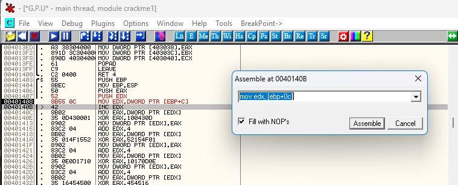

Có vẻ như nó vừa vặn hoàn hảo. Bây giờ hãy thực hiện từng bước 1 để xem điều gì xảy ra. Trước tiên, tại địa chỉ 401408, giá trị của EDX sẽ được gán bằng 1 con trỏ đến chuỗi văn bản của ta

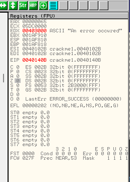

Sau đó giá trị EDX được tăng lên 1 đơn vị, khiến nó trỏ đến ký tự thứ 2 của chuỗi kí tự của ta tức là ký tự n trong cụm từ "An error occured. Bốn byte tương đương với một DWORD được tải vào thanh ghi EAX, bắt đầu từ ký tự "n" trong chuỗi "An error occurred". Tiếp theo, giá trị trong EAX được thực hiện phép XOR với 0100430D, kết quả là EAX thành 073656363. Giá trị mới này sau đó sẽ được ghi vào địa chỉ nơi chuỗi lỗi đang được lưu trữ(tại địa chỉ 403000). Ta có thể quan sát được chuỗi ký tự này trước khi giá trị mới được lưu vào đó.

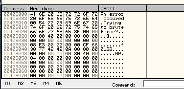

Và sau khi đã được lưu trữ

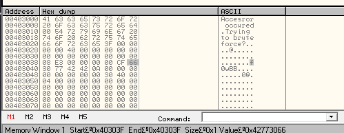

Dường như chuỗi của ta đang bị thay đổi. Tiếp tục thôi

Tiếp theo, ta đọc thêm 4 byte tiếp theo, thực hiện XOR với giá trị 0x52154F01 sau đó ghi kết quả trở lại bộ nhớ, nhờ đó, chuỗi kí tự hiện tại sẽ có dạng như sau:

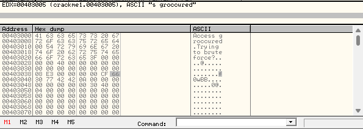

Giờ thì gần vấn đề rồi. Khi thực thi đoạn mã tiếp theo, ta nhận được 4 byte tiếp theo:


Giờ đây, có thể phần nào đoán được nội dung mà nó sẽ hiển thị. Khi di chuyển qua lần chỉnh sửa cuối cùng, toàn bộ chuỗi ký tự sẽ được hiển thị ra.


Ta có thể thấy rằng đã đúng, dù rằng tình hình vẫn chưa thực sự được kiểm soát. Hiện tại, ta đã biết chính xác chuỗi văn bản cần xuất hiện là gì. Vấn đề nằm ở chỗ do ta đã nhập mật khẩu sai và các câu lệnh cuối cùng bị giải mã không chính xác, nên thông điệp của ta sẽ không bao giờ được hiển thị. Điều cần làm là phải xây dựng lại quá trình đẩy các đối số vào ngăn xếp cho hàm SetDlgItemTextA. Khi tra cứu tài liệu về SetDlgItemTextA trong Olly, ta thấy có 3 đối số cần được đẩy vào ngăn xếp(theo thứ tự asm)

```
LPCTSTR lpString     // text to set
int nIDDlgItem,    // identifier of control
HWND hDlg,    // handle of dialog box
```

Điều đầu tiên thì rất đơn giản

__PUSH [EBP + 0x0C]__

Do đây là con trỏ đến chuỗi văn bản mới của chúng ta. Hai tùy chọn thứ 2 và cuối cùng hơi phức tạp. Có một hàm SetGlgItemTextA được gọi khi thông báo bruteforce được hiển thị


Có thể nhận thấy rằng ColtrolID bằng 3 và con trỏ cửa sổ(hamdle) là 707AA. ID điều khiển thì khá đơn giản

__PUSH 3__

Cái này có phần cứng hơn một chút, nhưng nếu xem lại stack thì có vẻ ok:


Handle được đặt chính xác trên stack

__PUSH DWORD PTR[EBP + 8]__

Việc chèn đoạn mã của ta vào lúc này sẽ giúp bản phân tích mã máy này trên nên dễ dàng và dễ đọc hơn


Sau tất cả nổ lực, việc chạy ứng dụng cuối cùng cũng mang lại phần thưởng :


Lưu lại tệp nhị phân sau khi áp dụng các bản vá để giờ nhập bất kì mật khẩu 10 chữ số nào cũng nhận được goodboy. Có thể xem như phá thành công app này

Nhưng sẽ hay ho hơn nếu biết chính xác mật khẩu :)))

# Homewwork

Beginning at location 4012C0, each button dictates various manipulations on the main variables at addresses 402038, 40303C, and 403040. Let’s call these variables a, b and c ( a = 402038, b = 40303C and c = 403040). Can you figure out what each button does to manipulate these three variables? I’ll give you the first one:

4012C0   add ecx, 54Bh   ; c += 54Bh

4012C6   imul ebx, eax     ; b *= a

4012C9   xor eax, ecx    ; a^= c

Now, can you figure out the remaining 14?

Bắt đầu từ vị trí 4012C0, mỗi nút bấm sẽ điều khiển các thao tác khác nhau đối với các biến chính nằm ở các địa chỉ 402038, 40303C và 403040. Chúng ta hãy gọi ba biến này lần lượt là a, b và c (trong đó a = 402038, b = 40303C và c = 403040). Bạn có thể xác định được mỗi nút bấm thực hiện thao tác gì để thay đổi ba biến này không? Tôi sẽ cung cấp thông tin về nút đầu tiên: 

4012C0: add ecx, 54Bh ; c += 54Bh 

4012C6: imul ebx, eax ; b *= a

4012C9: xor eax, ecx ; a ^= c

Giờ thì bạn có thể tìm ra được 14 phần còn lại không?

## Bài làm

___Trả lời:___

1. Nút 1 :

4012C0: add ecx, 54Bh ; c += 54Bh 

4012C6: imul ebx, eax ; b *= a

4012C9: xor eax, ecx ; a ^= c

2. Nút 2:

004012D6  |.  81E9 33020000 SUB ECX,233 ; c-=233h

004012DC  |.  6BDB 14       IMUL EBX,EBX,14 ; b*=14h

004012DF  |.  03C8          ADD ECX,EAX ; c+=a

004012E1  |.  23D8          AND EBX,EAX ; b&=a

3. Nút 3:

004012EE  |.  05 82050000   ADD EAX,582 ; a+=582h

004012F3  |.  6BC9 16       IMUL ECX,ECX,16 ; c*=16h

004012F6  |.  33D8          XOR EBX,EAX ; b^=a

4. Nút 4:

00401303  |.  23C3          AND EAX,EBX ; a&=b

00401305  |.  81EB 22121100 SUB EBX,111222 ; b-=111222h

0040130B  |.  33C8          XOR ECX,EAX ; c^=a 

5. Nút 5:

00401318  |.  99            CDQ ; Tạo ra 1 số nguyên có dấu 64 bit từ EAX, cụ thể sẽ có dạng như sau EDX:EAX, tương đương 2 trường hợp :
+ a dương : EDX = 00000000, EAX = a
+ a âm : EDX = FFFFFFFF, EAX = a

00401319  |.  F7F9          IDIV ECX ; Từ bên trên thì có cái số nguyên EDX:EAX, sau đó lấy số đó gọi tạm là x đi thì sẽ có các phép:
+ EAX = x/ECX
+ EDX = x%ECX

Giá trị ECX giữ nguyên

0040131B  |.  2BDA          SUB EBX,EDX ; b-=d

0040131D  |.  03C1          ADD EAX,ECX ; a+=c

6. Nút 6:

0040132A  XOR EAX,ECX      ; a ^= c

0040132C  AND EBX,EAX      ; b &= a

0040132E  ADD ECX,546879   ; c += 0x546879

7. Nút 7:

0040133F  SUB ECX,25FF5    ; c -= 0x25FF5

00401345  XOR EBX,ECX      ; b ^= c

00401347  ADD EAX,401000   ; a += 0x401000

8. Nút 8:

00401357  XOR EAX,ECX      ; a ^= c

00401359  IMUL EBX,EBX,14  ; b *= 0x14

0040135C  ADD ECX,12589    ; c += 0x12589

9. Nút 9:

0040136D  SUB EAX,542187   ; a -= 0x542187

00401372  SUB EBX,EAX      ; b -= a

00401374  XOR ECX,EAX      ; c ^= a

10. Nút A:

0040137E  CDQ             ; mở rộng dấu EAX thành EDX:EAX

0040137F  IDIV EBX        ; EAX = a / b, EDX = a % b

00401381  ADD EBX,EDX     ; b += số dư

00401383  IMUL EAX,EDX    ; a *= số dư

00401386  XOR ECX,EDX     ; c ^= số dư

11. Nút B:

00401390  ADD EBX,1234FE    ; b += 0x1234FE

00401396  ADD ECX,2345DE    ; c += 0x2345DE

0040139C  ADD EAX,9CA4439B  ; a += 0x9CA4439B

12. Nút C:

004013A9  XOR EAX,EBX      ; a ^= b

004013AB  SUB EBX,ECX      ; b -= c

004013AD  IMUL ECX,ECX,12  ; c *= 0x12

13. Nút D:

004013B8  AND EAX,12345678 ; a &= 0x12345678

004013BD  SUB ECX,65875    ; c -= 0x65875

004013C3  IMUL EBX,ECX     ; b *= c

14. Nút E:

004013CE  XOR EAX,55555    ; a ^= 0x55555

004013D3  SUB EBX,587351   ; b -= 0x587351

15. Nút F:

004013E1  ADD EAX,EBX      ; a += b

004013E3  ADD EBX,ECX      ; b += c

004013E5  ADD ECX,EAX      ; c += a

