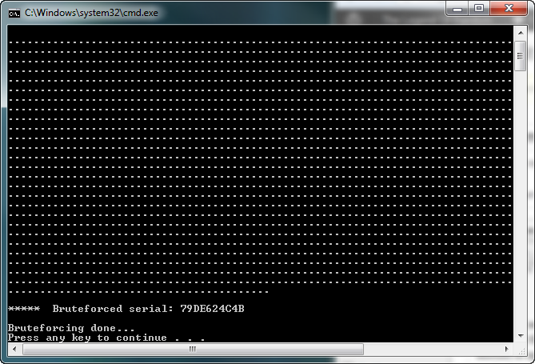
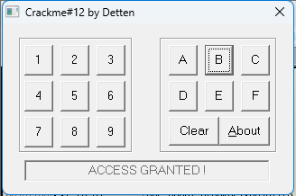

# Introduction

Bruteforce là phương pháp trích xuất mã(mật khẩu hay bất kỳ thông tin bảo mật nào,...) từ một tệp nhị ohaan, khi ta biết rõ đầu vào và đầu ra của quy trình mã hóa/ghép mã, nhưng lại không rõ cách thức hoạt động của nó hoặc không muốn tốn thời gian để sửa phần mềm. Phương pháp này tạo nên sự khác biệt giữa phần mềm đã bị crack đi kèm công cụ vá lỗi(hoặc bản sao của tệp thực thi đã được vá) và phần mềm đi kèm thông tin thông tin đăng nhập (tài khoản/mật khẩu) có thể sử dụng ngay lập tức.

Cách thức hoạt động của nó như sau: Khi biết rõ đầu vào và đầu ra của quy trình mã hóa/giải mã, ta sẽ thử mọi khả năng có thể biến đầu vào thành đầu ra cho đến khi tìm được trường hợp trùng khớp. VD, nếu nhập chuỗi serial "12121212" ứng dụng sẽ đưa chuỗi này này vào quy trình giải mã, sau khi xử lý, ứng dụng sẽ so sánh kết quả với chuỗi "j6^^gD7-L". Trong trường hợp này, đầu vào là chuỗi serial của ta, được chuyển đổi thành "j6^^gD7-L" và làm thế nào để nhập một mã serial phù hợp với đầu ra mà chương trình yêu cầu - nói cách khác, cần nhập mã serial nào để ứng dụng đăng kí thành công cho ta

Cần lưu ý rằng phương pháp này chỉ áp dụng với các tệp nhị phân sử dụng tên người dùng và mã serial để xác thực tính hợp lệ của quá trình đăng ký. Nếu ứng dụng truy vấn cơ sở dữ liệu trực tuyến thì phương pháp này sẽ không hoạt động

Dù vậy, kỹ thuật bruteforcing thực ra không phức tạp. Tiên quyết là phải biết một ngôn ngữ lập trình để viết chương trình bruteforcing. Trong bài này sẽ dùng C vì dễ theo dõi luồng xử lí

Một yêu cầu khác là phải hiểu rõ cách tên người dùng hoặc mã(hoặc cả 2) được chuyển đổi thành đầu ra. Lý do và điều này giúp giảm đáng kể số lượng thao tác mà cần thử nghiệm. VD nếu yêu cầu chuyển đổi mật khẩu "SECRET" thành đầu ra "MESSAGE" thì sẽ có vô số cách thực hiện. Tuy nhiên, nếu chỉ cho phép 1 thao tác duy nhất là phép XOR tên người dùng với một giá trị nhất định thì phạm vi có thể thu hẹp rất nhiều

# Deciphering the Keys

Bài tập lần trước là giải mã các khóa khác nhau và xác định ứng dụng thay đổi gì với từng khóa, dưới đây là bản hoàn thiện :

```asm
004012A9 mov ecx, dword_403040            ; variable 'a'
004012AF mov ebx, dword_40303C            ; variable 'b'
004012B5 mov eax, dword_403038            ; variable 'c'
004012BA cmp [ebp+arg_0], 1               ; ***** Button 1
004012BE jnz short loc_4012D0
004012C0 add ecx, 54Bh                    ; c += 54Bh
004012C6 imul ebx, eax                    ; b *= a
004012C9 xor eax, ecx                     ; a^= c
004012CB jmp loc_4013E7

004012D0 cmp [ebp+arg_0], 2               ; ***** Button 2
004012D4 jnz short loc_4012E8
004012D6 sub ecx, 233h                    ; c -= 233h
004012DC imul ebx, 14h                    ; b *= 14h
004012DF add ecx, eax                     ; c += a
004012E1 and ebx, eax                     ; b &= a
004012E3 jmp loc_4013E7

004012E8 cmp [ebp+arg_0], 3               ; ***** Button 3
004012EC jnz short loc_4012FD
004012EE add eax, 582h                    ; a += 582h
004012F3 imul ecx, 16h                    ; c *= 16h
004012F6 xor ebx, eax                     ; b ^= a
004012F8 jmp loc_4013E7

004012FD cmp [ebp+arg_0], 4               ; ***** Button 4
00401301 jnz short loc_401312
00401303 and eax, ebx                     ; a &= b
00401305 sub ebx, 111222h                 ; b -= 111222h
0040130B xor ecx, eax                     ; c ^= a
0040130D jmp loc_4013E7

00401312 cmp [ebp+arg_0], 5               ; ***** Button 5
00401316 jnz short loc_401324
00401318 cdq
00401319 idiv ecx                         ; a /= c, division rest --> (r)
0040131B sub ebx, edx                     ; b -= r
0040131D add eax, ecx                     ; a += c
0040131F jmp loc_4013E7

00401324 cmp [ebp+arg_0], 6               ; ***** Button 6
00401328 jnz short loc_401339
0040132A xor eax, ecx                     ; a ^= c
0040132C and ebx, eax                     ; b &= a
0040132E add ecx, 546879h                 ; c += 546879h
00401334 jmp loc_4013E7

00401339 cmp [ebp+arg_0], 7               ; ***** Button 7
0040133D jnz short loc_401351
0040133F sub ecx, 25FF5h                  ; c -= 25FF5h
00401345 xor ebx, ecx                     ; b ^= c
00401347 add eax, 401000h                 ; a += 401000h
0040134C jmp loc_4013E7

00401351 cmp [ebp+arg_0], 8               ; ***** Button 8
00401355 jnz short loc_401367
00401357 xor eax, ecx                     ; a ^= c
00401359 imul ebx, 14h                    ; b *= 14h
0040135C add ecx, 12589h                  ; c += 12589h
00401362 jmp loc_4013E7

00401367 cmp [ebp+arg_0], 9               ; ***** Button 9
0040136B jnz short loc_401378
0040136D sub eax, 542187h                 ; a -= 542187h
00401372 sub ebx, eax                     ; b -= a
00401374 xor ecx, eax                     ; c ^= a
00401376 jmp short loc_4013E7

00401378 cmp [ebp+arg_0], 0Ah             ; ***** Button 10
0040137C jnz short loc_40138A
0040137E cdq
0040137F idiv ebx                         ; a /= b, division rest --> (r)
00401381 add ebx, edx                     ; b += r
00401383 imul eax, edx                    ; a *= r
00401386 xor ecx, edx                     ; c ^= r
00401388 jmp short loc_4013E7

0040138A cmp [ebp+arg_0], 0Bh             ; ***** Button 11
0040138E jnz short loc_4013A3
00401390 add ebx, 1234FEh                 ; b += 1234FEh
00401396 add ecx, 2345DEh                 ; c += 2345DEh
0040139C add eax, 9CA4439Bh               ; a += 9CA4439Bh
004013A1 jmp short loc_4013E7

004013A3 cmp [ebp+arg_0], 0Ch             ; ***** Button 12
004013A7 jnz short loc_4013B2
004013A9 xor eax, ebx                     ; a ^= b
004013AB sub ebx, ecx                     ; b -= c
004013AD imul ecx, 12h                    ; c *= 12h
004013B0 jmp short loc_4013E7

004013B2 cmp [ebp+arg_0], 0Dh             ; ***** Button 13
004013B6 jnz short loc_4013C8
004013B8 and eax, 12345678h               ; a &= 12345678h
004013BD sub ecx, 65875h                  ; c -= 65875h
004013C3 imul ebx, ecx                    ; b *= c
004013C6 jmp short loc_4013E7

004013C8 cmp [ebp+arg_0], 0Eh             ; ***** Button 14
004013CC jnz short loc_4013DB
004013CE xor eax, 55555h                  ; a ^= 55555h
004013D3 sub ebx, 587351h                 ; b -= 587351h
004013D9 jmp short loc_4013E7

004013DB cmp [ebp+arg_0], 0Fh             ; ***** Button 15
004013DF jnz short loc_4013E7
004013E1 add eax, ebx                     ; a += b
004013E3 add ebx, ecx                     ; b += c
004013E5 add ecx, eax                     ; c += a
```

Vì vậy, hiện tại ta đã hiểu rõ thao tác nào được thực hiện nhi nhấn từng phím. Điều tiếp theo cần xác định là các đầu vào và đầu ra. Về phần này, ta đã có hiểu biết ban đầu, đoạn mã trong phần tự điều chỉnh ban đầu chỉ là một dãy kí tự vô nghĩa, sau đó xor với 3 địa chỉ bộ nhớ a,b,c để biến thành các lệnh hợp lệ. Do đó đầu vào chính là đoạn mã trước khi thực hiện lệnh xor, còn đầu ra là nội dung tại các địa chỉ a,b,c sau khi đã được xor và điều chỉnh theo các giá trị này

Địa chỉ _401407_ ban đầu có giá trị là _EB 3F 90 90_ và sau khi thực hiện phép xor với ký tự a, giá trị của nó trở thành _B9 B4 C5 9C_.

Địa chỉ _40143B_ ban đầu có giá trị là _04 66 E7 BB_ và sau khi thực hiện phép xor với ký tự b, giá trị của nó trở thành _FF 75 0C 6A_.

Địa chỉ _40143F_ ban đầu có giá trị là _4D BD 08 8B_ và sau khi thực hiện phép xor với ký tự c, giá trị nó trở thành _03 FF 75 08_.

Cuối cùng, ta sẽ thử mọi tổ hợp có thể từ các thay đổi này, giống như việc tự động thực hiện tất cả các tổ hợp thao tác có thể bằng cách nhấp vào các nút một cách thủ công. Khi thực hiện 10 thao tác trên 1 tập hợp dữ liệu, 3 biến của ta đều có giá trị đúng, thì ta có thể khẳng định rằng ta tìm ra mật khẩu chính xác.

Tác giả bản crackme này đã cung cấp hai ký tự đầu tiên của mật khẩu: đó là "7" và "9". Lý do là nếu ta sử dụng máy tính có tốc độ xử lý chậm, quá trình thử tất cả các tổ hợp khả năng có thể mất rất nhiều thời gian. Nói chung là nếu không biết 2 ký tự đầu thì có thể mất tới 1 giờ để crack. Nhưng nếu biết thì chỉ mất khoảng 1 phút. Bình thường thì sẽ không có bất kỳ ký tự nào. 

Dưới đây là mã nguồn C của công cụ bruteforcer

```C
#include <iostream>
using namespace std;

void brute( void )
{
    char finalAsciiSerial[11] = "";
    int    i, varA, varB, varC, tempVar, currentSerial[10];

    // we know the first number is '7'
    for (currentSerial[0] = 7; currentSerial[0] <= 7; currentSerial[0]++)
    {
     // and we know the second number is '9'
     for (currentSerial[1] = 9; currentSerial[1] <= 9; currentSerial[1]++)
     {
      for (currentSerial[2] = 1; currentSerial[2] <= 15; currentSerial[2]++)
      {
       for (currentSerial[3] = 1; currentSerial[3] <= 15; currentSerial[3]++)
       {
        for (currentSerial[4] = 1; currentSerial[4] <= 15; currentSerial[4]++)
        {
         cout << ".";    // Update display
         for (currentSerial[5] = 1; currentSerial[5] <= 15; currentSerial[5]++)
         {
          for (currentSerial[6] = 1; currentSerial[6] <= 15; currentSerial[6]++)
          {
           for (currentSerial[7] = 1; currentSerial[7] <= 15; currentSerial[7]++)
           {
            for (currentSerial[8] = 1; currentSerial[8] <= 15; currentSerial[8]++)
            {
             for (currentSerial[9] = 1; currentSerial[9] <= 15; currentSerial[9]++)
             {
                // Reset variables
                varA = 0xDEAD;
                varB = 0xDEAD;
                varC = 0x42424242;

                // Apply each digit
                for (i = 0; i < 10; i++)
                {
                    switch (currentSerial[i])
                    {
                    case 1:
                        varC += 0x54B;
                        varB *= varA;
                        varA ^= varC;
                        break;

                    case 2:
                        varC = varC - 0x233 + varA;
                        varB = (varB * 0x14) & varA;
                        break;

                    case 3:
                        varA += 0x582;
                        varC *= 0x16;
                        varB ^= varA;
                        break;

                    case 4:
                        varA &= varB;
                        varB -= 0x111222;
                        varC ^= varA;
                        break;

                    case 5:
                        if (varC != 0)        // Watch divide by zero!
                        {
                            varB -= (varA % varC);
                            varA /= varC;
                            varA += varC;
                        }
                        break;

                    case 6:
                        varA ^= varC;
                        varB &= varA;
                        varC += 0x546879;
                        break;

                    case 7:
                        varC -= 0x25FF5;
                        varB ^= varC;
                        varA += 0x401000;
                        break;

                    case 8:
                        varA ^= varC;
                        varB *= 0x14;
                        varC += 0x12589;
                        break;

                    case 9:
                        varA -= 0x542187;
                        varB -= varA;
                        varC ^= varA;
                        break;

                    case 10:
                        if (varB != 0)        // Watch divide by zero!
                        {
                            tempVar = varA % varB;
                            varA /= varB;
                            varB += tempVar;
                            varA *= tempVar;
                            varC ^= tempVar;
                        }
                        break;

                    case 11:
                        varB += 0x1234FE;
                        varC += 0x2345DE;
                        varA += 0x9CA4439B;
                        break;

                    case 12:
                        varA ^= varB;
                        varB -= varC;
                        varC *= 0x12;
                        break;

                    case 13:
                        varA &= 0x12345678;
                        varC -= 0x65875;
                        varB *= varC;
                        break;

                    case 14:
                        varA ^= 0x55555;
                        varB -= 0x587351;
                        break;

                    case 15:
                        varA += varB;
                        varB += varC;
                        varC += varA;
                        break;
                    }
                }

                // stop if serial equals proper values
                if ((varA == 0x9CC5B4B9) && (varB == 0xD1EB13FB) && (varC == 0x837D424E))
                {
                    // Convert to ASCII
                    for (i = 0; i < 10; i++)
                    {
                        if (currentSerial[i] <= 9)
                        {
                            finalAsciiSerial[i] = currentSerial[i] + 0x30;
                        }
                        else
                        {
                            finalAsciiSerial[i] = currentSerial[i] + 0x37;
                        }
                    }
                    cout << "\n\n*****  Bruteforced serial: " << finalAsciiSerial << "\n";\
                    return;
    }}}}}}}}}}}
}

int main()
{
    cout << "Bruteforcer by R4ndom\n\n";

    brute();

    cout << "\nBruteforcing done...\n";

    return 0;
}
```

Trước tiên, sau khi thiết lập các biến cần thiết, ta sẽ lần lượt kiểm tra từng kí tự trong mật khẩu. Hai kí tự đầu tiên đã biết là "7" và "9", còn các ký tự còn lại có thể nằm trong khoảng từ 1 đến 15(1-F). Có lệnh Cout để in một dấu "." sau mỗi thao tác. Dãy dấu . ngày càng dài sẽ giúp xxacs nhận rằng chương trình hoạt động bình thường và vẫn chưa lỗi.

Tiếp theo, ta sẽ thực hiện các thay đổi với các biến tùy theo phím nào được nhấn, tương tự như những thay đổi đã trình bày ở trên

Sau mỗi bộ 10 lần thay đổi (mật khẩu 10 ký tự), ta kiểm tra 3 biến để xác định xem có trùng khớp với các kết quả mong muốn hay không. Nếu trùng khớp, quá trình sẽ dừng lại, chuỗi mật khẩu sẽ được chuyển sang mã ASCII và hiển thị ra màn hình. Nếu không trùng khớp, hệ thống sẽ tiếp tục xử lí tổ hợp tiếp theo.

Kết quả chạy chương trình 



Nhập mật khẩu :

