Trong bài này, ta sẽ cùng tìm hiểu cách làm việc với tệp nhị phân viết bằng Delphi. Các tệp nhị phân Delphi có nhiều điểm khác biệt so với các tệp nhị phân viết bằng các ngôn ngữ lập trình khác. Thông thường, có thể nhận diện một chương trình Delphi dựa trên số lượng lời gọi hàm rất lớn, nhiều hơn so với chương trình thông thường, cũng như các kĩ thuật khác

# Delphi

Hầu hết các ứng dụng được xây dựng trong Delphi dựa trên các form, về bản chất, đây chỉ là các cửa sổ hoặc hộp thoại thông thường. Ta có thể thiết kế các form này bằng cách sử dụng các công cụ đồ họa để vẽ giao diện, tức là thêm các nút bấm, ô nhập liệu và các thành phần khác vào bất kỳ vị trí nào mong muốn. Thực tế sau khi thiết kế xong, điều duy nhất cần làm là thông báo cho trình biên dịch Delphi biết những sự kiện nào muốn xử lý và hành động gì sẽ được thực hiện khi sự kiện đã xảy ra. Ví dụ, khi người dùng nhấp vào một nút bấm, ta có thể muốn mở hộp thoại chọn tệp. Trong trường hợp này, ta cần thông báo cho trình biên dịch Delphi biết rằng nút điều khiển này phải được liên kết với đoạn mã do ta cung cấp và đoạn mã đó chỉ đơn giản là mở cửa sổ chọn tệp

Các dạng biểu mẫu này cùng với mọi yếu tố liên quan(chuỗi kí tự, kích thước, màu sắc) đều được lưu trữ trong các tài nguyên, về mặt lý thuyết, cách thức này tương tự như trong một ứng dụng C++ thông thường, nhưng được triển khai theo một cách hoàn toàn khác biệt. Một điểm thú vị là Delphi liên kết tất cả các tài nguyên này theo tên, nghĩa là tên mà ta đặt cho một tài nguyên cụ thể chính là tên sẽ được hard-code vào tệp thực thi, đồng thời cũng là tên mà tệp thực thi sẽ dùng để tra cứu tài nguyên đó. Điều này vừa có ưu điểm, vừa có nhược điểm. Điểm tốt là ta có thể dễ dàng tìm thấy những tên biến liên quan đến tài nguyên. Tuy nhiên, điểm yếu là tất cả chúng đều được lưu trữ tập trung ở một vị trí duy nhất và không được tích hợp một cách hợp lí vào mã nguồn, do đó việc tìm kiếm đoạn mã tương ứng với 1 tài nguyên cụ thể(VD như một thao tác nhấp nút) trở nên khó khăn hơn nhiều

Phần lớn các công việc lập trình đã được thực hiện sẵn cho ta, ngoại trừ một số ngôn ngữ như C++. Trong 1 chương trình Delphi, có rất nhiều xử lý diễn ra ở "phía sau hậu trường". Đây chính là một trong những lý do khiến mã nguồn trông khác biệt so với những gì ta có thể hình dung.

# The first target

Một trong những câu hỏi đầu tiên ta có thể đặt ra là: "Làm sao để ta có thể biết mình đang xử lý một chương trình Delphi" Sau khi có thêm nhiều kinh nghiệm, các chương trình Delphi sẽ dễ nhận biết. Tuy nhiên trước khi đạt đến mức độ đó, ta sẽ sử dụng một công cụ hỗ trợ. Mở và chạy ExeInfoPE. Chương trình này thường được dùng để xác định công cụ đóng gói(packer) nào đã được sử dụng trên một tệp nhị phân đã được đóng gói(và ta sẽ sử dụng nó rất nhiều khi đi sâu vào chủ đề đóng gói chương trình). May mắn thay, nếu chương trình chưa bị đóng gói, công cụ này vẫn có thể cho biết chương trình được viết bằng ngôn ngữ lập trình nào. Khi lần đầu tiên khởi động ExeInfoPE, ta sẽ thấy màn hình khởi động:

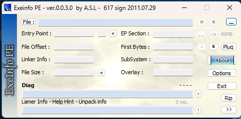

Hãy tải tệp mục tiêu đầu tiên của ta là DelphiCrackme.exe vào ExeInfoPE và ta sẽ thấy các trường thông tin được điền đầy đủ(chỉ cần kéo biểu tượng crackme và thả vào cửa sổ ExeInfoPE)

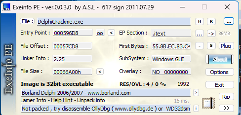

Tại đây, ta có thể thấy rằng ExeInfoPE đã xác định được tệp nhị phân này đã được biên dịch bằng Delphi. Dưới mục này cũng có thể nhận thấy rằng tệp này không bị đóng gói(packed). Ngoài ra, để tiện nhắc thêm một chút, khi tải tệp vào Olly, ta sẽ thấy rằng đây là 1 tệp có đặc điểm hoàn toàn khác biệt :

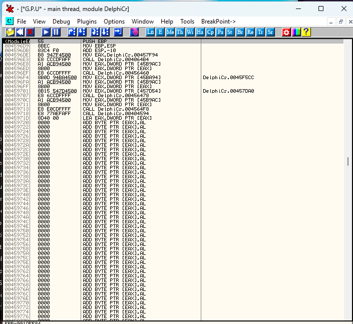

Có thể dễ dàng nhận thấy ứng dụng này trông không giống như những ứng dụng thông thường mà ta thường dùng

# Looking at Delphi resources

Một trong những khác biệt quan trọng nhất, ít nhất là với reverse của một chương trình chính là các tài nguyên(resources). Khi tải tệp Delphi Crackme vào Resource Hacker, ta sẽ thấy một thư mục mới có tên là RCDATA, vốn thường không tồn tại trong các tệp Delphi thông thường. Việc mở thư mục này sẽ cho thấy các phần tài nguyên liên quan đến tệp nhị phân này

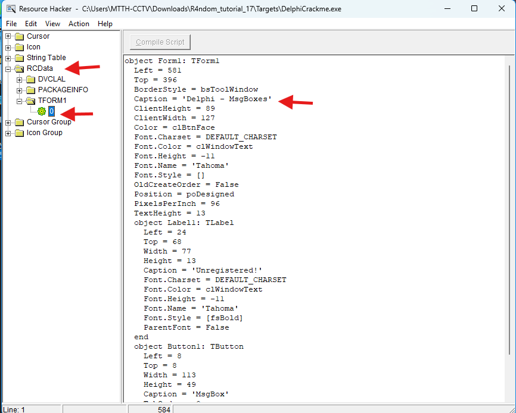

Nhìn chung, thư mục con quan trọng nhất(các phần tài nguyên) là các phần TFORM, tương ứng với các cửa sổ hoặc hộp thoại trong chương trình Delphi. Trong ví dụ crackme này, ta có thể thấy chỉ tồn tại một form duy nhất là TFORM1. Khi nhấp vào biểu tượng hoa nhỏ bên trong TFORM1, khu vực dữ liệu chính của phần này sẽ được mở ra trong Resource Hacker. Dữ liệu này cung cấp đầy đủ thông tin  về biểu mẫu : kích thước, màu sắc, vị trí trên màn hình.

Thông thường, nơi đầu tiên ta kiểm tra là ô "caption" vì đây là phần hiển thị nội dung sẽ xuất hiện trong thanh tiêu đề cửa sổ. Trong trường hợp này, nội dung là "Delphi - MsgBoxes". Trường này rất quan trọng đặc biệt là trong các ứng dụng có nhiều form với tên như TFORM1, TFORM2, TFORM3 khi đó việc xác định form nào tương ứng với cửa sổ nào có thể trở nên khó khăn. Nhờ xem nội dung caption, ta có thể dễ dàng phân biệt các cửa sổ này. Ví dụ, caption có thể là Register, cho biết đây là màn hình đăng kí hoặc là About để chỉ màn hình thông tin về ứng dụng

Cuối cùng điều đặc biệt quan trọng đối với ta là các nút ở phần dưới cùng của giao diện. Lý do là vì thông thường, ta cần bắt sự kiện chương trình sau khi người dùng nhấn một nút, ví dụ như sau khi nhấn OK trên màn hình đăng kí sau khi nhập tên người dùng và mã. Điều then chốt liên quan đến ccacs nút này là tên phương thức được gọi khi nút đó được nhấp, trong trường hợp này đó là "Button1Click". Các chương trình Delphi kết nối mọi thành phần thông qua các tên mã hóa ASCII, co đó khi ứng dụng cần thực thi đoạn mã liên quan đến thao tác nhấp vào nút này, nó sẽ tra cứu tên "Button1Clicked" để tìm phương thức tương ứng.

Dựa trên việc xem xét tệp tin này, ta nhận thấy có 1 cửa sổ chứa một nút duy nhất. Tiêu đề của cửa sổ là Delphi-MsgBoxes và hàm gọi khi mà click vào nút là Button1Click

Giờ, chuyển sang tìm hiểu cách sử dụng của công cụ quan trọng khi làm việc với chương trình Delphi

# Using DeDe

Delphi Decompiler cho phép ta tải một chương trình Delphi và phân tích chi tiết chương trình đó, hiển thị toàn bộ dữ liệu và các form mà thu thập được, đồng thời chỉ ra vị trí gọi các phương thức, địa chỉ của từng phương thức và tên các phương thức đó. Nếu cần, công cụ còn cung cấp bản giải mã hoàn chỉnh từ tệp nhị phân, kèm theo các chức năng chỉnh sửa mã nguồn. Khởi động DeDe :

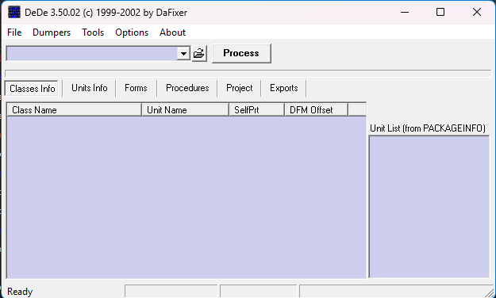

Trước tiên, ta cần tải chương trình vào để DeDe có thể thực hiện việc giải mã ngược. Ta có thể nhấp vào biểu tượng thư mục mở hoặc kéo tệp DelphiCrackme vào cửa sổ DeDe, sau đó chọn có để cho phép DeDe bắt đầu xử lí tệp nhị phân. Lúc này DêDe sẽ hiển thị hộp thoại hỏi xem mục tiêu đã được tải thành công chưa :

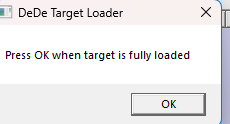

Đồng thời, hệ thống sẽ thực thi chương trình và cho phép ta quan sát cửa sổ chính của chương trình đó xuất hiện 

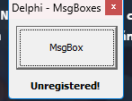

Đôi khi, xuất hiện thông báo cảnh báo hoặc lỗi nhỏ ngay khi bắt đầu chạy ứng dụng, ta có thể muốn tiếp tục thực hiện phần chính của chương trình trước khi yêu cầu DeDe xử lý ứng dụng. Trong trường hợp này, ứng dụng mục tiêu đã được tải đầy đủ, vì vậy có thể nhấn nút OK để cho phpes DeDe tiếp tục. Sau đó DeDe sẽ đóng ứng dụng mục tiêu và hỏi có muốn thực hiện quá trình xử lý sâu hơn với ứng dụng hay không ?

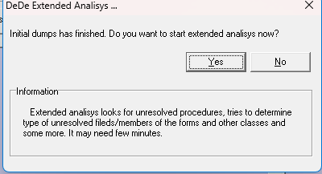

Thường thì bấm "No" vì bấm "Yes" chưa bao giờ cung cấp thêm thông tin cần thiết. Sau đó, DeDe sẽ hoàn tất việc xử lý mục tiêu và cửa sổ chính sẽ được hiển thị đầy đủ nội dung

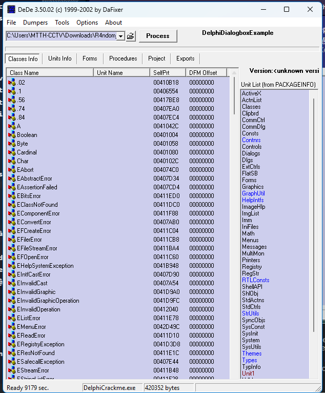

Ban đầu, giao diện sẽ hiển thị thông tin class, như ta có thể thấy qua tab "Classes Info" đang được chọn. Ta có thể cuộn danh sách, nhưng điều ta cần là tab "Forms"

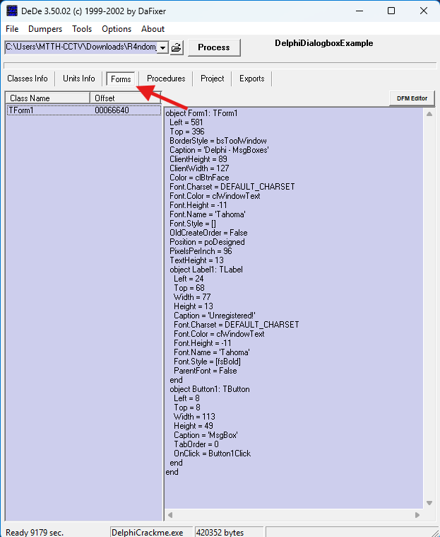

Ở đây, ta có thể thấy được thông tin từng xem trước đó trong Resource HAcker, cụ thể là các thuộc tính của form. Tiếp theo, nhấp vào tab "Procedures". Đây là tab quan trọng nhất trong DeDe

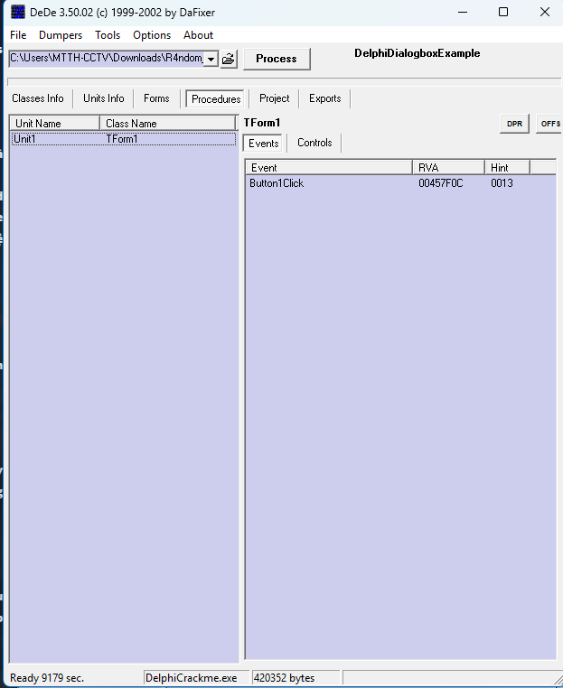

Ở đây, DeDe đã hiển thị cho chúng ta các tên và ĐỊA CHỈ HÀM CALLBACK CỦA FORM TFORM1. Vì đây là một chương trình rất đơn giản, nên chỉ có duy nhất một nút bấm và do đó chỉ có một hàm callback duy nhất. Tuy nhiên, tích cự là ta đã biết được địa chỉ của hàm callback này - 457F0C. Tiếp theo, tải tệp vào Olly và xem có thể làm gì

# Finding the patch

Nếu tìm các chuỗi ký tự, ta sẽ không thấy ổn lắm

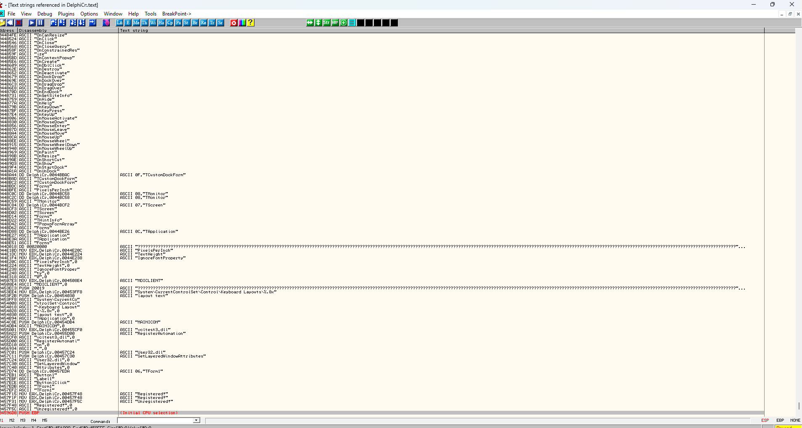

Việc tìm kiếm các lời gọi liên modun cũng là một dấu hieuej đây là một chương trình Delphi

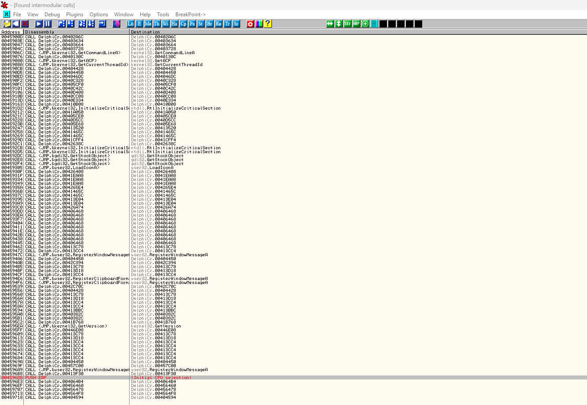

Ta nhận thấy rằng Delphi thực hiện rất nhiều lần gọi hàm

Thông thường, ở bước này, ta sẽ thử chạy ứng dụng rồi tạm dừng nó ngay tại thông báo lỗi "bad boy", nhưng ta sẽ nhận thấy rằng cách làm này không hiệu quả trong trường hợp này, vì khi quay lại, ta sẽ đang ở sâu khoảng 15 tầng gọi hàm và việc truy tìm đoạn mã thực sự xử lý hộp thoại thông báo gần như là bất khả thi

Tuy nhiên, nếu ta nhớ lại từ DeDe, ta biết địa chỉ được gọi khi nút được nhấn đó là 457F0C. Vì vậy kiểm tra địa chỉ này trong Olly

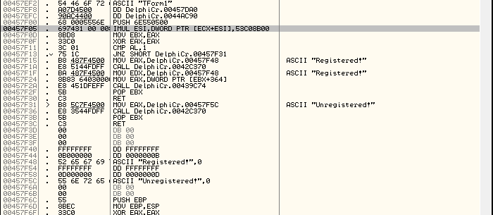

Đặt 1 BP ở đầu đoạn mã này 457F0C rồi chạy ứng dụng. Olly có thể cảnh báo rằng ta đang thiết lập BP trong phần dữ liệu. Chỉ cần bỏ qua thông báo đó

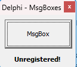

Lưu ý rằng hệ thống đang hiển thị thông báo rằng ta chưa đăng ký. Ngoài ra, để ý đến tên trang "Delphi - MsgBoxes". Ta thấy rằng có duy nhất 1 nút bấm. Tất cả điều này khá quen. nhấp vào nút đó và Olly sẽ dừng tại điểm BP của ta.

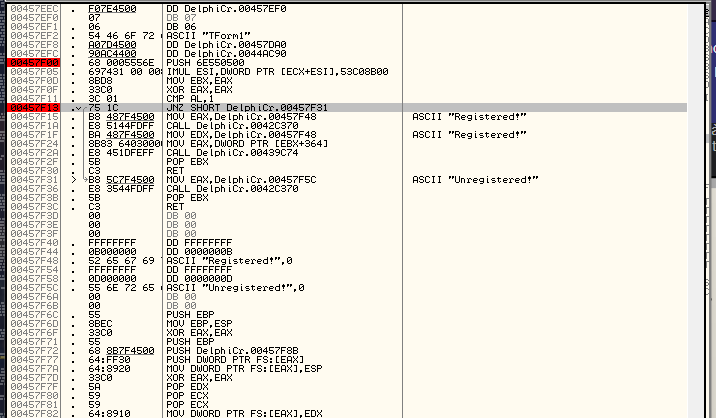

Giờ đây, vấn đề là điều chỉnh mã nguồn và dẫn Olly theo đúng hướng để nó hiển thị goodboy thay vì badboy. 

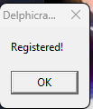

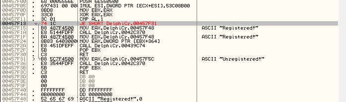

# The second target

Trong hành trình tìm kiếm những công cụ không gây hại cho ai, ứng dụng thứ 2 ta sẽ xem xét là một phần mềm miễn phí, nó có một nag xuất hiện liên tục cho đến khi ta đăng ký sử dụng. Việc đăng ký hoàn toàn miễn phí. Đây là một chương trình có tên Exif2htm. Có thể đây là chương trình chuyển các file sang dạng html.

Tải app vào, ta thấy chương trình thực chất viết bằng Delphi và chưa được đóng gói

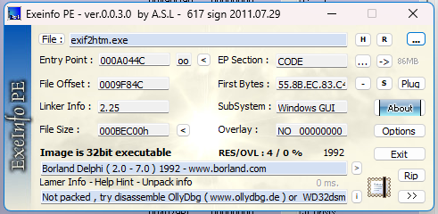

Khi chạy app, ta sẽ thấy nag liên tục xuất hiện

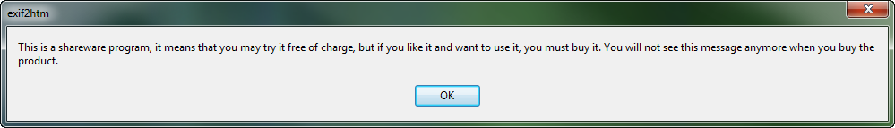

Click ok, ta sẽ thấy một giao diện được thiết kế với đầy màu sắc :

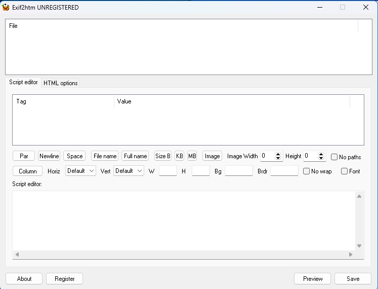

Dù sao, ta có thể thấy ở phần đầu giao diện rằng ứng dụng ở trạng thái UNREGISTERED. Khi nhấp vào mục "About" , màn hình thông tin ứng dụng sẽ được hiển thị :

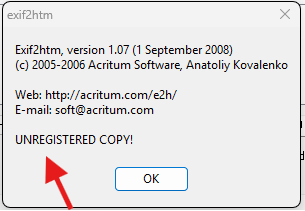

Khi nhấn vào nút "Register" ở cuối trang, màn hình đăng ký sẽ được hiển thị

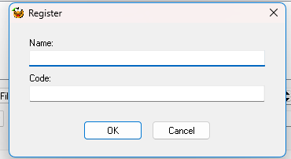

Nhập bừa cho ta thấy một thông điệp sai :

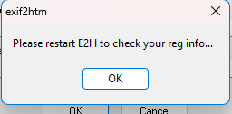

# Using DeDe

Tải app vào DeDe xem có gì. Nhấp bỏ qua thông báo nhắc nhở khi bấm OK để DeDe xử lý

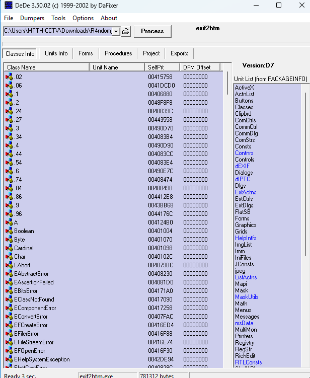

Khi nhấp vào Forms, cửa sổ chứa các form sẽ được hiển thị. Sau đó, nếu nhấp vào TForm1, ta có thể nhận thấy đây rất có thể là cửa sổ chính của ứng dụng

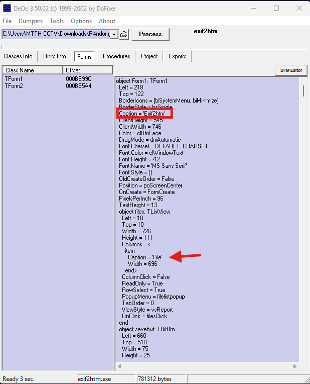

Ta có thể thấy chúc thích cho tùy chọn "Files" và nếu cuộn xuống một chút, sẽ xuất hiện các chú thích tương ứng với các chức năng "Lưu",  "In" và "Editor", tuy nhiên, nhấp vào TForm2 lại thú vị hơn :

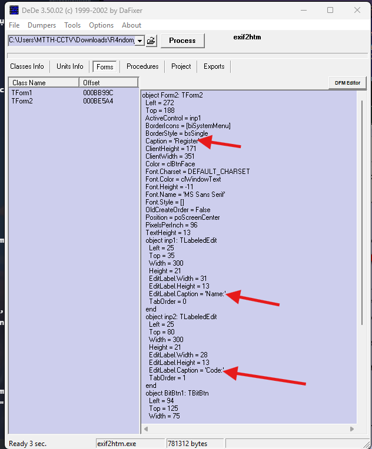

Vì vậy, tiêu đề giao diện là "Register". Ta có thể thấy các nhãn bên cạnh các ô nhập liệu lần lượt là "Name" và "Code", đồng thời có 2 nút ở phía dưới là "OK" và "Cancel". Nhấp vào tab Procedures để xem nội dung bên trong

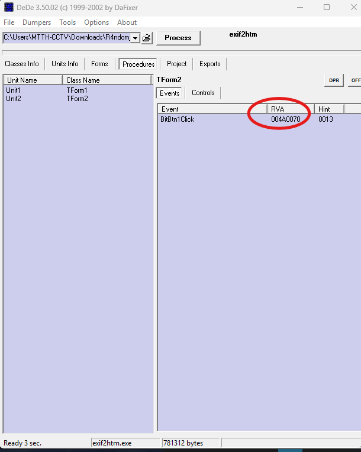

Khi nhấp vào Unit2 - TForm2, ta thấy một phương thức là "BitBtn1Click", chính là phương thức tương ứng với nút "OK" ở trên cửa sổ đăng ký mà ta đã quan sát thấy trước đó trong các cửa sổ form. Ngoài ra, ta cũng thấy rằng DeDe đang hiển thị giá trị RVA của địa chỉ dành cho phương thức này. Nó rất hữu ích. Ghi lại và khởi động Olly

# Finding the patch

Trong Olly, đoạn mã nhị phân này có vẻ không thân thiện lắm

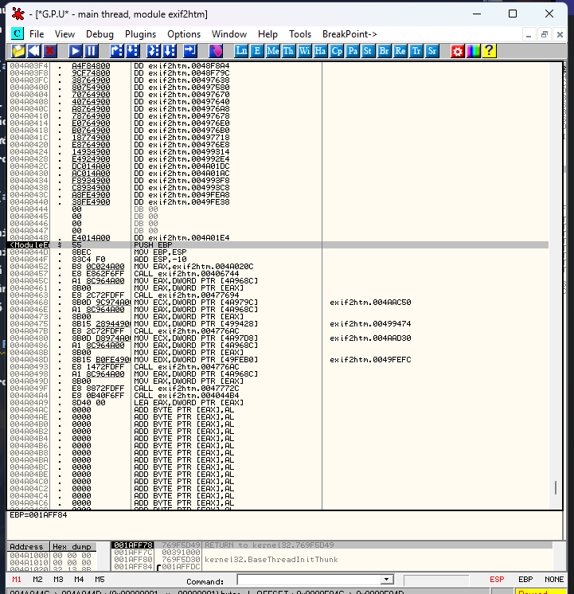

Truy cập địa chỉ đã lưu và xem có gì bên trong

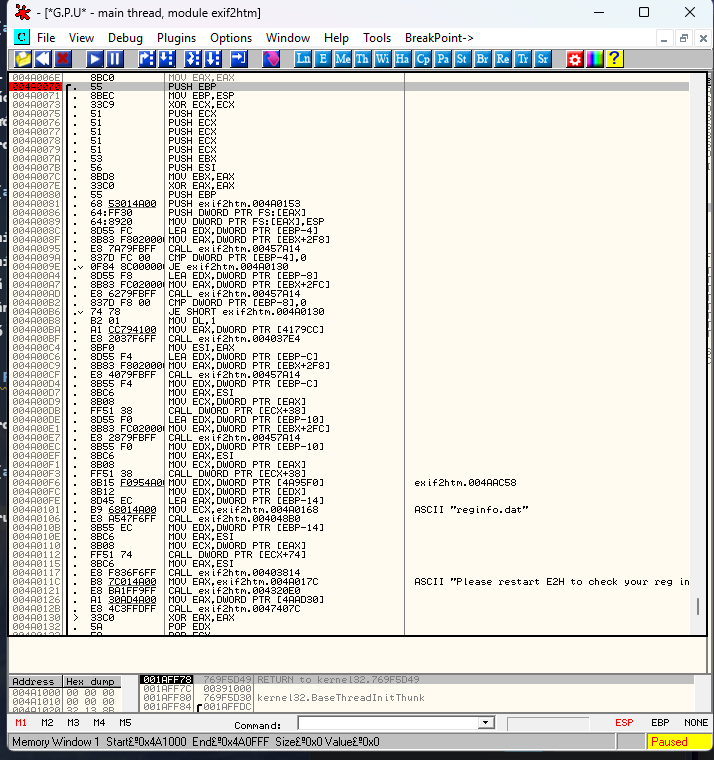

Về cuối phần, ta sẽ thấy một thông báo hiện lên, nhắc nhở ta khởi động lại app để kiểm tra xem mã đăng ký đã hoạt động thành công hay chưa. Đây là một kỹ thuật khá phổ biến và thực sự tạo thử thách cho người dùng. Vấn đề là ta không thể biết được liệu mình đã nhập đúng mã hay chưa cho đến khi khởi động lại ứng dụng và phần mã kiểm tra đúng hay sai có thể nằm ở bất kỳ đâu trong chương trình. Hơn nữa, ta cũng không thể ép buộc mã mình đúng vì không biết các lệnh kiểm tra tính hợp lệ ở đâu trong hệ thống. Tuy nhiên, điều quan trọng là ứng dụng phải lưu lại một thứ gì đó

Diều này được suy ra từ thực tế rằng, sau khi ta nhập mã của mình, ứng dụng nhất định phải lưu mã đó vào một vị trí nào đó(hoặc là lưu gì đó vào một nơi nào đó), để khi khởi động lại, ứng dụng có thể kiểm tra xem liệu mã đúng đã được lưu lại hay chưa. Ứng dụng có thể lưu tên, và mã mà người dùng nhập vào, hoặc lưu một dấu hiệu cho biết người dùng đã đăng ký hoặc bất kỳ thông tin nào khác tương tự. Tuy nhiên điều quan trọng là ứng dụng nhất định phải lưu lại một thứ gì đó

Chỉ có một vài vị trí mà một chương trình có thể lưu trữ dữ liệu giữa các lần chạy ứng dụng. Trong hầu hết các trường hợp, dữ liệu này được lưu trong registry hoặc một tệp. Do đó, điều ta cần làm là xác định chính xác vị trí lưu dữ liệu này, để khi chạy lại app, ta có thể tìm ra nơi dữ liệu được xử lí và kiểm tra xem người dùng đã đăng ký hay chưa

Ta đã lập BP, hãy chạy lại app trong Olly. Nhấp Register và nhập bừa, nhấn OK. Olly dừng lại tại BP mà ta lập

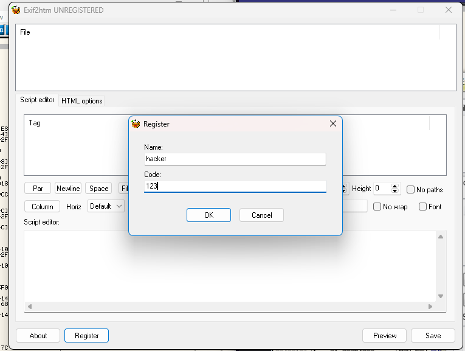

Giờ hãy xem đoạn mã mà Olly bị lỗi. Ban đầu là một loạt lệnh push để khởi tạo các biến trên ngăn xếp. Sau đó, chương trình đẩy thêm một số biến lên ngăn xếp và thực hiện một lời gọi hàm tại địa chỉ 4A0095. Nếu thực hiện step over, dừng tại địa chỉ 4A009A, ta sẽ thấy một số điều thú vị trong cửa sổ thông tin

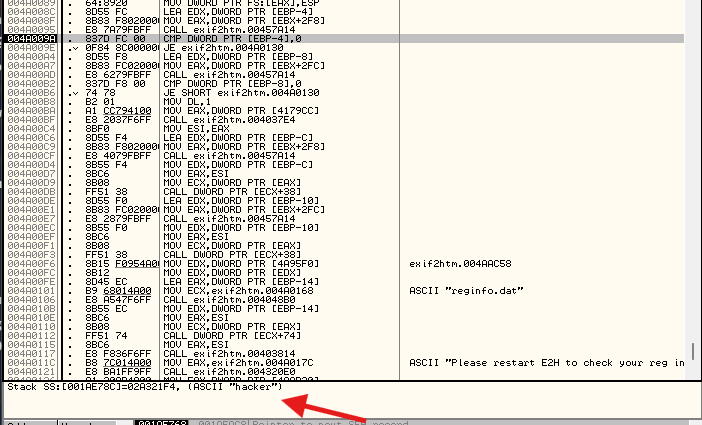

Có vẻ như hệ thống đang xử lí tên người dùng của ta. Chắc chắn 99,99% là một kiểm tra nhằm đảm bảo rằng ta thực sự nhập dữ liệu vào ô nhập văn bản trong cửa sổ đăng kí(thông thường trả về độ dài của chuỗi nhập). Việc giá trị EAX bằng 6 khi kết thúc hàm phần nào hỗ trợ giả thuyết này, dù ta vẫn chưa thể khẳng định chắc chắn. Sau đó, hệ thống sẽ kiểm tra xem EAX có bằng 0 hay không, rồi thực hiện lệnh nhảy(jmp). Sau khi lần lượt bỏ qua 2 lệnh tiếp theo, ta sẽ thấy đoạn code của mình cũng xuất hiện trên cửa sổ

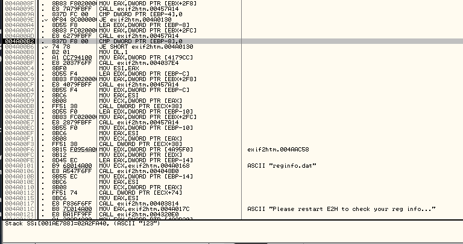

Liệu có chắc rằng đoạn mã nguồn này cũng đang thực hiện cùng một thao tác trên code của ta ? Một lần nữa, EAX được so với 0(nhưng EAX đang là 3, độ dài code của ta) và nhảy nếu nó là 0. Sau đó, ta tiếp tục thực hiện thêm vài lần gọi hàm nữa, mỗi lần gọi đều truyền tên và code của ta làm đối số 1 lần nữa. Ta có thể thực hiện step over cho đến khi gặp dấu hiệu cảnh báo màu đỏ tại địa chỉ 4A0101

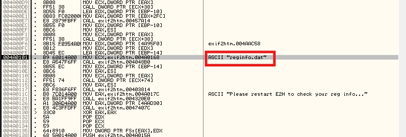

Trông có vẻ quan trọng. Đây là một tệp dữ liệu và có vẻ như nó sẽ được tạo ra. Sau khi bỏ qua 2 dòng tiếp, ta đến địa chỉ 4A010B

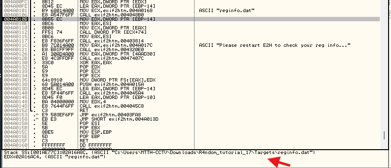

Một dãy kí tự trông giống như đường dẫn tệp sẽ được hiển thị trong cửa sổ thông tin, đây là vị trí mà ứng dụng đang được thực thi tại thời điểm hiện tại. Trong đường dẫn tệp này có tên của tệp dữ liệu (dat file) mà ứng dụng dường như đang định tạo ra. Nếu tiếp tục thực hiện các bước debugging thêm một vài lần cho đến khi vượt qua lệnh gọi tại địa chỉ 4A0112, ta có thể sẽ thấy một thông báo nhỏ hiện lên tệp kia :

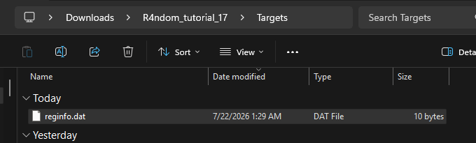

Trước đó thì nó không có. Hãy xem thử nội dung của nó

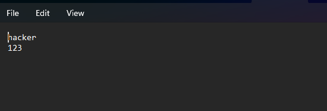

Ok đã biết dưx liệu của ta sẽ lưu ở đâu. Ta biết rằng ứng dụng sẽ tạp 1 tệp tin reginfo.dat trong cùng thư mục nơi ứng dụng được lưu trữ và tệp tin này sẽ lưu tên cùng mã người dùng nhập vào. Giờ đây, khi đã hiểu rõ cách chương trình kiểm tra việc đăng ký của người dùng. Ta có thể tận dụng thông tin này để tìm ra mã đăng ký. Mở Olly thực hiện tìm chuỗi kí tự, tìm cụm từ "reginfo.dat".

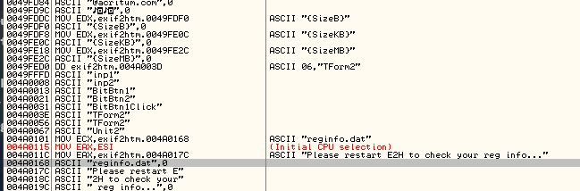

Nhấp chuột phải vào liên kết tham chiếu đến reginfo và chọn xem mã nguồn để xem đoạn mã đó như nào

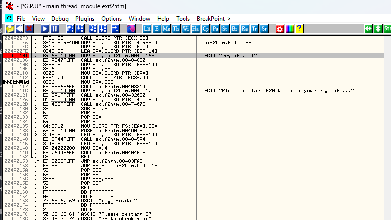

Khi cuộn lên trên, ta thấy không có lệnh nhảy điều kiện nào, tuy nhiên ở phần dưới BP của ta lại xuất hiện một số lệnh nhảy như vậy. Tiếp tục và đóng ứng dụng(bấm Run trong Olly sau đó bấm OK trong cửa sổ registry và đóng ứng dụng thông qua chính ứng dụng) đảm bảo toàn bộ mã xử lý việc lưu trữ thông tin đều được thực thi xong xuôi. Sau đó, ngayu khi khởi dộng lại app, ngắt chương trình tại BP

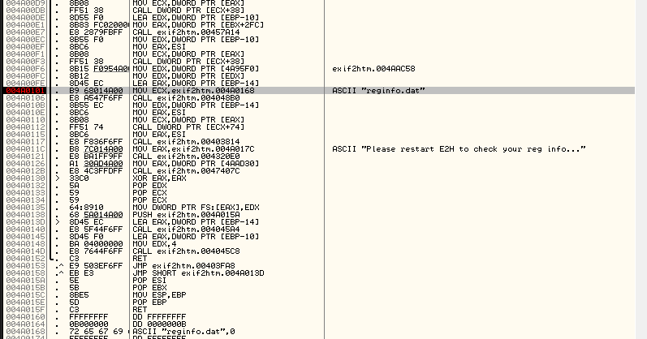

Tiến hành step từng bước để xem điều gì diễn ra. Tại lệnh nhảy có điều kiện đầu tiên tại địa chỉ 49AC26, ta không thực hiện nhảy. Vì ta chưa biết rằng nó là vị trí cần vá không, nên tiếp tục thực hiện từng bước. Tập lệnh tiếp theo sẽ tải tên người dùng và code từ tệp dữ liệu, sau đó thực hiện mộ số lời gọi hàm với các giá trị này. Đây có thể là một điểm cần xử lí. Khi đến lệnh nhảy có điều kiện tiếp theo, ta thấy chương trình thực sự sẽ thực hiện nhảy

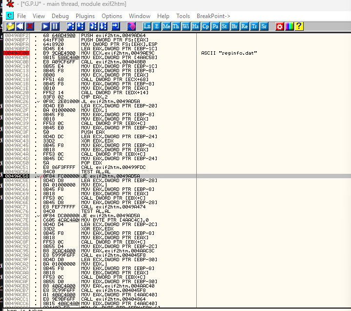

Khi bước vào phân tích, ta nhận ra mình đang đi đến đâu :

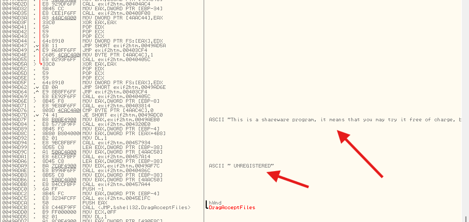

Trông không khả quan lắm. Nếu tiếp tục thực hiện step, ta sẽ nhảy đến đoạn mã "Shareware" chứng tỏ ta đã đi quá xa. Không thực hiện nhảy thử xem

Tại lệnh nhảy ở địa chỉ 49AC58

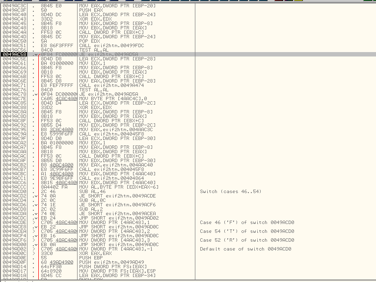

Ta sửa cờ ZF để không nhảy, đồng thời F8 từng dòng lệnh. Sau đó tiến tới lệnh nhảy có điều kiện cuối cùng tại địa chỉ 49AC78

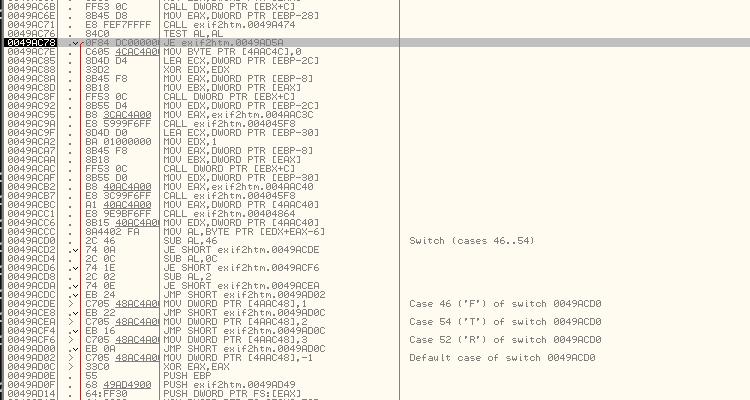

Khi xem xét vị trí nhảy đến, ta thấy cùng mục đích nhảy như lần nhảy trước. Nếu ta thực hiện nhảy thì nó sẽ lại bị shareware. Điều này cho thấy rằng đây là lần kiểm tra thứ 2 với cặp tên và code của ta. Ngăn nhảy này bằng cách đặt lại cờ ZF:

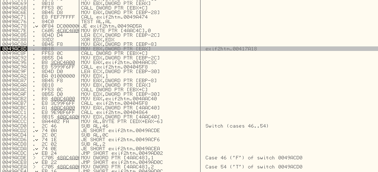

Giờ đây, nếu step liên tục, sẽ thấy không có hiện tượng nào xảy ra, mở ứng dụng 

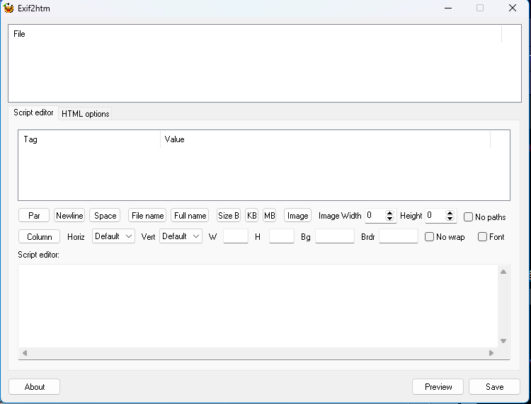