# Introduction 

Thử nghiệm thời gian là một dạng giới hạn trong ứng dụng, khi người dùng chỉ sử dụng trong một số ngày nhất định hoặc thực hiện một số lần thử nhất định trước khi ứng dụng ngừng hoạt động. Thông thường, một ứng dụng sẽ cho phép người dùng dùng thử trong 30 ngày sau thời gian này ứng dụng sẽ bị vô hiệu hóa. Trong một số trường hợp, khi thực hiện bẻ khóa ứng dụng, việc phân tích ngược mã thử nghiệm thời gian là rất đáng giá vì lúc này quá trình đăng ký sẽ dễ dàng được xác định hơn. Ngoài ra nếu lười thì ta chỉ cần sửa đổi đoạn mã kiểm tra thời gian mà không cần thay đổi gì khác, từ đó được dùng thử ứng dụng vô hạn

# Loading the app


Khi khởi động ứng dụng, ta thấy màn thời gian xuất hiện ngay lập tức:

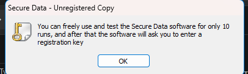

Nhấp OK, màn hình chính sẽ xuất hiện :

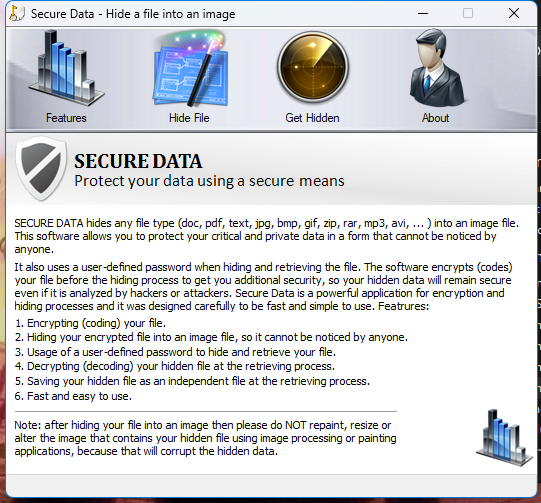

Nhấp vào About ta sẽ thấy

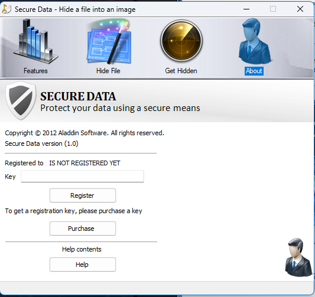

Nhập bừa key, ta nhận được :

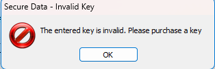

Tải chương trình vào Olly :

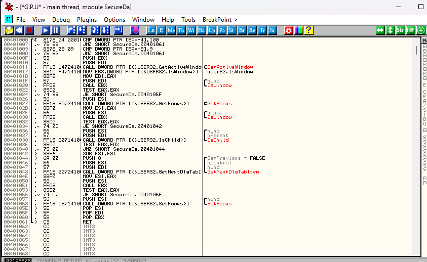

Tìm kiếm chuỗi kí tự, ta thấy thông điệp hiển thị trên nag:

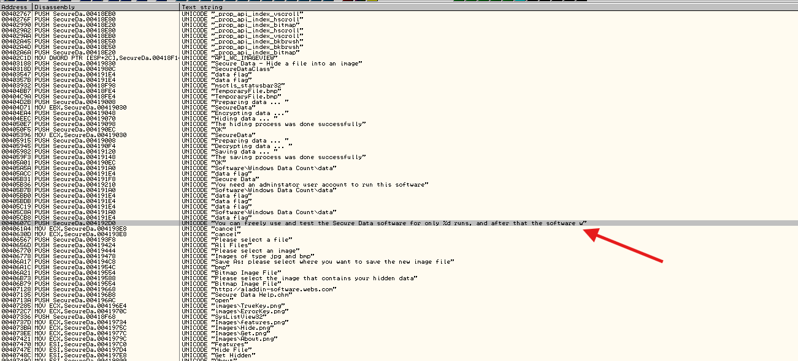

Tuy nhiên, ta không thấy bất kì ràng buộc nào liên quan đến màn hình đăng kí

Lưu ý là không phải chuỗi văn bản nào trong ứng dụng cũng được lưu trong bộ nhớ. Nếu tác giả đã thực hiện các biện pháp bảo vệ một cách nghiêm túc thì những chuỗi quan trọng nhất sẽ không được giải mã trước mà chỉ được giải mã khi cần sử dụng. Trường hợp này rõ ràng là vậy: Khi màn hình đăng ký cần hiển thị thông báo cho người dùng cho biết key nhập sai, chuỗi văn bản đó mới được giải mã vào đúng thời điểm đó

# The Time Trial

Điều quan trọng nhất là kĩ sư RE cần nắm rõ là ứng dụng phải lưu lại chính xác số lần thử hoặc số ngày còn lại sau khi người dùng đóng và khởi động lại chương trình. Điều này đồng nghĩa với việc một số dữ liệu nhất định phải được lưu trữ bền vững ở đâu đó. Hai phương án là registry và một tập tin trên ổ cứng

Trong phần lớn trường hợp, dữ liệu này không bị thay đổi bởi vì một quan niệm sai lầm phổ biến giữa lập trình viên là người dùng sẽ không muốn tốn công sức để tìm kiếm nó. Tiếc là dữ liệu này thường dễ tìm thấy. Cách đơn giản nhất là xem xét các chuỗi văn bản và tìm kiếm đường dẫn tệp. Những đường dẫn này khá nổi bật : Software\\AppName\\Key

Trong khi đó một đường dẫn tệp có dạng :

AppName\DataFileName.ini hoặc AppName\DataFileName.dat

và tên tệp hoặc thư mục sẽ chứa một chuỗi kí tự dạng  %WINDOWS% dùng để chỉ đến thư mục cài đặt hệ điều hành Windows

Ta cũng có thể sử dụng chức năng "Search for intermodular call", miễn là ứng dụng không quá lớn. Ta sẽ nhận thấy các lời gọi phương thức kiểu CreateFileExA hoặc các lời gọi kiểu RegSetValueExA tùy thuộc vào việc ứng dụng lưu dữ liệu trên đĩa hay registry. Tiếc là ứng dụng này sử dụng cả 2 phương pháp vì nó tạo các tệp tin trên ổ đĩa nhằm che giấu các tệp tin khác

Khi xem lại cửa sổ chuỗi, ta thấy có một chuỗi tham chiếu đến khóa đăng kí

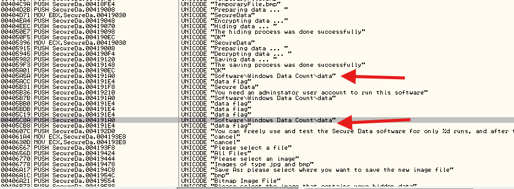

Thông tin cần biết là : registry là một cơ sở dữ liệu có cấu trúc dạng cây tệp tin thông thường và ta có thể truy cập nó thông qua công cụ regedit, công cụ này được tích hợp sẵn trong Windows. Để mở regedit, ta chỉ cần nhấn phím Windows + R để mở cửa sổ Run, sau đó gõ regedit và nhấn Enter

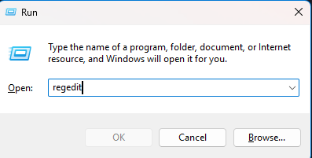

Top ̀5 folder cuar registry

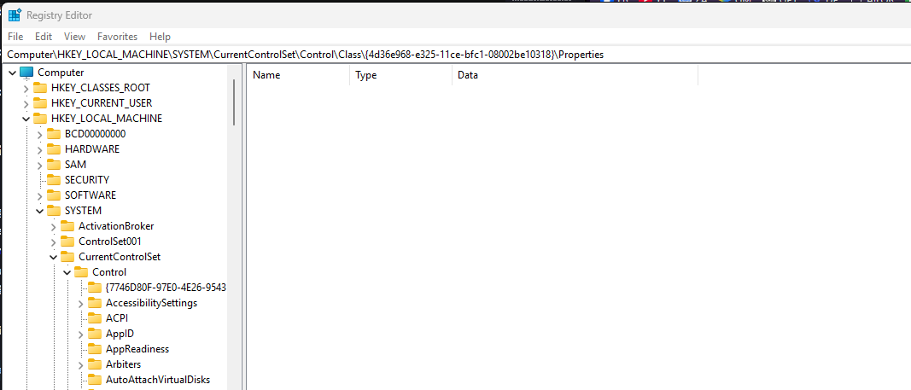

Dãy khóa của chúng ta không bao gồm khóa gốc chính(root key), do đó khi lần lượt mở từng thư mục trong số này, tiếp tục mở khóa "Software" và tìm kiếm thư mục "Windows Data Count", ta sẽ thấy nó nằm trong thư mục HKEY_LOCAL_MACHINE

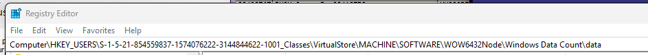

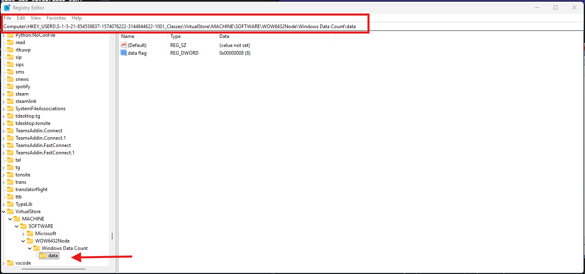

Như thấy bên trái, giá trị của khóa "data flag" là 8(tùy trường hợp). Đổi thử giá trị xem có gì. Chuột phải vào khóa, chọn "Modify", nhập 100(thập phân), Lưu.

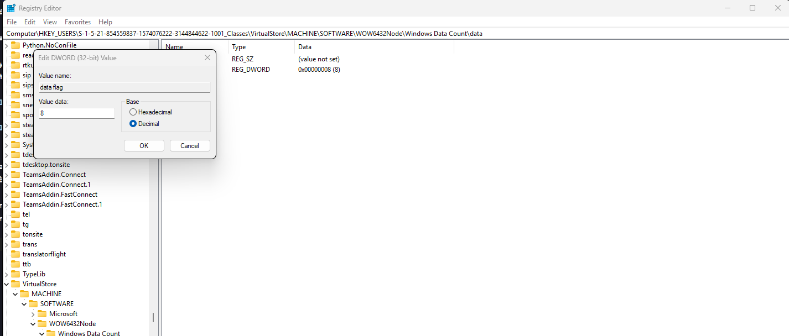

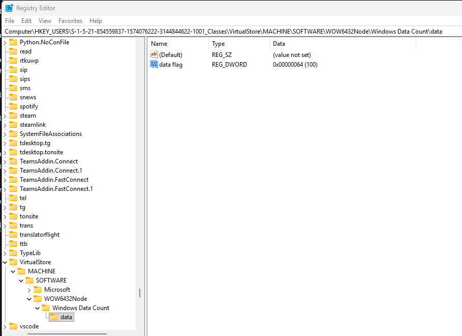

Giờ mở ứng dụng

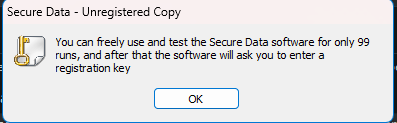

Trông có vẻ ma quỷ :))))

# Investigating the Binary

Một cách khác để xử lí cái tính thời gian là sửa đổi trực tiếp mã nguồn. Phương pháp này sẽ hiệu quả hơn vì ta không cần phải thay đổi khóa đăng kí mỗi lần sử dụng ứng dụng quá 256 lần (0xFF là giá trị lớn nhất có thể ghi vào khóa đăng kí mà không làm nó chiếm 2 byte và gây sập ứng dụng). Trước đó, khi tìm kiếm chuỗi văn bản, ta thấy chuỗi hiển thị thông báo về số lần thử còn lại là x. Quay lại chỗ đó xem nó trông như nào. Trước tiên, ta thấy văn bản đang được tải vào địa chỉ 406078(Thực tế, việc sử dụng một con trỏ tham chiếu đến văn bản sẽ chính xác hơn)

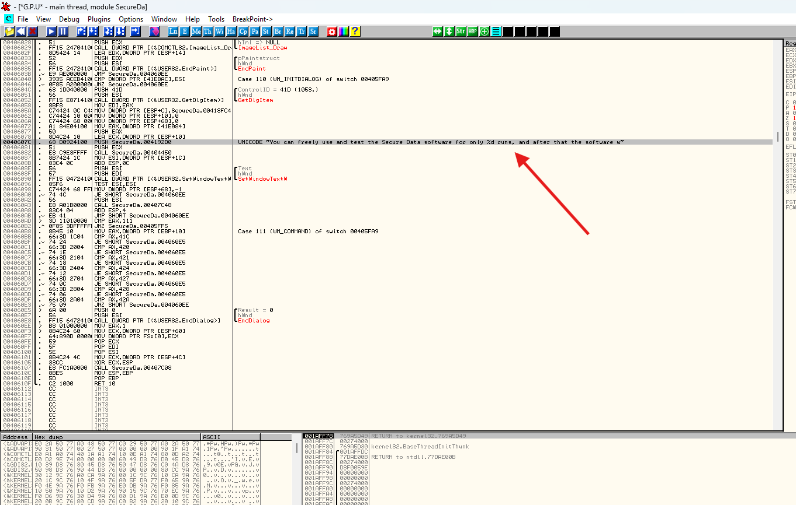

Nhìn vào bức tranh tổng thể, ta có thể thấy đây là một quy trình thường lệ trong hàm gọi lại của Windows khi nhận được thông báo WM_INITDIALOG

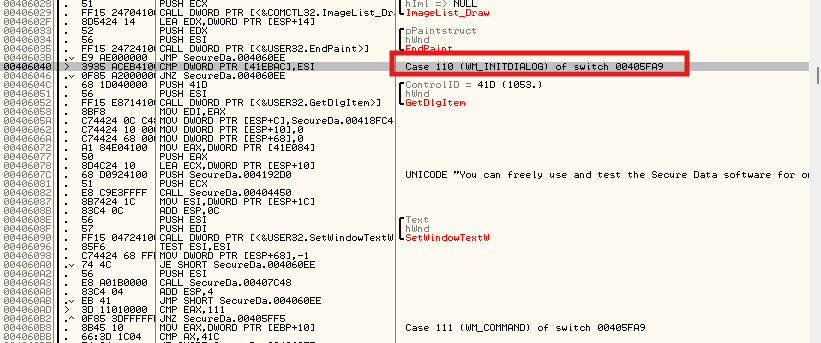

Thao tác đầu tiên nó thực hiện là tải một con trỏ điều khiển của một thành phần điều khiển Windows có mã ID 0x41D(1053) nhằm truyền vào hàm API GetDlgItem. Khi xem trong Resource Hacker, ta có thể thấy mã ID 1053 tương ứng với nội dung văn bản trong hộp thoại cảnh báo lần đầu về trial time

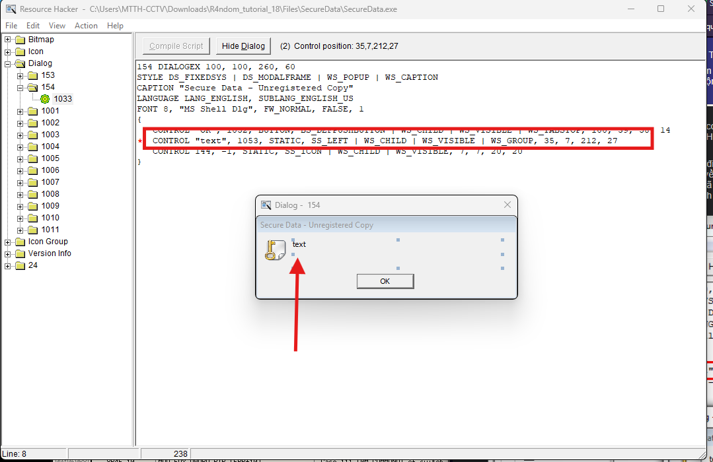

Khi tra cứu hàm GetDlgItem trong tài liệu API, ta thấy hàm trả về một con trỏ (handle) đến thành phần điều khiển của Windows thông qua thanh ghi EAX. Sau khi đặt BP tại 40604C(lệnh PUSH 41D), khởi động lại app và thực hiện từng bước step-in đến lệnh này, ta thấy giá trị trả về là 0x290784 và được lưu vào thanh ghi EDI

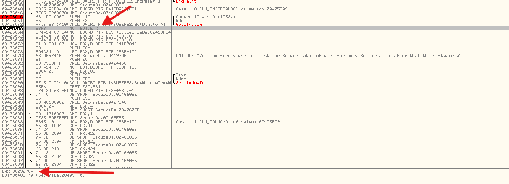

Lệnh tiếp sẽ nạp nội dung tại địa chỉ 418FC4 vào ngăn xếp tại địa chỉ ESP+C. Sau hằng số này trong bản dump, ta thấy rằng địa chỉ 418FC4 lưu trữ một địa chỉ khác là 403980, nếu theo dõi sâu hơn, ta sẽ thấy callback. Ta có thể giả định rằng đây là hàm gọi lại cho hộp thoại

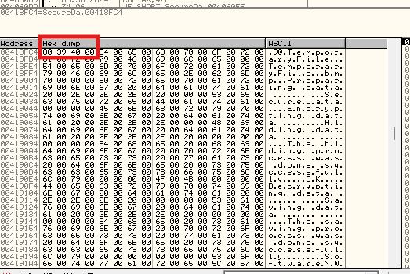

Hai dòng lệnh tiếp theo sẽ đẩy các giá trị 0 vào ngăn xếp(khởi tạo một số biến cục bộ được sử dụng trong lần gọi hàm), sau đó đọc một giá trị từ địa chỉ 41E084 và gán vào EAX

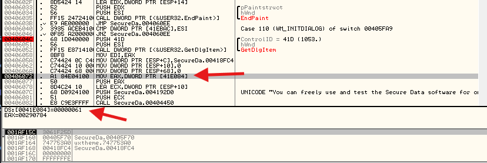

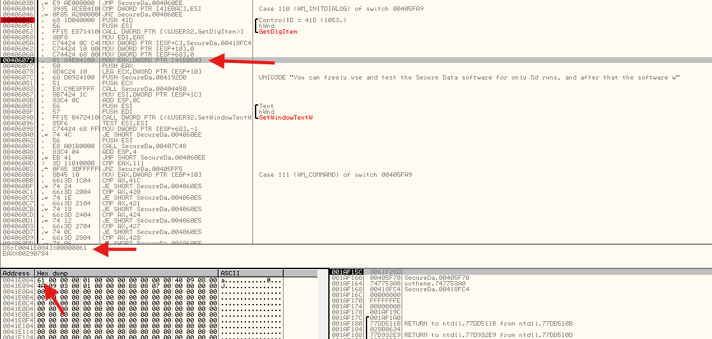

Hiện tại, lí do mà cái này đáng ngờ là nó bằng chính cái số lần thử còn lại. Nếu khởi động lại app, giá trị sẽ giảm đi một đơn vị vì ta dùng 1 lần. Do đó, ta có thể suy ra rằng địa chỉ 41E084 này lưu trữ số lần thử nghiệm còn lại của ta. 

Cuối cùng, chương trình mục tiêu sẽ đẩy giá trị này cùng với một con trỏ đến chuỗi vào ngăn xếp, sau đó thực hiện một lời gọi hàm. Lời gọi tại địa chỉ 406082 nhằm kiểm tra số lần thử còn lại có nhỏ hơn 0 hay không và chèn giá trị đó vào chuỗi. Có thể thấy rằng chuỗi này hiện không chứa giá trị nào

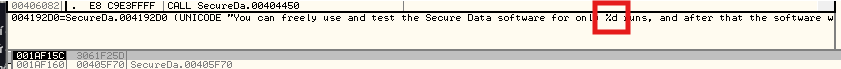

Có thể nhận ra đây là một biểu thức dạng printf

```c
printf(“My IQ is a whopping %d”, 18);
```

Trong đó, phần "%d" sẽ được thay thế bằng giá trị thập phân nằm ở cuối chuỗi định dạng. Lệnh gọi này cũng thực hiện chức năng tương tự. Vì số lần thử nghiệm là động, ta cần tạo một chuỗi tổng quát và sau đó chèn giá trị thực tế vào chuỗi đó tại thời điểm thực thi. Khi xem xét đoạn mã sau lệnh gọi này, ta có thể gthaays giá trị đã được chèn thông công vào chuỗi

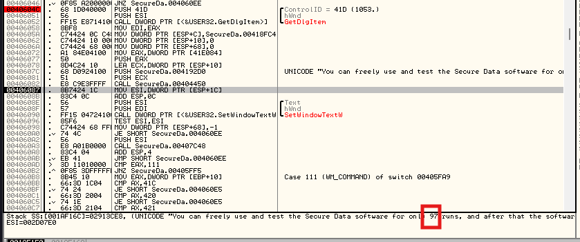

Giờ đây, ta có thể khẳng định chắc chắn rằng địa trị được nêu trên thực sự chứa số lần thử còn lại. Sau khi hoàn tất phần mã nguồn này, thông báo nhắc nhở về thời gian thử nghiệm sẽ được hiển thị và người dùng nhấn nút OK

# Patching the Target

Có thể nghĩ ngay: "Tại sao không đơn giản là thay đổi thao tác di chuyển nội dung tại ô nhớ đó(ô nhớ lưu số lần thử còn lại), cụ thể là thay vì tải giá trị số lần thử còn lại vào ô nhớ, thì chuyển một giá trị lớn tùy ý vào đó? VD như này, thay tại 406072 :

```c
MOV EAX, DWORD PTR DS:[41E084]
```

thành như này

```c
MOV EAX, 99
```

Lý do là vì tất cả những thay đổi này chỉ đơn thuẩn là làm thay đổi giao diện hộp thoại mà thôi, việc kiểm tra thực tế số lần thực tế số lần thử còn lại vẫn được thực hiện đầy đủ. DO đó, khi số lần thử còn lại < 1, ứng dụng sẽ ngừng hoạt động(mặc dù ứng dụng vẫn hiển thị rằng còn 99 lần thử). Vì vậy điều chúng ta cần làm là xác định vị trí mà ứng dụng tải giá trị này từ registry và gán vào biến tương ứng

Giải pháp là đặt một BP hardware tại vị trí bộ nhớ này, nhằm yêu cầu Olly tạm dừng chương trình mỗi khi một giá trị mới được ghi vào đó. Bước đầu tiên là truy vết địa chỉ này trong file dump :

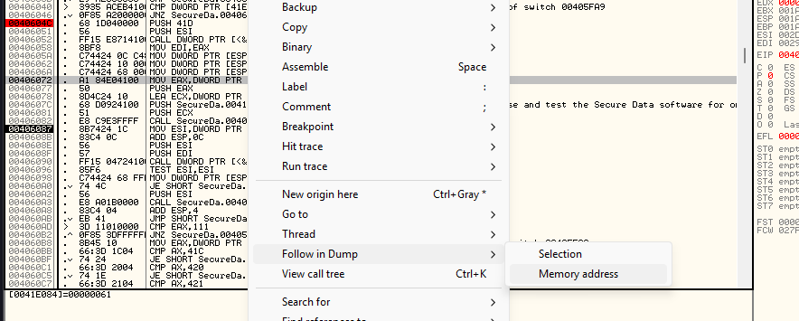

Sau đó, trong vùng nhớ dump, ta cần thiết một điểm ngắt phần cứng tại vị trí này để tạm dừng chương trình mỗi khi có giá trị mới được ghi vào đó

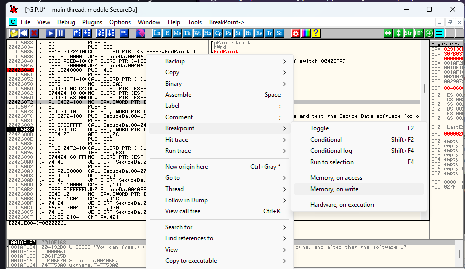

Như đã thấy, còn số lần thử nghiệm. Mỗi khi có một giá trị mới được ghi vào biến này, hệ thống sẽ phát sinh một sự kiện HBP

Khởi động lại app. Olly sẽ dừng tại điểm ngắt phần cứng HBP của ta. Có thể nhận biết điều này bằng cách quan sát phần dưới cùng của cửa sổ Olly

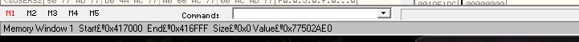

Cùng điểm lại xem đã dừng lại tại đâu

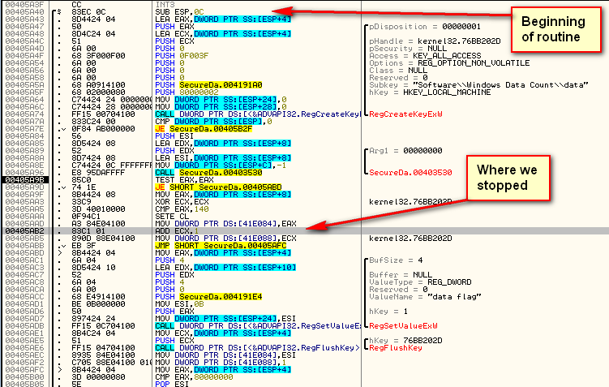

Tại phần trên cùng của hàn hình, ta có thể thấy giá trị đăng kí được truy xuất từ thư mục Windows Data Count(hàm RegCreateKeyExW không chỉ được dùng để tạo khóa mà còn để mở khóa đã tồn tại). Sau đó mã mục tiêu thực hiện một số xử lý tại địa chỉ khoảng 405A7E, kiểm tra xem giá trị trả về có = 0 không(nêu = 0, nghĩa là chương trình không được phép truy cập vào registry), và nếu đúng như vậy, sẽ chuyển đến đoạn mã lỗi tại địa chỉ 405B2F, đoạn mã này thông báo rằng cần có đặc quyền quản trị viên mới có thể truy cập khóa này. Nếu không có lỗi xảy ra, lời gọi tại địa chỉ 405A96 sẽ thực sự tải giá trị tương ứng với khóa đó vào bộ nhớ và trả về giá trị này qua thanh ghi ESP +C(Sau đó thực hiện lệnh return, thanh ghi này sẽ trở thành ESP+8)

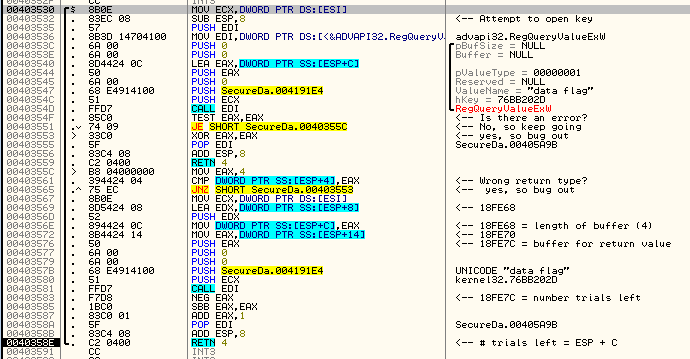

Chú thích vào đoạn mã

Sau đó, ta sẽ gán giá trị trả về vào biến tại địa chỉ 405AAD. Đây là lệnh trước khi ta tạm dừng trong Olly

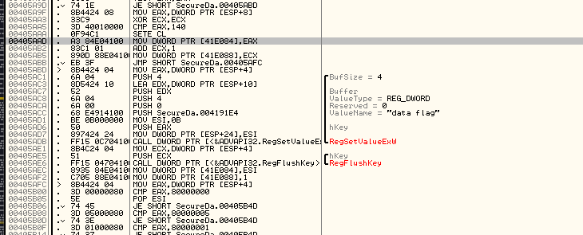

Cuối cùng, ta kiểm tra các giá trị bất thường, đóng khóa và trả về kết quả

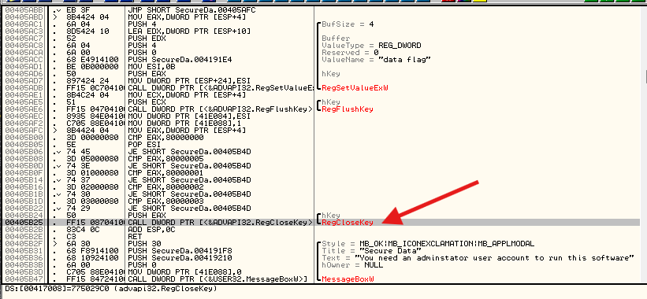

Vấn đề đặt ra là: Dâu là vị trí lí tưởng nhất để thực hiện vá lỗi cho tệp nhị phân? Khi theo dõi ngược dòng mã, tại địa chỉ 405AAD, giá trị nhận được từ registry sẽ được lưu vào một vị trí bộ nhớ nhằm phục vụ việc kiểm tra số lần thử nghiệm sau này. Hiện tại, giá trị này chưa bị thay đổi hay chỉnh sửa nào, nó chỉ đơn thuần được tải từ registry và lưu tại đây. Vấn đề nằm ở chỗ, nếu cố gắng vá lỗi bằng cách thay thế bằng một đoạn mã như _MOV DWORD PTR DS:[41E084], FF_, thì toàn bộ đoạn mã sẽ lỗi nghiêm trọng, cụ thể là 2 lệnh tiếp theo sẽ bị xóa

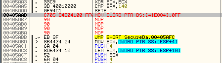

Vậy thì, điền đoạn mã vào vị trí lệnh trước đó tại địa chỉ 405A9F, nơi giá trị được gán bằng số lần thửu nghiệm đã được trả về

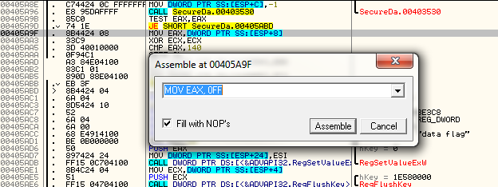

Và sau khi vượt qua bước này, ta có thể thấy rằng biến của ta đang lưu giá trị 0xFF thay vì số lần thử lại thực tế

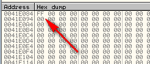

Mở lại và chạy app :

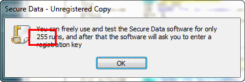

Lưu file vá lỗi. 

# Conclusion

Rõ ràng, cách tốt nhất là loại bỏ tính năng cảnh báo (nag) trong ứng dụng. Tuy nhiên ta sẽ không đề cập đến vì việc hiểu rõ cơ chế hoạt động của các bản dùng thử và nhận diện chúng là rất cần thiết, vì chúng sẽ dẫn ta đến phương án bảo vệ thực sự của ứng dụng. Thứ 2 là đôi khi không thể crack được ứng dụng nào đó, ta cần dùng bản dùng thử là tốt nhất

__Bonus question__: Những lệnh kiểm tra có ngoại hình kỳ lạ xuất hiện tại địa chỉ 405B08 là gì? Và lệnh kiểm tra so sánh với giá trị 0×140 tại địa chỉ 405AA5 nhằm mục đích gì?

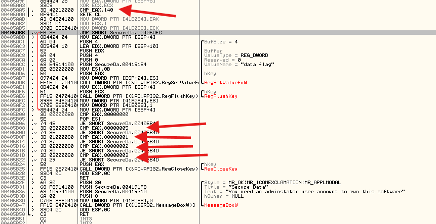

Khả năng giá trị 0x140 = 320(hệ 10) thì có thể hiểu con số 320 này giống như cái key để có bản premium nếu ta register với con số này. Cụ thể nó sẽ so sánh với 320. Nếu bằng thì bên dưới có lệnh _SETE CL_ (set if equal) thì nó sẽ ghi 1 vào thanh ghi CL. Còn nếu không bằng thì gán 0 vào CL

Đối với loạt các lệnh so sánh ở phần 405B08, thì đây là một kiến trúc Windows API, cụ thể :

CMP EAX, 80000000 (HKEY_CLASSES_ROOT)

CMP EAX, 80000005 (HKEY_CURRENT_CONFIG)

CMP EAX, 80000001 (HKEY_CURRENT_USER)

CMP EAX, 80000002 (HKEY_LOCAL_MACHINE)

CMP EAX, 80000003 (HKEY_USERS)

Mỗi lệnh đi kèm với một lệnh _JE SHORT SecureDa.000405B4D_. Như vậy đây là đoạn so sánh EAX để xin cấp registry nào.

