# Introduction

Tiếp tục sẽ là về công cụ patcher. Đây là một chương trình cho phép kỹ sư RE áp dụng các bản vá, những bản vá đã được tìm ra nhằm thay đổi hành vi của ứng dụng theo ý muốn(vd: bỏ qua đăng kí, hiển thị chế độ chơi) lên một bản sao mới của chương trình. Thông thường, các patcher là những chương trình nhỏ, được cung cấp kèm theo bản phần mềm gốc chưa qua chỉnh sửa(Vd: bản mà tải về từ trang web của nhà sản xuất). Sau khi chạy chương trình, công cụ vá lỗi sẽ áp dụng các bản vá mà ta chọn vào chương trình gốc chưa được chỉnh sửa và sau đó chương trình sẽ được vá lỗi

Ví dụ, giả sử ta tải về một bản sao của ứng dụng "The Most Awesome Program In The World", một ứng dụng có tính năng giới hạn thời gian sử dụng. Sau khi nghiên cứu kĩ lưỡng ứng dụng này, ta tìm ra một bản vá có thể giúp vượt giời hạn thời gian đó khi được áp dụng. Lúc này, ta có thể nhập bản vá này vào một công cụ và vá lỗi, đồng thời chỉ rõ chính xác vị trí của lệnh cần được thay đổi cũng như nội dung lệnh mới cần thay thế. Giờ, ta có thể phân phối bản cập nhật này thay vì phải cung cấp toán bộ phần mềm "The most" kia và chỉ cần hướng dẫn người dùng tải ứng dụng từ nhà phát triển rồi chạy công cụ cập nhật. Khi người dùng thực hiện việc này, các thay đổi mà ta đã thiết lập  sẽ được áp dụng và ứng dụng mới sẽ được cập nhật thành công.

Một thành phần khác cũng tương tự như phần mềm vá lỗi patcher là loader.

Trong bài sẽ sử dụng công cụ vá lỗi dUP2 và CFF explorer

# Loading the App

Khi khởi động ứng dụng, ta thấy 1 hình ảnh bắt mắt :))

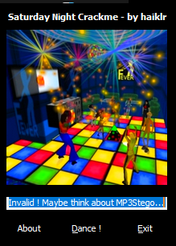

Nhạc nhẽo của cái game này khá đau đầu :)

Nhập mã

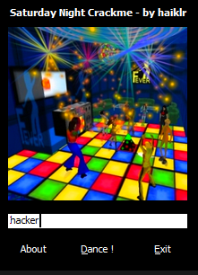

Click "Dance" ta thấy badboy :

# Patching the App

Tải vào Olly

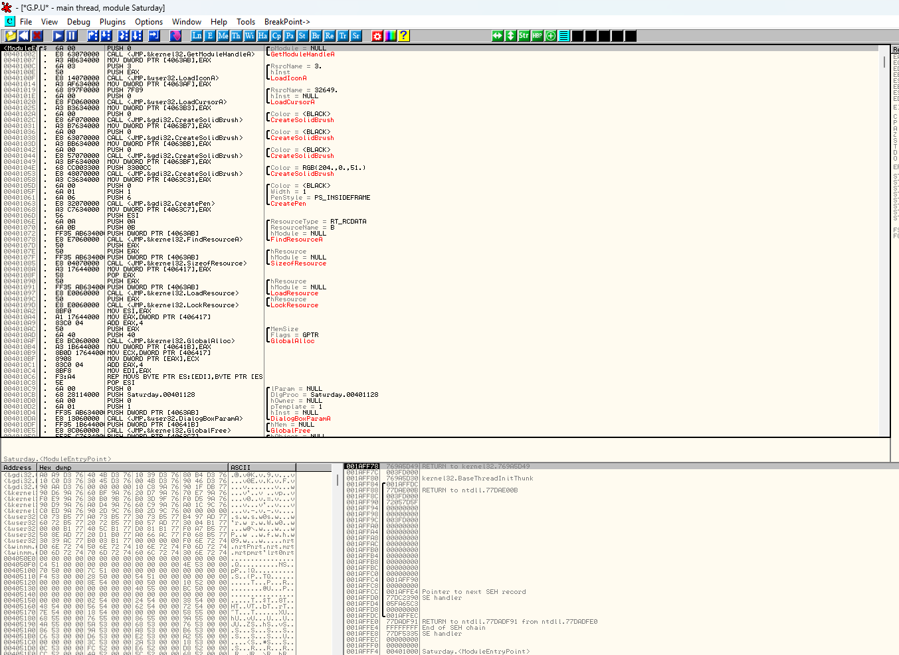

Tìm theo chuỗi :

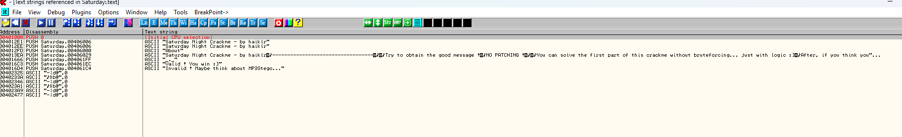

Đến badboy :

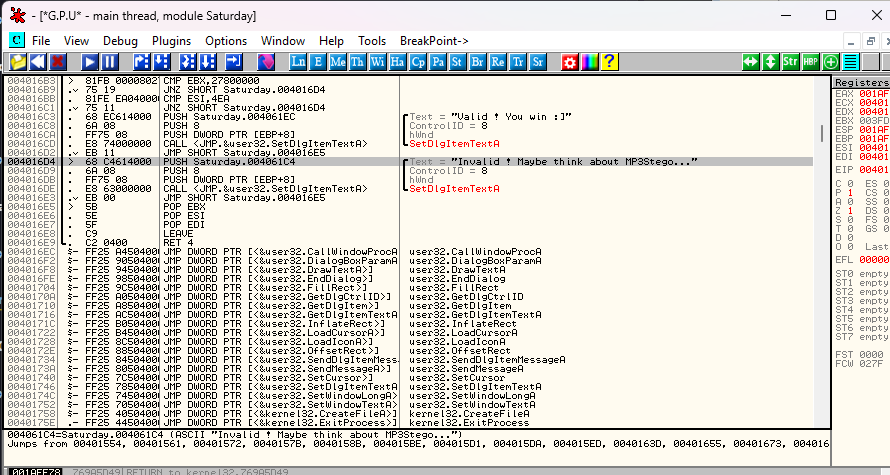

Ở đây ta thấy badboy được tạo ra. Cuộn lên để xem cái hàm tạo badboy này được gọi ở đâu

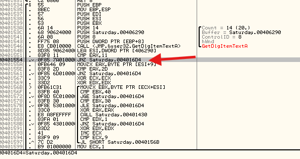

Ta đặt BP tại đây và thực thi chương trình để bắt được lệnh JNZ này. Thông thường, ta sẽ thay đổi trạng thái cờ zero(zero flag) tại đây, sau đó lần lượt từng lệnh để xem hàm badboy có được gọi hay không. Sau đó, ta sẽ quay lại và sửa đổi tất cả các lệnh nhảy đến badboy bằng cách thay thế chúng bằng lệnh không nhảy. Tuy nhiên, mục tiêu của ta đơn thuần là hiển thị đoạn mã goodboy, hãy thay đổi lệnh JNZ thành lệnh nhảy trực tiếp đến đoạn mã goodboy thay vì kiểm tra điều kiện, như vậy, ta sẽ không cần nhập bất cứ giá trị nào, vốn mặc định là sai, chương trình vẫn nhảy đến đoạn mã goodboy. Ta có thể thấy đoạn mã goodboy có địa chỉ 4016C3

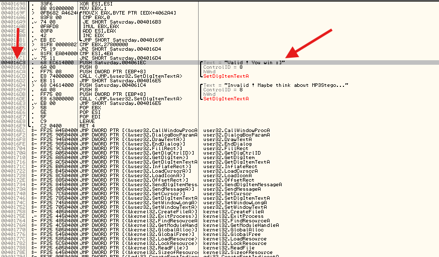

Hãy thay đổi lệnh JNZ nhắm đến badboy thành nhắm đến goodboy

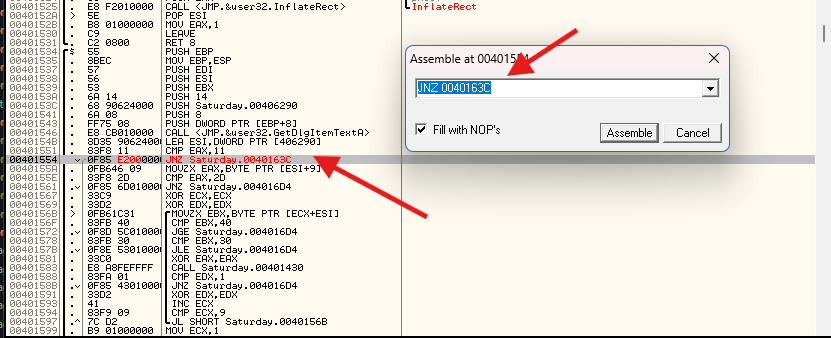

Sau khi áp dụng bản và và thực thi chương trình, ta thấy rằng dù nhập bất kì nội dung nào vào ô mã(trừ mã hợp lệ), hệ thống vẫn không phản hồi lỗi nào để dưa ta đến goodboy

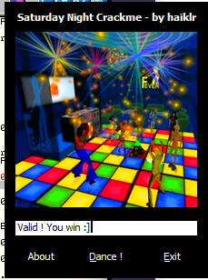

Ta sẽ quay lại để thảo luận chi tiết về bản vá này sau khi tìm hiểu dUP2002

# Introducing dUP2 

Hiện có một vài công cụ tạo bản vá patcher. Về cơ bản có 2 phương pháp chính để tạo bản vá : 1) Bản vá theo vị trí offset(offset patch) và 2) bản vá kiểu tìm và thay thế (search and replace patch). Bản vá theo vị trí offset là phương pháp được dùng khi biết chính xác vị trí ofset trong tệp tin mà bản vá cần áp dụng. Phương pháp này thường được dùng khi sử dụng olly, khi người dùng tự tìm ra vị trí cần vá và xác định rõ ràng vị trí đó. Để thực hiện bản vá này, ta cần nhập vị trí offset(khoảng cách tính từ đầu tệp) của bản vá cùng với các nội dung cần thay đổi, sau đó dUP2 sẽ tự động tạo ra 1 chương trình có thể thực thi được, chương trình này sẽ thực hiện các bản vá mà ta đã cung cấp

Loại thứ 2 là Tìm và thay thế, được sử dụng khi biết rõ các lệnh cần thay đổi nhưng không xác định được vị trí chính xác của nó trong tệp tin hoặc trong trường hợp chương trình có khả năng tự sửa đổi, khi đó các vị trí cần vá lỗi có thể thay đổi mỗi lần ta chạy chương trình, dó đó việc sử dụng một offset cố định là không khả thi. Chính vì vậy, chức năng Tìm và Thay thế hoạt động theo nguyên lí này : nó sẽ tìm kiếm một dãy lệnh nhất định và khi phát hiện được dãy lệnh đó, nó sẽ thay thế chúng bằng các thay đổi do ta cung cấp

dUP cũng cho phép áp dụng bản vá trực tiếp vào registry(tuy nhiên điều này ảnh hưởng lớn)

Ta cũng có thể cấu hình  để dUP2 tự động trích xuất các tệp tin khác khi chương trình khởi động, đây là lựa chọn lí tưởng nếu ta đã tạo sẵn một tệp dữ liệu thay thế hoặc tệp khóa riêng. Khi thực hiện bản vá, tệp .ini được cài đặt sẵn sẽ bị thay thế bằng tệp do ta cung cấp

Cuối cùng, dUP2 cho phép sử dụng các skin tùy chỉnh. 

Khi khởi động dUP2, màn hình đầu tiên hiện ra trước mắt người dùng

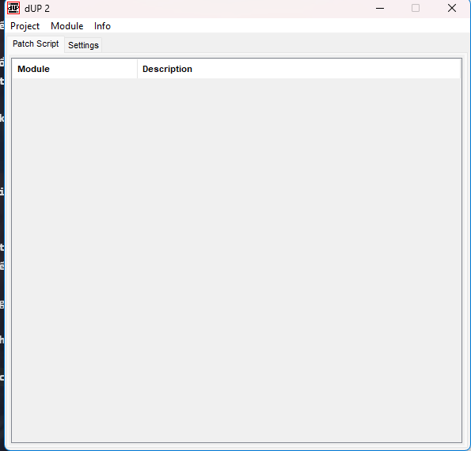

Chọn Project -> New, màn hình tạo dự án mới :

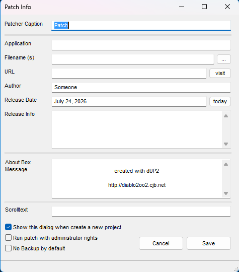

Tại đây, nhập một số thuộc tính của công cụ patcher
+ Patcher caption : Đây là nội dung sẽ xuất hiện ở tiêu đề cửa sổ công cụ cập nhật
+ Application : Đây là tên của ứng dụng mục tiêu và sẽ được hiển thị ở phần đầu giao diện của công cụ patcher. 
+ Filename : Đây là đường dẫn đến tệp mục tiêu.
+ Author : Người thám tử tài năng đã sáng tạo nên tác phẩm này.
+ Release date : Rõ ràng
+ Release info :  Area này dùng để cung cấp các lưu ý, chẳng hạn như hướng dẫn sao chép tệp .ini hoặc các bước cần thực hiện sau khi cài đặt bản vá lỗi.
+ About box message
+ Scrolltext : Một thanh văn bản có thể cuộn xuất hiện ở phía dưới cửa sổ patcher.

Cơ bản như này

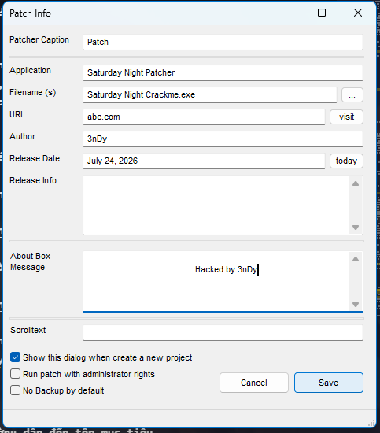

Sau khi nhấp vào lưu, quay lại màn hình chính và thấy màn hình này hiển thị thông tin :

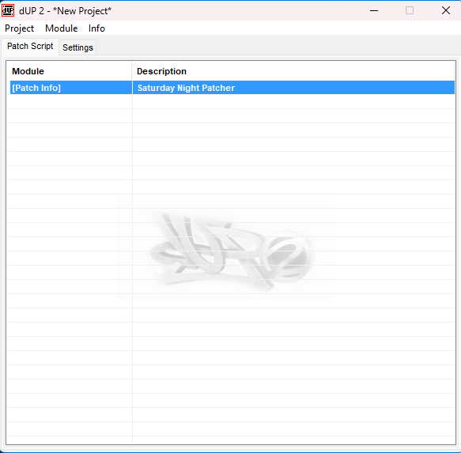

Thông thường ở bước này nên lưu lại project. Nhấp đúp vào dòng  Patch Info sẽ mở lại màn hình chính thiết lập dự án, trong trường hợp nhập sai dữ liệu

Tieeps theo, ta sẽ thêm một bản vá. Nhaaps chuột phải vào dòng Saturday Night Patcher, chọn Add rồi chọn Offset patch. Thao tác này sẽ thêm một dòng mới vào dự án của ta.

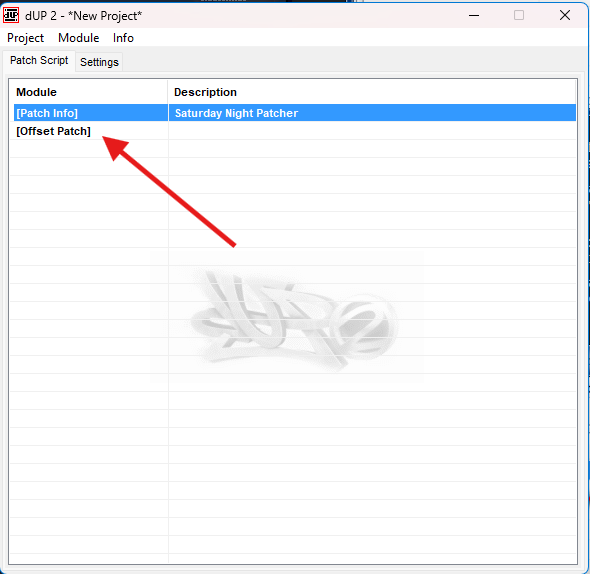

Khi nhấp đúp vào dòng mới này, cửa sổ chính của bản vá offset được hiển thị :

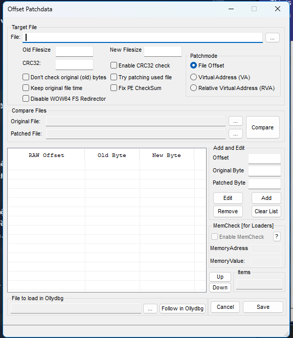

Trang này là nơi nhập toàn bộ thông tin bản vá. Ô đầu tiên nhập tệp mục tiêu. Nhấp vào "..." và chọn tệp

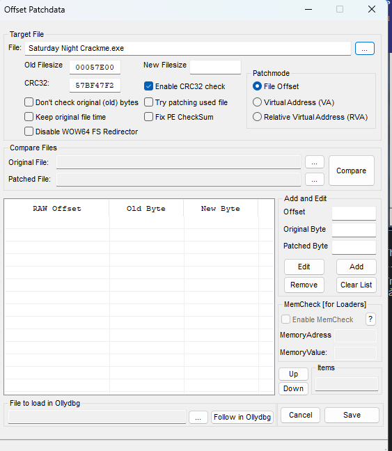

Các ô "Old Filesize", "New Filesize" và "CRC32" được dùng khi ứng dụng kiểm tra CRC, nên ta có thể để nguyên các ô như hiện tại

_Kiểm tra CRC là một phương pháp ngăn việc sử dụng các bản vá lỗi cũng như các tệp bị lỗi hoặc bị biến đổi(phần mềm độc hại). Khi chương trình lần đầu đưiocj thực thi, phương pháp này sẽ kiểm tra từng byte trong tệp thực thi để đảm bảo không có byte nào bị thay đổi so với bản phân phối ban đầu. Sau đó, nó sử dụng một thuật toán đơn giản để tạo ra một khóa CRC duy nhất. Nếu bất kỳ byte nào bị thay đổi, khóa này sẽ đổi theo. CRC là viết tắt của Cyclic Redundancy check

Nhóm "Patchmode" cho phép ta chọn một trong 3 tùy chọn: giá trị offset dựa trên tệp nhị phân, offset dựa trên địa chỉ ảo hoặc RVA. Trong trường hợp này, ta sẽ sử dụng tùy chọn mặc định

Tính năng "Compare files" là một công cụ hữu ích, cho phép ta so sánh 2 tập tin, bản gốc và bản được vá lỗi, từ đó tạo ra một tệp vá dựa trên khác biệt giữa chúng. Tính năng này được dùng để tạo tệp vá  khi có sẵn một tập tin đã được vá nhưng không nhớ cách thức tạo ra nó, tuy nhiên, đôi khi cần dùng nếu cần tạo lại tệp vá.

Khu vực dữ liệu chính là nhóm "Add and Edit". Tại đây ta nhập lần luwojt giá trị độ lệch (offset), giá trị byte gốc và giá trị byte mới cho từng đoạn dữ liệu

# Creating the Patcher

Điều đầu tiên ta cần làm là ghi lại địa chỉ, các giá trị ban đâof và giá trị mới cho đoạn vá lỗi. Sau khi tải lại chương trình mục tiêu và chuyển đến đoạn mã vá lỗi, ta thấy địa chỉ cần thay đổi là 401554. Ta có thể kiểm tra cột mã lệnh opcodes và nhận thấy các byte ban đầu là 0F85 7A010000, hoặc nếu viết rõ ràng hơn thì là "0F 85 7A 01 00 00"

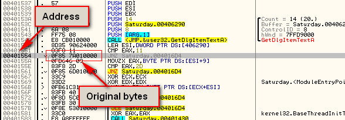

Giờ đây sau khi kích hoạt bản vá trong Olly, ta có thể thấy các byte mới được thay thế 

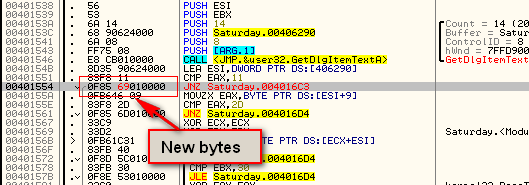

Ta có thể thấy rằng thực tế chỉ duy nhất một byte bị thay đổi: giá tị 7A tại địa chỉ 401556 được thay bằng 69. Do đó, để vá lỗi tại vị trí này, ta chỉ cần thay thế giá trị 7A ở địa chỉ 401556 bằng 69. Bước tiếp theo mà ta cần thực hiện là xác định vị trí offset của bản vá trong tệp nhị phân. Do đó vị trí của bản vá trong tệp nhị phân sẽ khác với vị trí này trong tệp nhị phân thực tế. Trong trường hợp này, ta có thể sử dụng chức năng "Tìm vá thay thê", công cụ sẽ thực hiện tìm kiếm thay ta. Tuy nhiên, ta sẽ sử dụng công cụ hex, vì trong một số trường hợp, có thể tồn tại nhiều nhóm byte trùng khớp với chuỗi tìm kiếm của ta. Ta sử dụng CFF Explorer. Sau khi mở tệp trong CFF và nhấp vào tùy chọn "Hex Editor", ta có thể xem được dữ liệu hex thô của tệp nhị phân này 

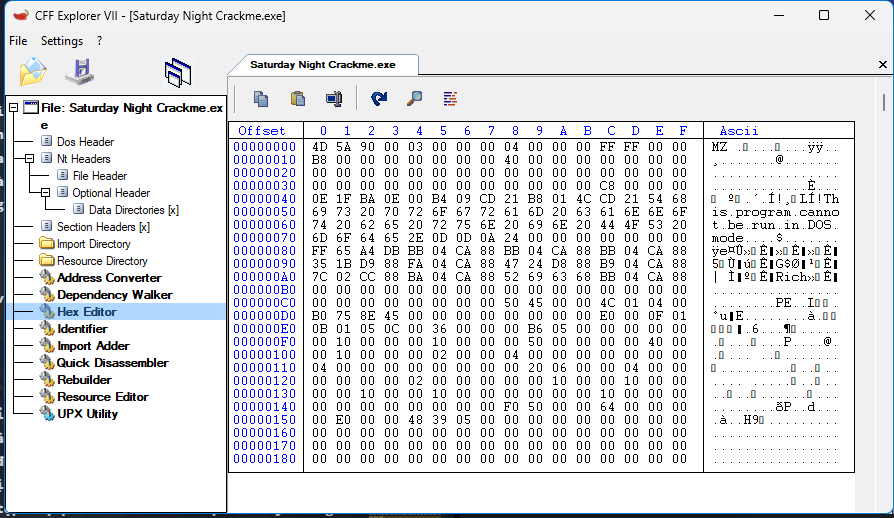

Nhấp vào biểu tượng kính lúp để thực hiện tìm kiếm. Sau đó, ta cần nhập giá trị hex mà ta đang tìm. Ta thường nhập ít nhất một vài lệnh lân cận để phòng trường hợp có mã trùng lặp ở vị trí khác. Trong trường hợp này, ta nhập opcode bắt đầu từ dòng lệnh ngay trước vị trí vá lỗi tại địa chỉ 401551 và bao gồm toàn bộ lệnh tại vị trí vá lỗi ở địa chỉ 401554

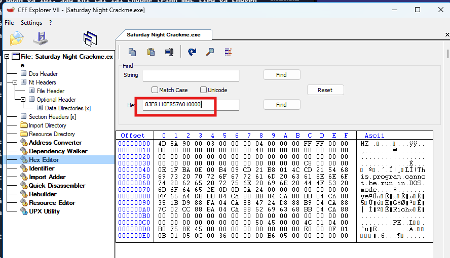

Rồi nhấp tìm. Sau đó CFF sẽ hiển thị vị trí của các giá trị này cho ta

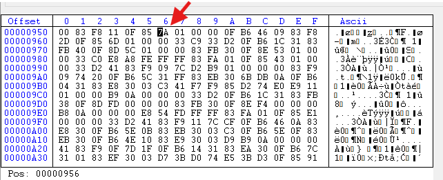

Tại đây, ta có thể thấy vị trí offset của byte cần thay đổi nằm ở offset 956(cách offset 950 đúng 6 byte). Sau đó, ta quay lại với dUP2

Ta nhập dữ liệu ngay lúc này. Đặt giá trị  offset là 956, giá trị cũ là 7A và giá trị mới là 69

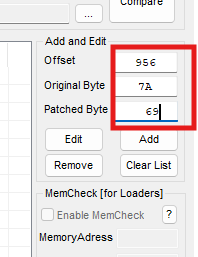

Sau khi click "Add", ta sẽ thấy bản vá của mình xuất hiện trong danh sách các bản vá

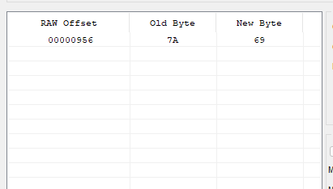

Click "Save", thông tin sẽ lưu vào cửa sổ chính.

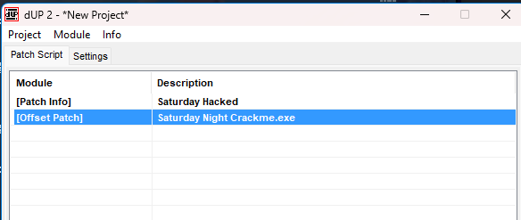

Giờ, chọn Project -> Create Patch. Một cửa sổ chọn tệp sẽ xuất hiện. Nhập tên cho công cụ tạo bản vá và chọn "NO" ở mục "whether to run it or not". Sau đó, ta sẽ có một công cụ tạo bản vá cho bài crackme Saturday Night Crackme

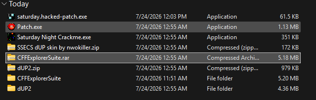

Khi chạy chương trình patcher, màn hình hiển thị sẽ xuất hiện như sau

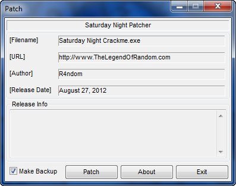

Click Patch 

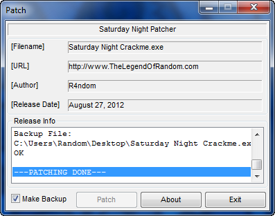

Ta thấy rằng Patch thàng công. Nó cũng tạo tệp backup. Chạy cái tệp mục tiêu, ta thấy đã patch thành công

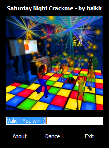

Ta có thể gửi kèm patcher với tệp crackme này bất kỳ ai muốn đều có thể sử dụng công cụ crack này để crack và vá lỗi cho tệp mục tiêu, pathcer phải được đặt trong cùng thư mục với tệp mục tiêu

# Using Search and Replace

Nếu ta muốn sử dụng chức năng Search an Replace, thay vì thêm vào offset mới. Nhấp chuột phải vào danh sách chính và chọn "Add" -> "Add Search and Replace Patch". Sau đó, nhấp vào dòng này trên màn hình chính sẽ mở cửa sổ Tìm kiếm và thay thế

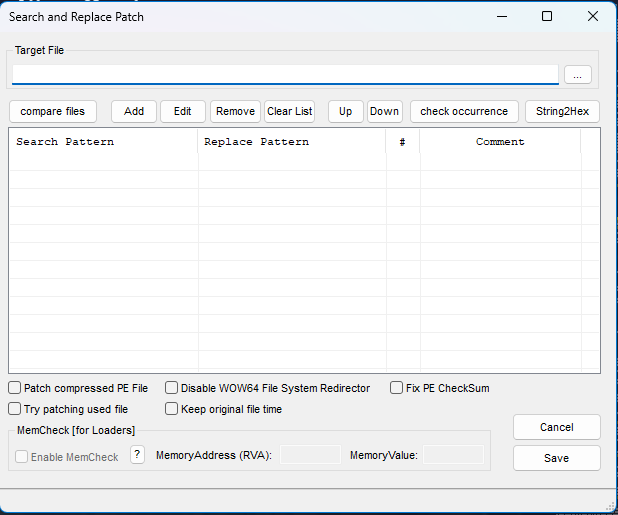

Chọn target và bấm add

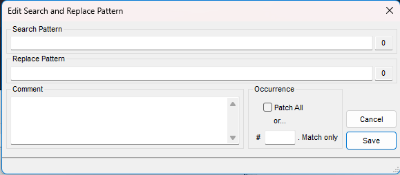

Tiếp, ta nhập lại những thông tin từng điền vào CFF để tìm byte hex, đồng thời thay đổi 7A thành 69

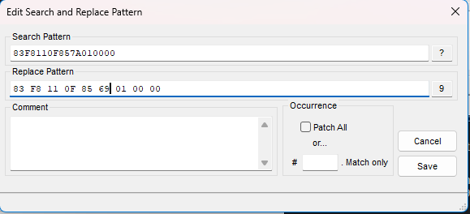

Ta có thể chọn thay thế toàn bộ các mẫu byte trong mục đích thay thế, hoặc chỉ thay thế một số lượng cụ thể nhất định. Chính vì lí do này mà ta đã thực hiện bước tìm kiếm bản vá trong trình soạn thảo hex, để đảm bảo chỉ có duy nhất một tập hợp các lệnh cụ thể như vậy tồn tại. Trong trường hợp này chỉ cần chọn tùy chọn "Patch all" rồi ấn Lưu. Giờ đây, bản vá "Search and Replace" đã xuất hiện trong danh sách

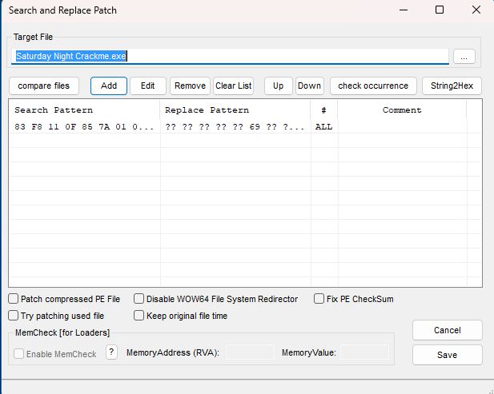

Giờ, nhấp nút Lưu và tạo file patcher như làm trước đó. Chạy thì cũng giống như bản vá offset

# Putting Lipstick on the Pig

Do cái skin bình thường nhìn xấu, nên ta thên skin nworkiller

Thêm skin bằng cách nhấp vào tab "Setting" Điền thông tin cần thiết và chỉ định các tùy chọn chỉnh sang tệp skin

Giờ khi tạo phần mềm vá lỗi thì :

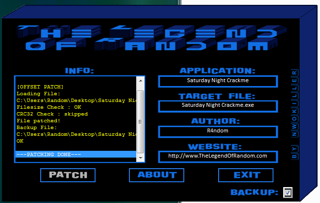