# Introduction

Trong bài này sẽ xử lý các mục tiêu được viết bằng Visual Basic. Một chủ để rộng

# Introducing Visual Basic

Visual Basic là ngôn ngữ lập trình theo cơ chế sự kiện. Điều này có nghĩa thay vì chương trình thực thi tuần tự từ đầu đến cuối, VB sẽ phản ứng với các sự kiện xảy ra trong cửa sổ ứng dụng. Cơ chế này tương tự như lập trình Windows, nơi các sự kiện được phát sinh và kích hoạt các phương thức đã được đăng ký để xử lý chúng, tuy nhiên, điểm khác của VB nằm ở chỗ phần lớn các thao tác xử lý và tạo thông điệp  được thực hiện trong một tệp DLL, chính là tệp môi trường chạy của VB

Quy trình phát triển một ứng dụng có phần khác biệt so với C++. Thông thường, ta sẽ tạo một cửa sổ(hộp thoại) bằng cách kéo các thành phần từ toolbox và thả chúng lên khung thiết kế cửa sổ. Cách làm tương tự C#, .Net. Sau khi hoàn thiện cửa sổ, ta sẽ viết các phương thức để xử lý các sự kiện có thể phát sinh từ tương tác của người dùng với nội dung trong cửa sổ, ví dụ : khi người dùng nhấp vào một nút, phương thức do ta viết để sự kiện nhấp nút sẽ được gọi. Vì ta chỉ cung cấp mã sự kiện, phần lớn các thao tác xử lý của cửa sổ sẽ được tự động thực hiện thay. Toàn bộ quá trình xử lý này diễn ra trong một tệp DLL có tên là msvbvm60.dll, tuy nhiên số 60 này có thể thay đổi tùy theo phiên bản runtime đang được sử dụng

Một điểm khác biệt lớn giữa VB và ngôn ngữ lập trình truyền thống là lập trình viên có thể lựa chọn biên dịch ứng dụng VB dưới dạng bản địa hoặc mã Pcode. Biên dịch bản địa tức là chuyển sang asm để thực thi trực tiếp trên vi xử lý do đó phụ thuộc vào hệ điều hành và kiến trúc bộ nhớ xử lý, ngược lại, Pcode được thực thi dưới dạng dịch động, tương tự java và .Net, nhờ đó có thể chạy trên nhiều hệ điều hành khác nhau. Thuật ngữ dịch động nghĩa là sau khi biên dịch ứng dụng VB thành Pcode, mỗi khi người dùng chạy ứng dụng, một một trường tương tự máy ảo sẽ được kích hoạt để thực thi mã Pcode và dịch nó thành mã bản địa để phù hợp với hệ điều hành cụ thể để sử dụng, quá trình diễn ra ngay thời điểm thực thi. Khi hoạt động, bộ xử lý mã Pcode là một cơ chế tương đối đơn giản, có nhiệm vụ xử lý một chuỗi các mã thao tác cấp cao opcodes. Bộ xử lý này cũng hoạt động dựa trên cơ chế ngăn xếp, do đó có ít đối số được truyền qua thanh ghi

Điểm lợi thế của phương pháp là : nếu ta cài đặt runtime trên một máy Mac, ví dụ thì ứng dụng được biên dịch dưới dạng Pcode sẽ được dịch và chạy trực tiếp trên hệ điều hành Mac. Việc chuyển sang môi trường Linux đơn giản là khởi động máy ảo Linux(bằng cách cài đặt runtime) và ngay lập tức nó sẽ hoạt động trên Linux. Tuy nhiên, nhược điểm là tốc độ sẽ bị ảnh hưởng do mã nguồn phải được chuyển thành mã bản địa trước khi thực thi.

Do các ứng dụng VB  có thể được biên dịch thành Pcode nên các công cụ gỡ lỗi truyền thống trở nên khó sử dụng hơn. Khi kết hợp với thực tế là phần lớn thời gian thực thi lại diễn ra trong các DLL mà ta không để ý, việc gỡ lỗi trở nên thách thức. Tuy nhiên, điều may mắn là hiện có một số công cụ có thể giúp ích cho ta.

# Investigating The Target in Olly

Khi lần đầu tải chương trình vb vào trình debugger như Olly, sẽ thấy một lời gọi thực hiện vào DLL của VB và chương trình sẽ ở trạng thái này cho đến khi có sự kiện nào đó xảy ra. Chính vì vậy mà việc phân tích ngược các chương trình VB sẽ có phần khác biệt so với các chương trình thông thường. Điều đầu tiên ta nhận thấy là call stack gần như không có giá trị, nguyên nhân là do phần lớn thời gian thực thi chương trình diễn ra bên trong một tệp DLL, cụ thể là DLL rumtime của VB> Ta không quan tâm đến DLL này nhưng lại rất cần quan tậm đến các phương thức callback, những hàm xử lý các sự kiện trong chương trình

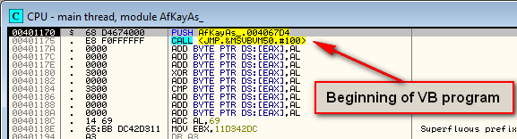

Điểm khác nữa nằm ở cách xử lí các chuỗi kí tự. Do phần lớn các hộp thoại thông báo cũng như thành phần điều khiển cửa sổ khác được lưu trữ trong các phần tài nguyên, Olly sẽ không hiển thị các chuỗi ký tự như các chương trình C hay C++ làm. Vì vậy việc sử dụng chuỗi kí tự tìm kiếm các đoạn mã liên quan thường không khả thi

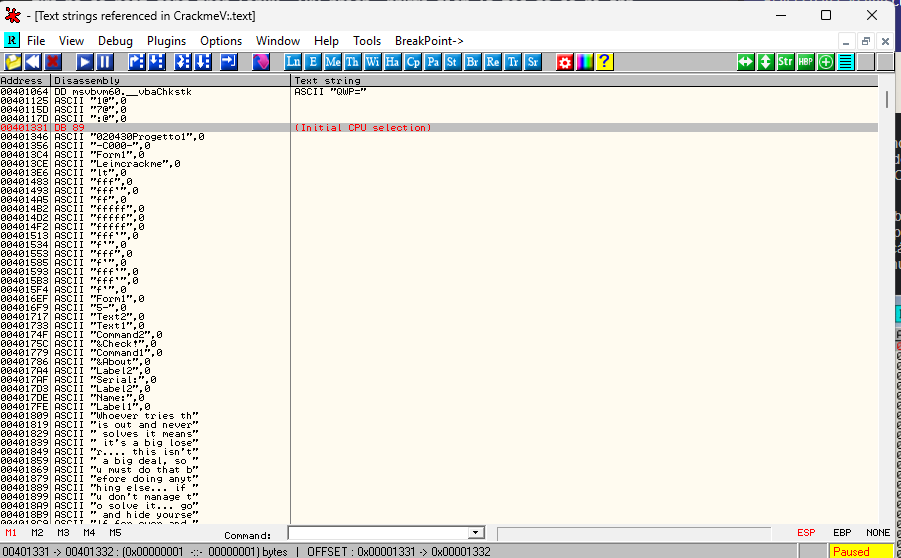

Một trở ngại khác là các lời gọi phương thức trong tệp thực thi VB hoàn toàn khác biệt so với các tệp thực thi thông thường. Thay vì sử dụng các hàm như RegisterWindowsEX hay MessageBoxA, VB lại dùng các lời gọi API riêng, được tích hợp sẵn trong DLL rumtime

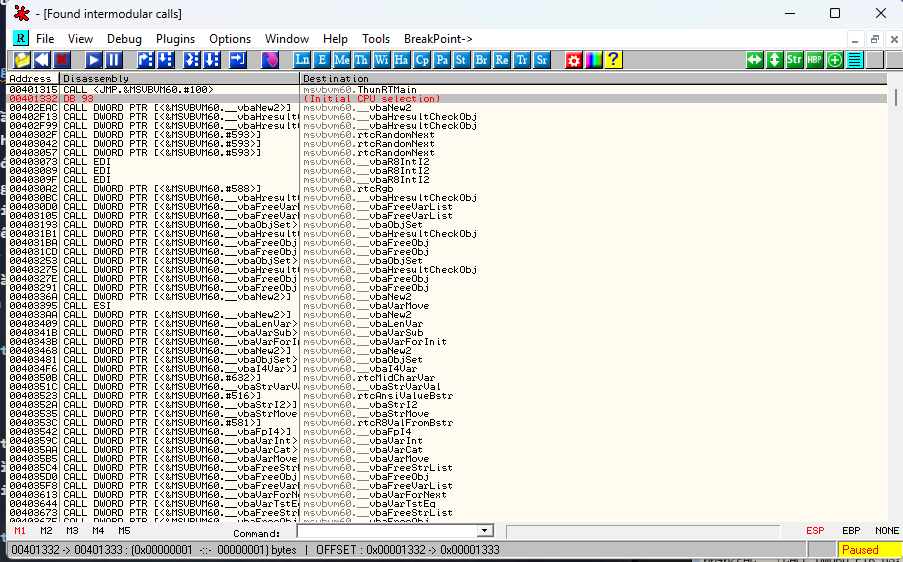

Khi nhấp vào một trong các phương thức này, ta sẽ xem được chi tiết sự khác biệt giữa VB và cách làm mà ta quen thuộc

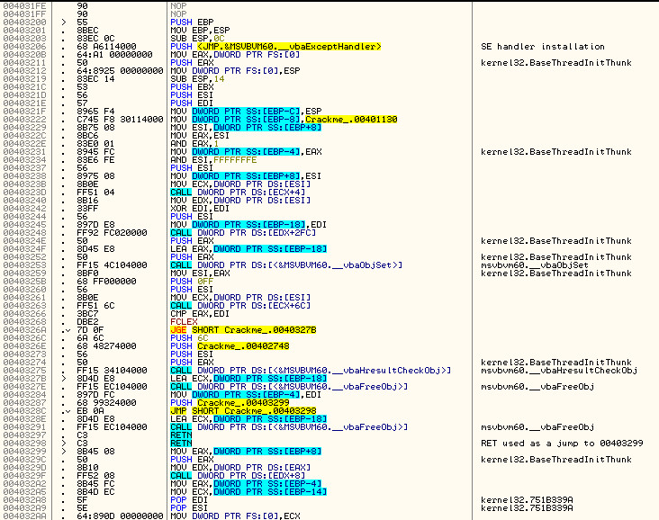

Như đã thấy thì không có chuỗi văn bản hữu ích nào cũng chả có lời gọi API nào có thể nhận biết được

Ta xem thử cấu trúc tệp cơ bản của một tệp thực thi VB. Cuôn lên đầu, ta thấy danh sách các hàm có trong tệp nhị phân này 

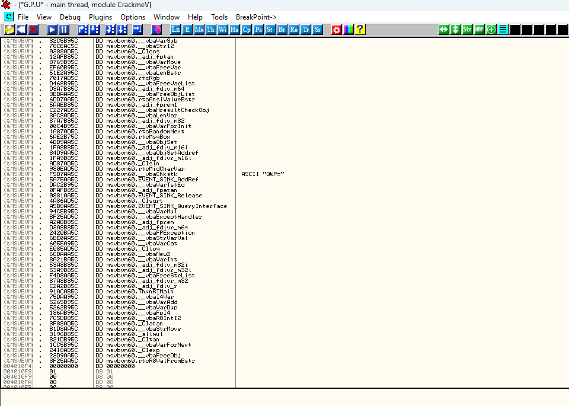

Khi cuộn xuống một chút, ta sẽ đến bảng nhảy(jump table). Bảng này tương tự như các bảng nhảy trong các tệp nhị phân Windows và được thiết kế nhằm hỗ trợ quá trình di chuyển tại mã chương trình

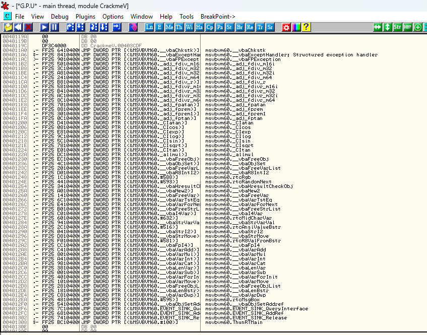

Sau phần này, ta sẽ tiếp cận một vùng dữ liệu khổng lồ, đây chính là nơi tệp nhị phân VB lưu trữ các tài nguyên của nó. Tất cả các thành phần như chuỗi kí tự, nút điều khiển hay các hàm. ! điều cần lưu ý là VB sử dụng tên thực tế của một hàm callback, vì vậy nếu ta muốn "MyButtonCallback" để quản lí sự kiện nút, chuỗi đó sẽ được sử dụng để tham chiếu. Vì vậy, ta sẽ thấy nhiều tên hàm callback được nhúng trong tài nguyên này

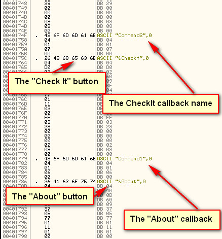

Khi cuộn xuống sâu hơn, ta sẽ đến phần các hàm gọi callbacks. Đây là các hàm callback do người dùng tạo ra để xử lí các sự kiện khác nhau. Hiện chưa có tài liệu này ghi rõ từng callback, tuy nhiên ta sẽ thay đổi điều này bằng các tệp map

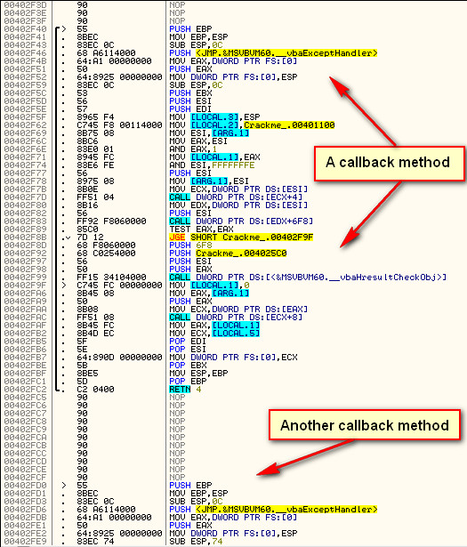

Cuối cùng, ta sẽ đến bảng Import Address Table. 

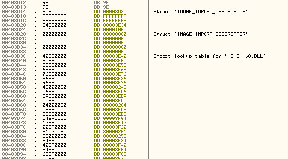

Và cơ bản. Rõ ràng, đây là lượng thông tin đủ.

# VB Decompiler Lite

Đây là công cụ cho phép người dùng giải mã lại mã VB đã được chuyển đổi thành mã Pcode, để khôi phục lại mã nguồn VB gốc ban đầu. Tuy nhiên, nó chỉ đạt mức lý tưởng. Chương trình này còn cho phép ta xem các tài nguyên được nhúng trong tệp thực thi dưới dạng trực quan và dễ hiểu hơn. GIao diện VB Decompiler Lite :

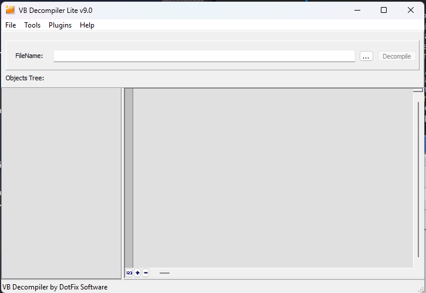

Mở file CrackmeVB1.exe, nhấn "Decompile", ta sẽ thấy toàn bộ mã nguồn :

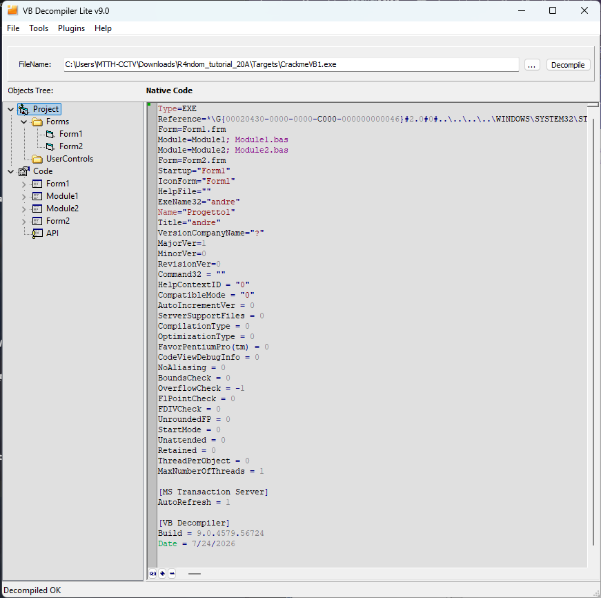

Phần lớn thông tin này không quan trọng, chủ yếu là các thuộc tính tệp và các thông tin tương tự. Tuy nhiên, ta cần lưu ý trong cây dự án, có 2 form : form1 và form2. Đây là các tài nguyên liên kết với từng Form tương ứng. Việc có 2 form cho thấy ứng dụng này thực tế bao gồm 2 form: một là cửa sổ chính, và một là About. Chạy ứng dụng xẽ cho ta biết :

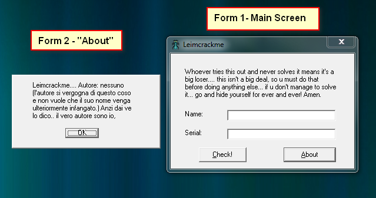

Khi thực thi mục tiêu này, ta cũng nhận thấy 2 điểm khác biệt: màn hình thông tin về ứng dụng ở một ngông ngữ khác và ta không thể nhấp vào nút OK trên đó.

Khi nhấp đúp vào "Form2" trong thư mục "Form", ta sẽ thấy các thành phần tài nguyên khác nhau cùng với các thuộc tính tương ứng của Form2

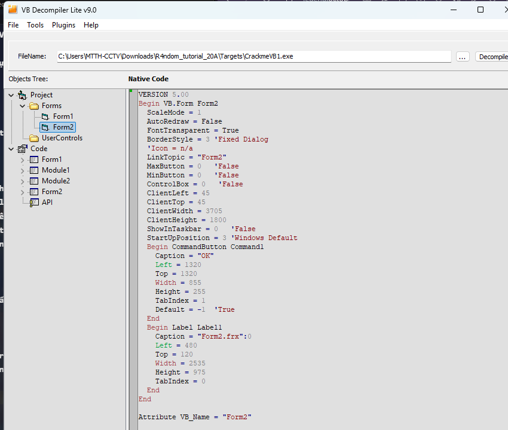

Ở đay, ta có thể thấy một nút với nội dung "OK", một nhãn hiển thị văn bản bằng một ngôn ngữ khác và một phương thức callback xử lý sự kiện nhấn nút OK, có tên là "Command1"

Nhấn đúp vào Form1 sẽ hiển thị các thuộc tính của cửa sổ chính :

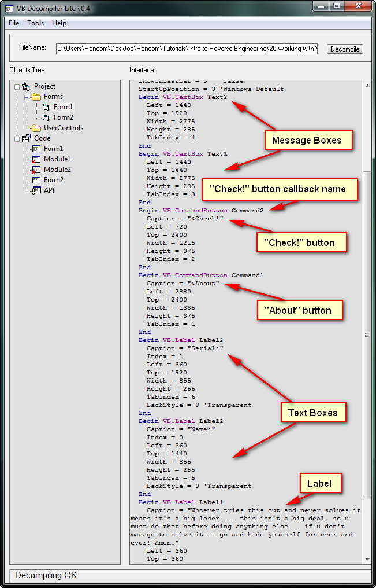

Hiện tại, ta biết một số thông tin : nút chính có tên "Check!" và nó có 1 callback với tên "Command2", Form 1 là form chính mà ta cần tập trung phân tích. Nếu ta xem cây thư mục, dưới nút "Code", ta sẽ thấy các đoạn mã tương ứng với từng form. Khi mở cây của Form1, ta sẽ thấy 5 callback, 1 dành cho nút "Check!" Command2_Click_402FD0 và các phương thức khác dành cho các nút khác cùng các thao tác di chuyển chuột. Khi chạy chương trình mục tiêu, ta ta sẽ thấy rằng các hàm callback của di chuyển chuột sẽ thay đổi màu sắc văn bản khi ta di chuột qua nó

Điều ta cần là Command2 vì đó là hàm callback của ta

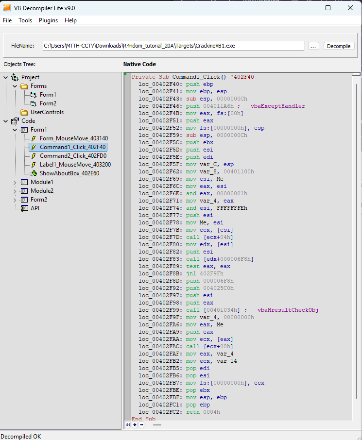

Nhấp đúp vào sẽ hiển thị mã asm thực tế

Điều quan trọng nhất trên màn hình này là địa chỉ hàm callback. Trong trường hợp này, mục đính chính ta sử dụng VB Decompiler là tìm địa chỉ hàm callback liên kết với nút "checkit", địa chỉ này như ta thấy là 402FD0, khi truy cập địa chỉ này trong Olly, ta thấy phần đầu của hàm callback

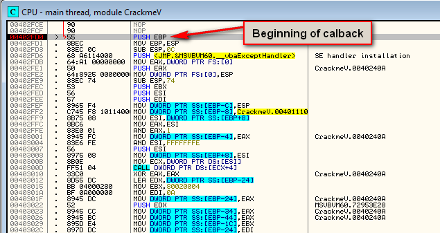

Nếu đặt BP tại đây, thực thi tệp, nhập tên người dùng cùng mã, nhấn nút "Checkit", sẽ thấy Olly dừng tại hàm callback của ta. Như vậy, ta thấy mã callback đăng ký chính

# VB Decompiler Pro

Cái này của tác giả. Nếu muốn minh họa cách mã P thực sự trông như nào, ta cần VB Decompiler Pro và cần bản quyền. Đây là trong bản Pro :

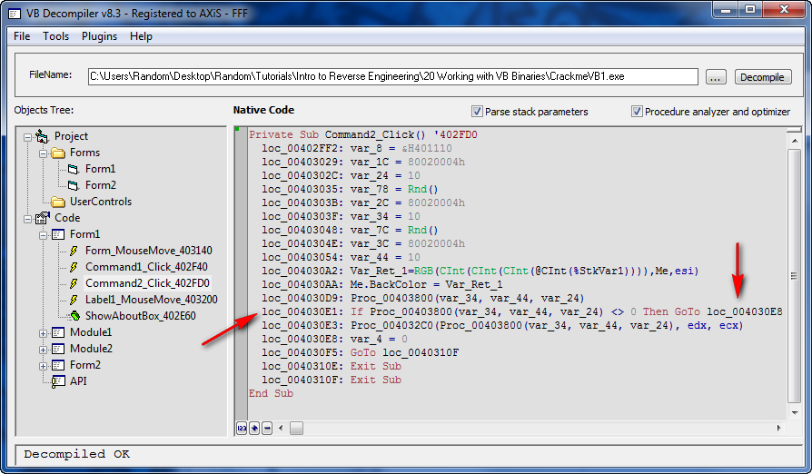

Tại đây ta có thể quan sát Pcode thực sự được sử dụng cho hàm callback. Trước tiên, một số biến được khởi tạo. Màu nền được thay đổi tại địa chỉ 4030A2, một thủ tục được gọi tại 4030D9, sau đó thao tác so sánh và nhảy có điều kiện, có lẽ chính phần bí ẩn trong mã được thực hiện tại địa chỉ 4030E1. CÓ thể thấy rằng nếu kết quả của việc gọi thủ tục tại 403800 là đúng, chương trình sẽ tiếp tục thực thi các lệnh bắt đầu từ địa chỉ 4030E2. 

# Patching the App

Đến địa chỉ 402FD0, điểm khởi đầu của callback, ta thấy mã nguồn :

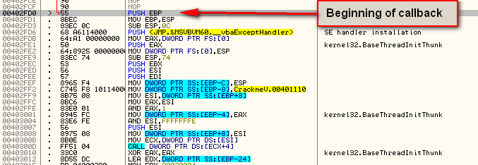

Đặt BP tại đây, và khởi động lại chương trình, sau đó giảm dần giá trị một chút, ta quan sát thấy địa chỉ 4030AA. nền cửa sổ đổi màu sắc, đúng như những gì đã dự đoán từ Pcode

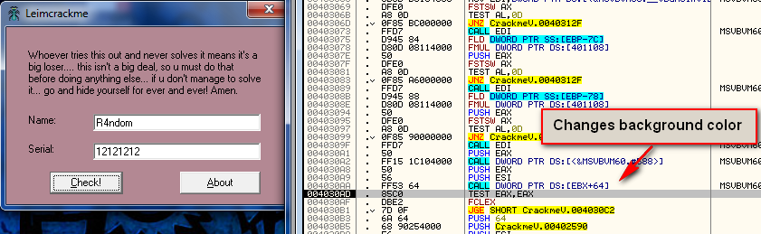

Tại địa chỉ 4030E3, badboy xuất hiện

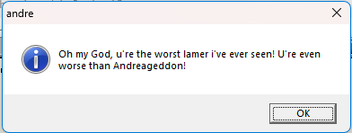

Khi xxem đoạn mã này, ta thấy trước đó là cấu trúc so sánh compare/jump

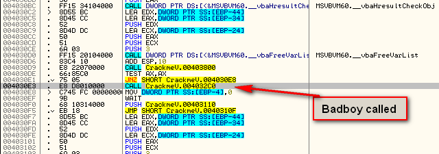

Đặt BP tại 4030E1, khởi động lại chương trình mục tiêu và kiểm tra xem đây có phải là điểm kiểm tra cần tìm không . Khi Olly dừng, đổi cờ sẽ kích hoạt lệnh nhảy tại 4030E1,. Tiếc là thao tác này không hiển thị thông tin nào. Điều này cho thấy ta cần xem kĩ hơn lời gọi đến địa chỉ 4032C0 tại địa chỉ 4030E3. Sau khi đặt BP tại đây, khởi động lại chương trình và thực hiện step info, ta sẽ thấy quy trình giải mã chính

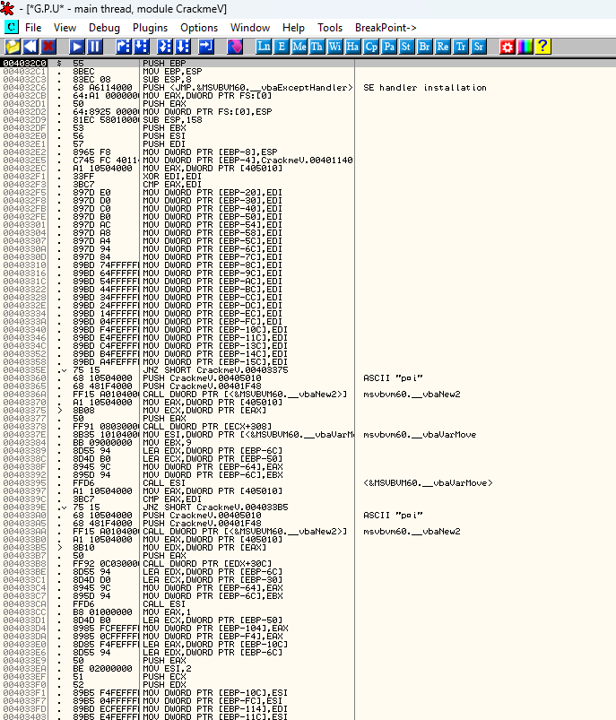

Như đã thấy, trong VB có một số hàm gọi phương thức phổ biến và cần được ghi nhớ kỹ lưỡng. Khi cuộn xuống dưới mã nguồn, ta sẽ thấy một trong những hàm này xuất hiện tại địa chỉ 403644

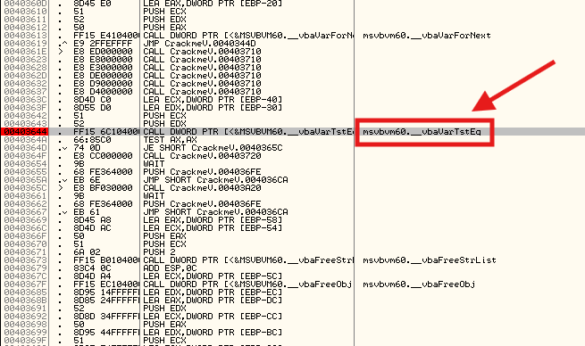

vbaVarTstEq hoạt động tương tự như hàm StrCmp trong mã nguồn gốc, nó dùng để kiểm tra xem 2 đối tượng có trùng khớp với nhau hay không. Khi nhấn giữ chuột để chọn dòng gọi nằm cách 3 dòng phía dưới tại địa chỉ 40364F và bấm Enter, Olly sẽ theo dõi luồng gọi này và ta có thể thấy rằng mình đã đúng hướng:

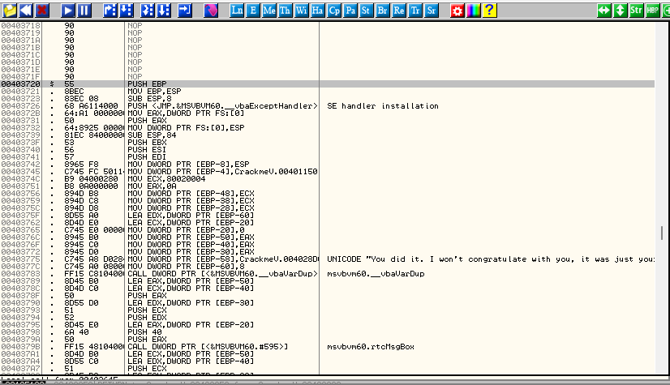

Do đó, ta nhận thấy cần phải thực thi đoạn mã này tại địa chỉ 403644 để xử lý vấn đề này. Khi xem xét các lệnh jump nằm phía trên địa chỉ này, ta thấy lệnh JE tại địa chỉ 40344F

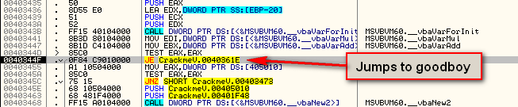

Và chuyển sang phần mã mà ta cần

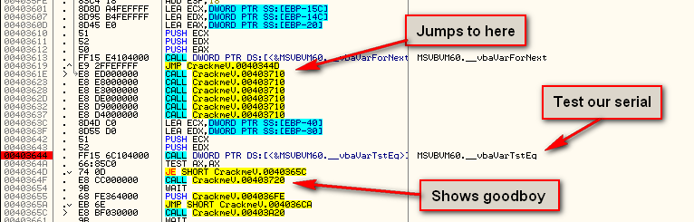

Đặt BP tại địa chỉ 40344F, thực thi chương trình, thay cờ để kích hoạt lệnh nhảy

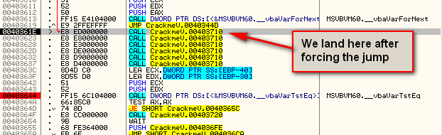

Giờ, đi sâu vào lệnh JE tại địa chỉ 40364D, ta cần ngăn việc nhảy qua lời gọi goodboy. Bằng cách thay đổi cờ. Khi chương trình đến điểm này, ta đã thành công

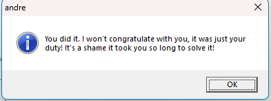

# Frequently Called Methods

Như bên trên, khi xem xét các phương án bảo vệ, có một số phương pháp thường được nhắc đến nhiều :

```
_vbaVarTstEq
_vbaVarTstNe
_vbaVarCmpEq
_vbaStrCmp
_vbaStrComp
_vbaStrCompVar
```

Trong 9 trên 10 trường hợp,  một trong các hàm so sánh này sẽ được sử dụng để đối chiếu một chuỗi với chuỗi đúng. Cụ thể, hàm _vbaVarTstEq được dùng trong bài

Tải tệp CCrackmeVB2.exe vào Olly ngay. Khi thực hiệm các gọi hàm liên modun, ta nhận thấy một trong những lời gọi đáng ngờ

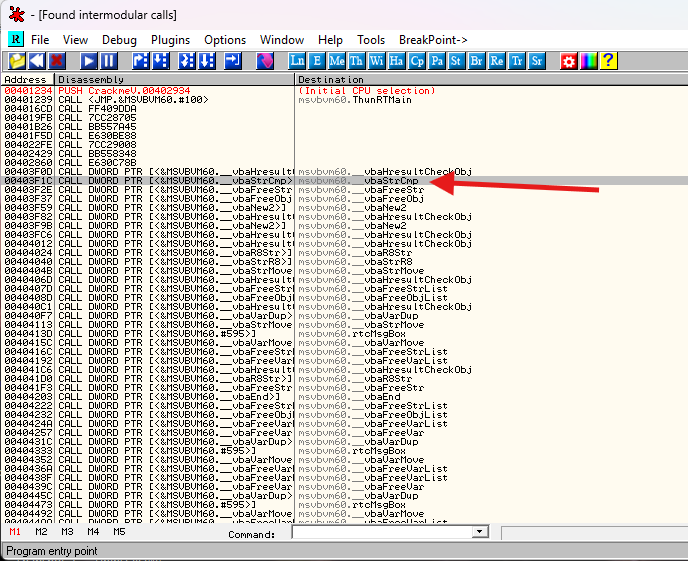

Ở dday, ta thấy lời gọi đến hàm _vbaStrCmp. Khi tra cứu lời gọi phương thức String.CompareTo trong API của VB, ta thấy rằng hàm này nhận 2 chuỗi làm đối số và trả về một giá trị kiểu int. Giá trị trả về có thể là -1, 0(2 chuỗi = nhau) hoặc 1, tùy theo việc chuỗi đầu lớn hay nhỏ hơn chuỗi thứ 2; nếu 2 chuỗi bằng nhau thì giá trị trả về là 0. Dưới đây là cahcs lời gọi này được viết trong VB

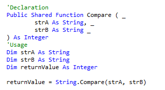

Nhấp đúp vào lời gọi này trong Olly, ta được chuyển đến vị trí thực hiện lời gọi đó

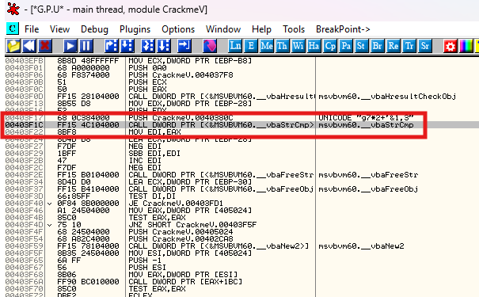

Cùng thiết lập BP cho đường này và thực hiện phân tích

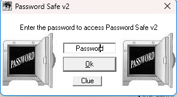

Nhập bừa password và nhấn OK, Olly sẽ gián đoạn ngay tại vị trí ta mong muốn

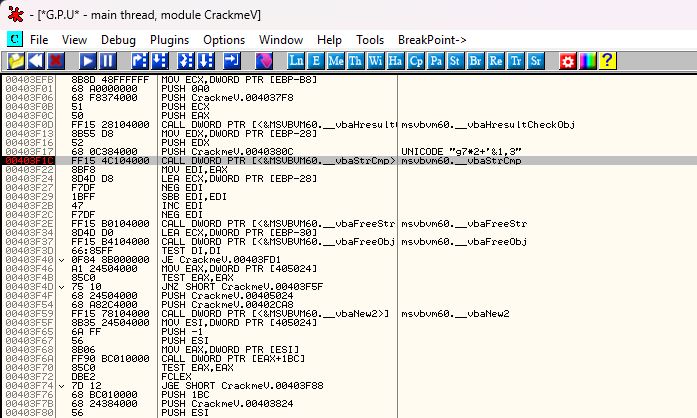

Khi xem xét địa chỉ 403F40 ở mức độ sâu hơn, ta thấy lệnh so sánh và nhảy đặc biệt quan trọng. Nếu ta di chuyển đến lệnh đó, lật cờ, rồi thực thi đoạn mã đích, ta nhận ra đây là cách crack dễ nhất :)))

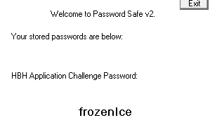

Có rất nhiều điều cần hiểu, ta sẽ tự tìm hiểu cách hoạt động của nó.

