# Investigating CrackmeVB3

Tải tệp crackme vào Olly :

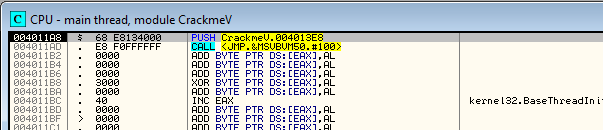

Ở đây, ta thấy một lời gọi vào VB runtime. 

Khi thực thi chương trình mục tiêu, ta thấy nó có nag với thời gian chờ 5s

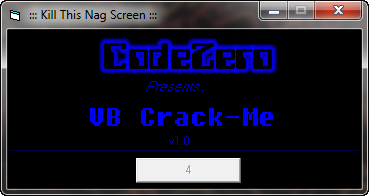

Chắc chắn là ta muốn loại bỏ nó. Sau đúng 5s, màn hình chính của trình phát serial sẽ xuất hiện

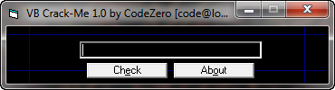

Nhập bừa, badboy xuất hiện

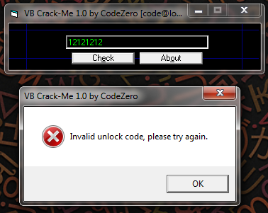

Ta xem kỹ cấu trúc nội bộ của tệp mục tiêu này. Lần này là dùng P32Dasm

# Using P32Dasm

P32Dasm là một công cụ giải mã mã nguồn và Pcode. Phần mềm này giống với VB Decompiler, tuy nhiên nó sở hữu một số tính năng hữu ích hơn, vd như xuất các tệp MAP hoạt động được.

Tải tệp tin CrackmeVB3.exe vào P32Dasm, màn hình chính xuất hiện cùng một số thông tin liên quan đến mục tiêu được phân tích

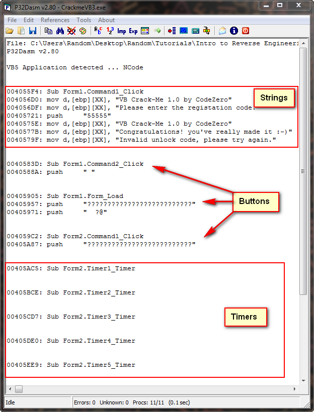

Ta có thể nhận thấy một số điểm tương đồng VB Decompiler, đặc biệt là đoạn mã Form1.Command.Click, đây là hàm callback khi người dùng nhấp vào một nút. Ở phần trên là các chuỗi ASCII được sử dụng trong tệp(chưa mã hóa), còn phần dưới là các hàm timer. Ở đầu cửa sổ P32Dasm là các nút thanh công cụ mà ta nên làm quen

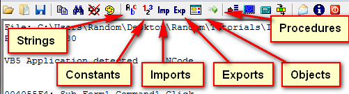

Nhấp vào mục Strings, ta thấy giao diện tương tự như chức năng "Search For -> Strings" trong Olly

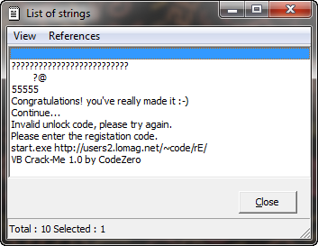

Tuy nhiên, khác Olly, nhấp đúp vào một đoạn mã sẽ không mở cửa sổ phân tích từng bước đoạn mã đó

Tiếp, nút công cụ Hằng số(constants) trên thanh công cụ, nhưng khi nhấp vào nút này, ta nhận thấy rằng không có bất kỳ hằng số nào được hiển thị. Sau đó là mục "Inports", tương tự như "All Intermodular calls" trong Olly

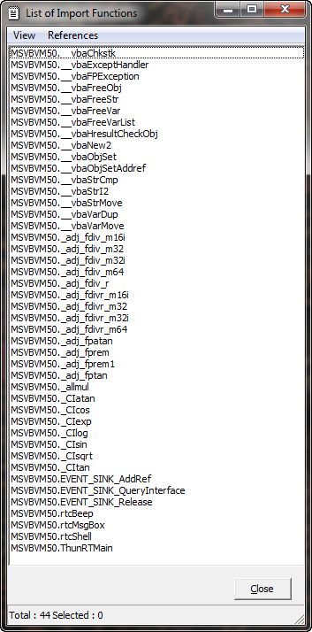

Hàm _vbaStrCmp sẽ dễ nhận biết và nổi bật, không thể bỏ qua

Tiếp là mục Exports nhưng mục tiêu này hiện không có dữ liệu nào nên trống

Objects nhắc ta về giao diện VB Decompiler

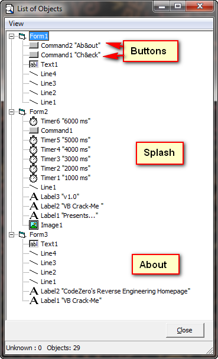

Giao diện hiển thị toàn bộ Objects VB trong tệp, như nút bấm, nhãn và timers. Ta có thể nhận thấy  nút "Check" có tên "Command1" và có thể suy luận đây chính là hàm xử lý sự kiện chính của nút check

Cuối cùng là các cửa sổ "Procedures"

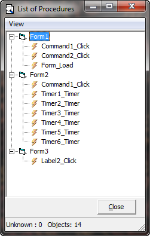

Điều này cho thấy tất cả các hàm gọi . Ta có thể thấy hàm callback của nút check là "Command1_Click" vì Command1 chính là tên hàm xử lý sự kiện nút Check

Điều cần nhấn mạnh là dãy số 5 xuất hiện liên tiếp, một dãy số đáng ngờ

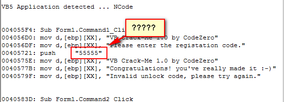

Có lẽ không đơn giản như vậy

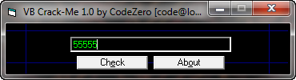

:))

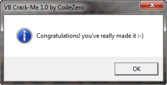

Có vẻ hơi lỏ, ta sẽ tiếp tục phân tích file crackme này để xem P32Dasm  có giúp ích gì không, ví dụ như loại bỏ nag.

# Making a MAP File

Tệp MAP là tập hợp các tên gọi hàm Procedure đã được biên dịch vào mã VB. VB sử dụng các tên chuỗi thực tế để tham chiếu đến các hàm callback, do đó, ta có thể suy luận và nhậm tên vào Olly. Ta có thể thực hiện việc này qua VB Decompiler Pro(File -> Save Procedure List) nhưng vì phiên bản pro không có nên ta có thể sử dụng P32Dasm. Mở lại tệp trong P32Dasm, chọn File -> Export to MAP file, lưu tệp MAP này, sau đó tỉa CrackmeVB3.exe vào Olly. Hãy xem xét các hàm gọi callback đáng ngờ chính của ta trướcm khi tải tệp MAP. Ta chọn địa chỉ của Command1_Click callback ở 4055F4

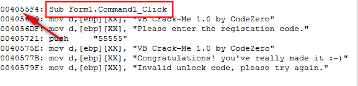

Tải tệp mục tiêu vào Olly nhảy đến địa chỉ đó, ta có thể xác định vị trí bắt đầu của hàm callback liên quan đến nút Check

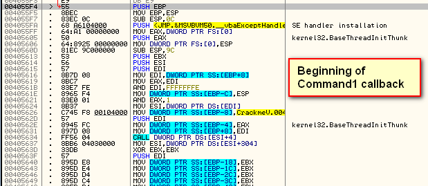

Ta sử dụng plugin chuyển đổi MAP dành cho Olly để nhập tệp MAP đã tạo trong P32Dasm. Lưu tệp DLL của plugin MapConv vào thư mục plugins của Olly và khởi động lại Olly. Tải chương trình mục tiêu và chọn Plugins -> MapConv -> Replace Comments

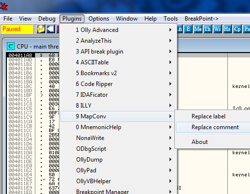

Chọn tệp MAP mà ta đã tạo trong P32Dasm. Việc này cho phép ta đưa thông tin từ tệp MAP vào cột chú thích. Ta cũng có thể tải thông tin này vào cột label, tuy nhiên cách này khó đọc hơn. Giờ đây, khi xem hàm callback, ta thấy thông tin liên quan đến callback được thêm vào để hỗ trợ việc phân tích

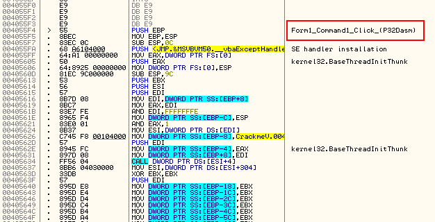

Như đã thấy, hiện ta có một chú thích cho các hàm callback của mình. Tiếp, nhấp chuột phải và chọn "Search for" -> "All user-defined comments"

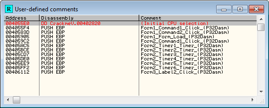

Giờ, ta có thể xem được tất cả các tên hàm callback

Cuộn xuống phần mã xử lý sự kiện Command1_Click, ta thấy đoạn mã ggoodboy, đoạn mã badboy và phần caanf được vá lỗi rõ ràng

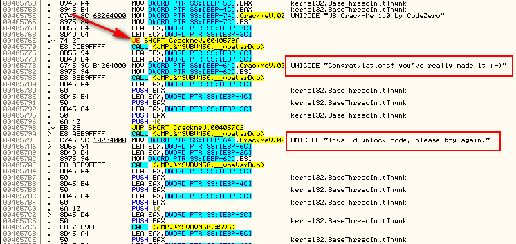

# Removing the Nag

Trở lại với P32Dasm, xem xét các lời gọi hàm liên quan đến timer

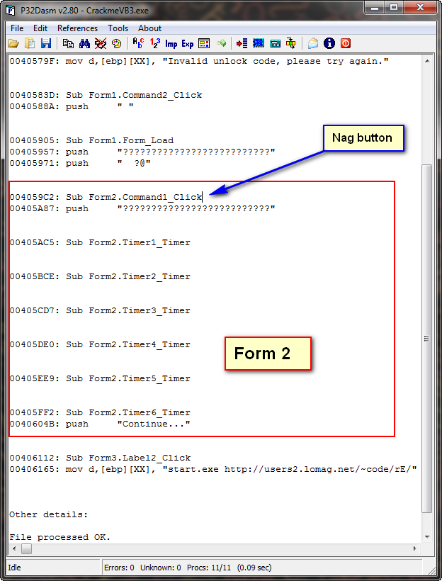

Từ màn hình này, ta có thể thấy rằng Form2 chính là màn hình cảnh báo liên tục(vì nó là form gọi các bộ hẹn giờ)

Lý do gọi timer tới 6 lần là vì người tạo bản crackme này không biết cách sử dụng timer một cách chính xác, nên họ gọi đến timer 1s này tổng cộng 6 lần để mô phỏng bộ đếm ngược 6s

Từ màn hình này, ta thấy Form2.Command1_click chính là hàm callback được kích hoạt khi người dùng nhấn nút OK sau khi thời gian chờ của bộ hẹn giờ kết thúc. Một giải pháp đơn giản, là thay thế trục tiếp lần gọi đầu tiên của bộ hẹn giờ bằng cách chuyển nó sang thực thi hàm gọi lại tương ứng với thao tác nhấn nút OK. Điều này có nghĩa là, khi lần gọi lại đầu tiên của bộ định thời được thực hiện(tức là ta vừa khởi động mục tiêu và đang bắt đầu bộ định thời của một giây đầu tiên), thay vì thực thi hàm xử lý sự kiện này, chương trình sẽ chuyển sang thực thi đoạn mã xử lý thao tác nhấp nút OK sau khi bộ định thời hết thời gian. Thực chất là đánh lừa chương trình để nó gọi đoạn mã "close nag screen" thay vì đoạn mã "start first timer"

Xem đoạn mã callback đầu tiên tại địa chỉ 405AC5

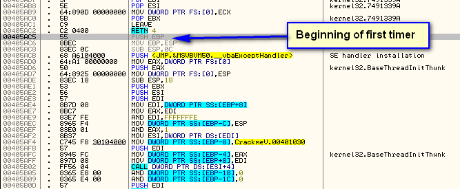

Ta thay đổi phần đầu tiên để trỏ trực tiếp đến đoạn mã xử lý việc đóng cửa sổ cảnh báo. Từ P32Dasm, ta có thể thấy hàm callback nằm ở địa chỉ 4059C2(callback của COmmand1_click)

Giờ sẽ sửa

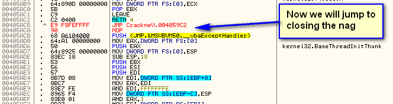

Giờ, nếu ta khởi động lại app, sẽ thấy thông báo nhắc nhở xuất hiện trong chớp mắt rồi biến mất ngay. Đây có thể không phải cách tốt nhất. 

# OllyVBHelper Plugin

Một công cụ hữu ích với VB là plugin OllyVBHelper. Plugin này được thế kế nhằm tìm kiếm và gán lại nhãn cho các hàm VB imports(DLL) được biên dịch bản địa. Ngoài ra, nó còn có thể tìm và đổi tên các stub gọi hàm DLL. VD, tải một trong các bài crackme vào Olly, chọn "Search for" -> "All user labels". Trước khi chạy plugin thì cửa sổ này trống :

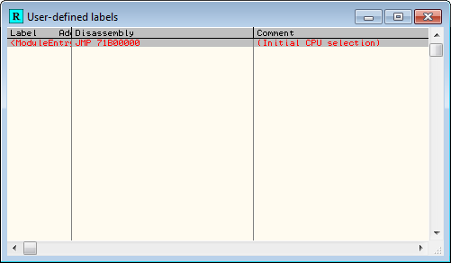

Tiếp, chạy plugin :

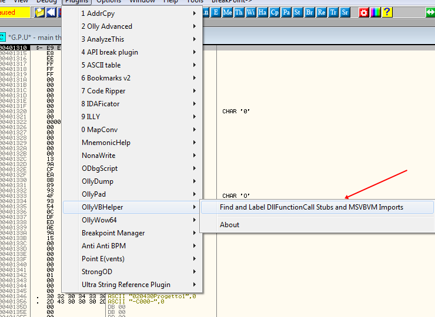

Có thể thấy tất cả các phương thức hiện đầy đủ, tương tự như ta nhập một tệp MAP

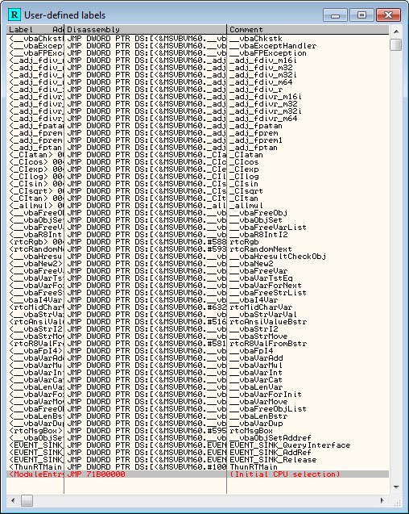

Đó là một mẹo

# Using the "Point-H"

Point-H là một kĩ thuật do Ricardo Narvaja giới thiệu. Chữ H là viết tắt của Hmemcopy, một hàm API cũ của Windows 95. Trước đây, hàm này được hệ điều hành gọi trực tiếp để sao chép chuỗi kí tự ASCII và có thể được tận dụng để tìm các điểm then chốt trong quá trình cracking. Point-H chính là một phương pháp hiện đại hơn nhằm đạt được mục đích đó

Trong tệp nntdll32.dll có một API mà Windows gọi khi cần sao chép một chuỗi kí tự. Hàm này được sử dụng rất phổ biến, từ việc sao chép tên các DLL được nhập, đeens so sánh các thông điệp Windows, thậm chí các hàm API như GetDlgItemTextA và SetDlgItemTextA. Trong trường hợp sử dụng hàm SetDlgItemTextA, ta có thể tận dụng API này để bắt dữ liệu khi tên người dùng hoặc mật khẩu được sao chép ban đầu từ cửa sổ và được truyền về chương trình của ta. VD, trong crackme của ta, có thể tồn tại một đoạn mã mà sau khi người dùng nhấp nút "Đăng nhập", chương trình lấy mật khẩu đã đăng nhập từ trường mật khẩu thông qua việc gọi hàm GetGlgItemTextA. Khi hàm này được gọi, kernel32 sẽ kích hoạt API nội bộ của nó để sao chép giá trị từ cửa sổ vào một biến tạm thời. Sau đó kernel32 trả về giá trị này cho chương trình của ta dưới dạng giá trị trả về của hàm GetDlgItemTextA

Nếu biết được vị trí của API sao chép chuỗi nội bộ này, ta có thể tạm dừng tại điểm đó để kiểm tra xem chuỗi nào được sao chép, nếu chuỗi đó là đối tượng mà ta quan tâm(vd như mật khẩu), ta có thể theo dõi quá trình thực thi cho đến khi luồng điều khiển quay lại mã nguồn của chương trình, từ đó xác định được vị trí mà chương trình này nhận mật khẩu

Địa chỉ của Point-H luôn giống nhau trên máy tính, bất kể đang chạy app nào, tuy nhiên, địa chỉ này lại khác biệt so với địa chỉ trên các máy khác. Do đó, sau khi xác định được địa chỉ Point-H trên máy tính của ta, ta cần thay thế bằng địa chỉ tương ứng trên hệ thống của mình

Phương pháp này đặc biệt hữu ích với các mục tiêu bị che giấu mã(obfucation) nghiêm trọng, được mã hóa hoặc đơn giản là quá khó để xác định đoạn mã phù hợp để bắt đầu phân tích(vd như tệp VB). Nó ít nhất cũng cung cấp cho ta 1 điểm khởi đầu để bắt đầu vào quá trình phân tích

# Finding Point-H

Ta nên thực hiện các bước này trên một bản cài đặt mới và sạch của Olly, tải file Crackme Point-H vào Olly để bắt đầu phân tích

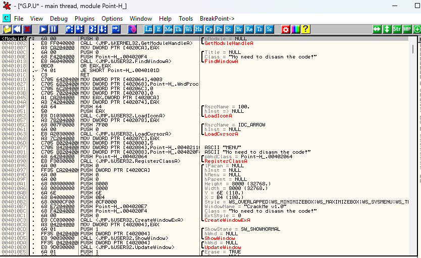

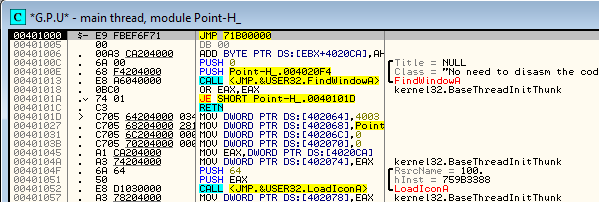

Đảm bảo ta đang dừng ở 401000, không phải điểm nhập thô của tệp tin. Nếu ta không dừng đúng điểm nhập thực sự OEP(401000), thử F9 1 lần, Olly sẽ dừng tại điểm nhậpc hính xác. Nếu cách này không hiệu quả, ta có thê mở cửa sổ Memory(icon "Me" trên thanh công cụ), chọn phần "CODE" trong tệp Crackme Point-H rồi anas Enter. Thao tác này sẽ đưa đến đúng điểm nhập của tệp nhị phân thực tế

Giờ. Nhấp chuột phải trong cửa sổ disassembly, chọn "Search for" -> "Name in current module" hoặc nhấn phím tắt Ctrl + N. Thao tác này mở cửa sổ danh sách lên :

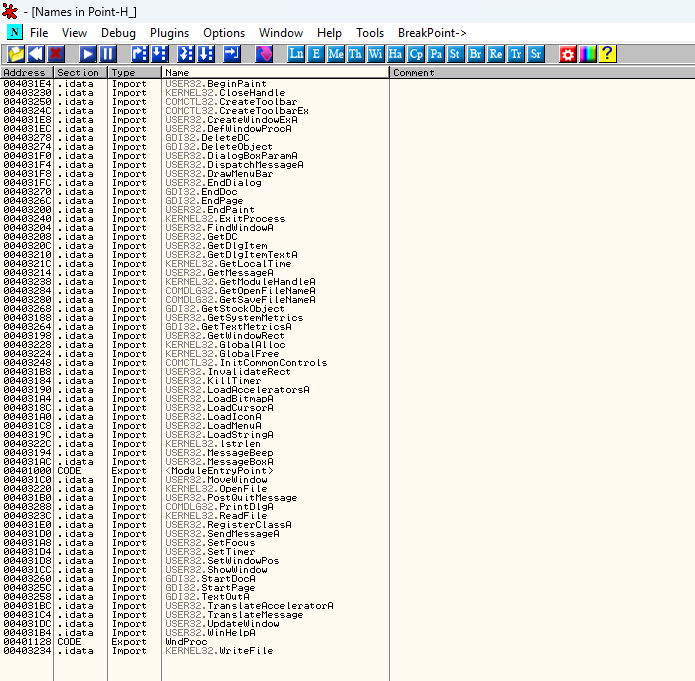

Phía dưới cùng là API TranslaateMessage. Chuột phải vào API này và chọn "Conditional log breakpoint on import"

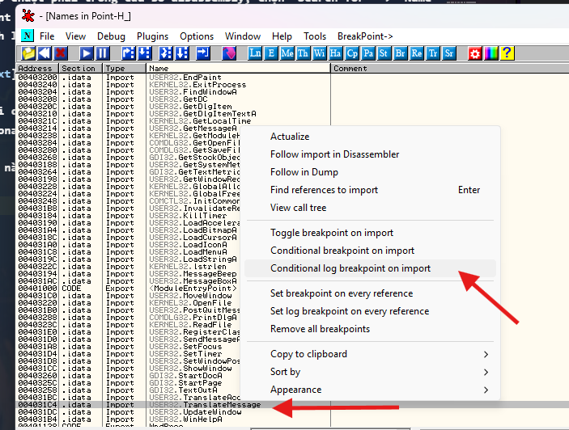

Thao tác này sẽ hiển thị màn hình điểm dừng điều kiện

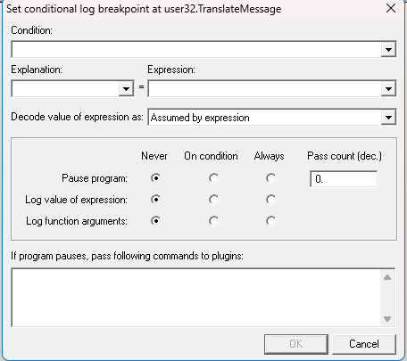

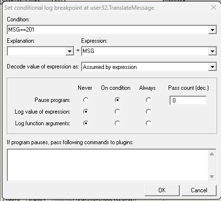

Thiết lập màn hình đúng hình minh họa. Ta sẽ sử dụng điểm ngắt điều kiện này để loại bỏ tất cả các lời gọi hàm TranslateMessage cho đến khi gặp thông điệp có ID là 201. Theo tài liệu về các mã ID thông điệp Windows, ta thấy rằng mã ID này tương ứng với thông điệp nhấp chuột trái. Mục đích là để bắt được hàm TranslateMessage khi xử lý thao tác nhấp nút "OK" trong chương trình crackme

Khi nhấp OK trong cửa sổ điểm ngắt điều kiên, ta thấy điểm ngắt xuất hiện trong cửa sổ BP

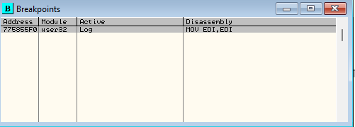

Ta có thể thấy dưới cột Active có hiển thị từ Log, điều này cho biết đây thực chất là một BP dạng log

Tiến hành chạy crackme. Chọn Edit -> Register, sau đó nhập tên và mã serial. Lưu ý là sử dụng phím TAB để chuyển giữa các trường nhập dữ liệu, vì nếu nhấp chuột trái, hệ thống sẽ kích hoạt BP trước thời điểm cần thiết. Nhập bừa

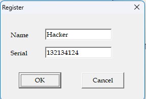

Giờ nhấp OK, Olly dừng tại điểm ngắt điều kiện mà ta đã thiết lập

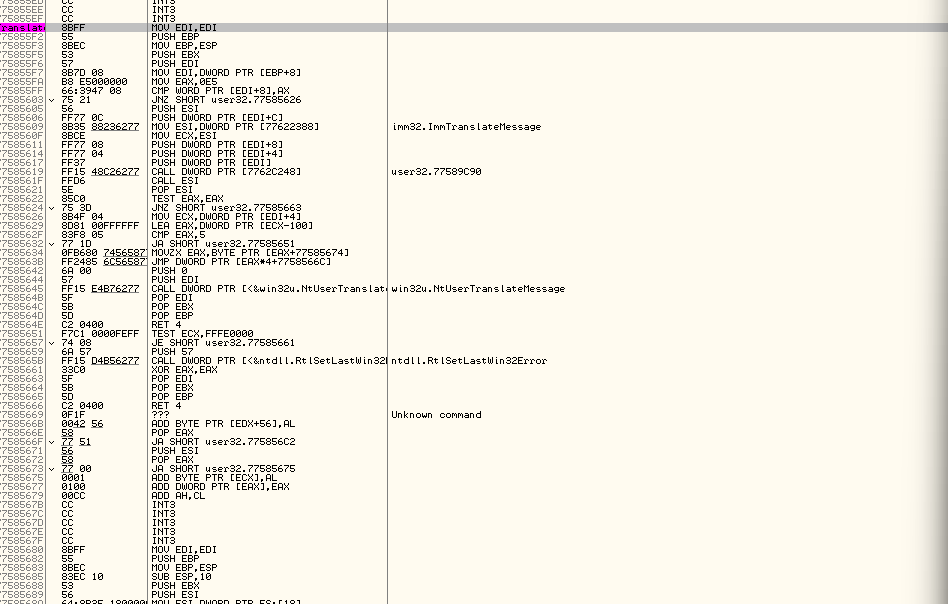

Giờ ta muốn tìm kiếm chuỗi kí tự của mình trong bộ nhớ. Để mở cửa sổ bộ nhớ, nhấp biểu tượng "Me" hoặc Alt-M. Nhấp chuột phải trong cửa sổ này và chọn "Search"

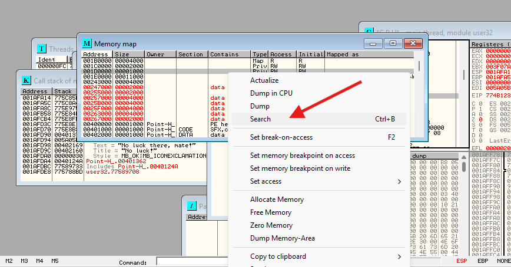

Trong trường ASCII, nhập mật khẩu mà ta đã nhập 

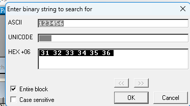

Olly chỉ cho ta biết chuỗi dữ liệu nằm ở đâu trong bộ nhớ(Có thể chuỗi trong các ảnh khác nhau do tôi thử lại nhiều lần)

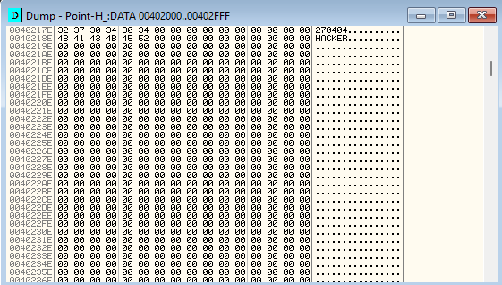

Ta muốn yêu cầu Olly tạm dừng khi địa chỉ bộ nhớ này được truy cập. Chọn byte đầu tiên của chuỗi serial rồi nhấp chuột phải vào nó, chọn BP -> Memory, on access

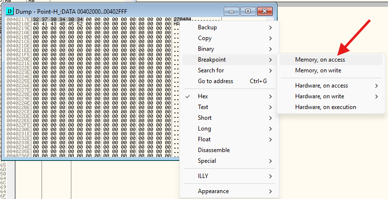

Giờ nhấn F9 để thực thi chương trình. Olly dừng ngay lập tức tại điểm ngắt bộ nhớ của ta

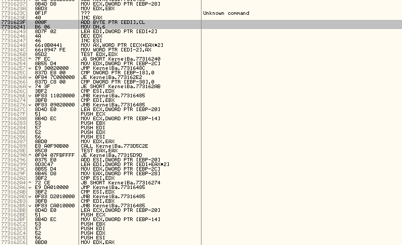

Đây là giá trị Point-H trên hệ thống của ta. Trên hệ thống, ta có thể thấy, giá trị này là 77316240. Ghi lại giá trị này

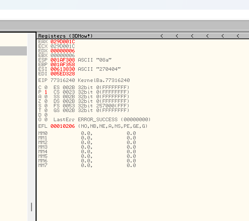

Thử nghiệm một chút với BP này. Xóa BP ghi log và tất cả BP bộ nhớ đã được thiết lập. Sau đó thêm 1 điểm ngắt phần cứng tại vị trí Point-H với on execute để điểm ngắt này không bị mất khi khởi động lại hệ thống, rồi khởi động lại app. Lúc này hệ thống sẽ bị ngắt trước khi cửa sổ chính của crackme xuất hiện

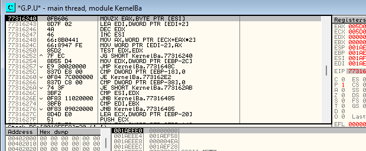

Khi xem cửa sổ register, thấy chuỗi đang sao chép là "OpenProcessToken"

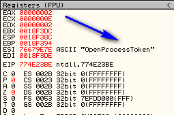

Nhấn liên tục F9, thấy các chuỗi kí tự khác nhau xuất hiện trong thanh ghi ESI, mỗi lần ntdll32 gọi API nội bộ này. Ngoài tên các API còn có các dãy số và các thông tin khác lướt qua, nói cách khác, đó là mọi thứ mà ntdll32 sao chép dưới dạng chuỗi kí tự

# Using "Point-H" to Crack the Target

Vậy điều này có nghĩa gì. Thử xem. Trước tiên, vô hiệu hóa BP tại Point-H. Khởi động lại app. Chọn lại tùy chọn Register trong menu rồi nhập tên cùng serial. Trước khi nhấn OK, thiết lập BP tại Point-H rồi nhấn OK trên app

__Nếu bạn cần tìm địa chỉ của Point-H để thiết lập BP, hãy mở cửa sổ bộ nhớ, nhấp một lần vào phần .text của ntdll (ở phần cuối cùng của cửa sổ) rồi nhấn Enter. Thao tác này sẽ hiển thị nội dung của ntdll trong cửa sổ phân tích mã máy (disassembly). Sau đó, bạn có thể sử dụng phím tắt Ctrl+G để chuyển đến địa chỉ của Point-H__

Olly dừng tịa điểm ngắt của ta và khi xem cửa sổ register, ta có thể thấy rằng lần thực thi này sử dụng tên người dùng của chúng ta

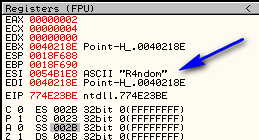

Ấn F9 lần nữa, thấy đang ở bước sao chép mã

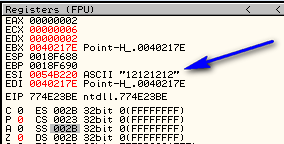

Mở cửa sổ bộ nhớ, nhấp chuột phải vào phần CODE của tệp, chọn "Set break on access". Như vậy chương trình sẽ tự động ngắt ngay khi ntdll32 trở lại đoạn mã của tệp. Nhấn F9, Olly dừng tại đúng vị trí đoạn mã của ta

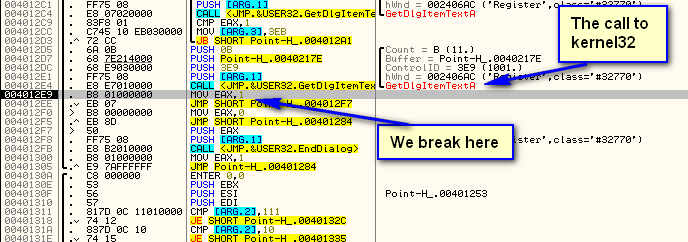

Như đã thấy, ta dừng ngay sau khi gọi hàm GetDlgItemTextA. Bên trong sâu bên trong ntdll32, hàm này cuối cùng cũng gọi đến đoạn mã của ta, nơi chứa địa chỉ Point-H. Sau đó, chương trình quay lại đoạn mã tại địa chỉ 4012E9. Giờ đây, ta đã có 1 điểm khởi đầu mới để thử crack phần mềm này. Phần mềm crackme vừa nhận được số nhạp vào và sẽ sớm làm gì với nó. Tất nhiên vì bản crackme này cũng không quá khó, nhưng trong một ứng dụng thương mại thì có tích hợp các cơ chế mã hóa và bảo vệ, có thể xác định chính xác  đoạn mã này là yếu tố cứu nguy

Trong trường hợp của bản crackme này, nếu tiếp tục thực hiện từng bước theo mã nguồn và đặt các BP access truy cập vào phần mã của crackme, thì ta sẽ sớm tìm thấy đoạn mã vá lỗi 

# Another Target Using Point-H

Thử một bài crackme khác bằng kĩ thuật này. Tải CrackmeVB4.exe vào Olly. Tiếp theo, ta cần tìm địa chỉ Point-H, mở cửa sổ bộ nhớ, cuộn xuống cuối và chọn phần chứa địa chỉ Point-H của ta. Trong này, là 774E23BE 

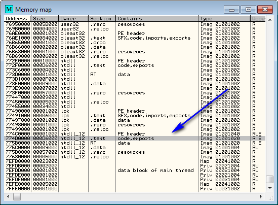

Nhấn Enter khi dòng mã đang được chọn để mở module tương ứng trong trình phân tích mã. Sau đó nhấn Ctrl+G và nhập địa chỉ của Point-H trên hệ thống để nhảy đến vị trí đó

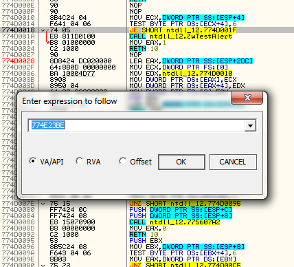

Tại Point-H

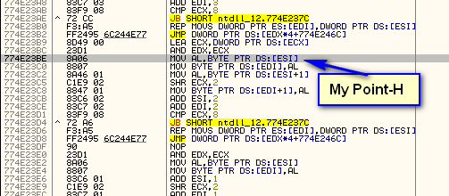

Tiếp, giữ vị trí này hiển thị trong cửa sổ phân tích mã nhưng chưa đặt BP, sau đó thực thi chương trình. Ban đầu, một số cửa sổ cảnh báo xuất hiện *kéo dài tới 3h" rồi tiếp theo là màn khởi động chính

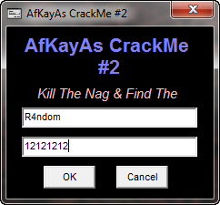

Nhập tên và mã, sau đó đặt BP tại Point-H trong Olly trước khi nhấn OK trong cửa sổ mục tiêu. Sau khi thiết lập BP, nhấn OK trong cửa sổ Target và Olly sẽ dừng tại Point-H

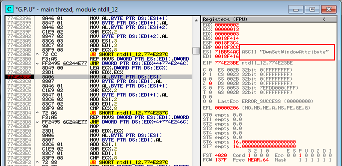

Như đã thấy trong cửa sổ Register, đây không phải là điểm dừng mà ta muốn xem xét, vì vậy nhấn F9 thêm 1 lần nữa. Ta cần tiếp tục nhấn F9 cho đến khi xuất hiện một chuỗi văn bản mà ta quan tâm. Trong trường hợp này, chuỗi "You Get Wrong...", trông có vẻ hứa hẹn 

Điều ta cần làm là bắt giữ quá trình thực thi ngay khi chương trình quay trở lại đoạn mã của đối tượng mục tiêu. Do các đặc thù của VB, ta không thể đơn giản đặt 1 BP truy cập bộ nhớ(access memory breakpoint) lên phần mã của đối tượng mục tiêu, điều ta có thể làm trong các ứng dụng bản địa. Thay vào đó, ta sẽ thực hiện từng single step cho đến khi chương trình quay trở lại mã mục tiêu. Trước tiên, ta đi vào file user32.dll rồi quay ngược lại qua môi trường chạy thời gian thực runtime của VB. Badboy này được trình bày trước tiên, sau đó ta sẽ tiến xa hơn, nhưng cuối cùng ta sẽ dừng tại điểm này :

Tại đây, ta có thể dễ dàng nhận thấy rằng chương trình đang trở về sau 1 lần gọi hàm rtcMsgBox, hàm đã hiển thị thông báo badboy. Ngay phía trên đoạn mã này là phần tạo ra đối tượng badboy và quan trọng hơn cả, ngay phía trên là đối tượng goodboy. Việc tìm ra đoạn vá lỗi tại địa chỉ 408677 là quan trọng. Tất nhiên việc sử dụng P32Dasm hoặc VB Decompiler sẽ đơn giản hơn, tuy nhiên với ứng dụng VB phức tạp thì phương pháp Point-H quý giá hơn

# What About Smartcheck

Do Smartcheck tương thích với Windows Vista. Và không phù hợp
